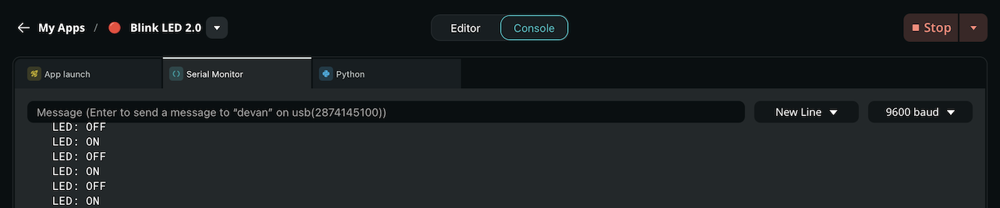

Welcome to Arduino App Lab. App Lab is the integrated development environment (IDE) specifically designed for the Arduino UNO Q. Use App Lab to create hybrid "Apps" that combine Python scripts running on the Linux microprocessor (MPU) with C++ sketches running on the real-time microcontroller (MCU).

This guide walks you through running a built-in example, and modifying it to fit your needs.

## Prerequisites

* [Setup Arduino App Lab](../../1.setup/1.overview/overview.md)

## 1. Explore the Interface

After configuration, App Lab displays the main interface. The left sidebar contains the primary navigation:

* **My Apps**: View, edit, and manage Apps you create or duplicate.
* **Examples**: Browse built-in, ready-to-run projects provided by Arduino.
* **Bricks**: Explore modular code blocks that provide pre-packaged functionalities, such as web servers or AI models.
* **Learn**: Access offline documentation and tutorials.
* **Settings**: Manage preferences, including Wi-Fi networks, Linux passwords, and keyboard layouts.
* **Account**: Access your Arduino account settings.


## 2. Run an Example App

The fastest way to verify your setup is to run a built-in example without modifying it.

1. Select **Examples** from the left sidebar.
2. Select the **Blink LED** example.
3. Select the **Run** button (play icon) in the top right corner.
   

App Lab compiles the C++ sketch, starts the Python Docker container on the UNO Q, and runs the code. Watch the **Console** tab at the bottom of the screen for start-up logs. Once the App is running, you will see the red LED (LED3_R) on the UNO Q blinking on and off.

To stop the App, select the **Stop** button.

## 3. Copy and Modify the App

Built-in examples are read-only. To modify the code, you must create a copy of the App.

1. With the **Blink LED** example still open, select **Copy and edit app** in the top right corner.
2. Enter a name for your App and select **Create new**. App Lab opens your new editable App.
3. Select `python/main.py` in the **Files** panel on the left.
   
4. Locate the `time.sleep(1)` command in the `loop` function and change it to `time.sleep(0.1)`.
5. If the App is still running, select the **Stop** button.
6. Select **Run** to start the modified App.

The red LED on your UNO Q now blinks at a much faster rate.

## 4. Log and Monitor

To debug your hybrid App or track its internal state, you can send messages from the Arduino sketch to the App Lab interface using the `Monitor` object.

1. In the **Files** panel, select `sketch/sketch.ino`.
2. Inside the `set_led_state()` function, add this code to log the state of the LED:

    ```cpp
    digitalWrite(LED3_R, HIGH);
    if led_state:
        print("LED ON")
    else:
        print("LED OFF")
    ```

3. Select **Run**. The **Console** will open automatically.
   

## Next Steps

Now that you have App Lab running, explore these resources to build more complex projects:

* [Your First App](../3.first-app/first-app.md)
* [Develop Apps in Arduino App Lab](../../3.apps/5.develop-apps/develop-apps.md)
