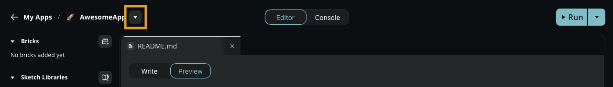
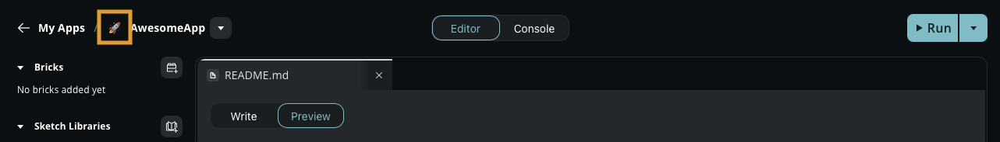

Learn how to  create, duplicate, import, export, and delete Apps in Arduino App Lab.

## Open an App

The **My Apps** section contains all the projects you create, duplicate, or import.

1. Open Arduino App Lab.
2. Select **My Apps** in the left sidebar.
3. Select the App you want to open.

The App opens in the editor.

## Create a new App

If you want to start with a blank canvas, you can generate a new App template directly from the Arduino App Lab interface:

1. Select the **My Apps** tab in the left sidebar.
1. In the top-right corner, click the **Create new app +** button.
1. Change the default emoji (optional) and enter a name for your App.
1. Click **Create new**.

## Duplicate an App

1. [Open an App](#open-an-app)
1. Select the arrow (**▼**) next to the App name near the top left corner.
   
1. In the menu, select **Duplicate**.
1. Change the emoji or name for your new App (optional).
1. Click **Create new**.

## Rename an App

You can rename an App you've created directly within the editor.

1. [Open an App](#open-an-app).
1. Select the arrow (**▼**) next to the App name near the top left corner.
   
1. In the menu, select **Rename**.
1. Enter a new name for your App and press **Enter**.

Renaming an App automatically updates its metadata in the underlying `app.yaml` file.

<Alert type="success">**Tip:** You can also edit the name by clicking on it.</Alert>

## Change an App Icon

App Lab uses emojis as icons to help you identify your projects in the **My Apps** list.

1. [Open an App](#open-an-app).
2. Select the current emoji next to your App name near the top left corner.
   
3. Use the emoji picker to select a new icon.

## Import an App

You can import an App shared with you or restored from a backup by uploading its `.zip` file.

1. [Open an App](#open-an-app).
1. Select the arrow (**▼**) next to the App name near the top left corner.
1. In the menu, select **Import App**.
1. Drag and drop your `.zip` file into the import area, or select **Import from computer** to browse for the file.
1. Select **Open** to complete the import.

## Export an App

Exporting is the easiest way to back up your code or share it with others.

1. [Open an App](#open-an-app).
1. Select the arrow (**▼**) next to the App name near the top left corner.
1. In the menu, select **Export App**.
1. Select **Export .zip** in the dialog box.
1. Choose a location on your computer to save the file.

## Delete an App

If you no longer need an App, you can permanently remove it from the board.

1. [Open an App](#open-an-app).
1. Select the arrow (**▼**) next to the App name near the top left corner.
1. In the menu, select **Delete App**.
1. Select **Delete** to confirm.
