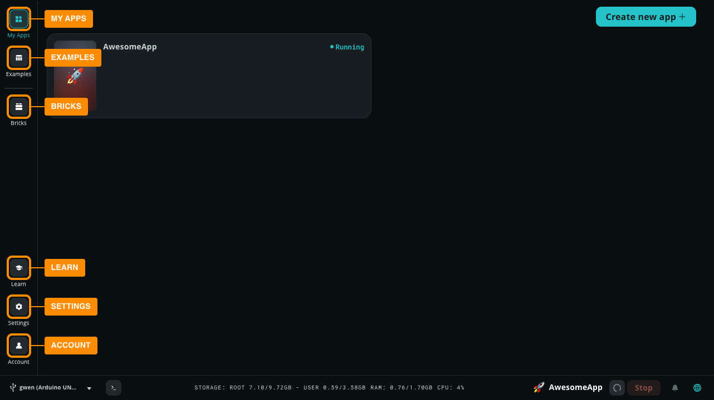
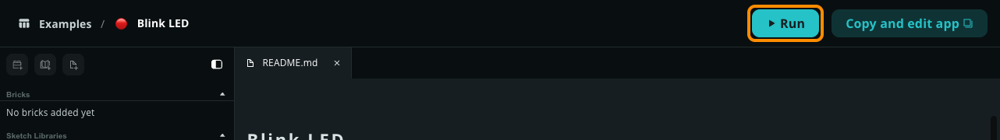

Discover the key features of Arduino App Lab to quickly start building modular Apps for your board. Navigate the user interface, run a built-in example on your board, and create an editable copy to modify its behavior. You'll also monitor and log your App's internal state using Python.

This onboarding journey assumes you have already installed App Lab and configured it with your board; if you haven't, please check the **Prerequisites** section below.

## Prerequisites

- [Setup Arduino App Lab](../../setup/overview/)
- [Connect, Configure, and Update boards in Arduino App Lab](../../configure/config/)

## Step 1: Explore the Interface

After configuration, App Lab displays the main interface. The left sidebar contains the primary navigation:

- **My Apps**: View, edit, and manage Apps you create or duplicate.
- **Examples**: Browse built-in, ready-to-run projects provided by Arduino.
- **Bricks**: Explore modular code blocks that provide pre-packaged functionalities, such as web servers or AI models.
- **Learn**: Access offline documentation and tutorials.
- **Settings**: Manage preferences, including Wi-Fi networks, Linux passwords, and keyboard layouts.
- **Account**: Access your Arduino account settings.



## Step 2: Run an Example App

The fastest way to verify your setup is to run a built-in example without modifying it.

1. Select **Examples** from the left sidebar.
2. Select the **Blink LED** example.
3. Select the **Run** button (play icon) in the top right corner.
   
4. App Lab compiles the C++ sketch and runs the code on your board. The **Console** panel opens automatically at the bottom of the editor to show launch progress. You can confirm the App is active when the **Run** button changes to a **Stop** button and a green notification appears at the bottom of the screen.
5. Once the **Blink LED** App is running, you will see the red LED (LED3_R) on the board blinking on and off.

## Step 3: Copy and Modify the App

Built-in examples are read-only. To modify the code, you must create a copy of the App.

1. With the **Blink LED** example still open, select **Copy and edit app** in the top right corner.
1. Enter a name for your App and select **Create new**. App Lab opens your new editable App.
1. Find the **File Manager** in the left sidebar.
1. Open the **python** folder and select the `main.py` file.
   
1. The `main.py` file will open in a new tab. Locate the `time.sleep(1)` command in the `loop` function and change it to `time.sleep(0.1)`.
1. Select **Run** to start the modified App. If another App is already active, App Lab will prompt you to replace it before proceeding. Select **Confirm and replace** to switch to your new App.

The red LED on your board now blinks at a much faster rate.

## Step 4: Log and Monitor with Python

Printing messages from your code is the simplest way to track your app's behavior and debug issues. In App Lab, standard Python `print()` statements are automatically captured and displayed in the **Python** tab of the integrated console panel.

1. Select `python/main.py` in the **Files** panel.
2. Locate the `loop()` function and add the following `print` statements to log the state of the LED:

    ```python
    def loop():
        global led_state
        time.sleep(1)
        led_state = not led_state
        Bridge.call("set_led_state", led_state)

        # Log the LED state to the console
        if led_state:
            print("LED is ON")
        else:
            print("LED is OFF")
    ```

3. Select **Run** to start the app.
4. When the **Console** panel opens at the bottom, select the **Python** tab to see your messages appearing in real-time

<!-- TODO: Add additional section for Serial Monitor logging in Sketch

[Screenshot of the Serial Monitor in Arduino App Lab, displaying the output.](../../assets/examples/blink-led/monitor/blink-led-monitor.png)

-->

## Next Steps

Now that you've learned the basics, explore these resources to start building your own projects:

- [Manage Apps in Arduino App Lab](../apps/manage-apps/)
- [Develop Apps in Arduino App Lab](../../apps/develop-apps/)
