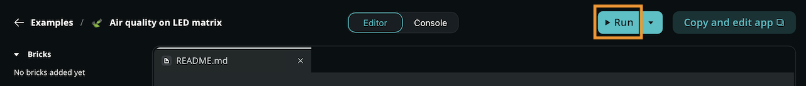
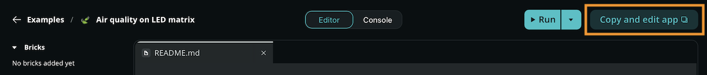

Explore built-in examples to understand the capabilities of modular Apps on your board. Learn how to run these ready-to-use projects and duplicate them to kickstart your own custom applications.

## Run an Example

Running an example allows you to quickly test hardware and software capabilities without writing code from scratch.

Take the following steps to run an example App:

1. Select the **Examples** tab in the left sidebar.
2. Select the example you want to run on your board.
3. Click the **Run** button in the top right corner.
   
4. Wait for the loading process to finish.
5. Interact with the App once the start-up is complete.

Built-in examples cannot be edited directly. If you want to modify the code or use an existing example as a starting point, you must [duplicate it](#duplicate-an-example).

## Duplicate an Example

Take the following steps to duplicate an example:

1. Navigate to the **Examples** tab and select an example.
2. Click the **Copy and edit app** button in the top right corner next to the **Run** button.
   
3. Enter a name for the App.
4. Click **Create new**.

After completing these steps, Arduino App Lab redirects you into a new, fully editable App project.

## Explore Examples

Examples can only be viewed in Arduino App Lab when connected to a board. However, the documentation and source files can be accessed in a public code repository.

<!-- app-bricks-examples table start -->
| Example | Description | Source |
| --- | --- | --- |
| Air quality on LED matrix | An Air Quality Monitoring System that uses air quality AQI API data to show the air quality state on the LED matrix. | [GitHub](https://github.com/arduino/app-bricks-examples/tree/main/examples/air-quality-monitoring) |
| Bedtime story teller | This example shows how to create a bedtime story teller using Arduino. It uses a cloud-based language model to generate a story based on user input and shows the story on a web interface. | [GitHub](https://github.com/arduino/app-bricks-examples/tree/main/examples/bedtime-story-teller) |
| Blink LED | This example shows how to make the LED blink alternately. | [GitHub](https://github.com/arduino/app-bricks-examples/tree/main/examples/blink) |
| Blink LED with UI | Blink an LED via microcontroller using RPC calls | [GitHub](https://github.com/arduino/app-bricks-examples/tree/main/examples/blink-with-ui) |
| Blinking LED from Arduino Cloud | Control the LED from the Arduino IoT Cloud using RPC calls | [GitHub](https://github.com/arduino/app-bricks-examples/tree/main/examples/cloud-blink) |
| Classify images | Image classification in the browser using a web-based interface. | [GitHub](https://github.com/arduino/app-bricks-examples/tree/main/examples/image-classification) |
| Cloud AI Assistant | Simple chatbot with Cloud LLM | [GitHub](https://github.com/arduino/app-bricks-examples/tree/main/examples/chatbot-cloud-llm) |
| Color your LEDs | Control the color of your LEDs from a web interface. | [GitHub](https://github.com/arduino/app-bricks-examples/tree/main/examples/color-your-leds) |
| Concrete crack detector | Detect anomalies (cracks, defects on concrete walls) in images | [GitHub](https://github.com/arduino/app-bricks-examples/tree/main/examples/anomaly-detection) |
| Detect Objects on Camera | This example showcases object detection within a live feed from a USB camera. | [GitHub](https://github.com/arduino/app-bricks-examples/tree/main/examples/video-generic-object-detection) |
| Detect objects on images | Object detection in the browser | [GitHub](https://github.com/arduino/app-bricks-examples/tree/main/examples/object-detection) |
| Detect Objects on Smartphone Camera | This example showcases object detection within a live feed from a smartphone's camera. | [GitHub](https://github.com/arduino/app-bricks-examples/tree/main/examples/mobile-video-generic-object-detection) |
| Edge AI Assistant | Chatbot powered by a local LLM | [GitHub](https://github.com/arduino/app-bricks-examples/tree/main/examples/edge-ai-assistant) |
| Face Detector on Camera | This example showcases face detection within a live feed from a USB camera. | [GitHub](https://github.com/arduino/app-bricks-examples/tree/main/examples/video-face-detection) |
| Fan Vibration Monitoring | Monitor fan vibrations and detect anomalies | [GitHub](https://github.com/arduino/app-bricks-examples/tree/main/examples/vibration-anomaly-detection) |
| Gesture Booth | Detects gesture and provide feedback to the user. Gesture Recognition Example | [GitHub](https://github.com/arduino/app-bricks-examples/tree/main/examples/gesture-booth) |
| Glass breaking sensor | Use a pre-trained model to classify audio files in the browser. | [GitHub](https://github.com/arduino/app-bricks-examples/tree/main/examples/audio-classification) |
| Hey Arduino! | When "Hey Arduino!" keyword is detected by the microphone, the led matrix will react | [GitHub](https://github.com/arduino/app-bricks-examples/tree/main/examples/keyword-spotting) |
| Home climate monitoring and storage | A simple data logger that gets temperature and humidity from the board via Modulino Thermo and stores them in a database. | [GitHub](https://github.com/arduino/app-bricks-examples/tree/main/examples/home-climate-monitoring-and-storage) |
| Led Matrix Painter | This example shows how to create a tool to design frames for an LED matrix using Arduino. It provides a web interface where users can design frames and animations and export them as C/C++ code. | [GitHub](https://github.com/arduino/app-bricks-examples/tree/main/examples/led-matrix-painter) |
| Mascot Jump Game | An endless runner game where you jump over electronic components with the LED character | [GitHub](https://github.com/arduino/app-bricks-examples/tree/main/examples/mascot-jump-game) |
| Music Composer | A music composer app that lets you create melodies by composing notes and play them using sound generator brick. | [GitHub](https://github.com/arduino/app-bricks-examples/tree/main/examples/music-composer) |
| Object Hunting | Detect a list of object to win the game | [GitHub](https://github.com/arduino/app-bricks-examples/tree/main/examples/object-hunting) |
| Person classifier on camera | This example showcases person classification on camera, using a camera stream from USB camera | [GitHub](https://github.com/arduino/app-bricks-examples/tree/main/examples/video-person-classification) |
| QR and Barcode Scanner | This example showcases how to use the Camera Code Detector Brick to detect barcodes and QR codes and display the results in a web application as well as saving the results to an SQL database. | [GitHub](https://github.com/arduino/app-bricks-examples/tree/main/examples/code-detector) |
| Real-time Accelerometer | Real-time Accelerometer data visualization and movement detection using Modulino Movement sensor | [GitHub](https://github.com/arduino/app-bricks-examples/tree/main/examples/real-time-accelerometer) |
| Smart Mirror | Control a smart mirror with a web interface | [GitHub](https://github.com/arduino/app-bricks-examples/tree/main/examples/smart-mirror) |
| System resources logger | A simple data logger that gets system resources usage from the board and stores them in a database. | [GitHub](https://github.com/arduino/app-bricks-examples/tree/main/examples/system-resources-logger) |
| Telegram Bot | Control your board through a Telegram bot | [GitHub](https://github.com/arduino/app-bricks-examples/tree/main/examples/telegram-bot) |
| Theremin simulator | A simple theremin simulator that generates audio based on user input. | [GitHub](https://github.com/arduino/app-bricks-examples/tree/main/examples/theremin) |
| UNO Q Pin Toggle | Control each Arduino UNO Q pin through a visual UI | [GitHub](https://github.com/arduino/app-bricks-examples/tree/main/examples/unoq-pin-toggle) |
| Weather forecast on LED matrix | A weather forecast system that get the current weather and display it on LED matrix. | [GitHub](https://github.com/arduino/app-bricks-examples/tree/main/examples/weather-forecast) |

<!-- app-bricks-examples table end -->