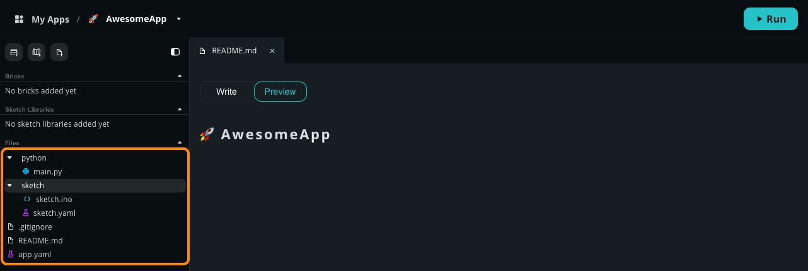
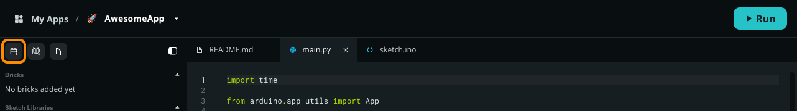
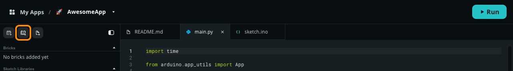
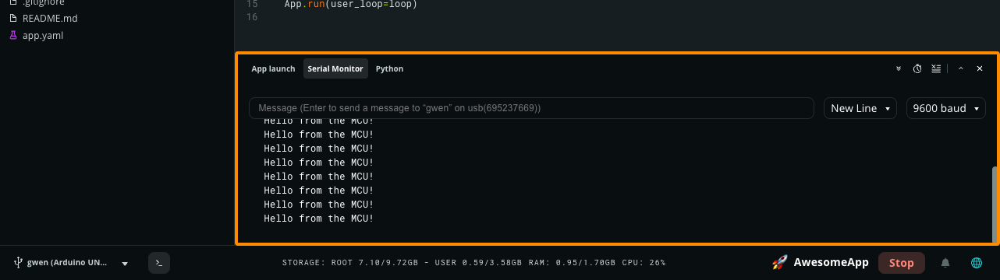

Develop Apps in Arduino App Lab by managing your project files, configuring optional Bricks, and writing your core Python logic.

## Project Files

An Arduino App is organized into a main logic layer, along with an optional real-time layer:

- **`python/main.py`**: Mandatory. The entry point for the high-level application logic running on Linux.
- **`sketch/sketch.ino`**: Optional. The C++ sketch that runs on the board's microcontroller.
- **`README.md`**: Optional. Project documentation displayed in the App Lab UI.

The system also manages two configuration files: `app.yaml` (mandatory manifest for App metadata and Bricks) and `sketch.yaml` (mandatory only if a sketch is present). To learn more about the directory structure, see [About Apps](../about-apps/).

### Explore and Open Files

1. [Open an App](../manage-apps/#open-an-app).
1. Find the **File Manager** in the left sidebar.
   
1. If folders are not displaying correctly, try closing and expanding the File Manager.
1. Click on a folder to expand it.
1. Click on a file to open it in a new tab.

### Add Files or Folders

1. **Right-click** an empty area in the **File Manager**, or a specific folder where you want to add the new file or folder.
1. Select one of the following:
   - _Create new file_
   - _Create new folder_

You can also click the **Add File** to create a new file or folder at the same level as your current selection.

### Rename or Delete Files and Folders

1. **Right-click** on the file or folder you want to rename or delete.
1. Select one of the following:
   - _Rename_
   - _Delete_

### Moving files and folders

The file tree supports **Drag and Drop** organization. Simply click and hold a file or folder, then drag it to your desired location within the project structure.

## Python Development

The Python script (`main.py`) handles the high-level logic and complex processing of your application. Running in its own isolated environment on the board, it provides the power needed for tasks like running AI models, hosting web servers, or performing data analysis.

### App.run()

Every Python script **must** include the `App.run()` function at the very bottom of the file to start the App. This command initializes App utilities and launches any imported Bricks. Note that the App framework ignores any code placed after `App.run()`.

The usage of `App.run()` depends on how you want to control your App's logic:

#### With user_loop function

If you need your Python script to perform repetitive tasks or maintain its own execution flow, pass a custom function to the `user_loop` parameter. This function will be called repeatedly by the App framework.

```python
from arduino.app_utils import App
import time

def loop():
    # This logic runs repeatedly on the Linux side
    print("Performing periodic task...")
    time.sleep(10)

# Start the App and run the loop
App.run(user_loop=loop)
```

#### Without user_loop function

If **Bricks** (e.g., a Web UI with its own event loop) or the **Sketch** (via Bridge calls that trigger Python functions) handle your App's logic, you can call `App.run()` without any arguments. This starts Bricks and utilities while keeping the Python environment active in the background.

```python
from arduino.app_utils import App, Bridge
import time

def my_function():
   # This logic runs when the function is called by the microcontroller
    print("Performing task...")


# Allow the microcontroller to call "my_function"
Bridge.provide("my_function", my_function)

# Start the App (no custom loop needed)
App.run()
```

Then, you can trigger this function from your Arduino sketch (`sketch.ino`) using the Bridge library:

```cpp
Bridge.call("my_function");
```

### Add Bricks

Bricks are pre-packaged code modules that run as separate processes alongside your App. Each Brick provides a specific functionality, such as a web interface or a database, that you can interact with from your Python script.

**To use a Brick:**

1. Click the **Add Brick** button at the top of the Editor sidebar to open the Bricks catalog.
   
2. Select a Brick from the list and follow the prompts to configure any required settings.
3. Arduino App Lab automatically adds the Brick configuration to your `app.yaml` file. Note that you should not manually edit the `bricks` entry in this file.
4. Review the Brick's documentation, which Arduino App Lab opens in a new tab when you add the Brick. The **Overview** and **Usage examples** contain the specific code needed for implementation.
5. Import and initialize the Brick in your `main.py` file.

<Alert type="success">**Tip:** Click on an added Brick in the sidebar to open its documentation.</Alert>

### Use Python Packages

You can use external Python packages (like `numpy` or `flask`) by creating a requirements file.

**To add dependencies:**

1. In the file browser, create a new file named `requirements.txt`.
2. **Important:** Place the `requirements.txt` file inside the `python/` folder, not the root of the App.
3. List your packages (one per line) in the file. For example:

   ```text
   numpy
   requests
   ```

4. When you click **Run**, the `uv` package manager automatically installs the listed packages into the App's virtual environment.

## Sketch Development

On your board's microcontroller, you can use an Arduino sketch (`sketch.ino`) to handle real-time interaction with hardware, such as reading sensors or controlling motors.

### Add Sketch Libraries

In Arduino App Lab, you install libraries on a per-App basis to prevent version conflicts between projects.

**To add a library:**

1. Click the **Add sketch library** button (the open book icon with a **+** sign) at the top of the Editor sidebar.
   
2. Search for the library you need (e.g., `Servo` or `OneWire`).
3. Select the desired version and click **Install**.
4. Arduino App Lab updates the `sketch.yaml` file automatically and downloads the library when you launch the App.

### Serial Monitor

In Arduino App Lab, the standard `Serial.print()` commands are automatically routed to the **Serial Monitor** tab in the App Lab console via the Bridge.

**To use the Serial Monitor:**

1. [Use the Sketch Libraries Manager](#add-sketch-libraries) to add the **Arduino_RouterBridge** library.
1. Include the bridge header at the top of your sketch: `#include "Arduino_RouterBridge.h"`.
1. Call `Serial.begin();` inside your `setup()` function.
1. Use `Serial.print()` or `Serial.println()` for logging. Output will appear in the **Serial Monitor** tab of the integrated console panel at the bottom of the editor.

This sketch will print `Hello from the MCU!` once per second:

```cpp
void setup() {
  Monitor.begin();
}

void loop() {
  Monitor.println("Hello from the MCU!");
  delay(1000);
}
```

```cpp
void setup() {
  Serial.begin();
}

void loop() {
  Serial.println("Hello from the MCU!");
  delay(1000);
}
```



## Python/Sketch Communication

The `Bridge` allows your Python script and Arduino sketch to exchange data using Remote Procedure Calls (RPC).

See [Getting Started with the Bridge](../../bridge/get-started-with-bridge/) to learn more.

## Running and Monitoring Your App

Once your code is ready, click the **Run** button in the top right corner. The environment will compile the sketch, flash it to the microcontroller, and start the Python container.

Monitor your App using the **Console** panel at the bottom of the editor by selecting the following tabs:

- **App launch**: Compilation output and deployment logs.
- **Serial Monitor**: `Monitor.print()` or `Serial.print()` output from your Arduino sketch.
- **Python**: `print()` output from your Python script.

See [Run and Monitor Apps](../run/) to learn more.
