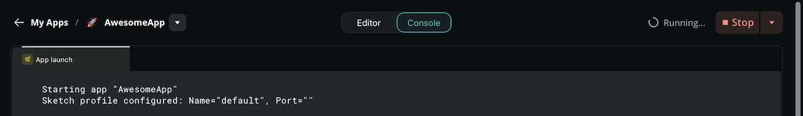
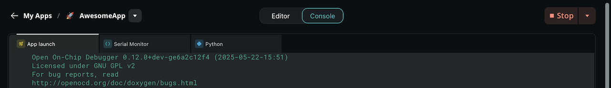
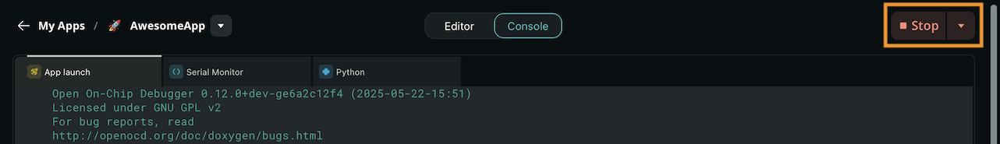
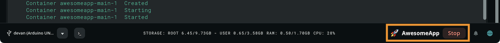

Arduino App Lab provides a seamless interface for testing, deploying, and managing applications on your board. Execute essential workflows including running examples, monitoring logs, and configuring startup apps.

## Run an App

When you have finished writing or modifying your code in the App Lab, you can execute it directly on your connected board.

1. [Open an App](../manage-apps/#open-an-app).
2. Click the **Run (▶)** button in the top navigation bar.
3. The **Console** panel opens automatically at the bottom of the editor as Arduino App Lab compiles your project, transfers it to the board's active memory, and launches it. Start-up logs appear in the **App launch** tab.
   
   <Alert type="info">**Note:** While the App is starting, only the **App launch** tab is available, and the system displays the text _"Running…"_ next to the **Stop** button.</Alert>
4. When the App launch completes, the text in the **App launch** tab turns green, and the **Serial Monitor** and **Python** tabs become available.
   

## Run at Startup

If you want your application to launch automatically whenever your board receives power, you must configure it as a **startup app**.

1. [Open an App](../manage-apps/#open-an-app).
1. Select the arrow (**▼**) next to the App name near the top left corner.
1. Enable **Run at Startup**.

Once configured, your board will automatically start the App on boot.

<Alert type="note">**Important:** Only one App can be set to run at startup at any given time. Setting a new App as the startup app will replace the previous configuration.</Alert>

## Stop an App

You can **stop** a running App in two ways:

- When you run an App, the **Run** button will be replaced by a **Stop** button. Click it to halt the application.
  
- You can always stop a running App by clicking the **Stop** button in the right corner of the **bottom status bar**.
  

## Monitor an App

When an App is running, you can monitor its execution through the **Console** panel at the bottom of the editor. Select the tabs at the top of the panel to switch between views:

- **App launch:** Displays logs related to code compilation, file transfer, and the deployment process. Check this tab if your App fails to launch.
- **Serial Monitor:** Displays logs from your microcontroller's sketch. Standard `Serial.print()` commands are automatically routed here.
- **Python:** Displays standard output from your Python script, such as `print()` statements. This is where you monitor the high-level logic and any errors on the Linux side.
