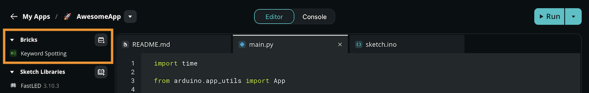

**Custom Bricks** allow you to create additional Docker services and companion Python packages for use by an App.

While Arduino Bricks provide ready-to-use features, Custom Bricks let you integrate any tool or service your application needs.

## Anatomy of a Custom Brick

A Custom Brick is a self-contained package stored locally within your App. Each Custom Brick is located inside the `bricks/` folder within your App's root directory, and the Brick's ID corresponds to the name of its folder. Custom Bricks don't use a namespace prefix (like `arduino:`).

A typical Custom Brick structure looks like this:

```text
my-app/
├── app.yaml
├── python/main.py
└── bricks/
    └── my_custom_brick/            # The Brick ID and folder name
        ├── __init__.py             # Python logic (optional)
        ├── brick_config.yaml       # Brick metadata and variables (required)
        ├── brick_compose.yaml      # Docker Compose configuration (optional)
        └── requirements.txt        # Python dependencies (optional)
```

<Alert type="info">**Note:** Custom Bricks are local to the App they are created in. They are not shared across different Apps or shown in the official Bricks index.</Alert>

## Create a Custom Brick

You can generate the foundational structure for a Custom Brick directly from the App Lab interface.

1. [Open an App](../../apps/manage-apps/#open-an-app).
2. Click the **Add Brick** button at the top of the **Editor sidebar**.
   
3. At the bottom of the Bricks catalog, select **Create Custom Brick**.
4. Enter a name for your Brick.
5. App Lab will generate the folder structure and basic files for your Custom Brick inside the `bricks/` directory.

### Configuration (`brick_config.yaml`)

The `brick_config.yaml` file defines the identity of your Brick and the environment variables it accepts from the App Lab UI.

```yaml
id: my_custom_brick
name: My Custom Brick
variables:
  - name: "MY_SETTING"
    description: "A custom setting for this brick"
    default_value: "123"
```

### Python Logic (`__init__.py`)

Custom Bricks can be implemented in two ways depending on your needs:

#### Simple Function-based Bricks

For utility functions or simple logic, you define plain Python functions. You don't need to use any special decorators.

```python
# bricks/my_custom_brick/__init__.py
def say_hello():
    print("Hello from the custom brick!")
```

#### Managed Class-based Bricks

If you want your Custom Brick to behave exactly like an official Brick with automatic lifecycle management (background threads, startup/shutdown hooks), use the `@brick` decorator on the class. The App lifecycle management system will automatically call certain methods of the decorated class:

```python
# bricks/my_custom_brick/__init__.py
from arduino.app_utils import brick
import time

@brick
class MyManagedBrick:
    def start(self):
        print("[Brick] Started")

    @brick.loop
    def my_background_task(self):
        print("[Brick] Running in background...")
        time.sleep(1)
```

For details on how to utilize the lifecycle management features of the App framework in the Python package of your custom App, see [Bricks Architecture and Configuration Reference](../bricks-reference/).

### Docker Containers (`brick_compose.yaml`)

If your Custom Brick requires external services (such as databases or companion APIs), you can define them in this file. The `brick_compose.yaml` file is a standard [Docker Compose file](https://docs.docker.com/reference/compose-file/). The orchestrator will automatically pull and run these containers alongside your App. For full details on Docker capabilities and networking, see [Bricks Architecture and Configuration Reference](../bricks-reference/).

```yaml
# bricks/my_custom_brick/brick_compose.yaml
services:
  my_service:
    image: some_registry/some_image:latest
ports:
  - "8080:8080"
```

<Alert type="warning">**Important:** The orchestrator executes the custom brick's Python code (in `__init__.py`) within the main application's container, **not** inside the custom Docker containers you define here. This means your Python code can't directly access system libraries or files inside the container. Instead, your Python code must communicate with the containerized service over the virtual Docker Compose network using a network API (such as HTTP, WebSockets, or TCP/IP). You can reach the service using the service name defined in your `brick_compose.yaml` (e.g., `my_service`) as the hostname.</Alert>

<Alert type="info">**Note:** Docker images specified in `brick_compose.yaml` must be publicly accessible, as App Lab doesn't currently support private registries for Custom Bricks.</Alert>

## Using Your Custom Brick

Once you create a Custom Brick, using it is identical to using a built-in Brick. You import its Python package into your App's `main.py` to instantiate its classes or call its functions.

### Registration (`app.yaml`)

The App Lab UI manages `app.yaml` automatically when you create a Custom Brick.

```yaml
# app.yaml
bricks:
  - my_custom_brick:
      variables:
        MY_SETTING: "123"
```

### Implementation (`python/main.py`)

The orchestrator automatically adds the `bricks/` directory to your Python `sys.path`. You can import the Brick's Python package (its folder name) directly inside `main.py`:

```python
# python/main.py
import os
from arduino.app_utils import App
from my_custom_brick import say_hello, MyManagedBrick

# Call a simple function
say_hello()

# Read the variable passed from the UI
print("Setting:", os.getenv("MY_SETTING"))

# Instantiate a managed brick so App.run() handles it
managed_brick = MyManagedBrick()

# Start the App
App.run()
```

For more details on how to import and initialize Bricks, see [Use Bricks in Your App](../use-bricks/).

## Custom Brick Examples

These examples illustrate key custom container patterns. Each example includes a complete, downloadable App archive that you can [import into Arduino App Lab](../../apps/manage-apps/#import-an-app).

### Use of a container

This example illustrates how to deploy a standard background container and connect to its services over the virtual network.

```yaml
services:
  hello_server:
    # Create a container from a Docker image that provides the BSD Netcat networking utility.
    image: toolbelt/netcat
    # Use Netcat to create a web server that responds with a simple message.
    # See: https://manpages.debian.org/unstable/netcat-openbsd/nc.1.en.html
    entrypoint: |
      sh -c ' \
        while true; do
          echo -e "HTTP/1.1 200 OK\r\n\r\nHello, world!" \
          | \
            nc -l -p 5000 -q 0 -v
        done \
      '
    ports:
      # Expose the port for communication with the container's web server.
      # See: https://docs.docker.com/reference/compose-file/services/#ports
      - 5000
```

This Brick provides an interface that can be used from the Python code running on the App's primary container:

```py
import requests

from arduino.app_utils import App

response = requests.get("http://hello_server:5000")
print("Web server response:", response.text)

App.run()
```

**Download Example:** [simple-web-server-brick.zip](https://github.com/user-attachments/files/29425430/simple-web-server-brick.zip)

### Giving the container access to system resources

This example shows how to configure your Docker service to access physical devices exposed to the container.

```yaml
# See: https://docs.docker.com/reference/compose-file/services/
services:
  sound_devices:
    # Create a container from a Docker image that provides the BSD Netcat networking utility.
    image: toolbelt/netcat
    # Make the host system's sound devices available for use inside the container.
    devices:
      - /dev/snd
    # Use Netcat to create a web server that responds with a list of the sound devices present in the container.
    # See: https://manpages.debian.org/unstable/netcat-openbsd/nc.1.en.html
    entrypoint: |
      sh -c ' \
        while true; do
          sound_devices="$$(ls -1 /dev/snd)"

          echo -e "HTTP/1.1 200 OK\r\n\r\n$$sound_devices" \
          | \
            nc -l -p 5000 -q 0 -v
        done \
      '
    ports:
      # Expose the port for communication with the container's web server.
      # See: https://docs.docker.com/reference/compose-file/services/#ports
      - 5000
```

Minimal Python code to interact with the Brick from the App's primary container:

```py
import requests

from arduino.app_utils import App

# Make an HTTP request to the custom Brick's web server.
# See: https://requests.readthedocs.io/en/latest/user/quickstart/#make-a-request
response = requests.get("http://sound_devices:5000")
print("Sound devices:")
print(response.text)

App.run()
```

**Download Example:** [simple-device-access-brick.zip](https://github.com/user-attachments/files/29425418/simple-device-access-brick.zip)

## AI Models in Custom Bricks

In the App Lab ecosystem, there is a strict separation between **AI Bricks** (the Python interface and Docker Runner) and **AI Models** (the data blobs/weights).

If your Custom Brick relies on Edge Impulse models, you declare them in a `models-list.yaml` file. The orchestrator uses this file to download the `.eim` models to the board so the runner can load them.

```yaml
# bricks/my_custom_brick/models-list.yaml
models:
  - my-model:
      runner: brick
      name: "Custom Model"
      bricks:
        - id: "my_custom_brick"
      metadata:
        ei-project-id: 12345
        ei-model-url: "https://studio.edgeimpulse.com/public/12345/live"
```

The manifest includes the following parameters:

- **`runner`**: Specifies the execution method for the model. A value of `brick` indicates that the brick's companion container handles the model execution.
- **`name`**: The display name for the model shown inside the visual App Lab UI.
- **`bricks`**: A list of brick IDs that are compatible with and will load this model.
- **`metadata`**: Contains Edge Impulse-specific details:
  - `ei-project-id`: The unique project identifier inside the Edge Impulse Studio.
  - `ei-model-url`: The direct download link to retrieve the pre-compiled `.eim` model file.

<Alert type="info">**Note:** When you export an App that contains a Custom Brick, the Brick's source code is included in the export. However, external dependencies like AI models or Docker images are not exported and must be re-downloaded when the App is imported elsewhere.</Alert>
