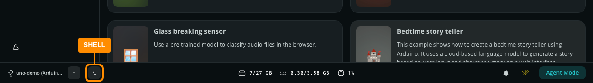
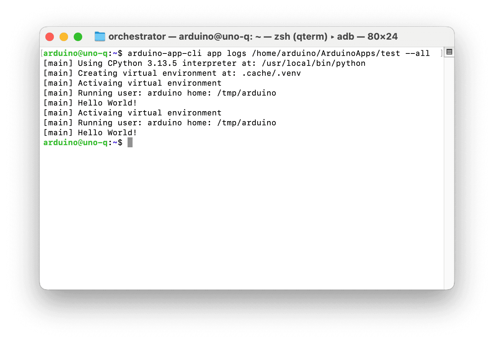
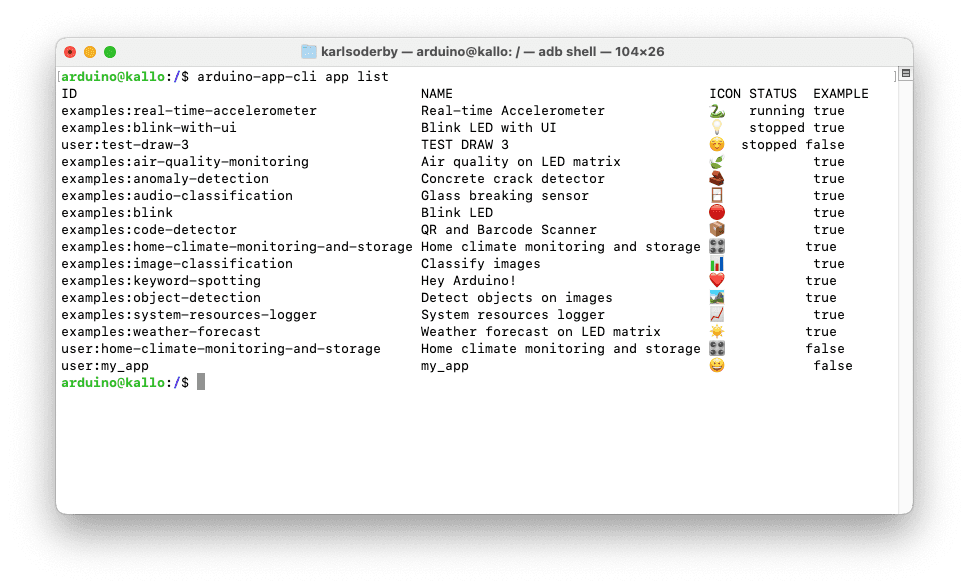
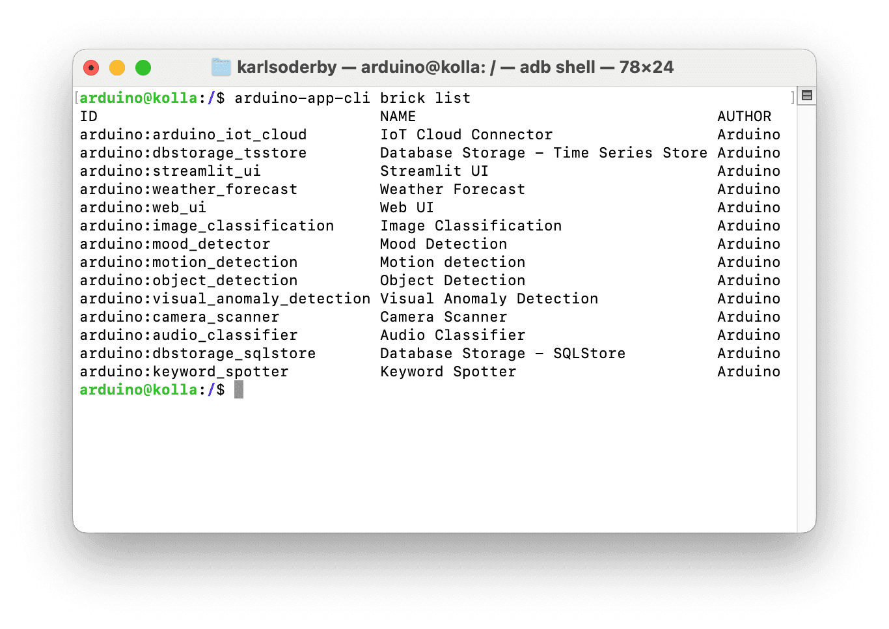

Manage your modular Apps through the `arduino-app-cli`, the command-line engine behind Arduino App Lab. This tool allows you to build, start, and stop applications directly from your board's terminal or remotely via ADB and SSH.

The `arduino-app-cli` is pre-installed on the board. You can run it from a terminal on the board itself, or from a shell opened on your computer. Arduino App Lab opens that shell for you, as described below.

## Requirements

The following hardware is required:
- [Arduino UNO Q](https://store.arduino.cc/products/uno-q)
- [USB-C® type cable](https://store.arduino.cc/products/usb-cable2in1-type-c)

Arduino App Lab opens the board's shell for you, so no additional software is required. To connect manually, or to transfer files with `adb pull` and `adb push`, you also need [Android Debug Bridge](https://developer.android.com/tools/releases/platform-tools) installed. SSH is typically installed on your system by default.

## Open the Board's Shell

Arduino App Lab opens a shell on your board directly from its interface, without setting up `adb` or `ssh` yourself.

1. Connect your board and make sure it is selected in the footer status bar.
2. Select the **Connect to the board's shell** button (terminal icon) next to the board name.

   

3. A terminal window opens on your computer, already logged in on the board as the `arduino` user.
4. Run the commands you need on the board. To close the session, type `exit`.

Arduino App Lab selects the connection method based on how the board is connected:

- **USB mode**: the shell is opened over ADB (Android Debug Bridge). No password is required.
- **Network mode**: the shell is opened over SSH. Provide the board password you set during the first setup.

***To open the board's shell manually, or from a computer without Arduino App Lab, see the [Connect to UNO Q via ADB](/tutorials/uno-q/adb/) and [Connect to UNO Q via Secure Shell (SSH)](/tutorials/uno-q/ssh/) tutorials.***

## Using Arduino App CLI

With the `arduino-app-cli` tool, you can for example:
- start/stop Apps
- list running Apps
- create new Apps
- show logs of an App
- monitor an App

To get a full understanding of available commands, type `arduino-app-cli` in the terminal.

### Create an App

To manage Apps, we use the `app` command. 

To create an app, we can use:

```sh
arduino-app-cli app new "test"
```

This will create an App at `/home/arduino/ArduinoApps/test`, with the configuration files as well as sketch & Python® folder.

### Edit an App

If you are using the board with a monitor, keyboard & mouse, you can open the files in a code editor, such as *Vim*, *gedit* or *Sublime*. 

If you are accessing the board via `adb`, you can **pull** and **push** the files/folder from your host computer.

To pull the file, use:

```sh
adb pull /home/arduino/ArduinoApps /path/to/localfolder
```

And to push it, use: 

```sh
adb push /path/to/localfolder /home/arduino/ArduinoApps
```

>Note: you may need to give permission rights to the `ArduinoApps` folder. This can be done by running `adb shell chown -R arduino:arduino /home/arduino/ArduinoApps`.

### Start & Stop Apps

Once an App is created and edited, it can be launched through the following command:

```sh
arduino-app-cli app start "/home/arduino/ArduinoApps/test"
```

This will launch the App on your board.

To stop the App, use:

```sh
arduino-app-cli app stop "/home/arduino/ArduinoApps/test"
```

### Read App Logs

To monitor the logs of a running App, use the `logs` command:

```sh
arduino-app-cli app logs /home/arduino/ArduinoApps/test --all
```

This will list the logs of the App:




## Running Examples & User Apps

To run built-in examples and Apps that we create, we can use the `user` and `examples` shortcut (instead of specifying path).

```sh
# run your own app
arduino-app-cli app start user:my-app 

# run an example app (e.g. blink)
arduino-app-cli app start examples:blink
```

### List Apps

To list available Apps, use the `app list` command.

```sh
arduino-app-cli app list
```

This will list all available Apps (including examples), and their status:




## System Configuration and Updates

The `system` command allows you to manage system configurations and updates on your board.

To check for updates, run:

```sh
arduino-app-cli system update
```
This will prompt you to install any available updates.

To set the board name, use:

```sh
arduino-app-cli system set-name "my-board"
```
This will change the name of the board, which will take effect after resetting the board.

To enable or disable the network mode, use:

```sh
arduino-app-cli system network enable/disable
```

Network mode will enable SSH and allows clients to connect to the board over a local network.

Finally, you can gain back some storage space by cleaning up unused containers and images by running:

```sh
arduino-app-cli system cleanup
```

## Bricks

Currently, it is only possible to list available Bricks and specific details for each Brick.

This is done by running:

```sh
# List out Bricks installed on the board
arduino-app-cli brick list
# Details for a specific Brick
arduino-app-cli brick details arduino:<brick>
```

Which will show something akin to:



## Summary

This article covers some important commands & usage of the `arduino-app-cli`, which allows you to manage Apps on your board without the graphical interface.

More documentation for the Arduino App Lab is available at:
- [Arduino App Lab Documentation](https://docs.arduino.cc/software/app-lab/)

You can also visit the [Arduino® UNO Q](/hardware/uno-q) hardware page for details on the board. 

<!-- markdownlint-disable-file -->
