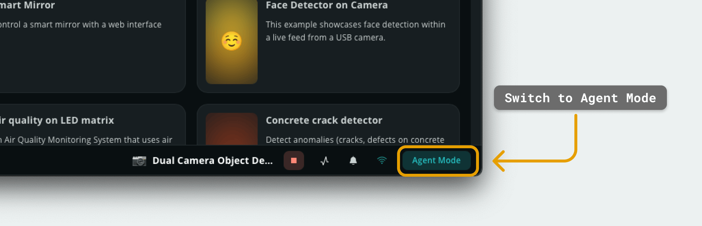
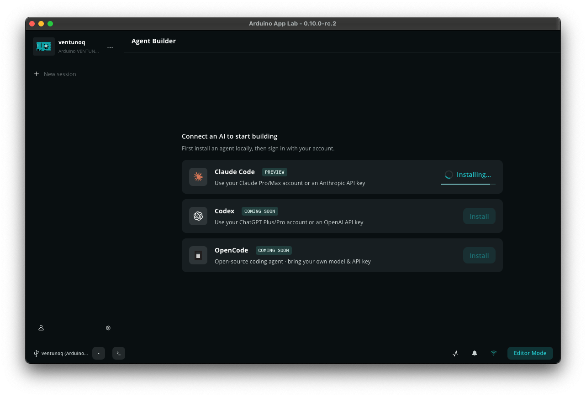

The **Agent Mode** view in **Arduino App Lab** allows you to use AI coding agents for creating applications. Agents can read and write project files, execute commands, and assist with code — all without leaving the Arduino App Lab editor.

Currently, **Claude Code™** (by Anthropic) is supported. Additional agents (Codex and OpenCode) are coming soon.

## Accessing the Agent Mode

The Agent Mode panel is located in the **bottom-right corner** of the App Lab interface, where an animation will play until you discover it. Clicking on it will enable "Agent Mode" view.

To go back to normal editor mode, click on the same button. The agent will continue to run in the background and you can easily change between **editor mode** or **agent mode** without interrupting any ongoing processes.

## Installing and Authenticating Claude Code

Click **Install** on the Claude Code card. The agent is installed on your local machine, not on the board — it interacts with the board remotely through App Lab. Once installation completes, click **Sign In** to link your Anthropic account — either a Claude Pro/Max account or an Anthropic API key. After authorization, the agent status updates to **Connected**.

## Models and Permissions

In the agent settings, you can select which Claude model to use and control what the agent is allowed to do.

Models vary in speed and reasoning depth. Larger models (Opus) produce more thorough responses; smaller models (Sonnet, Haiku) are faster and consume fewer tokens.

Permissions define the agent's access to your project:

- **Default:** Standard mode, prompts for any dangerous operations.
- **Accept Edits:** Auto-accepts all file edit operations.
- **Plan Mode:** Does not execute any tools.
- **Don't Ask:** Does not prompt for any permissions, denies if it is not pre-approved.
- **Bypass Permissions:** bypasses all permission checks.

## Sessions

Each conversation with the agent is a **session**. Sessions store the full message history, including file context from that exchange.

Use the **session selector** in the Agent Mode panel (to the left) to switch between sessions or start a new one. Previous sessions are listed by date and can be reopened at any time.

***Sessions are stored locally on your machine (not on the board) and are cleared if Arduino App Lab is reinstalled. The sessions will persist when changing a board.***

## Output

Apps that are created through the Agent Mode will appear in the "Apps" section. Here you can manually review the App and make changes to the code. 

## Successful Prompting

In Agent Mode, the agent owns the code — you focus on **what** you want to build. You are not expected to read files or edit code yourself. Instead, describe your goal, plan with the agent, and let it execute.

- **Start with a plan:** Describe your goal at a high level. For example: "I want an app that reads temperature from a sensor and displays it on a dashboard." The agent can then propose a step-by-step plan before writing any code, depending on what permission settings you have.
- **Split work into tasks:** Split the work that needs to be done into tasks. The agent can then execute them in sequence, and can be set to ask for your permission to continue.
- **Review results:** After the agent completes a task, test the behavior (run the app, check outputs). If something is wrong, describe the problem and the agent will locate and fix it.
- **Use a new session for unrelated tasks:** Keeping sessions focused prevents the agent from applying context from a previous project to the current one. A good rule of thumb is to keep one session per App, as the session history will be included.
