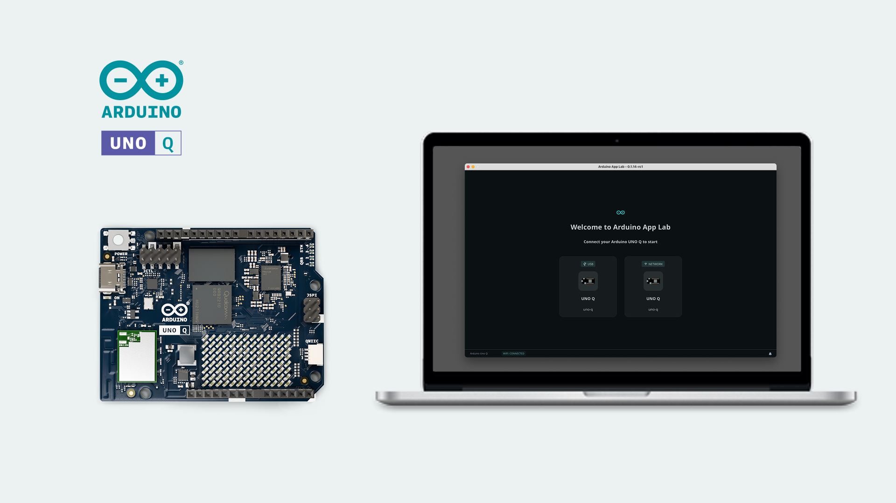

With the [Arduino App Lab](https://www.arduino.cc/en/uno-q/), you can create and deploy **Apps** on the [Arduino® UNO Q](https://store.arduino.cc/products/uno-q) board, which features both a microcontroller and a microprocessor running Linux system. The Arduino App Lab is designed to run both on a personal computer (Windows, MacOS, Linux), and on the UNO Q, where it is pre-installed and automatically updated.

In this guide we will explore:
- The Arduino App Lab core features.
- How Apps work, and how they are structured.
- What a [Brick](/software/app-lab/tutorials/bricks/) is, and how they are used in Apps.
- How to launch an App on an UNO Q board.

***The Arduino App Lab software also provides several guides and examples for getting started with the UNO Q.***

## Hardware & Software Requirements

### Hardware

- Computer (Windows/Mac/Linux)
- [Arduino® UNO Q board](https://store.arduino.cc/products/uno-q)
- [USB-C® cable](https://store.arduino.cc/products/usb-cable2in1-type-c)

Alternatively, using the board as a [Single Board Computer (SBC)](/tutorials/uno-q/single-board-computer/), the following is required:
- USB-C dongle
- A monitor and HDMI cable
- Keyboard and mouse

### Software

- [Arduino App Lab](https://www.arduino.cc/en/uno-q/)

### Internet Connection

The board is automatically updated when a new update is released. To download and install it, an Internet connection is required. To run Apps, an Internet connection is not required unless using examples that specifically requires it (e.g. connecting to Arduino Cloud, fetching data from external APIs).

## Install & Set Up Arduino App Lab

***Instructions for your specific OS is available down below.***

1. Navigate to the [Arduino Software Page](https://www.arduino.cc/en/software/#app-lab-section) and download the Arduino App Lab for your OS.
2. Download and run the installation file.
3. Launch the Arduino App Lab.
4. Connect the UNO Q board to a computer.

After launching the Arduino App Lab and connecting the UNO Q, you will be prompted inside the editor to configure your board's Wi-Fi®, as well as setting a name & password for the board.

***You will also be prompted to login to your arduino.cc account. This is optional, but you will need to be logged in to use some of the features of the Arduino App Lab.***

### MacOS

On MacOS, run the `.dmg` file from your Downloads folder, and move it to your Applications folder.

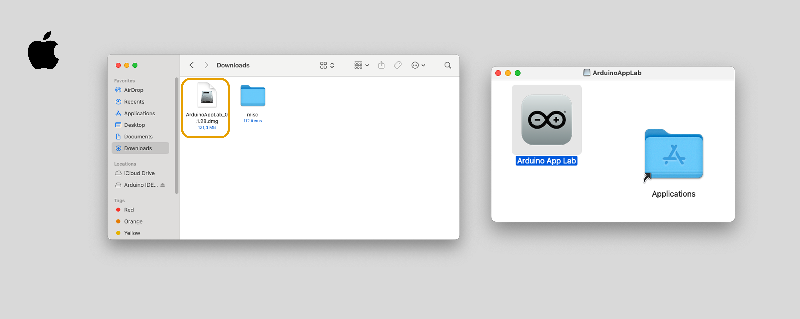

### Windows

On Windows, run the `.exe` file from your Downloads folder, and complete the installation.

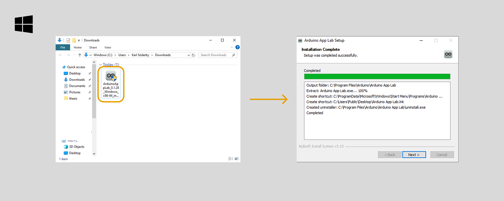

### Linux

On LinuxOS (Ubuntu based), extract the downloaded file (`.tar.gz`). Navigate to the folder and run the application.

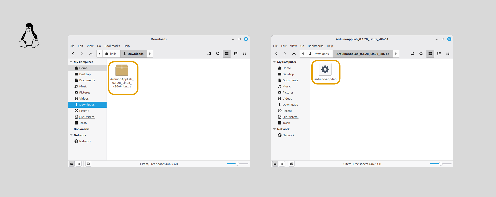

After extracting the folder, we recommend moving it to e.g. `$HOME/Desktop` or `$HOME/Applications`:

```sh
tar -xf ArduinoAppLab*.tar.gz 
mv ArduinoAppLab*/ ~/Desktop
```

**Note:** you will need `libwebkit2gtk-4.1` installed on your machine to successfully run the Arduino App Lab. Install it by running:

- **Debian / Ubuntu:**
```sh
sudo apt install libwebkit2gtk-4.1-0
```

- **Arch:**

```sh
sudo pacman -S webkit2gtk-4.1
```

## Board Modes

The board can be used in **three different modes:**
- **Over USB (desktop mode)** - the board is connected to a personal computer (Windows / Mac / Linux), and is programmed using the Arduino App Lab desktop application.
- **Over local Wi-Fi® network (network mode)<sup>1</sup>** - using this mode, a connection with the board is established over the local network (over Wi-Fi®), using SSH<sup>2</sup>.
- **Using board as an Single Board Computer (SBC mode)** - by connecting a USB dongle with a monitor, keyboard & mouse connected, the UNO Q can be used as an SBC.

***<sup>1</sup>Network mode only works once the first setup is complete, which requires a USB connection. After the first setup, when launching the Arduino App Lab, select the "Network" mode.***

***<sup>2</sup>The computer connecting to the board needs to be connected to the same local network.***

### Desktop Mode Over USB (Default)

To program your board over using **desktop mode**, follow the instructions below:
1. Connect the board to your computer, using a USB-C® cable.
2. Open the Arduino App Lab, wait for the board to appear<sup>3</sup>, and select the **USB** option.
    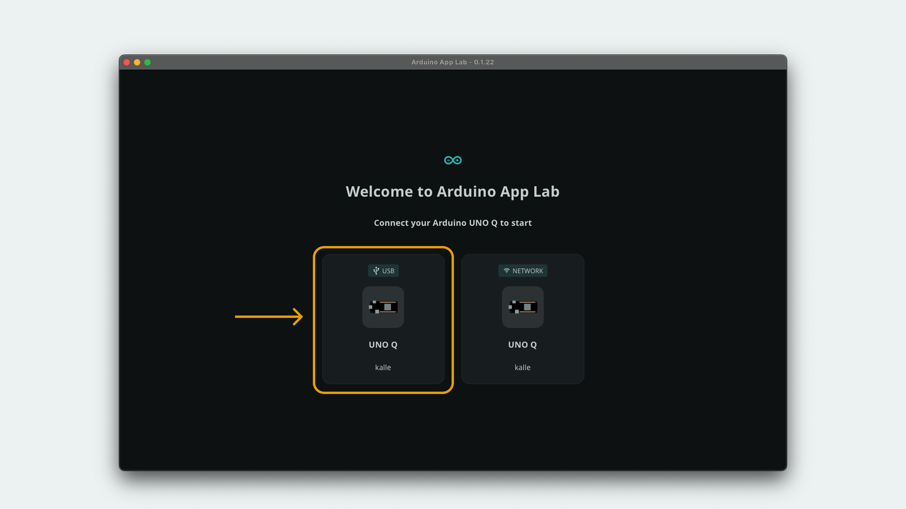

3. You are ready to create and run Apps on your board ✅.

***<sup>3</sup>The board takes some time to boot. If the animation on the LED matrix is still running, it is still booting.***

### Network Mode (Over Local Wi-Fi® Network)

To program your board using **network mode**, follow the instructions below:
1. Make sure the board is setup (this is done by connecting the board over USB, see above instructions).
2. Open the Arduino App Lab, wait for the board to appear, and select the **network** option.
    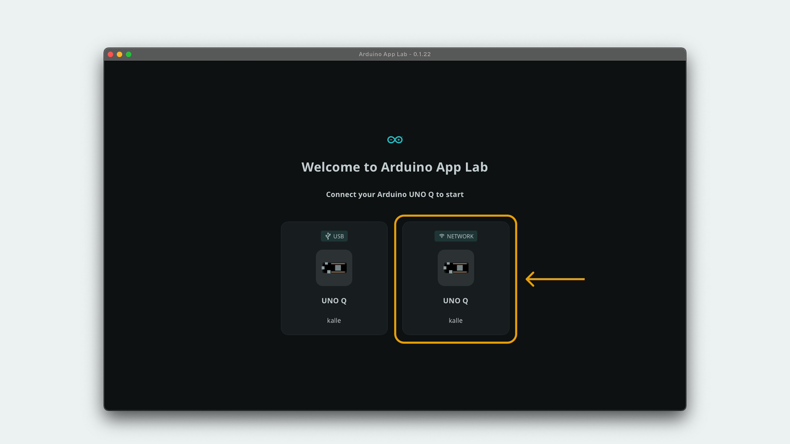

3. You are ready to create and run Apps on your board ✅.

***Network mode makes it possible to develop and run Apps on the board, without it being connected to a computer.***

***Note: if you change Wi-Fi® networks, the board will need to be connected again via USB, where you will be prompted again to connect to a new network. The board will then automatically connect to any network previously configured.***

### SBC Mode (Standalone)

***This mode requires a USB dongle with HDMI and external power delivery support.***

To program your board using **SBC mode**, follow the instructions below:
1. Connect a USB dongle to the board's USB-C® port.
2. Connect a monitor (via HDMI), keyboard and mouse to the USB dongle.
3. Power the USB dongle using a +5 VDC - 3 A power source (e.g. a phone charger).
4. The complete setup should look like this:
    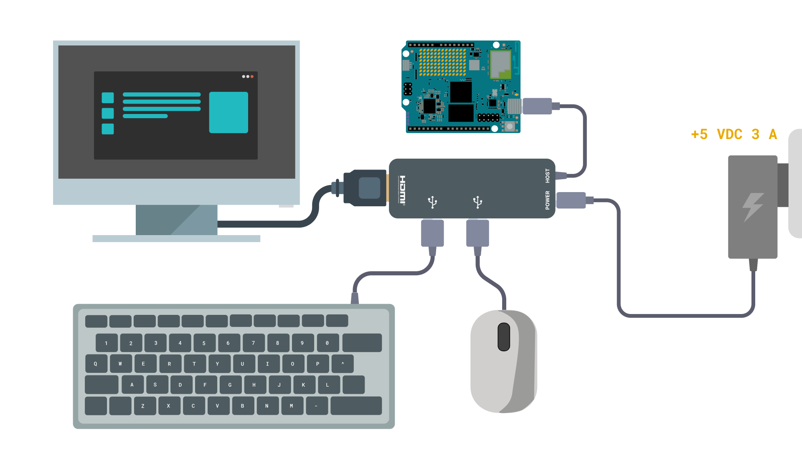

5. Wait for the board to boot. Once it is booted, a login screen will appear on the monitor.
6. Log in using the credentials `arduino` as a username, and create a custom password for the board.
7. Once logged in, the Arduino App Lab will automatically launch and look for updates. Once the update is finished, you are ready to create and run Apps on your board ✅.

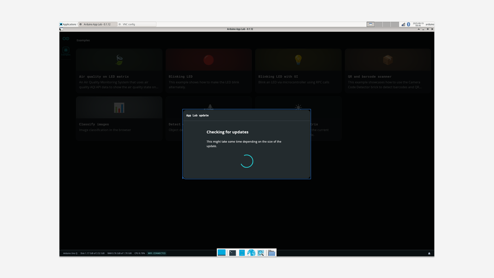

## Arduino App Lab UI Overview

The Arduino App Lab is designed as an editor and resource manager for creating & launching Apps.

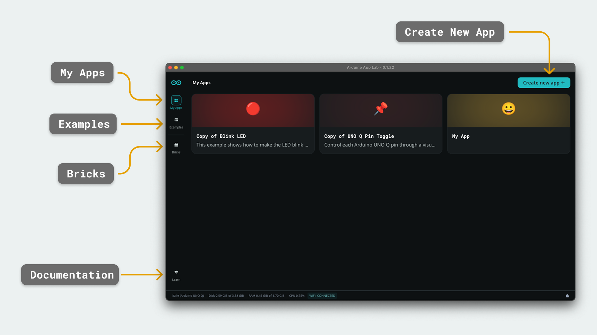

- **My Apps** - created / duplicated Apps appear here. Click into each App to edit and run them.
- **Examples** - examples made by the Arduino® team, including audio classification, video object detection and GPIO control.
- **Bricks** - the modular code building blocks that is used to create advanced Apps easily.
- **Learn** - built-in documentation for learning about Arduino App Lab features.

### What are Apps?

The Arduino App Lab is designed around **Apps** that will run on the [UNO Q](https://store.arduino.cc/products/uno-q) board. The UNO Q is a board unlike any other Arduino board, featuring a microprocessor capable of running Debian OS (a Linux distribution), and a microcontroller that runs sketch files. These systems can then communicate using a tool called [Bridge](#bridge-tool).

Apps are a composition of various configuration and application files:
- A **Python® file** running on the Linux system.
- A **sketch file** running on the microcontroller.
- Or **both a Python® file and sketch file**, talking to each other (this is the most common example).

Below is an example of the **Home Climate Monitoring** App, which records data from a Modulino® and streams it to a web server hosting a web application.

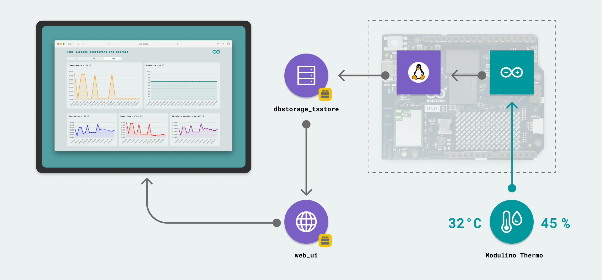

Apps can be created directly from a large set of pre-made examples, or you can create your own from scratch. Examples are accessible in the side menu, under **"Examples"**, which provides in-app documentation on how to connect any additional hardware, how to use the example, and how to understand the code setup. All examples can be duplicated and modified<sup>4</sup>.

To create your own App, navigate to the **"Apps"** tab, and click on the **"Create new app +"** button.

***<sup>4</sup>To duplicate an example, navigate to an example, click on the arrow next to the name, and select "Duplicate Example". Some examples such as the "Blinking LED from Arduino Cloud" may require additional setup, such as adding API keys.***

### What are Bricks?

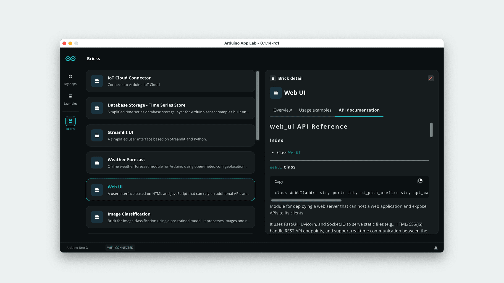

[Bricks](/software/app-lab/tutorials/bricks/), unlike Apps, can best be likened to a software library that has pre-packaged functionalities, such as AI models, web server or specific HTTP requests that will make developing code easier. However Bricks are unique as they do not just import code, they are designed to launch in parallel with Apps.

There are a number of different categories, for example:

- An object detection model trained on a specific set of images
- Pre-packaged code for connecting to an external API (such as weather forecast)
- A web server that hosts a web application

Bricks containing AI models are deployed alongside the App as a [docker](https://www.docker.com/) container, and there may be several containers running simultaneously.

The Arduino App Lab has a number of Bricks that can be installed and used directly. These are available in the side menu under **"Bricks"**, and are frequently being updated.

***The API documentation for each Brick can be accessed in the "Bricks" tab inside the Arduino App Lab.***

### App Files

An App is contained inside a directory with multiple sub-directories. A typical App looks something like this:

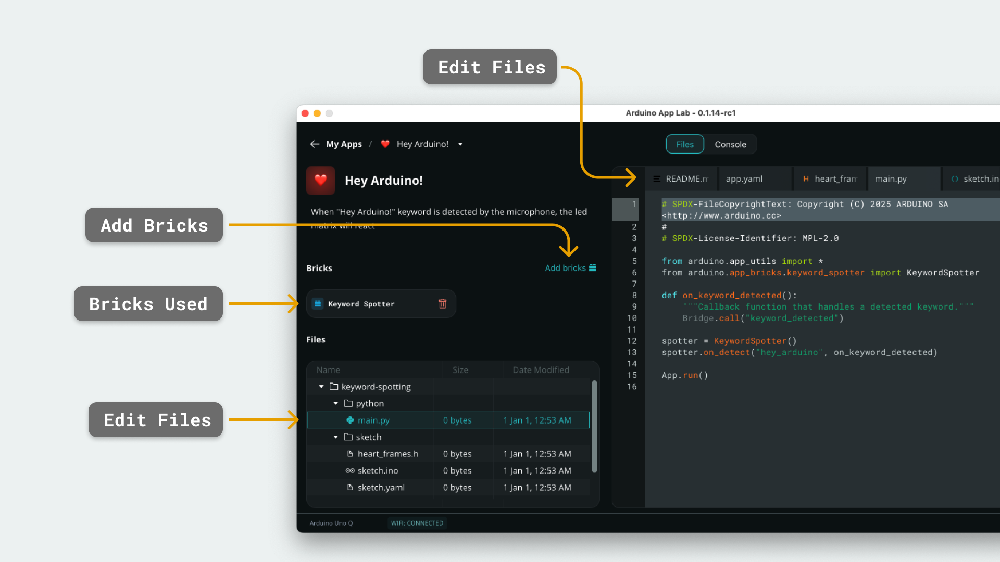

There are three main files, each contained in a separate folder:

- `sketch.ino` - hosts all the code for the **microcontroller**, written in the Arduino programming language (C++)
- `main.py` - main entry point for the **Linux system**, running on the microprocessor, written in Python®.
- `app.yaml` - contains metadata for an application, such as name, description and *Bricks* used. This file **cannot be edited**.

There are other files such as the `README.md`, storing the documentation for the App, and additional files that may be part of a particular example.

## Create & Run Apps

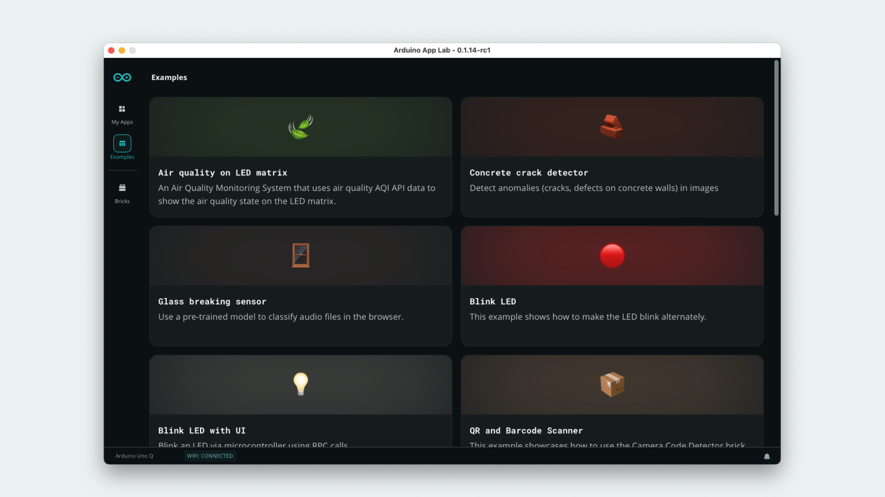

To run an App, you can either start from scratch, or choose an **existing example**. For first-time users, we recommend using an existing example for a better understanding of the structure.

### Run Example Apps

To run an example App, follow the steps below:

1. Select the example you want to run on your UNO Q board from the **"Example"** tab, located in the left side menu.
2. Click on the **"Run"** button in the top right corner.
3. Wait for the loading process to finish.
4. Once start-up is complete, you can start interacting with the App.

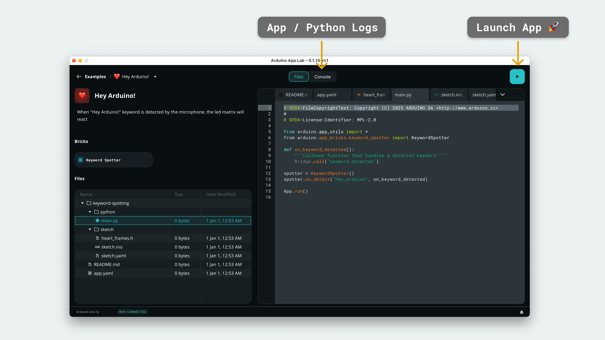

Each official example provides a detailed documentation provided in the `readme.md` file inside of the example App.

***Note that every time an App is launched, the sketch is compiled, and the Python® application is launched. Depending on the complexity of the application, this process may take up to a minute.***

### How do I know my App is Running?

Once an App is launched, the status of the App is available in the **Console**. There are three tabs available:
- **Start-up** - outputs the logs from the start-up process. Here you will find information regarding compilation for the microcontroller and deployment of the Python® application on the Linux system.
- **Main (Python®)** - view the logs from the Python® application (`print()`)
- **Sketch (Microcontroller)** - view serial data from the sketch (`Serial.println()`)

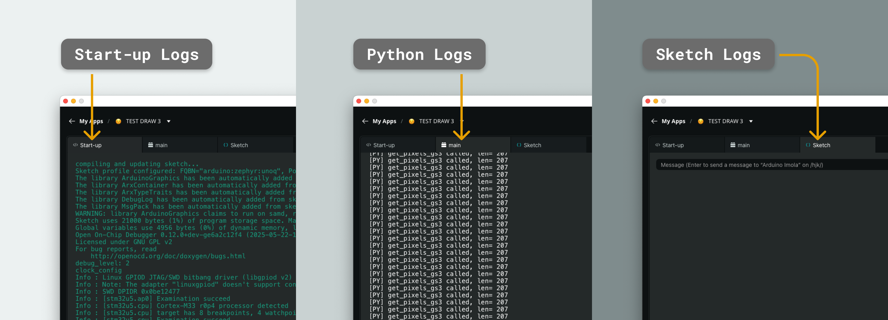

***Please note that while an App may successfully launch, it does not mean it is working properly. The Python® script may have issues, and this can be seen in the Python log. However, if an error occurs during the sketch compilation, the launch will be aborted.***

### Create a New App

To create a new App, click on the **"Create New App"** on the main page.

When creating a new App from scratch, the `sketch.ino` and `main.py` will need to be written manually,  and Brick will need to be imported manually.

To add a Brick, click on the **"Add Bricks"** button, and select the Brick you'd like to use. The Brick can now be used in your `main.py` file.

### Duplicate an Existing Example

Instead of creating a new App from scratch, an example can also be **duplicated**. This is done by selecting an available example in the **"Examples"** section, and duplicate it:

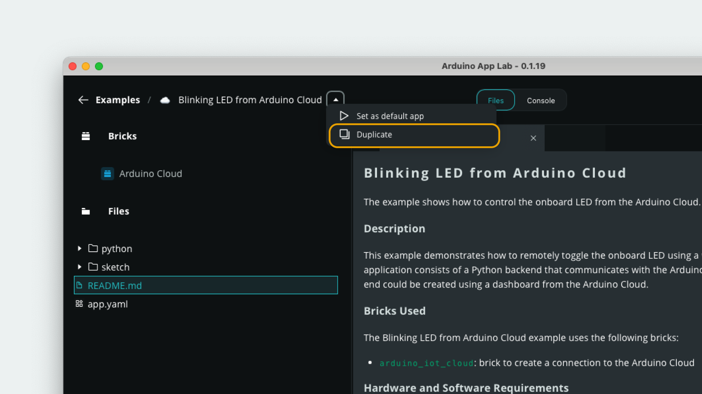

## How Apps Function

Only one App at a time can run on a board simultaneously, but an App may have several Bricks running in the background. Bricks are deployed as separate processes that run on the board, which the App can interface with using specific APIs.

For example, an App may have the following running at the same time:
- An AI model, for classifying incoming data (e.g. audio, camera, sensor data)
- A web server, that displays the data
- A Brick connecting to a Web API

These processes are run in parallel, which makes Apps a very versatile component when creating complex projects.

### App Run

When creating an App, it is important to always import and use the `App` class, particularly the `run()` function.

```python
# Launches the App, along with any imported Bricks
App.run()
```

It is important that `App.run()` is placed at the end of the `main.py` file, as this will launch any imported Bricks & utilities (such as Bridge). Any code placed after this will not function properly.

### Bridge Tool

One of the most important tools when developing Apps is the **Bridge** tool. The Bridge tool makes it possible to communicate between the Microcontroller and Linux system, through an easy-to-use API with three core functionalities:
- **Provide** - a service is *provided* that can be *called* upon.
- **Call** - we *call* a service that is *provided*.
- **Notify** - we *notify* the other side with some parameters (a one way push of data)

In simple terms, if you want to send data from the microcontroller to the Linux system, we would implement a provider function that we can then call from the Linux system, or use the notify function to push data from one system to the other.

Here's a very quick example, demonstrating sending data from the sketch to the Python® application.

**Sketch:**
```arduino
int data = 1;
Bridge.notify("python_function", data);
```

**Python®:**
```python
Bridge.provide("python_function", python_function)
def python_function(data: int)
    print(data)
```

## Summary

The Arduino App Lab is a versatile editor, used for programming both Python & Sketch applications on the UNO Q board. It includes a large variety of examples for quickly getting started, and several Bricks that makes the development experience easier.

In this guide, we have covered some of the most important aspects of the editor, such as:
- How to install & set up a board for the first time.
- What *Apps* are, and what are they made of.
- What *Bricks* are, and how they function
- What *Bridge* is, and how it makes the MPU & MCU communicate over RPC.

More documentation for the Arduino App Lab is available at:
- [Arduino App Lab Documentation](https://docs.arduino.cc/software/app-lab/)

You can also visit the [Arduino® UNO Q](/hardware/uno-q) hardware page for details on the board.