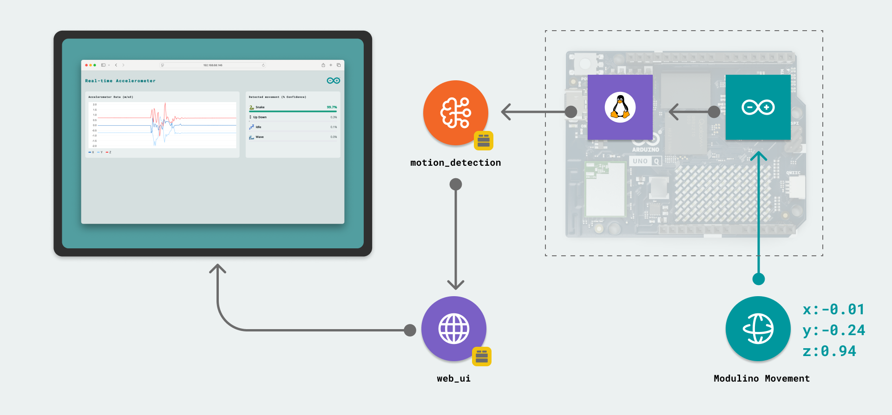
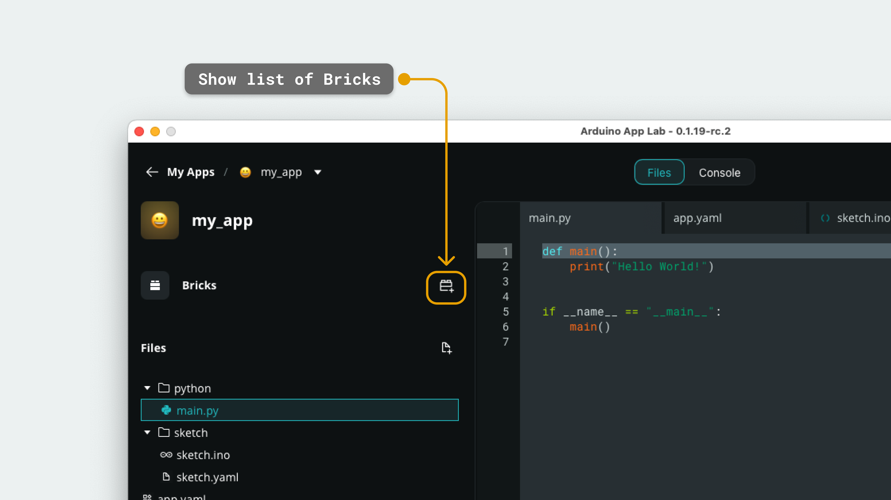
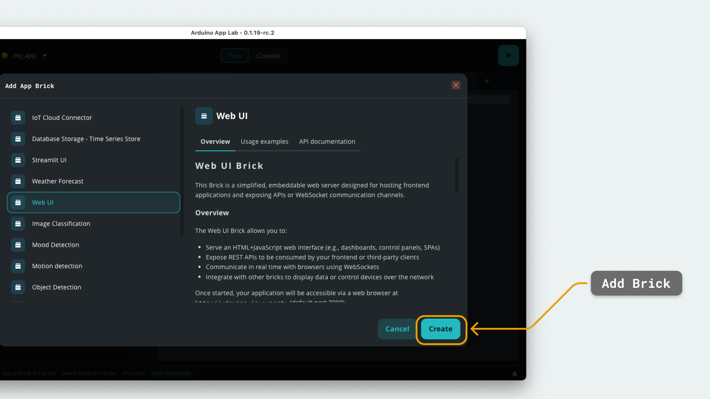

Bricks are **code building blocks** that are used to build [Apps](/software/app-lab/tutorials/getting-started/) in the [Arduino App Lab](/software/app-lab). Bricks have a wide area of usage, some embed AI models while other Bricks are used to host web applications or connecting to external web APIs.

They are designed to make it easier to build complex Apps, such as embedding **computer vision**, by abstracting the code and exposing easy-to-use APIs that can be used in an App. An App may have a number of Bricks, which may include:
- AI models, e.g. for object detection or image recognition
- A web UI builder, for hosting web interfaces for interacting or showing data from our board
- A REST API handler, that can return weather data through a single command

In this guide, we will explore how Bricks work, how they are used in Apps, and the different Bricks available.

***The API documentation for each Brick can be accessed in the "Bricks" tab inside the Arduino App Lab.***

## Hardware & Software Requirements

### Hardware

- [Arduino® UNO Q board](https://store.arduino.cc/products/uno-q)
- USB-C® cable

### Software

- [Arduino App Lab](https://www.arduino.cc/en/uno-q/)

## Understanding the Brick Concept



Bricks are code packages that are imported into an App, and launched as a separate process on the Linux system. Bricks are written in **Python**. When launching an App on the UNO Q, the Bricks are deployed on the board, and may be using [docker](https://www.docker.com/) containers that can be interfaced with from the main application through an easy-to-use API.

Bricks are first added in the UI, by clicking on the button (seen in the image below), and selecting the Brick we want to use inside our App. 




Adding a Brick will also update the `app.yaml` file:

```yaml
bricks:
    - arduino:web_ui
    - arduino:motion_detection
```

***Do not manually edit the `bricks` entry inside the `app.yaml` file.***

After adding the Brick to the App, it also needs to be imported in the `main.py` file that is located inside the `python` folder of your App. Below is an example:

```python
from arduino.app_bricks.web_ui import WebUI
from arduino.app_bricks.motion_detection import MotionDetection
```

- In the above example, `WebUI` and `MotionDetection` classes are imported from the `web_ui` and `motion_detection` Bricks. 

To access the Brick's functionality, we would use:

```python
motion_detection = MotionDetection(confidence=CONFIDENCE)
web_ui = WebUI()
```

***To get a better understanding of what each Brick does, see the "Bricks" section in the Arduino App Lab.***

### Brick Class Example

Other Bricks are more advanced, such as the `objectdetection` Brick. This Brick can detect objects within an image and return class labels, and confidence scores using the **YoloX Nano** model.

```python
object_detection = ObjectDetection()
frame = os.read("path/to/your/image.jpg")

out = object_detection.detect(frame)
obj_det = out["detection"][0]
detected_object = obj_det.get("class_name", None)
```

Inside the Brick, the `detect` method looks like this:

```python
    def detect(self, image_bytes, image_type: str = "jpg", confidence :float = None) -> dict:
        """Process an image to detect objects.

        Args:
            image_bytes: can be raw bytes or PIL image.
            image_type: type of image (jpg, jpeg, png). Default is jpg.
            confidence: confidence level for detection. Default is None (use module defaults).
        """
        if not image_bytes or not image_type:
            return None
        ret = super().infer_from_image(image_bytes, image_type)
        return self._extract_detection(ret, confidence)
```

## What Bricks are Available?

There are many Bricks available to choose from. The Bricks are divided into the following categories:
- AI - Audio
- AI - Computer Vision
- AI - Sensor data
- API
- IoT
- Storage
- Web User Interface

To view the full list of Bricks, navigate to the **"Bricks"** tab in the Arduino App Lab. The description, usage, API documentation and linked examples are also available in this section.

### Brick Types

Bricks vary in level of implementation, where some Bricks work similarly to a Python® module, others use **Docker** to launch a container on the board. Deploying Bricks is handled automatically by the Arduino App Lab. 

Some Bricks, such as the `web_ui`, use a folder called `assets` inside of an App, where HTML/CSS/JS files can be configured to interface with the Python application via web sockets. This particular Brick also launches its web applications at `http://localhost:7000`, which can be accessed by other devices on the same network, using the `<board-name>.local:7000` address.

> The board name is visible at the bottom of the Arduino App Lab, and is the name we set during the first setup.

### Bricks with AI Models

Bricks embedding an AI model uses a Docker container to launch the Brick, which is called from the main Python® application. These Bricks use a default model that is pre-configured.

Bricks using AI models are deployed using a [Docker](https://www.docker.com/) container. This spawns a separate process running on the board, which can be interfaced with through APIs from the Python® application.

This can be detected during the **start-up** of an App, by checking the logs. 

```sh
# Container for Brick started
Container local-share-arduino-app-cli-examples-real-time-accelerometer-ei-motion-detection-runner-1  Started
# Container for App started
Container local-share-arduino-app-cli-examples-real-time-accelerometer-main-1  Started
```

#### Docker Status

It is possible to see the status of a Docker container by running `docker ps` in the board's terminal. To access the terminal, we can either:
- Open the terminal in [Single Board Computer (SBC)](/tutorials/uno-q/single-board-computer) mode and run `docker ps`
- Access the board's shell via `adb` (with the board connected via USB).

Running the command provides information regarding the container, and if an issue occurred during or after the launch of an App, it is possible to see if it is running or not.

The output from running a command looks like this:

```sh
CONTAINER ID   IMAGE                                                      COMMAND                  CREATED        STATUS         PORTS                                       NAMES
9d194a4f6867   public.ecr.aws/arduino/app-bricks/python-apps-base:0.3.1   "/run.sh"                41 hours ago   Up 6 minutes   0.0.0.0:7000->7000/tcp, :::7000->7000/tcp   local-share-arduino-app-cli-examples-real-time-accelerometer-main-1
03c2f2fa2b4b   public.ecr.aws/arduino/app-bricks/ei-models-runner:0.3.2   "node /app/linux/nod…"   41 hours ago   Up 6 minutes   127.0.0.1:1337->1337/tcp                    local-share-arduino-app-cli-examples-real-time-accelerometer-ei-motion-detection-runner-1
```

If an App or Brick has not launched properly, we may see:

```sh
CONTAINER ID   IMAGE                                                      COMMAND                  CREATED        STATUS         PORTS                                       NAMES
```

## Summary

Bricks are fundamental to developing Apps for the UNO Q board. In this guide, we have learned that:
- Bricks are code building blocks that makes it easier to build Apps
- Some Bricks may include the use of an AI model
- Some Bricks may help build an accessible web interface over the local network

More documentation for the Arduino App Lab is available at:
- [Arduino App Lab Documentation](https://docs.arduino.cc/software/app-lab/)

You can also visit the [Arduino® UNO Q](/hardware/uno-q) hardware page for details on the board. 

