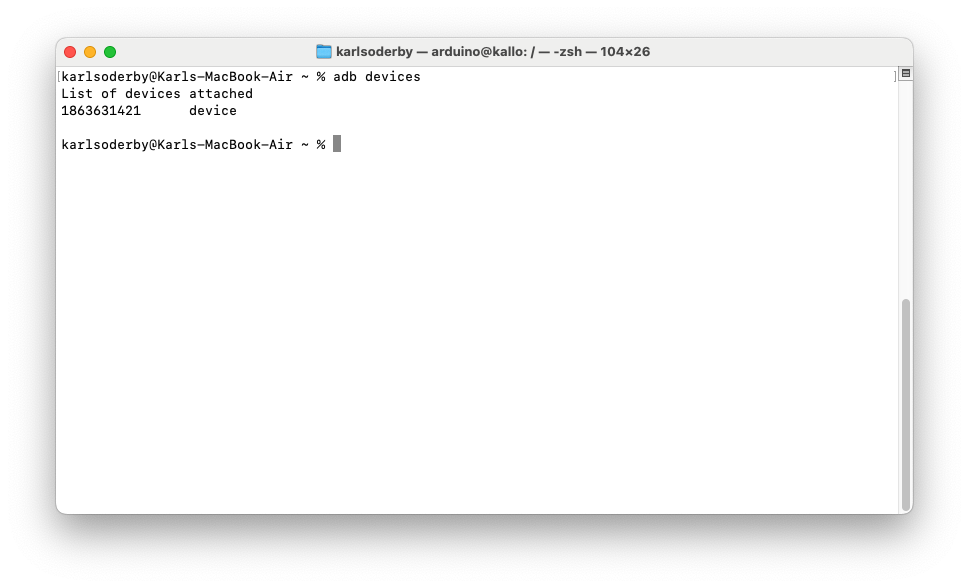
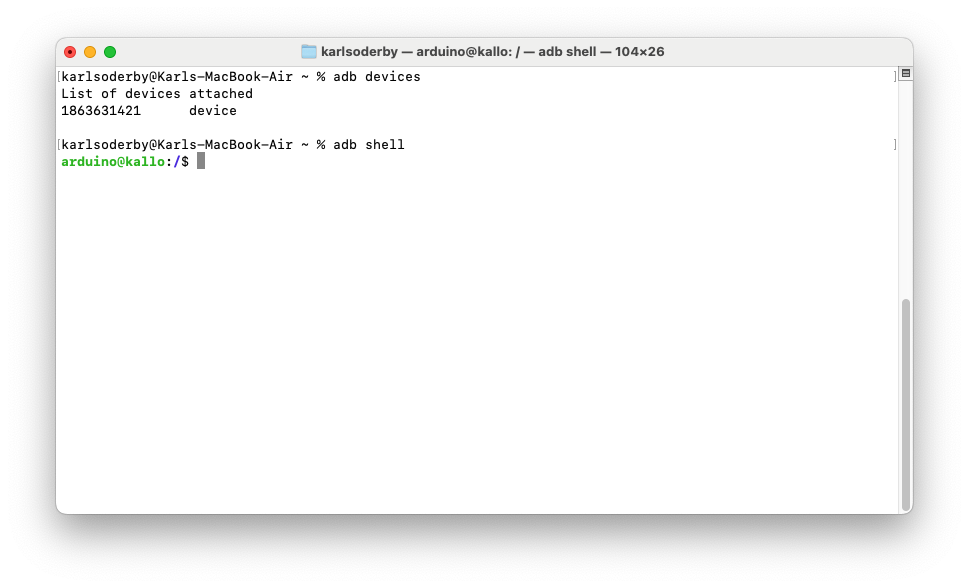
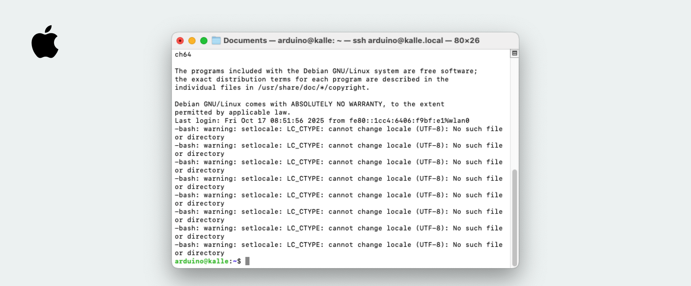
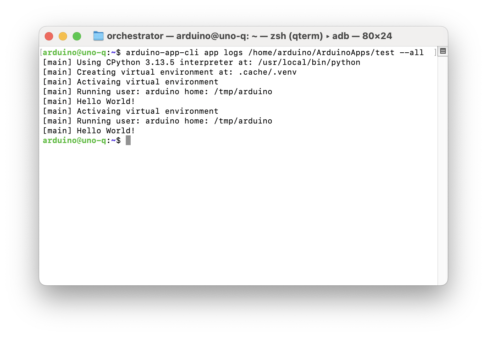
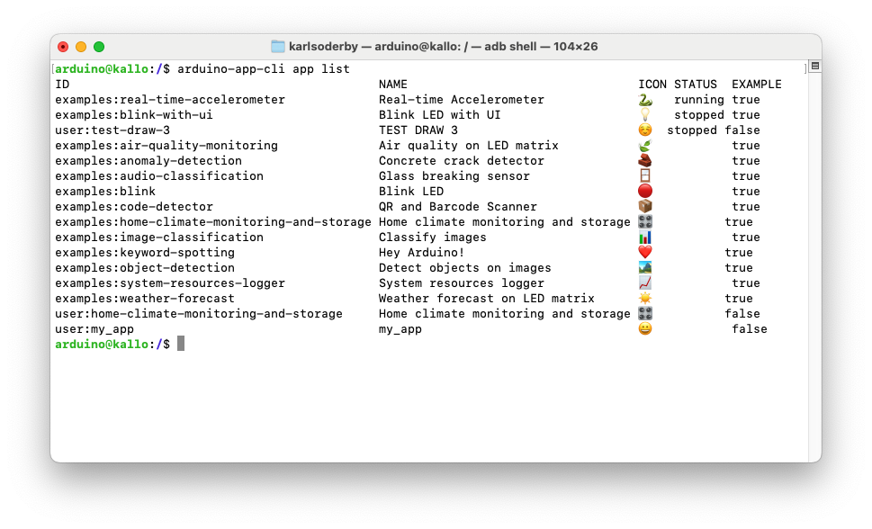
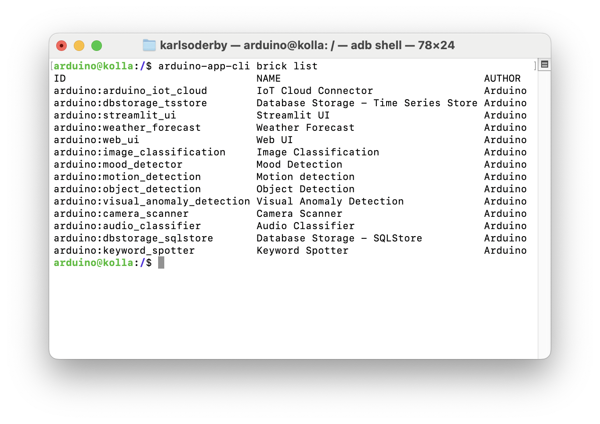

The Arduino App Lab is built on top of the `arduino-app-cli` tool, a command line tool that manages Apps made for the [Arduino UNO Q](https://store.arduino.cc/products/uno-q) board.

The `arduino-app-cli` is pre-installed on the UNO Q board and can be accessed either through using the terminal on the board itself, or by accessing the board's terminal from a host computer via Android Debug Bridge (ADB).

## Requirements

The following hardware is required:
- [Arduino UNO Q](https://store.arduino.cc/products/uno-q)
- [USB-C® type cable](https://store.arduino.cc/products/usb-cable2in1-type-c)

To access the board via `adb` (over USB), you will also need to have the following software installed:
- [Android Debug Bridge](https://developer.android.com/tools/releases/platform-tools)

You can also access the board via SSH, which is typically installed on your system by default.

## Connect via ADB

***To learn more about setting up `adb`, check out the [Connect to UNO Q via ADB](/tutorials/uno-q/adb/) tutorial. This guide will walk you through the installation steps.***

1. Connect the UNO Q board to your computer via USB-C.
2. Run `adb devices` in the terminal. This should list the connected devices.

    

>Note that it may take up to a minute for the device to appear after connecting it.

3. Run `adb shell`. 
4. You should now be inside your board's terminal.

    

5. You are now able to run commands via the terminal on your board! To exit from the terminal, simply type `exit`.

>Note: If you have not set up your board prior to this via the Arduino App Lab, the first time you run a command that requires authentication (such as `sudo`), you will be prompted to create a new password.

## Connect via SSH

***Note: to use SSH, the [first setup](/software/app-lab/tutorials/getting-started#install--set-up-arduino-app-lab) needs to be completed. This is done by connecting your board via USB, open the Arduino App Lab, and select the USB option. Here you will need to give your board a name, a new password as well as providing Wi-Fi® credentials. SSH will be automatically configured during this setup.***

1. Open a terminal on your machine.
2. Run `ssh arduino@<boardname>.local`
3. Provide the password for the board.
4. We can now interact with the board's shell remotely! ✅



- A more detailed tutorial on connecting to the UNO Q via SSH is available [here](/tutorials/uno-q/ssh).

## Using Arduino App CLI

With the `arduino-app-cli` tool, you can for example:
- start/stop Apps
- list running Apps
- create new Apps
- show logs of an App
- monitor an App

To get a full understanding of available commands, type `arduino-app-cli` in the terminal.

### Create an App

To manage Apps, we use the `app` command. 

To create an app, we can use:

```sh
arduino-app-cli app new "test"
```

This will create an App at `/home/arduino/ArduinoApps/test`, with the configuration files as well as sketch & Python® folder.

### Edit an App

If you are using the board with a monitor, keyboard & mouse, you can open the files in a code editor, such as *Vim*, *gedit* or *Sublime*. 

If you are accessing the board via `adb`, you can **pull** and **push** the files/folder from your host computer.

To pull the file, use:

```sh
adb pull /home/arduino/ArduinoApps /path/to/localfolder
```

And to push it, use: 

```sh
adb push /path/to/localfolder /home/arduino/ArduinoApps
```

>Note: you may need to give permission rights to the `ArduinoApps` folder. This can be done by running `adb shell chown -R arduino:arduino /home/arduino/ArduinoApps`.

### Start & Stop Apps

Once an App is created and edited, it can be launched through the following command:

```sh
arduino-app-cli app start "/home/arduino/ArduinoApps/test"
```

This will launch the App on your UNO Q board.

To stop the App, use:

```sh
arduino-app-cli app stop "/home/arduino/ArduinoApps/test"
```

### Read App Logs

To monitor the logs of a running App, use the `logs` command:

```sh
arduino-app-cli app logs /home/arduino/ArduinoApps/test --all
```

This will list the logs of the App:




## Running Examples & User Apps

To run built-in examples and Apps that we create, we can use the `user` and `examples` shortcut (instead of specifying path).

```sh
# run your own app
arduino-app-cli app start user:my-app 

# run an example app (e.g. blink)
arduino-app-cli app start examples:blink
```

### List Apps

To list available Apps, use the `app list` command.

```sh
arduino-app-cli app list
```

This will list all available Apps (including examples), and their status:




## System Configuration and Updates

The `system` command allows you to manage system configurations and updates on your board.

To check for updates, run:

```sh
arduino-app-cli system update
```
This will prompt you to install any available updates.

To set the board name, use:

```sh
arduino-app-cli system set-name "my-board"
```
This will change the name of the board, which will take effect after resetting the board.

To enable or disable the network mode, use:

```sh
arduino-app-cli system network enable/disable
```

Network mode will enable SSH and allows clients to connect to the board over a local network.

Finally, you can gain back some storage space by cleaning up unused containers and images by running:

```sh
arduino-app-cli system cleanup
```

## Bricks

Currently, it is only possible to list available Bricks and specific details for each Brick.

This is done by running:

```sh
# List out Bricks installed on the board
arduino-app-cli brick list
# Details for a specific Brick
arduino-app-cli brick details arduino:<brick>
```

Which will show something akin to:



## Summary

This article covers some important commands & usage of the `arduino-app-cli`, which allows you to manage Apps on the UNO Q without the desktop UI.

More documentation for the Arduino App Lab is available at:
- [Arduino App Lab Documentation](https://docs.arduino.cc/software/app-lab/)

You can also visit the [Arduino® UNO Q](/hardware/uno-q) hardware page for details on the board. 
