## Overview

This article provides a comprehensive overview of various applications developed for Arduino App Lab. Each application showcases unique functionalities, from environmental monitoring to machine learning, leveraging the capabilities of the Arduino ecosystem. Below is a summary of each example, detailing the App's purpose, functionality, and components used.

## Requirements

- [Arduino® UNO Q](https://store.arduino.cc/products/uno-q)
- [USB-C® cable](https://store.arduino.cc/products/usb-c-to-hdmi-multiport-adapter-with-ethernet-and-usb-hub)

## Examples Without Additional Hardware

### Air Quality Monitoring App

The **Air Quality Monitoring App** displays real-time air quality data using the AQICN service on an 8x13 LED matrix. It visually represents air quality levels with animated emoji patterns, ranging from "Good" to "Hazardous."

[**Example Source Code**](https://github.com/arduino/app-bricks-examples/tree/main/examples/air-quality-monitoring)

#### How it Works

- **Data Fetching:** The app retrieves air quality data from the AQICN API for a specified city.
- **Visualization:** Numeric AQI values are converted into visual patterns displayed on the LED matrix.
- **Communication:** The Python® script handles API communication, while the Arduino sketch manages the LED display.

#### Bricks Used

- **None:** Direct communication between Python® and Arduino is facilitated through the Router Bridge.

### Blink LED

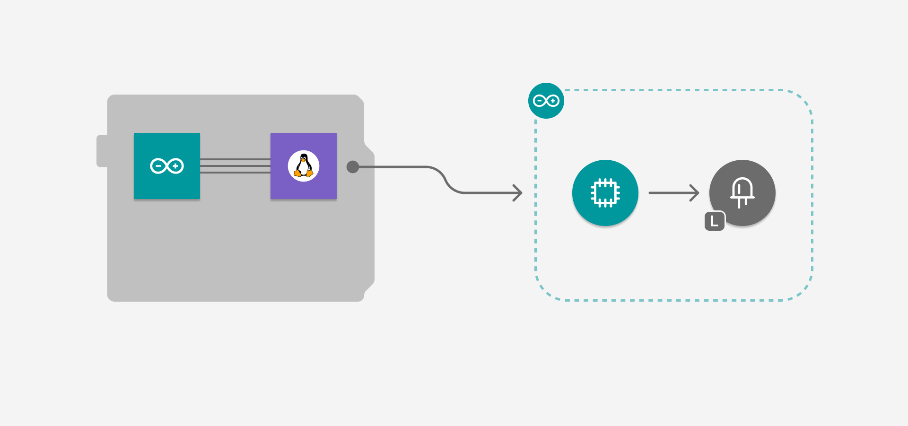

The **Blink** example toggles the onboard LED state every second, illustrating basic LED control and Router Bridge communication.

[**Example Source Code**](https://github.com/arduino/app-bricks-examples/tree/main/examples/blink)

#### How it Works

- **Timing Control:** A Python® script manages the timing and state logic for the LED.
- **LED Control:** The Arduino sketch handles the hardware control.

#### Bricks Used

- **None:** Direct communication via Router Bridge.

### Blinking LED from Arduino Cloud

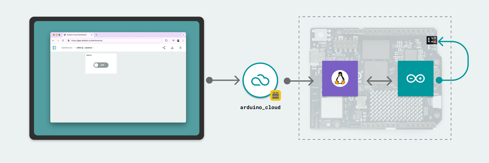

This example allows remote control of the onboard LED from the Arduino Cloud using a dashboard with a switch.

[**Example Source Code**](https://github.com/arduino/app-bricks-examples/tree/main/examples/cloud-blink)

#### How it Works

- **Cloud Integration:** The `arduino_cloud` Brick connects the device to the Arduino Cloud.
- **LED Control:** Changes in the cloud dashboard update the LED state.

#### Bricks Used

- **arduino_cloud:** Brick to create a connection to the Arduino Cloud.

### Concrete Crack Detector

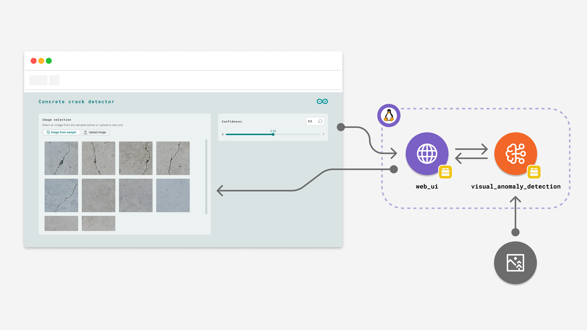

The **Concrete Crack Detector** uses a pre-trained machine learning model to identify cracks in concrete surfaces. It provides a web interface for image upload and displays results with highlighted crack locations.

[**Example Source Code**](https://github.com/arduino/app-bricks-examples/tree/main/examples/anomaly-detection)

#### How it Works

- **Image Analysis:** The `VisualAnomalyDetection` Brick processes images to detect structural anomalies.
- **Web Interface:** Users can upload images or select samples, adjust detection sensitivity, and view results.

#### Bricks Used

- **visual_anomaly_detection:** Brick to detect cracks and structural defects in concrete surfaces using computer vision and machine learning.
- **web_ui:** Brick to create a web interface with image upload capabilities, confidence controls, and real-time result visualization.

### Glass Breaking Sensor

The **Glass Breaking Sensor** classifies audio files to detect glass breaking sounds using a machine learning model. It features a web interface for audio upload and real-time classification results.

[**Example Source Code**](https://github.com/arduino/app-bricks-examples/tree/main/examples/audio-classification)

#### How it Works

- **Audio Classification:** The `audio_classification` Brick analyzes audio files for specific sound patterns.
- **Web Interface:** Supports audio file upload and displays classification results with confidence scores.

#### Bricks Used

- **audio_classification:** Brick to classify audio files using a pre-trained model for sound detection and analysis.
- **web_ui:** Brick to create a web interface with audio upload capabilities, confidence controls, and real-time result display.

### Image Classification

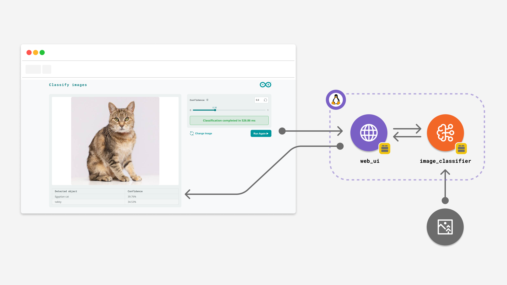

The **Image Classification** example lets you perform image classification using a pre-trained neural network model. It features a web-based interface that allows you to upload images for classification, set the confidence threshold and see the inference results.

[**Example Source Code**](https://github.com/arduino/app-bricks-examples/tree/main/examples/image-classification)

#### How it Works

- **Image Classification:** The `image_classification` Brick classifies objects within an image file.
- **Web Interface:** Supports image file upload and displays classification results with confidence scores.

#### Bricks Used

- `image_classification`: Brick to classify objects within an image. 
- `web_ui`: Brick to create a web interface to display the image classification dashboard.

### Linux® Blink with UI (JavaScript)

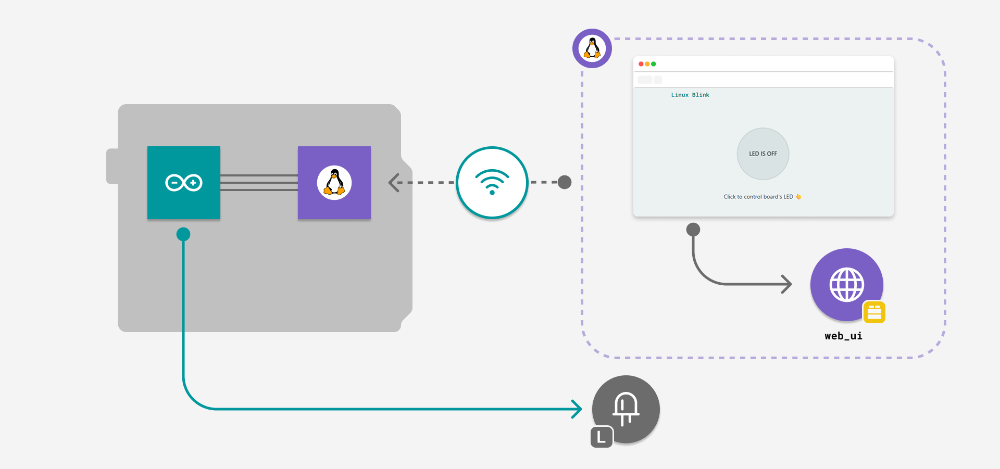

The **Linux® Blink** example toggles an LED state on the board through a web-based interface, demonstrating basic event handling and UI updates.

[**Example Source Code**](https://github.com/arduino/app-bricks-examples/tree/main/examples/blink-with-ui)

#### How it Works

- **Web Interface:** A toggle switch controls the LED state via WebSocket communication.
- **LED Control:** The Arduino sketch manages the LED hardware.

#### Bricks Used

- **web_ui:** Brick to create a web interface to display the LED control toggle switch.

### Object Detection

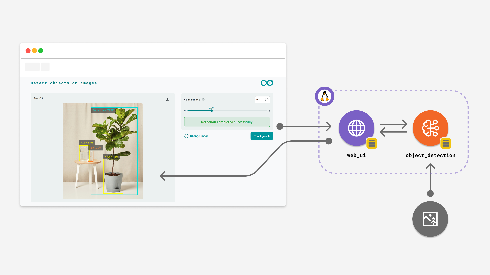

The **Object Detection** example lets you perform object detection using a pre-trained machine learning model. It shows how to process input images, run inference, and visualize detected objects with bounding boxes and labels.

[**Example Source Code**](https://github.com/arduino/app-bricks-examples/tree/main/examples/object-detection)

#### How it Works

- **Object Detection:** The `object_detection` Brick to locate and classify objects within an image file.
- **Web Interface:** Supports image file upload and displays classification results with confidence scores.

#### Bricks Used

- **object_detection:** Brick to identify objects within an image.
- **web_ui:** Brick to create a web interface.

### System Resources Logger

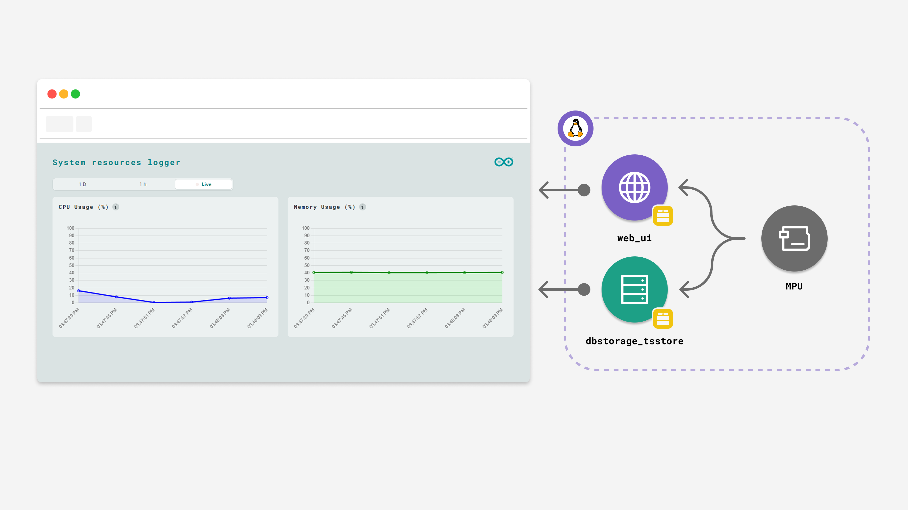

The **System Resources Logger** monitors and displays real-time system performance data from your Arduino UNO Q board.

[**Example Source Code**](https://github.com/arduino/app-bricks-examples/tree/main/examples/system-resources-logger)

#### How it Works

- **Data Collection:** Uses the `psutil` library to gather CPU and memory usage statistics every 5 seconds.
- **Data Storage:** The `dbstorage_tsstore` Brick stores performance metrics with timestamp.
- **Web Interface:** Provides interactive visualization with real-time updates via WebSocket communication.

#### Bricks Used

- **dbstorage_tsstore:** Brick to store CPU and memory usage data in a time series database with retention and aggregation capability.
- **web_ui:** Brick to create a web interface with real-time charts and historical data visualization.

### UNO Q Pin Toggle

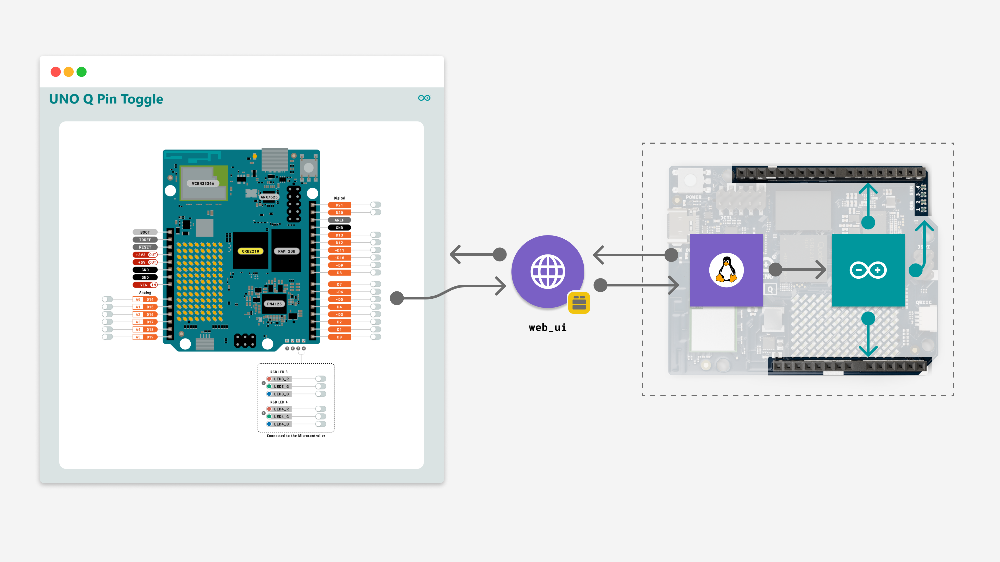

The **UNO Q Pin Toggle** example lets you control the state of every pin of the Arduino UNO Q through an interactive web interface.

[**Example Source Code**](https://github.com/arduino/app-bricks-examples/tree/main/examples/unoq-pin-toggle)

#### How it Works

- **Web Interface:** Displays the board pins control dashboard with toggle switches.
- **Pin Control:** The backend processes toggle requests and broadcasts updates.

#### Bricks Used

- **web_ui:** Brick to create a web interface with the UNO Q illustration and allow real-time pin control.

### Weather Forecast on LED Matrix

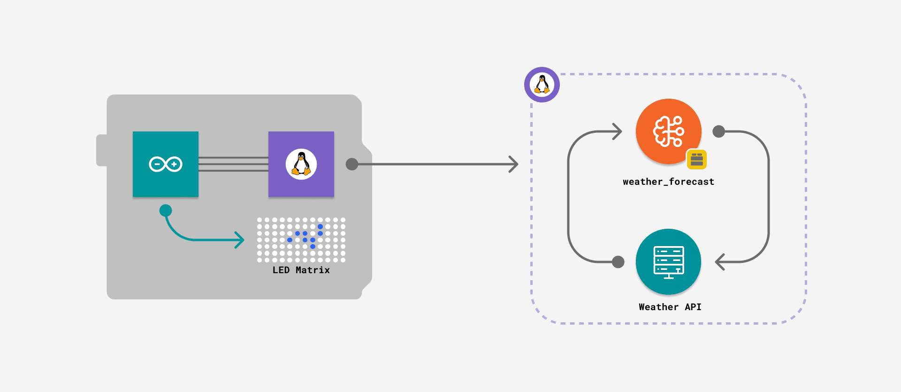

The **Weather Forecasting System** displays real-time weather information from the *open-meteo.com* service on the Arduino UNO Q LED matrix.

[**Example Source Code**](https://github.com/arduino/app-bricks-examples/tree/main/examples/weather-forecast)

#### How it Works

- **Weather Data:** The `weather_forecast` Brick fetches data from the *open-meteo.com* API.
- **LED Display:** The Arduino sketch manages LED matrix animations based on weather conditions.

#### Bricks Used

- **weather_forecast:** Brick to fetch weather data from the open-meteo.com API and convert weather codes into simple categories.

## Examples Using Additional Hardware

### Code Detector

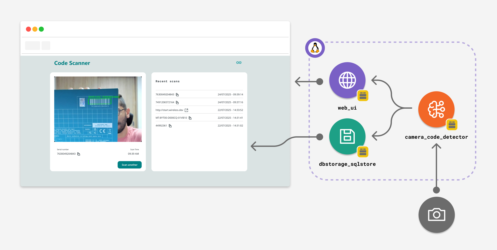

The **Code Detector** scans barcodes and QR codes using a USB camera, displaying results on a web interface and storing them in a local database.

[**Example Source Code**](https://github.com/arduino/app-bricks-examples/tree/main/examples/code-detector)

#### Additional Hardware

- USB camera
- USB-C® dongle
- External Power Supply (for powering the dongle)

#### How it Works

- **Code Detection:** The `camera_code_detection` Brick processes video input for code detection.
- **Web Interface:** Displays live camera feed and detected codes.

#### Bricks Used

- **camera_code_detection:** Brick to detect barcodes and QR codes using a camera.
- **dbstorage_sqlstore:** Brick to store the detected codes in a database.
- **web_ui:** Brick to create a web interface to display the detected codes and the camera live feed.

### Detect Objects on Camera

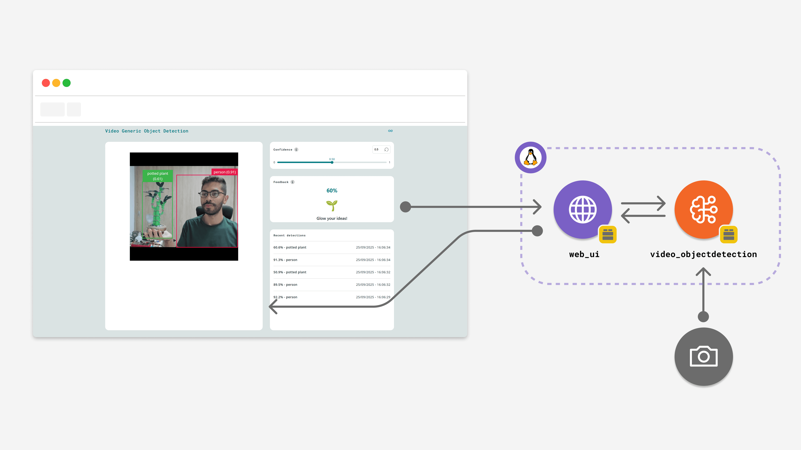

The **Detect Objects on Camera** example lets you detect objects on a live feed from a USB camera and visualize bounding boxes around the detections in real-time.

[**Example Source Code**](https://github.com/arduino/app-bricks-examples/tree/main/examples/video-generic-object-detection)

#### Additional Hardware

- USB camera
- USB-C® dongle
- External Power Supply (for powering the dongle)

#### How it Works

- **Video Stream:** Processes frames from a USB camera using the `video_objectdetection` Brick.
- **Web Interface:** Displays the classification results and model controls.

#### Bricks Used

- **web_ui:** Brick to create a web interface to display the classification results and model controls.
- **video_objectdetection:** Brick to classify objects within a live video feed from a camera.

### Face Detector on Camera

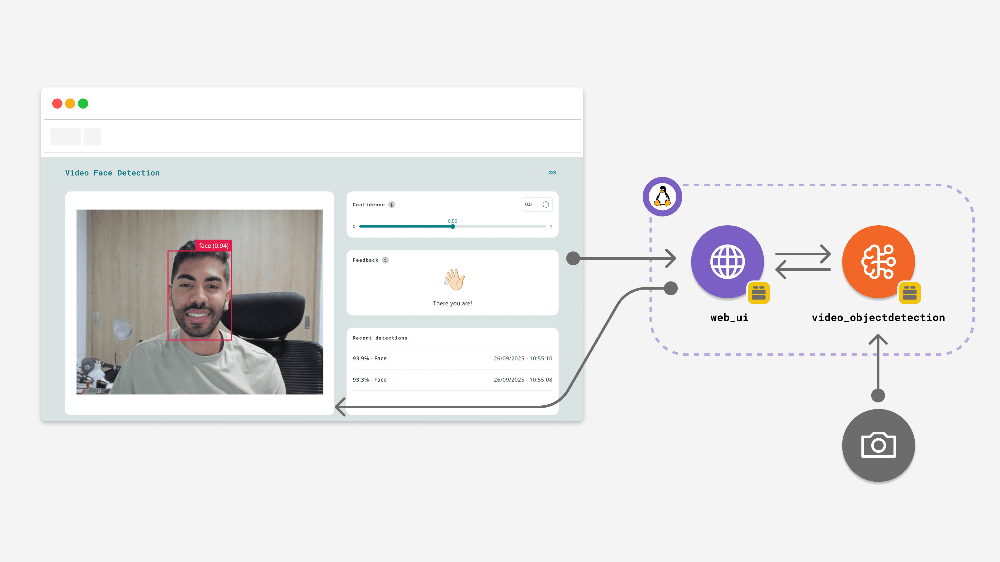

The **Face Detector on Camera** example lets you detect faces on a live feed from a USB camera and visualize bounding boxes around the detections in real-time.

[**Example Source Code**](https://github.com/arduino/app-bricks-examples/tree/main/examples/video-face-detection)

#### Additional Hardware

- USB camera
- USB-C® dongle
- External Power Supply (for powering the dongle)

#### How it Works

- **Video Stream:** Processes frames from a USB camera using the `video_objectdetection` Brick.
- **Web Interface:** Displays the classification results and model controls.

#### Bricks Used

- **web_ui:** Brick to create a web interface to display the classification results and model controls.
- **video_objectdetection:** Brick to classify faces within a live video feed from a camera.

### Hey Arduino!

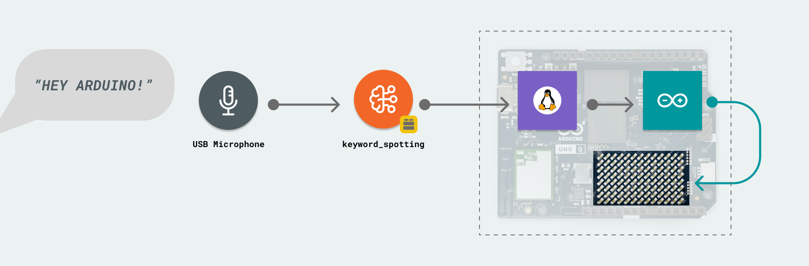

The **Hey Arduino!** example triggers an LED matrix animation whenever the keyword "Hey Arduino" is detected through a microphone.

[**Example Source Code**](https://github.com/arduino/app-bricks-examples/tree/main/examples/keyword-spotting)

#### Additional Hardware

- USB microphone (or headset)
- USB-C® dongle
- External Power Supply (for powering the dongle)

#### How it Works

- **Keyword spotting:** Monitors the audio continuously, and when it detects the keyword, it calls the microcontroller to activate an animation on the LED matrix, using the Bridge tool.

#### Bricks Used

- **keyword_spotting:** this Brick is designed to detect sound patterns, triggering an event in case of a match.

### Home Climate Monitoring

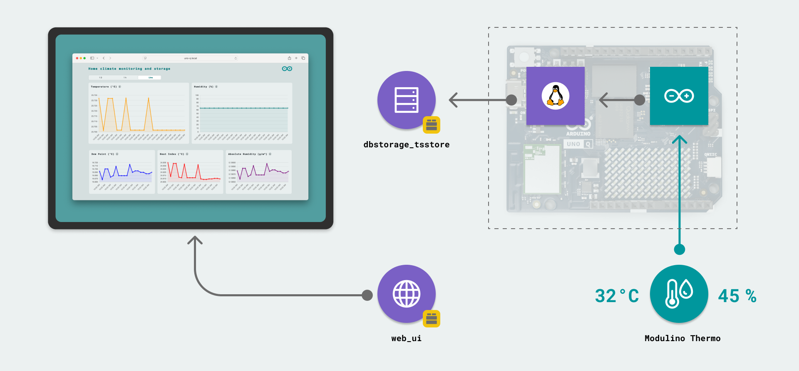

The **Home Climate Monitoring** app records temperature and humidity data from the Modulino® Thermo node, displaying it on a web interface.

[**Example Source Code**](https://github.com/arduino/app-bricks-examples/tree/main/examples/home-climate-monitoring-and-storage)

#### Additional Hardware

- Modulino® Thermo
- Qwiic cable

#### How it Works

- **Data Storage:** The `dbstorage_tsstore` Brick makes it possible to save, read, and manage time-based data.
- **Web Interface:** Provides interactive visualization with real-time updates via WebSocket communication.

#### Bricks Used

- **dbstorage_tsstore:** Brick to store sensor data in a time series database with retention and aggregation capability.
- **web_ui:** For deploying a user interface to display real-time and historical data.

### Real Time Accelerometer Data

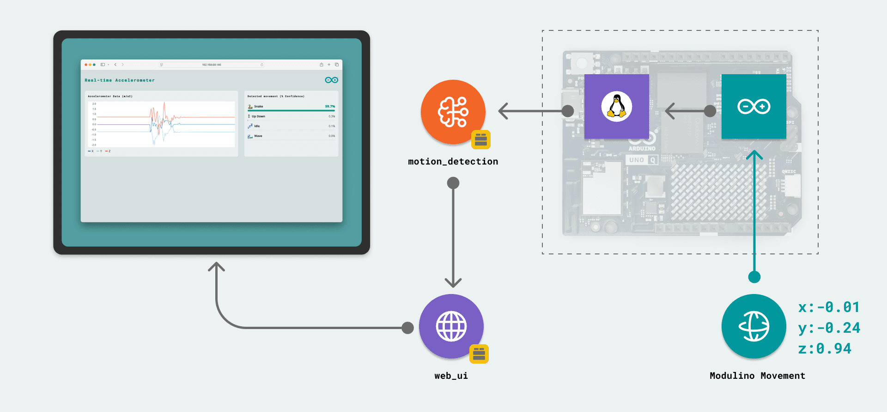

The **Real Time Accelerometer Data** example records accelerometer data from the Modulino® Movement node, and streams it to a web interface.

[**Example Source Code**](https://github.com/arduino/app-bricks-examples/tree/main/examples/real-time-accelerometer)

#### Additional Hardware

- Modulino® Movement
- Qwiic cable

#### How it Works

- **Motion Detection:** The `motion_detection` Brick processes accelerometer data to identify specific motion patterns using a pre-trained model.
- **Web Interface:** Hosts a web server on the board, serving HTML, CSS & JavaScript files.

#### Bricks Used

- **motion_detection:** For processing accelerometer data and detecting movement patterns using machine learning.
- **web_ui:** Brick to create a web interface to display the accelerometer data and the detected movements.

### Person Classifier on Camera

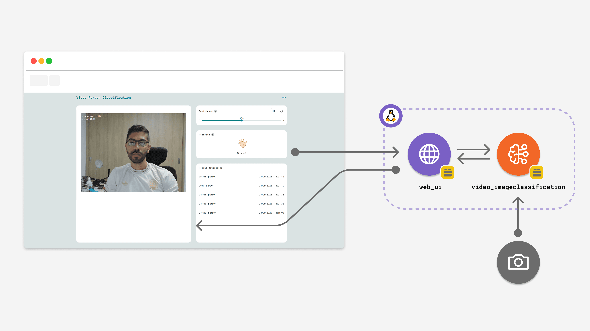

The **Person Classifier** example lets you detect people on a live feed from a camera and visualize the model inference result on a user-friendly web interface.

[**Example Source Code**](https://github.com/arduino/app-bricks-examples/tree/main/examples/video-person-classification)

#### Additional Hardware

- USB camera
- USB-C® dongle
- External Power Supply (for powering the dongle)

#### How it Works

- **Video Stream:** Processes frames from a USB camera using the `video_imageclassification` Brick.
- **Web Interface:** Displays the classification results and model controls, triggers a greeting on person detections.

#### Bricks Used

- **web_ui:** Brick to create a web interface to display the classification results and model controls.
- **video_imageclassification:** Brick to classify objects within a live video feed from a camera.
