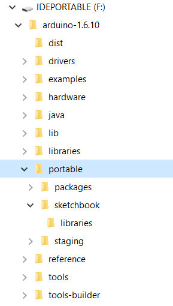

This document explains how to make a portable installation of the Arduino Software (IDE) on Windows and Linux machines. A portable installation contains all the files and directories necessary to get the Arduino Software (IDE) to work on a computer without affecting its files outside the folder designated for the portable installation.

## Why Portable?

Almost in all the schools students don't have administrator privileges, so they don't have write access in some folders. This leads to some problem in using the Arduino Software (IDE) since your preferences and sketchbook are saved in one of those folders. Using a portable version of the IDE you can overcome this problem.

Another scenario can be the following: you want to organize a workshop and you need some additional [library](/learn/starting-guide/software-libraries) or a specific [core](/learn/starting-guide/cores). Since the portable version stores the sketchbook, the libraries and the hardware folder locally, you can have a starting point equal for all the people who join the workshop just replicating the same folder on all the machines. This is also quite useful if for some reason you don't have an internet connection and want to prepare everything for your project without downloads and delays.

Furthermore, a portable installation could be on a pendrive, allowing you to carry around your personal set of sketches, cores and libraries, to be used on any computer without affecting it with your files.

## Windows & Linux

The procedure is made of a few simple steps. You may use a pendrive or a local folder on your machine. Once done, with libraries and additional cores where needed, that folder can be copied on other machines.

- [Download](https://www.arduino.cc/en/Main/Software) a compressed version of the Arduino IDE according to your OS;

- Once download has been completed, extract the archive content on the chosen unit (local or pendrive);

- Open the extracted folder and in its root create a new directory called **_portable_**, alongside the others;

The tree structure should be as this one; the **portable** folder will be populated by the Arduino Software (IDE) as needed by libraries, sketches and cores.

To use this installation, launch the Arduino executable;

From now on all the sketches, libraries and additional cores will be installed in the **_portable_** folder. You can copy the whole main folder and bring it with you anywhere you want: it will retain all your preferences, libraries, cores and sketches.

## MacOS Note

The portable installation is not officially supported on Apple's Mac operating systems for several reasons. One of them is related to the package signature (we sign the Arduino IDE package): adding any content - like additional cores, libs and sketches - to the package will break the signature. A consequence of that is the reaction of the Gatekeeper that could even stop the app from starting. This is related to the OS and not to our IDE. Anyway, if you want to experiment you can check [this forum thread](http://forum.arduino.cc/index.php?topic=539551.msg3678998#msg3678998) and try by yourself the solutions developed by the community.

## Updating Portable Installation

If you want to update a portable installation to a newer version, download the new version in compressed format, then extract the contents in a temporary folder. Now you may either move the "portable" folder you have from the old installation into the new one, or copy all the files of the new version onto the old one, overwriting all the files. Either way you should end up with the updated portable Arduino Software (IDE) installation with your cores, libraries and sketches preserved. Remember to rename the root folder with the proper release version, if needed.
You should always launch the executable file "Arduino" from inside the folder of your portable installation to use the sketches, cores and libraries contained in it. If you have another installation of the Arduino Software (IDE) on the machine you are using, that version won't be affected. Libraries and cores already installed on the machine won't be seen or used by the portable installation.

The text of the Arduino getting started guide is licensed under a
[Creative Commons Attribution-ShareAlike 3.0 License](http://creativecommons.org/licenses/by-sa/3.0/). Code samples in the guide are released into the public domain.
