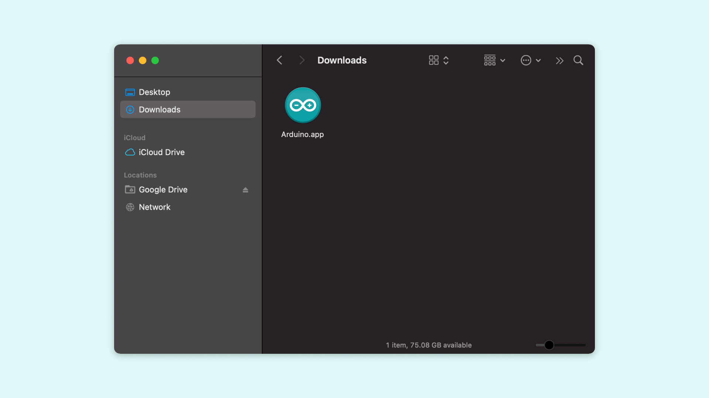
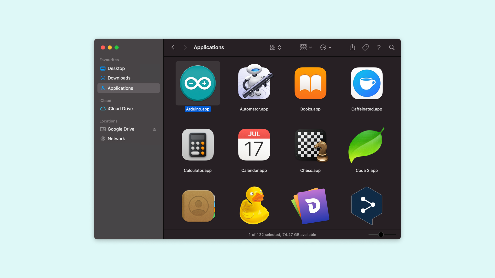

This document explains how to install the Arduino Software (IDE) on macOS machines.

## Download the Arduino Software (IDE)

Get the latest version from the [download page](https://www.arduino.cc/en/software). The file is in Zip format. If you use Safari it will be automatically extracted. If you use a different browser you may need to extract it manually.

Copy the Arduino application bundle into the Applications folder (or elsewhere on your computer).

