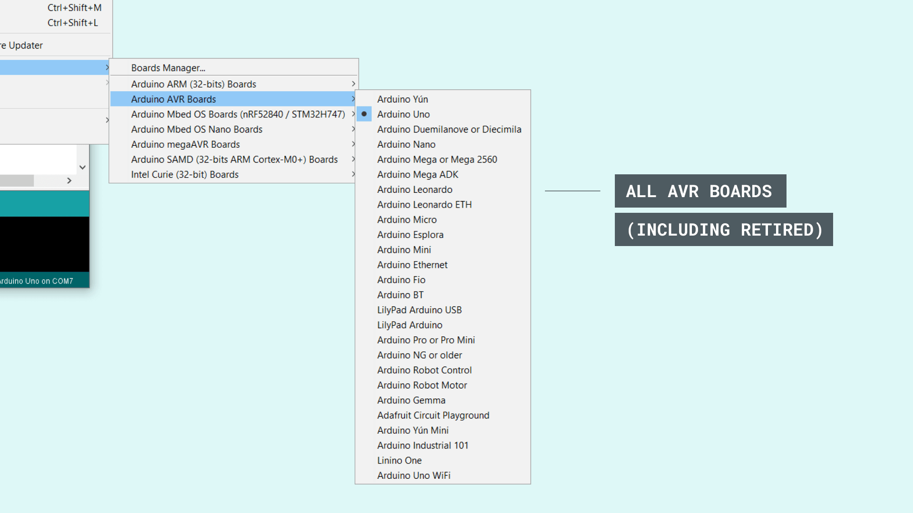
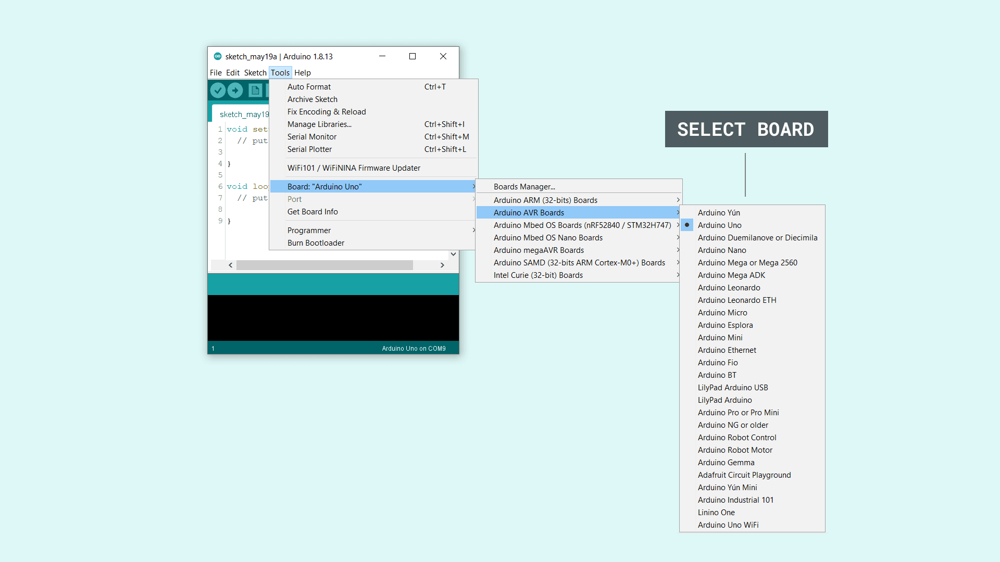
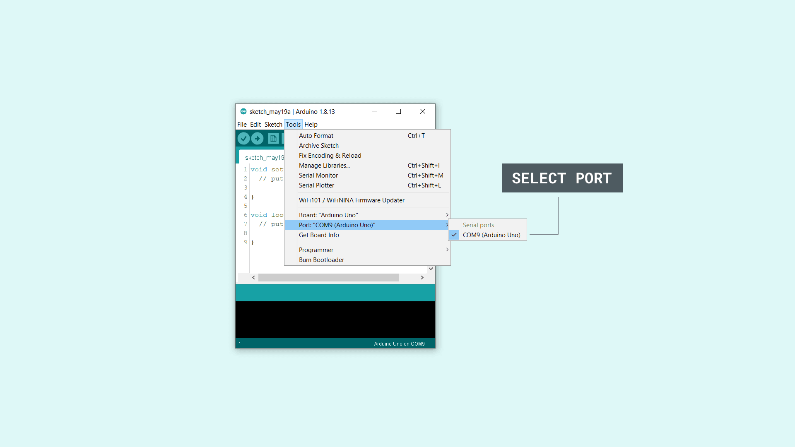

## Installing the AVR core

The classic Arduino boards, including the favorites UNO, Nano and Mega, requires the **AVR** core to be installed to compile and upload sketches to your board.

Fortunately, the classic IDE comes with **the AVR core already pre-installed**. This means that we only need to download and install the editor to start using our Arduino products.

In this tutorial, we will simply show how to select the right board, choose the right port, and how to upload the classic **blink example** to our board, a simple program that makes your LED blink every second.

You can download the editor from [our software page](https://www.arduino.cc/en/software).

### Boards using the AVR core

- Arduino UNO R3
- Arduino Mega 2560 Rev3
- Arduino Nano (classic)
- Arduino Micro
- Arduino Leonardo
- Arduino UNO Mini Limited Edition

### Retired boards using the AVR core

There are several retired boards that uses the AVR core, but are no longer available from our store. You can see all of them in the list of boards in the editor.

### Downloading and installing

1. First, we need to download the Arduino IDE, which can be done from the [software page](https://www.arduino.cc/en/software).

2. Install the Arduino IDE on your local machine.

3. Open the Arduino IDE.

### Choosing the board

First, we need to select the right core & board. This is done by navigating to **Tools > Board > Arduino AVR Boards > Board**. Make sure you select the board that you are using. In this case, we are using an Arduino UNO.

### Selecting the port

Now, let's make sure that our board is found by our computer, by selecting the port. Regardless what kind of program we are uploading to the board, we **always** need to choose the port for the board we are using. This is simply done by navigating to **Tools > Port**, where you select your board from the list.

This will look different depending on what kind of operative system you are using. 

For **Windows** users, it could look like this:

- `<COM9> (Arduino Uno)`

For **MAC** users, it could look like this:

- `/dev/cu.usbmodem14112 (Arduino Uno)`

### Uploading a simple example

You are now ready to start using your board! The easiest way to check that everything is working, is to upload just a simple blink example to your board. This is done by navigating to **File > Examples > 01.Basics > Blink**. 

To upload the sketch, simply click on the arrow in the top left corner. This process takes a few seconds, and it is important to not disconnect the board during this process.

When the code is uploaded, the text `"Done uploading."` is visible in the bottom left corner.

If you look closely at your board, you will notice an orange LED blink with an interval of one second. This means you have successfully uploaded a program to your board.

