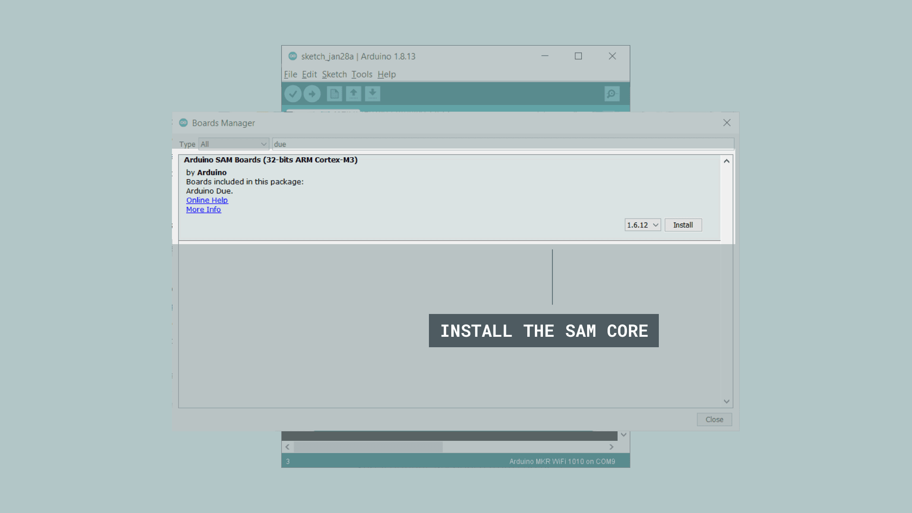
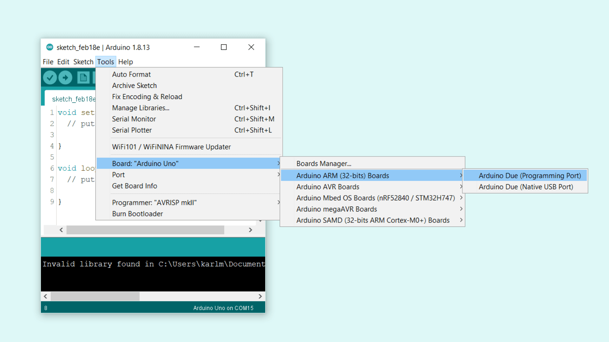
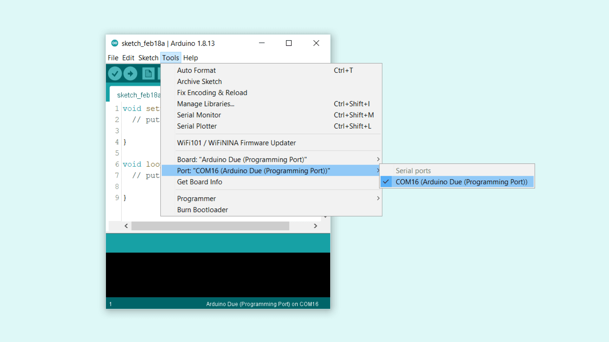
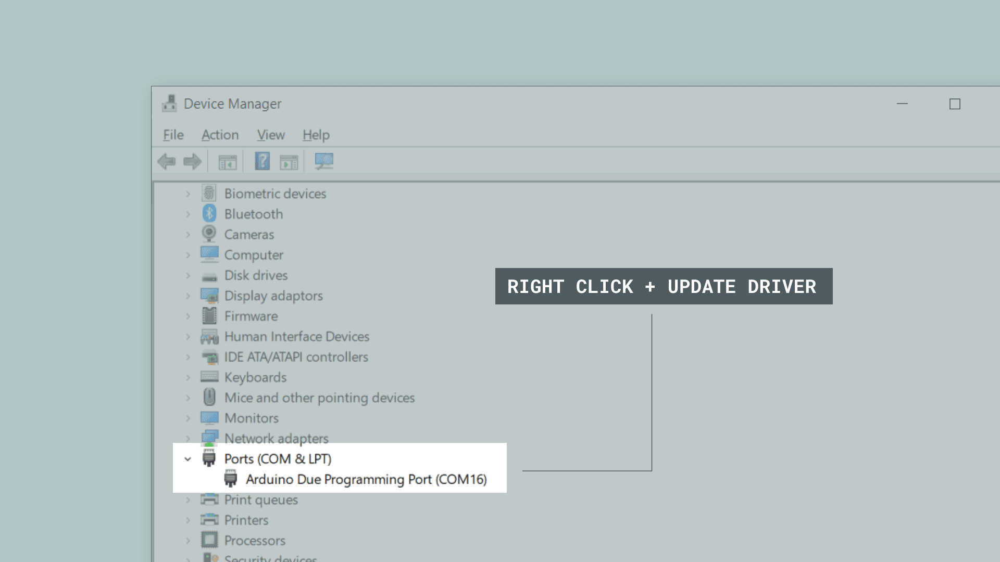
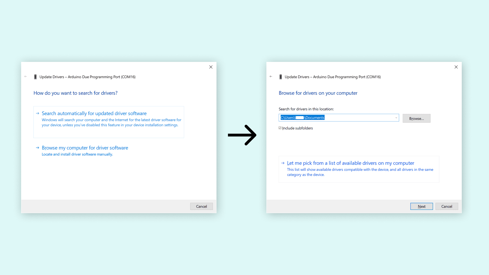
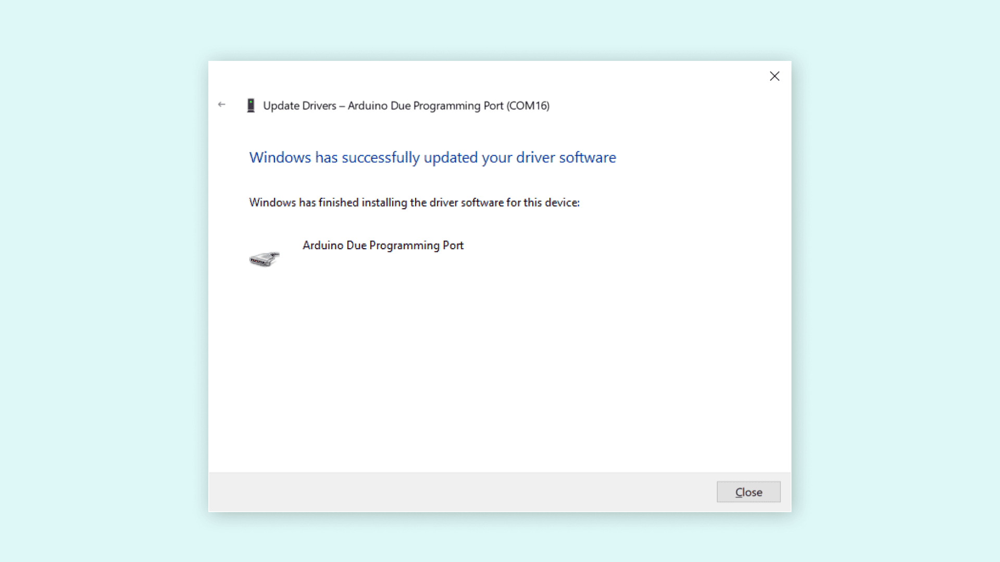
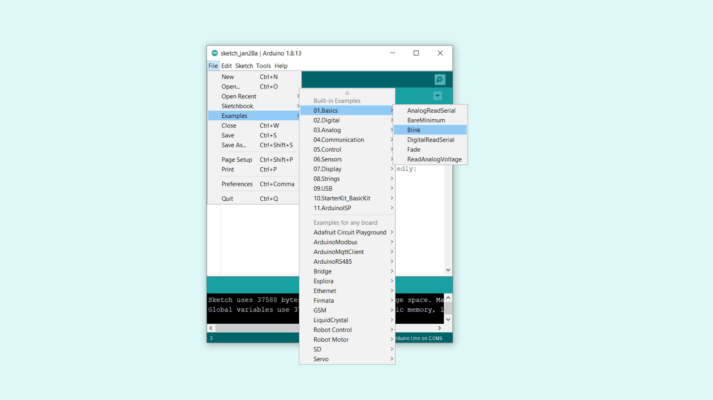

## Installing the Due board

In this tutorial, we will go through a few simple steps on installing the SAM core, designed for the Arduino DUE board. This installation is necessary to use your board with the offline Arduino IDE.

This tutorial uses the **Arduino IDE**. You can download the editor easily from [our software page](https://www.arduino.cc/en/software).

If you are using the **Web Editor**, you can follow the [getting started with the Web Editor tutorial](/cloud/web-editor/tutorials/getting-started/getting-started-web-editor).

### Boards using the SAM core

- Arduino Due

### Downloading and installing

1. First, we need to download the Arduino IDE, which can be done from the [software page](https://www.arduino.cc/en/software).

2. Install the Arduino IDE on your local machine.

3. Open the Arduino IDE.

### Installing the SAM core

After we have downloaded, installed and opened the Arduino IDE, let's continue to installing the SAM core.

When we open the editor, we will see an empty sketch.

Here we need to navigate to **Tools > Board > Board Manager**.

This will open up a new window, with all available cores. Type in `"due"` in the search field, and install the **Arduino SAM Boards (32-bits ARM Cortex-M3)** core.

This process may take some time, and you may need to accept the installation window that comes up (depending on your operative system). When it is finished, it should say `"INSTALLED"` under the title.

>**Note:** This process may take several minutes.

Exit the board manager, and go to **Tools > Board > Arduino Arduino ARM (32-bits) Boards**. Here you can choose between:

- Arduino Due (Programming Port)
- Arduino Due (Native USB Port)

Select the **Arduino Due (Programming Port)**.

### Selecting the port

Now, let's make sure that our board is found by our computer, by selecting the port. Regardless what kind of program we are uploading to the board, we **always** need to choose the port for the board we are using. This is simply done by navigating to **Tools > Port**, where you select your board from the list.

This will look different depending on what kind of operative system you are using.

For **Windows** users, it could look like this:

- `<COM16> (Arduino Due (Programming Port))`

For **MAC** users, it could look like this:

- `/dev/cu.usbmodem14112 (Arduino Due (Programming Port))`

### Updating the driver manually (Windows)

If you cannot see your Arduino Due in the port list, you may need to manually update the driver. Don't worry, this is a quick process!

- Close down the Arduino IDE.

- Navigate to the **"Device Manager"** for your computer.

- Look for a section called **"Ports (COM & LPT)**. Your board should be listed here. Right click on the device, and click on **"Update Driver"**.

- Choose the **"Browse my computer for driver software"** option, and in the next window, click on **"Next"**.

- This will install the drivers necessary for your Due board, and you will get a confirmation when it is complete!

### Uploading a simple example

You are now ready to start using your board! The easiest way to check that everything is working, is to upload just a simple blink example to your board. This is done by navigating to **File > Examples > 01.Basics > Blink**.

To upload the sketch, simply click on the arrow in the top left corner. This process takes a few seconds, and it is important to not disconnect the board during this process.

When the code is uploaded, the text `"Done uploading."` is visible in the bottom left corner.

If you look closely at your board, you will notice an orange LED blink with an interval of one second. This means you have successfully uploaded a program to your board.
