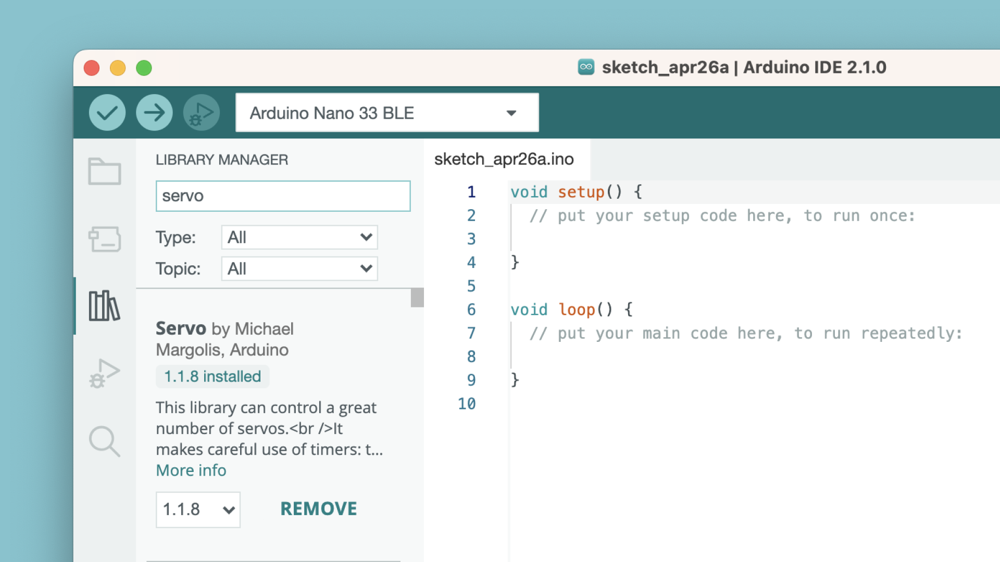
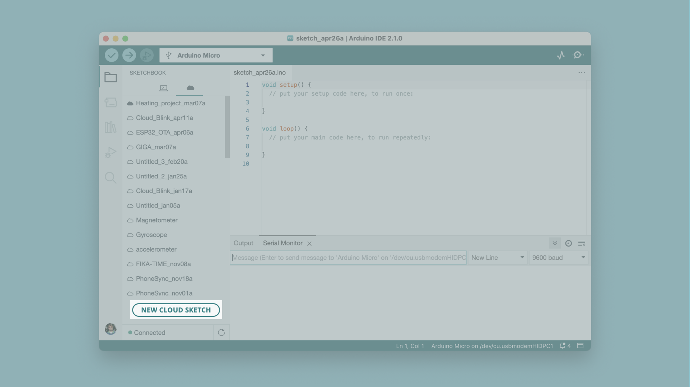

Makers, students & professionals have been using the classic Arduino IDE (Integrated Development Environment) ever since Arduino was born.

The Arduino IDE 2 is an improvement of the classic IDE, with increased performance, improved user interface and many new features, such as [autocompletion](/software/ide-v2/tutorials/ide-v2-autocomplete-feature), a [built-in debugger](/software/ide-v2/tutorials/ide-v2-debugger) and [syncing sketches with Arduino Cloud](/software/ide-v2/tutorials/ide-v2-cloud-sketch-sync).

In this guide, we will cover the basics of the Arduino IDE 2, where you will find links to more detailed resources on how to use specific features!

***You can download the IDE 2 from the [Arduino Software page](https://www.arduino.cc/en/software).*** 

***You can also follow the [downloading and installing the Arduino IDE 2](/software/ide-v2/tutorials/getting-started/ide-v2-downloading-and-installing) tutorial for more detailed guide on how to install the editor.***

## Requirements

- [Arduino IDE 2](https://www.arduino.cc/en/software) installed. 

## Overview

The Arduino IDE 2 features a new sidebar, making the  most commonly used tools more accessible.

- **Verify / Upload** - compile and upload your code to your Arduino Board.
- **Select Board & Port** - detected Arduino boards automatically show up here, along with the port number.
- **Sketchbook** - here you will find all of your sketches locally stored on your computer. Additionally, you can sync with the [Arduino Cloud](https://cloud.arduino.cc/), and also obtain your sketches from the online environment.
- **Boards Manager** - browse through Arduino & third party packages that can be installed. For example, using a MKR WiFi 1010 board requires the `Arduino SAMD Boards` package installed.
- **Library Manager** - browse through thousands of Arduino libraries, made by Arduino & its community.
- **Debugger** - test and debug programs in real time.
- **Search** - search for keywords in your code.
- **Open Serial Monitor** - opens the Serial Monitor tool, as a new tab in the console.

## Features

The Arduino IDE 2 is a versatile editor with many features. You can install libraries directly, sync your sketches with Arduino Cloud, debug your sketches and much more. In this section, some of the core features are listed, along with a link to a more detailed article.

### Sketchbook

Your sketchbook is where your code files are stored. Arduino sketches are saved as `.ino` files, and must be stored in a folder of the exact name. For example, a sketch named `my_sketch.ino` must be stored in a folder named `my_sketch`.

Typically, your sketches are saved in a folder named `Arduino` in your `Documents` folder. 

To access your sketchbook, click on the **folder icon** located in the sidebar. 

### Boards Manager

With the Boards Manager, you can browse and install packages, or "cores" for your boards. A core is always required when compiling and uploading code for your board.

There are several Arduino cores available, such as **avr, samd, megaavr** and more.

***To learn more about the Boards Manager, visit the [Installing new boards tutorial](/software/ide-v2/tutorials/ide-v2-board-manager).***

### Library Manager

With the library manager you can browse and install thousands of libraries. Libraries are extensions of the Arduino API, and makes it easier to for example control a servo motor, read specific sensors, or use a Wi-Fi module.

***To learn more about the library manager, visit the [Installing libraries tutorial](/software/ide-v2/tutorials/ide-v2-installing-a-library).***

### Serial Monitor

The Serial Monitor is a tool that allows you to view data streaming from your board, via for example the `Serial.print()` command. 

Historically, this tool has been located in a separate window, but is now integrated with the editor. This makes it easy to have multiple instances running at the same time on your computer.

***To learn more about the Serial Monitor, visit the [Serial Monitor tutorial](/software/ide-v2/tutorials/ide-v2-serial-monitor).***

### Serial Plotter

The Serial Plotter tool is great for visualizing data using graphs, and to monitor for example peaks in voltage. 

You can monitor several variables simultaneously, with options to enable only certain types. 

***To learn more about the Serial Plotter, visit the [Serial Plotter tutorial](/software/ide-v2/tutorials/ide-v2-serial-plotter).***

### Example Sketches

An important part of the Arduino Documentation are the example sketches that come bundled with libraries. They will show examples of the functions used in practice, illustrating the intended use and features of a library.

Libraries that come bundled as a part of a boards package may also include libraries, and those libraries often include example sketches.

To open the example sketches bundled in either the libraries you have installed manually or that come bundled in core packages, navigate to **File > Examples** and find the library you're searching for in the list that appears.

In the image above, you can see what the examples list looks like when a UNO R4 WiFi board is connected to your computer.

From here, you can for example navigate to **File > Examples > LED_Matrix > MatrixIntro** and upload the sketch to your board to show the Tetris animation that came pre-loaded on your UNO R4 WiFi when you first took it out of its box.

### Debugging

The debugger tool is used to test and **debug** programs, hence the name. It can be used to navigate through a program's execution in a controlled manner. 

***To learn more about the debugger tool, visit the [Debugging tutorial](/software/ide-v2/tutorials/ide-v2-debugger).***

### Autocompletion

Autocompletion is a must-have for code editors, and the 2 version comes well equipped. When writing code, this is useful to understand more about the elements of the Arduino API.

Note that you always need to select your board for autocompletion to work. 

***To learn more about the Autocompletion tool, visit the [Autocompletion tutorial](/software/ide-v2/tutorials/ide-v2-autocomplete-feature).***

### Remote Sketchbook

The Remote Sketchbook feature lets you sync sketches from your [Arduino Cloud](https://cloud.arduino.cc/) sketchbook with your local computer. To enable this feature, you will need to login to your Arduino Cloud account.

You can also create a new cloud sketch directly in the IDE.

***To learn more about the Remote Sketchbook feature, visit the [Synchronizing Sketches tutorial](/software/ide-v2/tutorials/ide-v2-cloud-sketch-sync).***

### Firmware & Certificate Uploader

You can upgrade and downgrade the firmware version for your Wi-Fi boards (with a NINA module), and upload SSL Root Certificates directly in the IDE.

***To learn more, visit the [Firmware & Certificate Uploader tutorial](/software/ide-v2/tutorials/ide-v2-fw-cert-uploader).***

## Contribute

The Arduino IDE 2 is an open-source project that is free for anyone to download. You can contribute to the project through [donations](https://www.arduino.cc/en/donate/), or by reporting issues to [our GitHub repository](https://github.com/arduino/arduino-ide).

## Conclusion

In this guide, we have presented a series of features & more detailed articles to follow, so that you can enjoy each and every one of the features included in the IDE 2.
