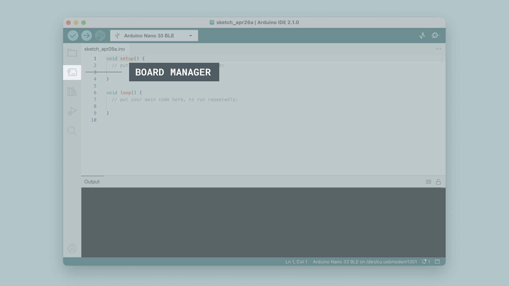
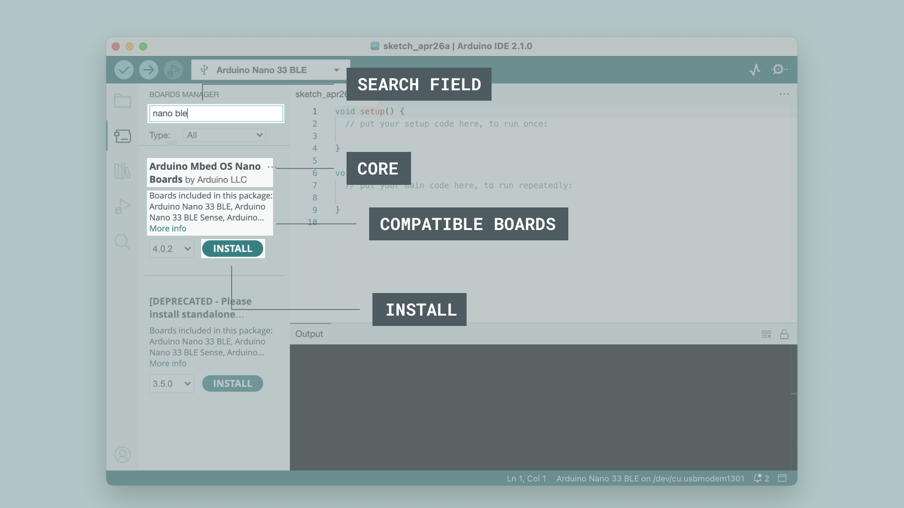
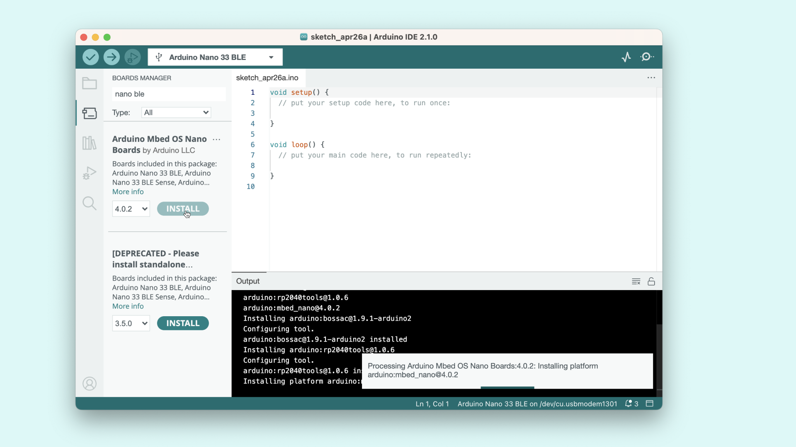
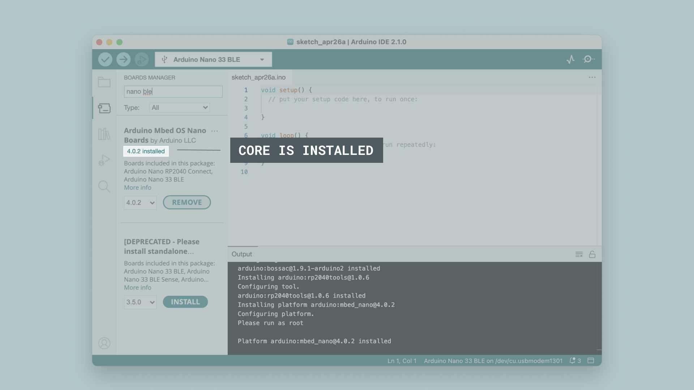
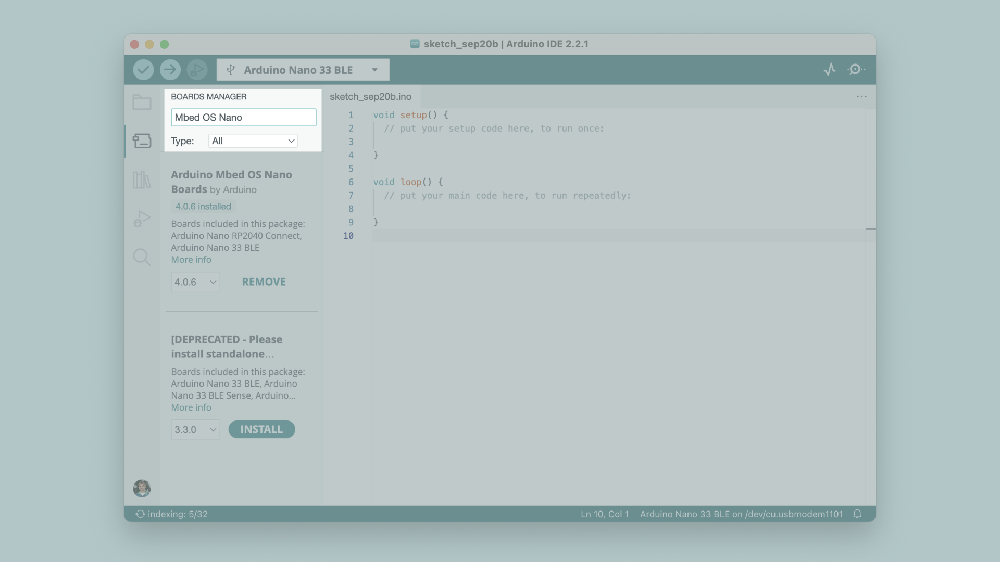
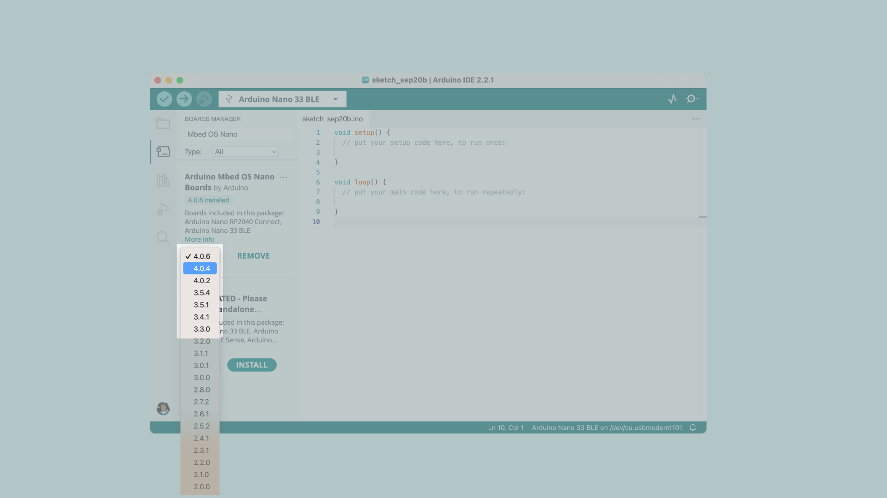
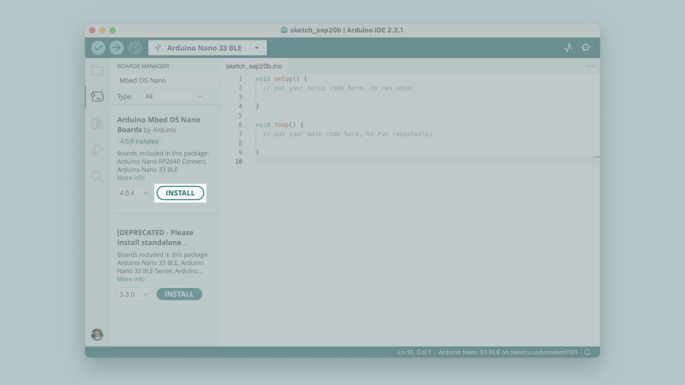
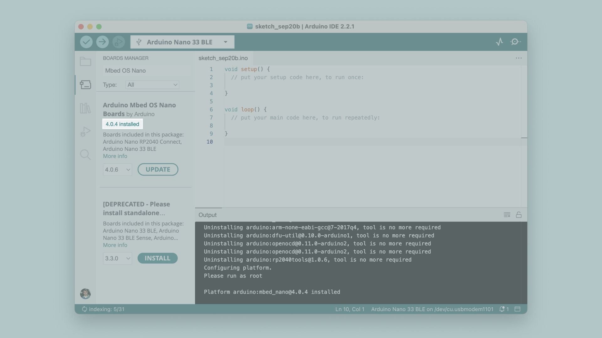

The board manager is a great tool for installing the necessary board packages to use your Arduino boards. In this quick tutorial, we will take a look at how to install one, and choosing the right package for your board!

You can easily download the editor from the [Arduino Software page](https://www.arduino.cc/en/software).

You can also follow the [downloading and installing the Arduino IDE 2](/software/ide-v2/tutorials/getting-started/ide-v2-downloading-and-installing) tutorial for more detailed guide on how to install the editor.

## Requirements

- Arduino IDE 2 installed.

## Why Use the Board Manager?

The board manager is a tool that is used to install different board packages on your local computer. So what is a **board package**, and why is it necessary that I install one?

Simply explained, a board package is written and designed for specific microcontrollers. Arduino offers several different types of boards, and these boards may also have different types of microcontrollers. While different microcontrollers accomplish tasks in similar ways, the way code is compiled, pins are mapped, and what features are available is tailor-made to the silicon itself, meaning that this will also be microcontroller-specific.

What a board package does is to act as a layer between all of this microcontroller-specific jargon, and you - the maker. The board package translates it into the Arduino API you are already familiar with so that you can program any of the microcontrollers in the Arduino ecosystem in the same way.

For example, an Arduino UNO has an **ATmega328P**, which uses the **AVR package**, while an Arduino Nano 33 IoT has a **SAMD21** microcontroller, where we need to use the **SAMD package**. However, regardless of what microcontroller is on the board we are using, `digitalWrite(LED_BUILTIN, HIGH)` will turn on the built-in LED, and `analogRead(A0)` will read the analog pin 0 and check for a voltage.

In conclusion, to use a specific board, we need to install a specific board package.

## Installing a Board Package

Installing a board package is quick and easy, but let's take a look at what we need to do.

**1.** Open the Arduino IDE 2.

**2.** With the editor open, let's take a look at the left column. Here, we can see a couple of icons. Let's click the on the **Arduino board** icon.

**3.** A list will now appear of all available packages. Now let's say we are using an **Nano 33 BLE** board, and we want to install the board package. Simply enter the name in the search field, and the right package (Mbed OS Nano) will appear, where the Nano 33 BLE features in the description. Click on the **"INSTALL"** button.

**4.** This will begin an installation process, which usually only take a few moments.

**5.** When it is finished, we can take a look at the core in the boards manager column, where it should say **"INSTALLED"**, as well as noting which version you have installed on your machine.

Congratulations! You have now successfully downloaded and installed a board package on your machine, and you can start using your Arduino board!

### Changing version

In some specific use cases you might want to downgrade the version of a board package that you have on your machine. Thankfully, the Arduino IDE has built in support to let you jump between versions with a breeze.

To change the installed version of a boards package, follow these steps:

- Open the boards manager

- Search for the name of the package you want to change

- Select your desired version in the drop down menu

- Press "INSTALL"

And that should be it!

To make sure that the process was successful, cross check what version is installed by looking at this little tag right underneath the package name.

## What Board Package Should I Install?

Do you have an Arduino board in your hands, but are not sure what board package you need to install? When you plug a board in to your computer, and you don't have the appropriate board package installed, the IDE should automatically prompt you to install it. But, in case you need it anyways, you can find a list of boards and the board packages they belong to below:

### AVR

The **AVR boards package** is based on the **Arduino AVR Core**, and includes the following boards:

- [UNO R3](/hardware/uno-rev3)
- [UNO R3 SMD](/hardware/uno-rev3-smd)
- [UNO Mini Limited Edition](/hardware/uno-mini-le)
- [Leonardo](/hardware/leonardo)
- [Micro](/hardware/micro)
- [Nano](/hardware/nano)
- [Mega 2560](/hardware/mega-2560)

The **AVR board package** comes pre-installed when you download the Arduino IDE, so if you have one of these boards - Great! You're already done and won't need to install it yourself. You can, however, still find it in the board manager if you want to change what version of the board package you have installed. For detailed instructions on how to do this, [follow the steps above](#installing-a-board-package).

For source code and reporting issues, please visit the official GitHub repository:

- [ArduinoCore-avr](https://github.com/arduino/ArduinoCore-avr)

### MegaAVR

The **MegaAVR Boards package** is based on the **Arduino AVR Core**, and includes the following boards:

- [UNO WiFi Rev2](/hardware/uno-wifi-rev2)
- [Nano Every](/hardware/nano-every)

You can install this package in the board manager by searching for "**Arduino MegaAVR Boards**". For detailed instructions, see the [Installing a Board Package section](#installing-a-board-package).

For source code and reporting issues, please visit the official GitHub repository:

- [ArduinoCore-megaavr](https://github.com/arduino/ArduinoCore-megaavr)

### UNO R4

The **UNO R4 Boards** package is based on the **Arduino Renesas Core**, and includes the following boards:

- [UNO R4 Minima](/hardware/uno-r4-minima)
- [UNO R4 WiFi](/hardware/uno-r4-wifi)

You can install this package in the board manager by searching for "**Arduino UNO R4 Boards**". For detailed instructions, see the [Installing a Board Package section](#installing-a-board-package).

For source code and reporting issues, please visit the official GitHub repository:

- [ArduinoCore-renesas](https://github.com/arduino/ArduinoCore-renesas)

### SAM

The **SAM Boards** package is based on the **Arduino SAM Core**, and includes the following boards:

- [Due](/hardware/due)

You can install this package in the board manager by searching for "**Arduino SAM Boards**". For detailed instructions, see the [Installing a Board Package section](#installing-a-board-package).

For source code and reporting issues, please visit the official GitHub repository:

- [ArduinoCore-sam](https://github.com/arduino/ArduinoCore-sam)

### SAMD

The **SAMD Boards** package is based on the **Arduino SAMD Core**, and includes the following boards:

- [Zero](/hardware/zero)
- [Nano 33 IoT](/hardware/nano-33-iot)
- [MKR 1000 WiFi](/hardware/mkr-1000-wifi)
- [MKR Zero](/hardware/mkr-zero)
- [MKR WiFi 1010](/hardware/mkr-wifi-1010)
- [MKR FOX 1200](/hardware/mkr-fox-1200)
- [MKR WAN 1300](/hardware/mkr-wan1300)
- [MKR WAN 1310](/hardware/mkr-wan1310)
- [MKR GSM 1400](/hardware/mkr-gsm-1400)
- [MKR NB 1500](/hardware/mkr-nb-1500)
- [MKR Vidor 4000](/hardware/mkr-vidor-4000)

You can install this package in the board manager by searching for "**Arduino SAMD Boards**". For detailed instructions, see the [Installing a Board Package section](#installing-a-board-package).

For source code and reporting issues, please visit the official GitHub repository:

- [ArduinoCore-samd](https://github.com/arduino/ArduinoCore-samd)

### Mbed OS GIGA

The **Mbed OS GIGA Boards** package is based on the **Arduino Mbed Core**, and includes the following boards:

- [GIGA R1 WiFi](/hardware/giga-r1-wifi)

You can install this package in the board manager by searching for "**Arduino Mbed OS GIGA Boards**". For detailed instructions, see the [Installing a Board Package section](#installing-a-board-package).

For source code and reporting issues, please visit the official GitHub repository:

- [ArduinoCore-mbed](https://github.com/arduino/ArduinoCore-mbed)

### Mbed OS Nano

The **Mbed OS Nano Boards** package is based on the **Arduino Mbed Core**, and includes the following boards:

- [Nano RP2040 Connect](/hardware/nano-rp2040-connect)
- [Nano 33 BLE](/hardware/nano-33-ble)
- [Nano 33 BLE Sense](/hardware/nano-33-ble-sense)
- [Nano 33 BLE Sense Rev2](/hardware/nano-33-ble-sense-rev2)

You can install this package in the board manager by searching for "**Arduino Mbed OS Nano Boards**". For detailed instructions, see the [Installing a Board Package section](#installing-a-board-package).

For source code and reporting issues, please visit the official GitHub repository:

- [ArduinoCore-mbed](https://github.com/arduino/ArduinoCore-mbed)

### Mbed OS Portenta

The **Mbed OS Portenta Boards** package is based on the **Arduino Mbed Core**, and includes the following boards:

- [Portenta H7](/hardware/portenta-h7)
- [Portenta H7-lite](/hardware/portenta-h7-lite)
- [Portenta H7-lite-connected](/hardware/portenta-h7-lite-connected)
- [Portenta X8](/hardware/portenta-x8)

You can install this package in the board manager by searching for "**Arduino Mbed OS Portenta Boards**". For detailed instructions, see the [Installing a Board Package section](#installing-a-board-package).

For source code and reporting issues, please visit the official GitHub repository:

- [ArduinoCore-mbed](https://github.com/arduino/ArduinoCore-mbed)

### Mbed OS Nicla

The **Mbed OS Nicla Boards** package is based on the **Arduino Mbed Core**, and includes the following boards:

- [Nicla Sense ME](/hardware/nicla-sense-me)
- [Nicla Vision](/hardware/nicla-vision)
- [Nicla Voice](/hardware/nicla-voice)

You can install this package in the board manager by searching for "**Arduino Mbed OS Nicla Boards**". For detailed instructions, see the [Installing a Board Package section](#installing-a-board-package).

For source code and reporting issues, please visit the official GitHub repository:

- [ArduinoCore-mbed](https://github.com/arduino/ArduinoCore-mbed)

### Mbed OS Edge boards

The **Mbed OS Edge Boards** package is based on the **Arduino Mbed Core**, and includes the following boards:

- [Edge Control](/hardware/edge-control)

You can install this package in the board manager by searching for "**Arduino Mbed OS Edge Boards**". For detailed instructions, see the [Installing a Board Package section](#installing-a-board-package).

For source code and reporting issues, please visit the official GitHub repository:

- [ArduinoCore-mbed](https://github.com/arduino/ArduinoCore-mbed)

### Renesas Portenta

The **Renesas Portenta Boards** package is based on the **Arduino Renesas Core**, and includes the following boards:

- [Portenta C33](/hardware/portenta-c33)

You can install this package in the board manager by searching for "**Arduino Renesas Portenta Boards**". For detailed instructions, see the [Installing a Board Package section](#installing-a-board-package).

For source code and reporting issues, please visit the official GitHub repository:

- [ArduinoCore-renesas](https://github.com/arduino/ArduinoCore-renesas)

### ESP32

The **ESP32 Boards** package is based on the **Arduino-esp32 Core**, and includes the following boards:

- [Nano ESP32](/hardware/nano-esp32)

You can install this package in the board manager by searching for "**Arduino ESP32 Boards**". For detailed instructions, see the [Installing a Board Package section](#installing-a-board-package).

For source code and reporting issues, please visit the official GitHub repository:

- [Arduino-esp32](https://github.com/arduino/arduino-esp32)

## More Tutorials

You can find more tutorials in the [Arduino IDE 2 documentation page](/software/ide-v2/).