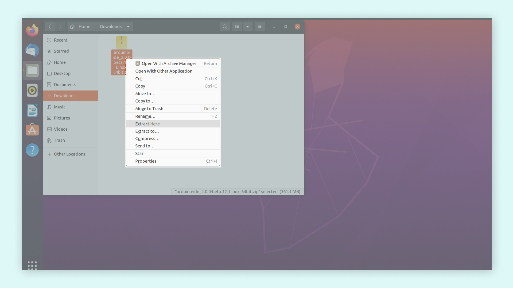
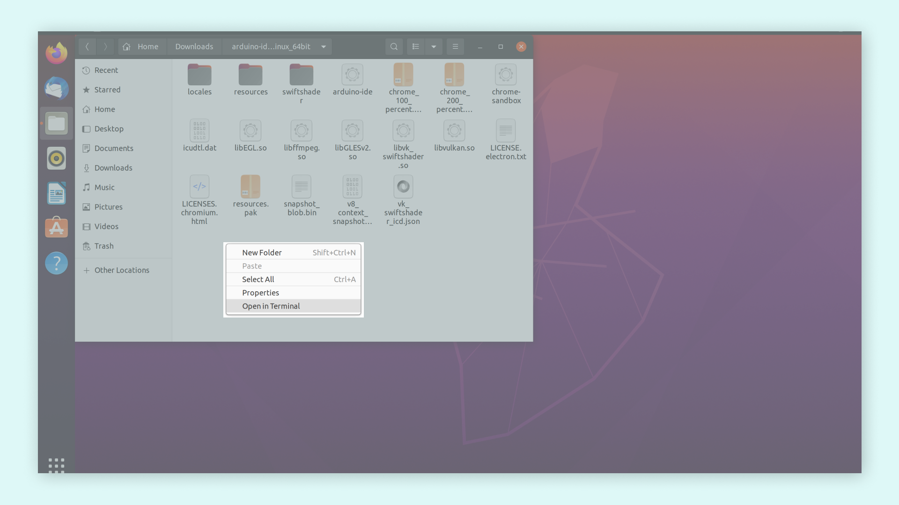
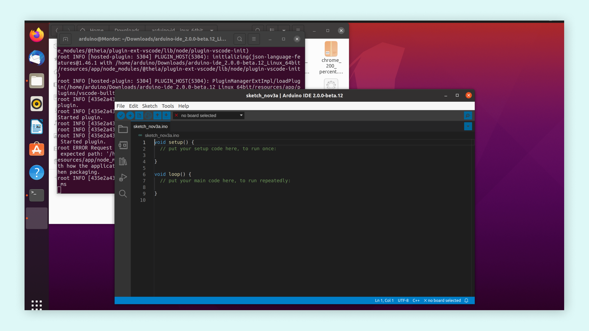

## Downloading and Installing the Arduino IDE 2.0

In this tutorial, we will show how to download and install the Arduino IDE 2.0 on your Windows, Mac, or Linux computer.

You can easily download the editor from the [Arduino Software page](https://www.arduino.cc/en/software#experimental-software). 

### Requirements

- **Windows** - Win 10 and newer, 64 bits
- **Linux** - 64 bits
- **Mac OS X** - Version 10.14: "Mojave" or newer, 64 bits

### The Arduino IDE 2.0

The Arduino IDE 2.0 is an open-source project. It is a big step from it's sturdy predecessor, Arduino IDE 1.x, and comes with revamped UI, improved board & library manager, autocomplete feature and much more. 

### Download the Editor

Downloading the Arduino IDE 2.0 is done through the [Arduino Software page](https://www.arduino.cc/en/software#experimental-software). Here you will also find information on the other editors available to use. 

### Installation

#### Windows

To install the Arduino IDE 2.0 on a Windows computer, simply run the file downloaded from the software page.


Follow the instructions in the installation guide. The installation may take several minutes.


You can now use the Arduino IDE 2.0 on your Windows computer!

#### macOS

To install the Arduino IDE 2.0 on a macOS computer, simply copy the downloaded file into your application folder. 


You can now use the Arduino IDE 2.0 on your macOS computer!

#### Linux 

To install the Arduino IDE 2.0 on Linux, extract the downloaded file into a desired folder. Extracting the file can be done in Linux by right-clicking on the downloaded file and then selecting the **Extract here** option:



Now, go to the folder where you extracted the contents to. Then, right-click inside the folder and then select the **Open in Terminal** option:



A new terminal window should open. To launch the IDE 2.0 editor type in the terminal:

```
$ ./arduino-ide
```



You can now use the Arduino IDE 2.0 on your Linux computer!

***In Linux, The Arduino IDE 2.0 must be launched through the terminal.***
