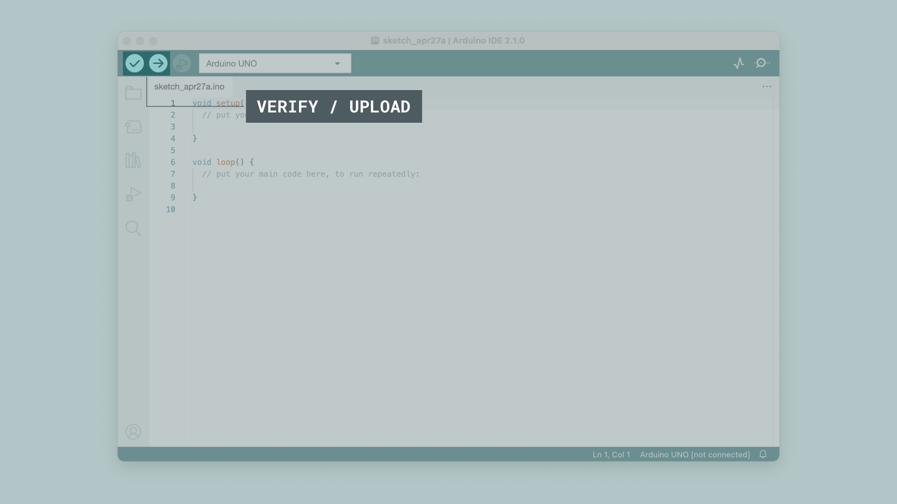
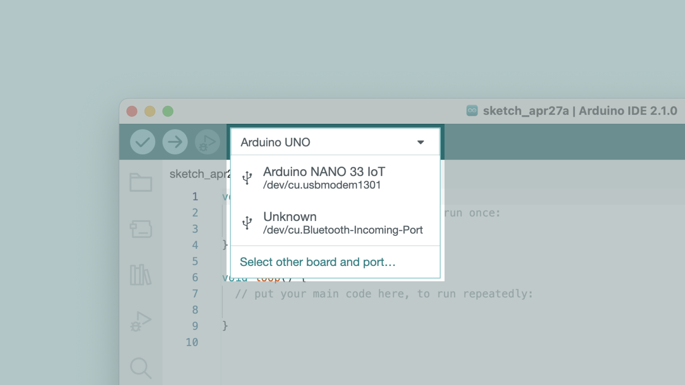
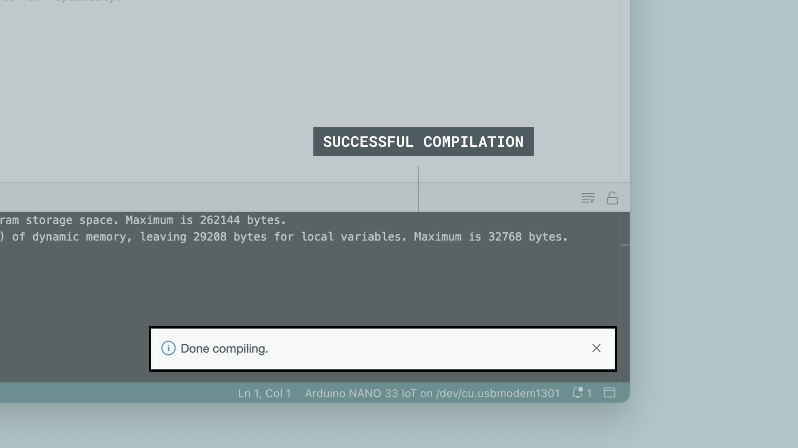
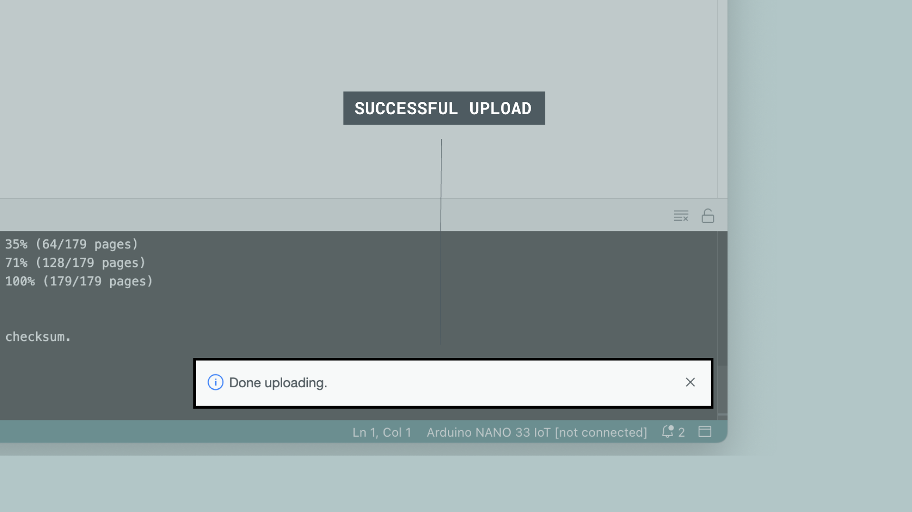

## How to Upload a Sketch with the Arduino IDE 2

In the Arduino environment, we write **sketches** that can be uploaded to Arduino boards. In this tutorial, we will go through how to select a board connected to your computer, and how to upload a sketch to that board, using the Arduino IDE 2.

You can easily download the editor from the [Arduino Software page](https://www.arduino.cc/en/software). 

You can also follow the [downloading and installing the Arduino IDE 2](./ide-v2-downloading-and-installing) tutorial for more detailed guide on how to install the editor.

### Requirements

- Arduino IDE 2 installed. 

### Verify VS Upload

There are two main tools when uploading a sketch to a board: **verify** and **upload.** The verify tool simply goes through your sketch, checks for errors and compiles it. The upload tool does the same, but when it finishes compiling the code, it also uploads it to the board.

A good practice is to use the verifying tool before attempting to upload anything. This is a quick way of spotting any errors in your code, so you can fix them before actually uploading the code. 

### Uploading a Sketch

Uploading a sketch is quick and easy, but let's take a look at what we need to do. 

**1.** Open the Arduino IDE 2. 

**2.** With the editor open, let's take a look at the toolbar at the top. At the very left, there is a **checkmark** and an **arrow pointing right**. The checkmark is used to **verify**, and the arrow is used to **upload.** 



**3.** First, we need to select the board that we are going to use. We can do this by navigating to **Tools > Port > {Board}**. The board(s) that are connected to your computer should appear here, and we need to select it by clicking it. In this case, our board is displayed as **COM17 (Arduino MKR WiFi1010)**.



**4.** Click on the verify tool (checkmark). Since we are verifying an empty sketch, we can be sure it is going to compile. After a few seconds, we can see the result of the action in the console (black box in the bottom). 



**5.** With the board selected, we are good to go! Click on the **upload** button, and it will start uploading the sketch to the board. 

**6.** When it is finished, a notification pops up in the bottom right of your IDE window. Of course, sometimes there are some complications when uploading, and these errors will be listed here as well.



Congratulations, you have now uploaded a sketch to your Arduino board!

### Please Read (Only Linux Users)

It might happen that when you upload a sketch - after you have selected your board and the serial port - you get an error such as **"... Permission denied"**. If you get this error, you need to set serial port permission.

To do this, open your Terminal and type:

```
ls -l /dev/ttyACM*
```

you will get something like:

```
crw-rw---- 1 root dialout 188, 0 5 apr 23.01 ttyACM0
```

The "0" at the end of ACM might be a different number, or multiple entries might be returned. The data we need is "dialout" (is the group owner of the file).

Now we just need to add our user to the group:

```
sudo usermod -a -G dialout <username>
```

where `<username>` is your Linux user name. **You will need to log out and log in again for this change to take effect.**


After this procedure, you should be able to proceed normally and upload the sketch to your board or use the Serial Monitor.
