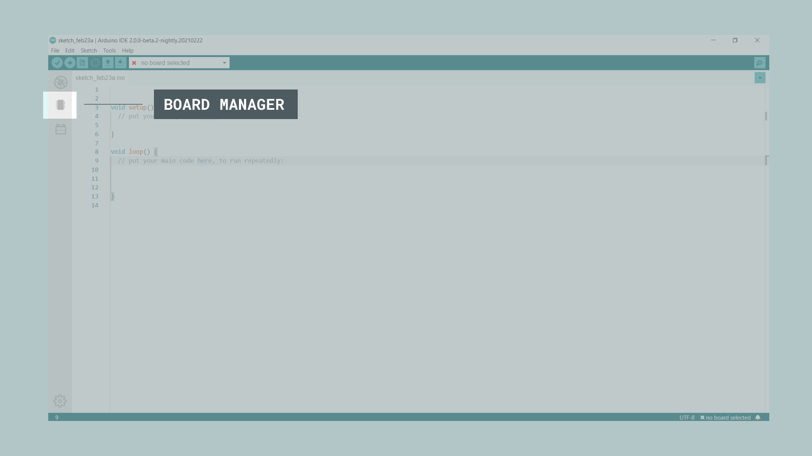
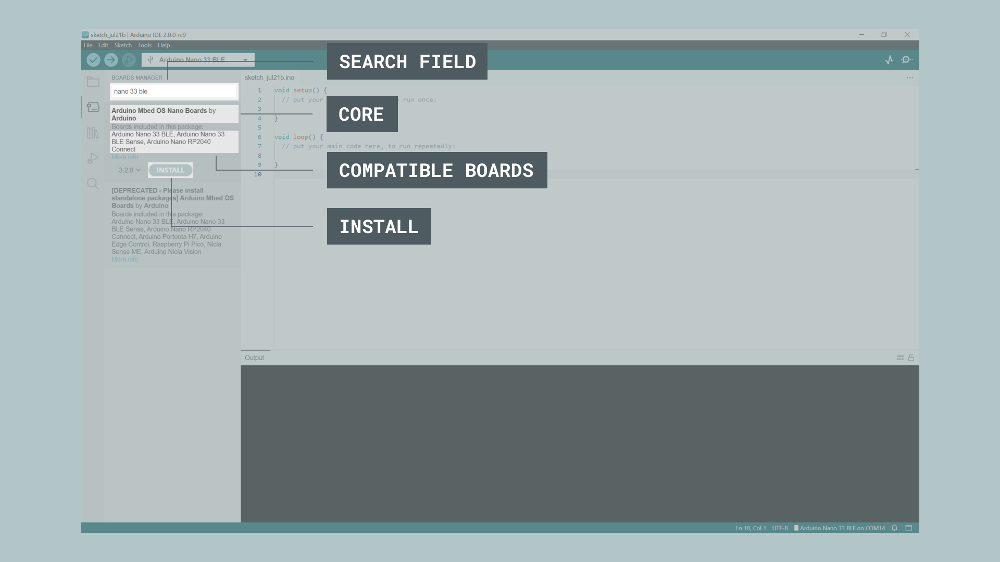
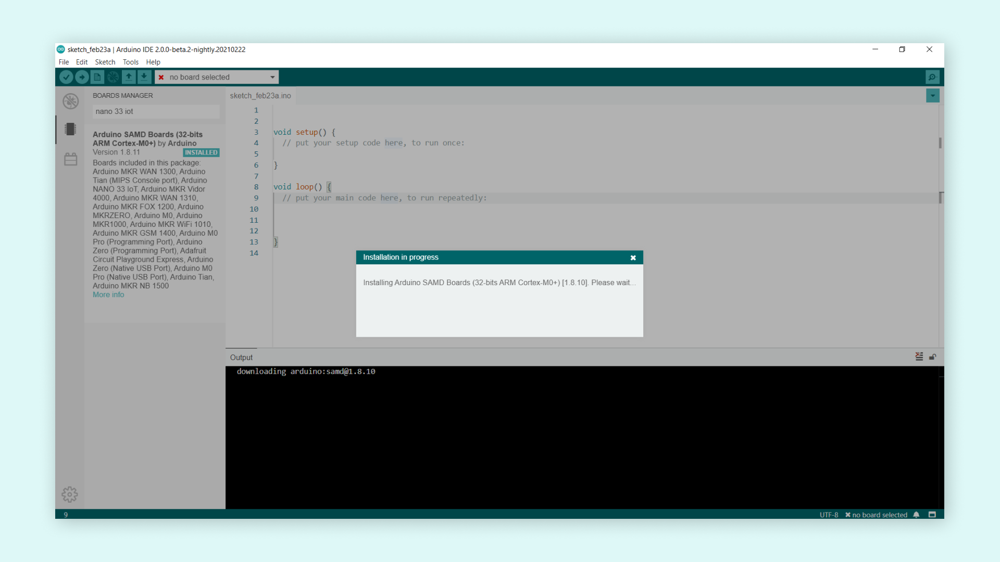
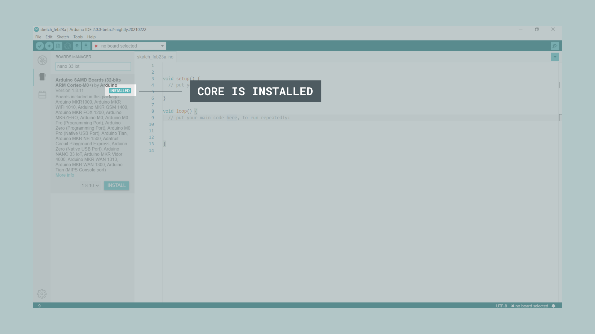

The board manager is a great tool for installing the necessary cores to use your Arduino boards. In this quick tutorial, we will take a look at how to install one, and choosing the right core for your board! 

You can easily download the editor from the [Arduino Software page](https://www.arduino.cc/en/software). 

You can also follow the [downloading and installing the Arduino IDE 2](/software/ide-v2/tutorials/getting-started/ide-v2-downloading-and-installing) tutorial for more detailed guide on how to install the editor.

## Requirements

- Arduino IDE 2 installed. 

## Why Use the Board Manager?

The board manager is a tool that is used to install different cores on your local computer. So what is a **core**, and why is it necessary that I install one?

Simply explained, a core is written and designed for specific microcontrollers. Arduino offers several different types of boards, and these boards may also have different types of microcontrollers. While different microcontrollers accomplish tasks in similar ways, the way code is compiled, pins are mapped, and what features are available is tailor-made to the silicon itself, meaning that this will also be microcontroller-specific. 

What a core does is to act as a layer between all of this microcontroller-specific jargon, and you - the maker. The core translates it into the Arduino API you are already familiar with so that you can program any of the microcontrollers in the Arduino ecosystem in the same way.

For example, an Arduino UNO has an **ATmega328P**, which uses the **AVR core**, while an Arduino Nano 33 IoT has a **SAMD21** microcontroller, where we need to use the **SAMD core**. However, regardless of what microcontroller is on the board we are using, `digitalWrite(LED_BUILTIN, HIGH)` will turn on the built-in LED, and `analogRead(A0)` will read the analog pin 0 and check for a voltage.

In conclusion, to use a specific board, we need to install a specific core. 

## Installing a Core

Installing a core is quick and easy, but let's take a look at what we need to do. 

**1.** Open the Arduino IDE 2. 

**2.** With the editor open, let's take a look at the left column. Here, we can see a couple of icons. Let's click the on the **Arduino board** icon.

**3.** A list will now appear of all available cores. Now let's say we are using an **Nano 33 BLE** board, and we want to install the core. Simply enter the name in the search field, and the right core (Mbed OS Nano) will appear, where the Nano 33 BLE features in the description. Click on the **"INSTALL"** button.

**4.** This will begin an installation process, which usually only take a few moments. 

**5.** When it is finished, we can take a look at the core in the boards manager column, where it should say **"INSTALLED"**, as well as noting which version you have installed on your machine.

Congratulations! You have now successfully downloaded and installed a core on your machine, and you can start using your Arduino board! 

### More Tutorials

You can find more tutorials in the [Arduino IDE 2 documentation page](/software/ide-v2/).