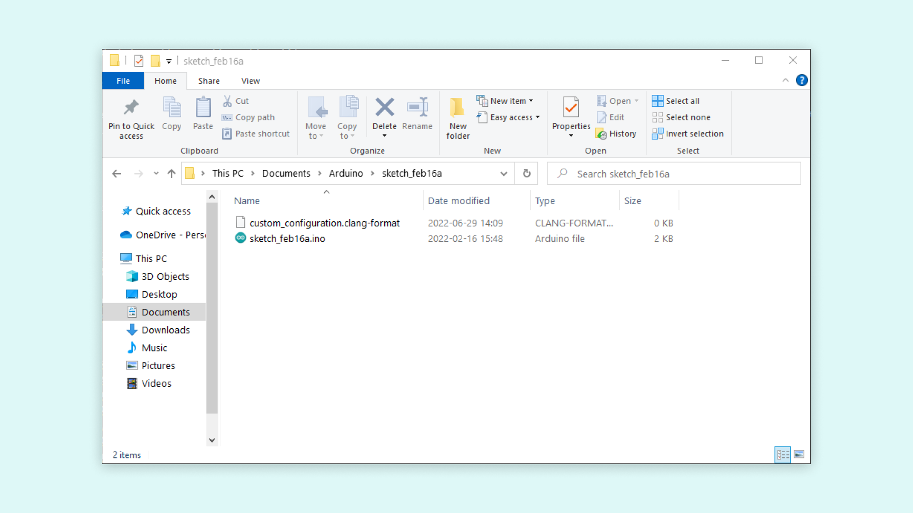

Selecting **Tools > Auto Format** or pressing CTRL + T on Windows/Linux or CMD + T on MacOS when writing a sketch in the Arduino IDE 2.0 will automatically format the sketch. It is possible to change the behaviour of this command. In this tutorial we will go through how you can change the behaviour of this command. 

You can easily download the editor from the [Arduino Software page](https://www.arduino.cc/en/software#experimental-software). 

You can also follow the [downloading and installing the Arduino IDE 2.0](/en/Tutorial/getting-started-with-ide-v2/ide-v2-downloading-and-installing) tutorial for more detailed guide on how to install the editor.

## Requirements

- Arduino IDE 2.0 installed. 

## Setting the Custom Configuration

It is possible to define your own custom configuration of the auto formatter feature in two different ways. The custom configuration of the auto formatter can be set on a global level to cover all sketches opened in the editor, or you can set the configuration to be specific to a sketch.

The formatter tool used by Arduino IDE 2.0 is ClangFormat. The documentation for the configuration options is [here](https://clang.llvm.org/docs/ClangFormatStyleOptions.html).

### Global scope
If you add a `.clang-format` configuration file to either of the following locations, the Arduino IDE 2.0 will always use it instead of the Arduino default configuration.

If you are using Windows place the file in:
```
C:\Users\<username>\.arduinoIDE\
```
Or
```
C:\Users\<username>\AppData\Local\Arduino15\
```

If you are using Linux place the file in:
```
~/.arduinoIDE/
```
Or
```
~/.arduino15/
```

If you are using macOS place the file in:
```
~/.arduinoIDE
```
Or
```
~/Library/Arduino15/
```

### Sketch scope
If you add a `.clang-format`  configuration file to the root of a sketch, the Arduino IDE will use that configuration when formatting that sketch. This file has precedence over a global formatter configuration file. 
If you add a `.clang-format` configuration file to the root of a sketch, the Arduino IDE will use that configuration when formatting that sketch. This file has precedence over a global formatter configuration file.



## Default Formatting File

Here you can find the default formatting file used in the Arduino IDE 2.0. If you wish to customize how your auto formatting acts in the IDE then starting with this file is a good idea.

***Please note that the custom configuration file completely overrides the Arduino default configuration, rather than merging with it. Any configuration option you don't set in your custom file will be set to the ClangFormat default value.***

```cpp
---
Language: Cpp
# LLVM is the default style setting, used when a configuration option is not set here
BasedOnStyle: LLVM
AccessModifierOffset: -2
AlignAfterOpenBracket: Align
AlignConsecutiveAssignments: false
AlignConsecutiveBitFields: false
AlignConsecutiveDeclarations: false
AlignConsecutiveMacros: false
AlignEscapedNewlines: DontAlign
AlignOperands: Align
AlignTrailingComments: true
AllowAllArgumentsOnNextLine: true
AllowAllConstructorInitializersOnNextLine: true
AllowAllParametersOfDeclarationOnNextLine: true
AllowShortBlocksOnASingleLine: Always
AllowShortCaseLabelsOnASingleLine: true
AllowShortEnumsOnASingleLine: true
AllowShortFunctionsOnASingleLine: Empty
AllowShortIfStatementsOnASingleLine: Always
AllowShortLambdasOnASingleLine: Empty
AllowShortLoopsOnASingleLine: true
AlwaysBreakAfterDefinitionReturnType: None
AlwaysBreakAfterReturnType: None
AlwaysBreakBeforeMultilineStrings: false
AlwaysBreakTemplateDeclarations: No
BinPackArguments: true
BinPackParameters: true
# Only used when "BreakBeforeBraces" set to "Custom"
BraceWrapping:
  AfterCaseLabel: false
  AfterClass: false
  AfterControlStatement: Never
  AfterEnum: false
  AfterFunction: false
  AfterNamespace: false
  #AfterObjCDeclaration:
  AfterStruct: false
  AfterUnion: false
  AfterExternBlock: false
  BeforeCatch: false
  BeforeElse: false
  BeforeLambdaBody: false
  BeforeWhile: false
  IndentBraces: false
  SplitEmptyFunction: false
  SplitEmptyRecord: false
  SplitEmptyNamespace: false
# Java-specific
#BreakAfterJavaFieldAnnotations:
BreakBeforeBinaryOperators: NonAssignment
BreakBeforeBraces: Attach
BreakBeforeTernaryOperators: true
BreakConstructorInitializers: BeforeColon
BreakInheritanceList: BeforeColon
BreakStringLiterals: false
ColumnLimit: 0
# "" matches none
CommentPragmas: ""
CompactNamespaces: false
ConstructorInitializerAllOnOneLineOrOnePerLine: true
ConstructorInitializerIndentWidth: 2
ContinuationIndentWidth: 2
Cpp11BracedListStyle: false
DeriveLineEnding: true
DerivePointerAlignment: true
DisableFormat: false
# Docs say "Do not use this in config files". The default (LLVM 11.0.1) is "false".
#ExperimentalAutoDetectBinPacking:
FixNamespaceComments: false
ForEachMacros: []
IncludeBlocks: Preserve
IncludeCategories: []
# "" matches none
IncludeIsMainRegex: ""
IncludeIsMainSourceRegex: ""
IndentCaseBlocks: true
IndentCaseLabels: true
IndentExternBlock: Indent
IndentGotoLabels: false
IndentPPDirectives: None
IndentWidth: 2
IndentWrappedFunctionNames: false
InsertTrailingCommas: None
# Java-specific
#JavaImportGroups:
# JavaScript-specific
#JavaScriptQuotes:
#JavaScriptWrapImports
KeepEmptyLinesAtTheStartOfBlocks: true
MacroBlockBegin: ""
MacroBlockEnd: ""
# Set to a large number to effectively disable
MaxEmptyLinesToKeep: 100000
NamespaceIndentation: None
NamespaceMacros: []
# Objective C-specific
#ObjCBinPackProtocolList:
#ObjCBlockIndentWidth:
#ObjCBreakBeforeNestedBlockParam:
#ObjCSpaceAfterProperty:
#ObjCSpaceBeforeProtocolList
PenaltyBreakAssignment: 1
PenaltyBreakBeforeFirstCallParameter: 1
PenaltyBreakComment: 1
PenaltyBreakFirstLessLess: 1
PenaltyBreakString: 1
PenaltyBreakTemplateDeclaration: 1
PenaltyExcessCharacter: 1
PenaltyReturnTypeOnItsOwnLine: 1
# Used as a fallback if alignment style can't be detected from code (DerivePointerAlignment: true)
PointerAlignment: Right
RawStringFormats: []
ReflowComments: false
SortIncludes: false
SortUsingDeclarations: false
SpaceAfterCStyleCast: false
SpaceAfterLogicalNot: false
SpaceAfterTemplateKeyword: false
SpaceBeforeAssignmentOperators: true
SpaceBeforeCpp11BracedList: false
SpaceBeforeCtorInitializerColon: true
SpaceBeforeInheritanceColon: true
SpaceBeforeParens: ControlStatements
SpaceBeforeRangeBasedForLoopColon: true
SpaceBeforeSquareBrackets: false
SpaceInEmptyBlock: false
SpaceInEmptyParentheses: false
SpacesBeforeTrailingComments: 2
SpacesInAngles: false
SpacesInCStyleCastParentheses: false
SpacesInConditionalStatement: false
SpacesInContainerLiterals: false
SpacesInParentheses: false
SpacesInSquareBrackets: false
Standard: Auto
StatementMacros: []
TabWidth: 2
TypenameMacros: []
# Default to LF if line endings can't be detected from the content (DeriveLineEnding).
UseCRLF: false
UseTab: Never
WhitespaceSensitiveMacros: []
```

## Conclusion

In this tutorial we went through how to customize the behavior of the `CTRL + T` / `CMD + T` auto formatter command in the Arduino IDE 2.0. This tutorial also shows the different scopes that are available for the auto formatter configuration.

### More Tutorials

You can find more tutorials in the [Arduino IDE 2 documentation page](/software/ide-v2/).
