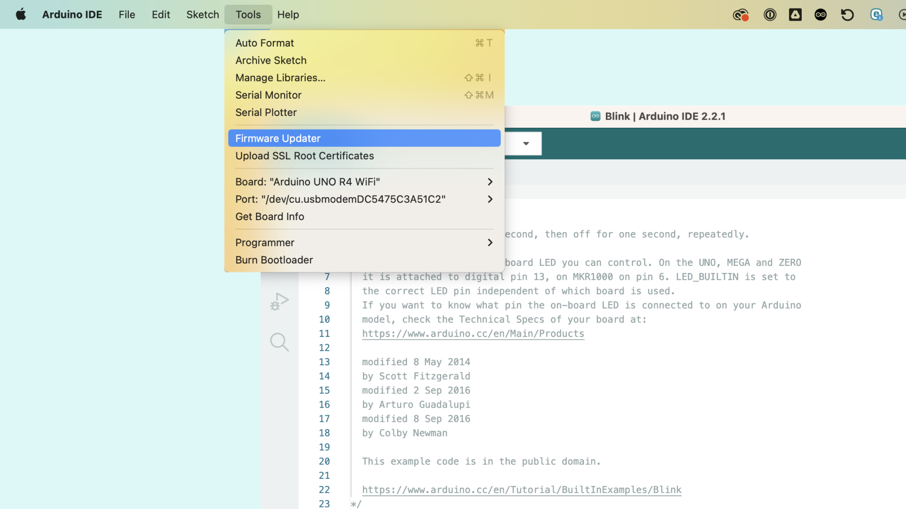
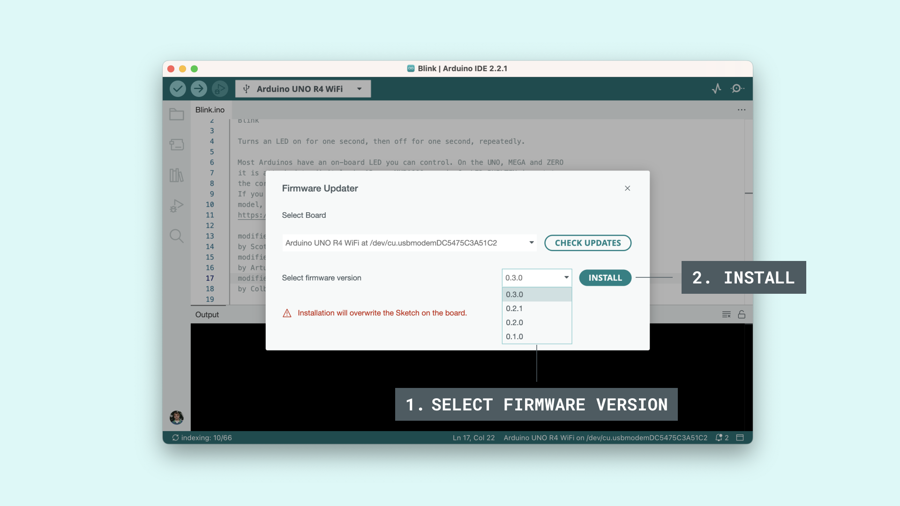
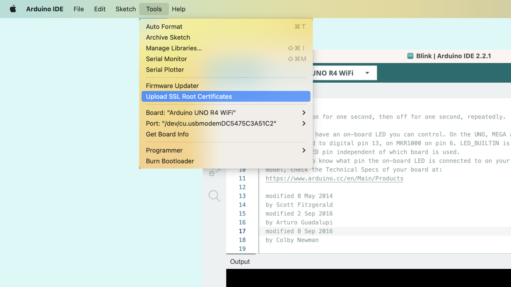
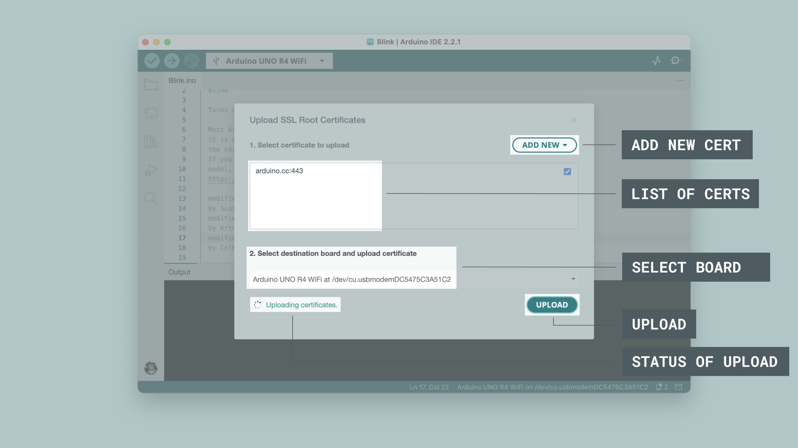

## Overview

The IDE 2 comes with two really useful tools: the **Firmware Updater for WiFi boards**, and the **SSL Root Certificates Uploader**. The Firmware Updater allows you to choose the firmware version you want to upgrade to (or downgrade to), while the Certificates Uploader allows you to update the SSL root certificates on the board (adding specific domains).

Only Wi-Fi enabled boards can be updated through these tools, and you can find the full list in the compatible boards section just below.

***You can download the editor from the [Arduino Software page](https://www.arduino.cc/en/software).***

## Compatible Boards

The following boards are based on the [NINA-W10 series](https://content.arduino.cc/assets/Arduino_NINA-W10_DataSheet_%28UBX-17065507%29.pdf) from [u-blox](https://www.u-blox.com/en/product/nina-w10-series-open-cpu).

- [UNO WiFi Rev 2](https://store.arduino.cc/arduino-uno-wifi-rev2)
- [Nano RP2040 Connect](https://store.arduino.cc/nano-rp2040-connect)
- [MKR WiFi 1010](https://store.arduino.cc/arduino-mkr-wifi-1010)
- [Nano 33 IoT](https://store.arduino.cc/arduino-nano-33-iot)
- [MKR Vidor 4000](https://store.arduino.cc/arduino-mkr-vidor-4000) /*

The following boards are based on the [ATWINC1500](https://www.microchip.com/en-us/product/ATWINC1500) module.

- [MKR 1000 WiFi](https://store.arduino.cc/arduino-mkr1000-wifi) /*
- [WiFi Shield 101](https://docs.arduino.cc/retired/shields/arduino-wifi-shield-101)

/* As of [Arduino IDE 2.2.0](https://github.com/arduino/arduino-ide/releases/tag/2.2.0) this board is no longer supported.

## When to Update Firmware

In most cases, manually updating your board's firmware is not necessary, as it is shipped to work 'out of the box'. But there are some cases where updating it might be useful, for example to correct hardware bugs or to be compatible with a specific setup. 

You can read the full changelog of the NINA firmware through the link below:

- [Arduino NINA-W102 Firmware Changelog](https://github.com/arduino/nina-fw/releases)

### Arduino Cloud

When you are using the [Arduino Cloud](https://create.arduino.cc/iot/things), during the device configuration, your board's firmware is automatically updated so that it can utilize features such as **OTA (Over The Air)** upload.

### Python® & Wi-Fi

To access the Wi-Fi module on the [Nano RP2040 Connect board](https://store.arduino.cc/products/arduino-nano-rp2040-connect) using Python® (through [OpenMV](/tutorials/nano-rp2040-connect/rp2040-openmv-setup)), you will need to update the NINA firmware to the latest version.

## Firmware Updater

***The Firmware Updater tool will overwrite any existing sketch on your board.***

To update the Firmware, follow the below steps:

**1.** Connect your board to your computer.

**2.** Open the Arduino IDE 2, and navigate to **Tools > Firmware Updater**.



**3.** A new window will open. Select your board from the drop down menu, and press the button to check for updates. 


**4.** Select the firmware you want to upgrade/downgrade to.



**5.** Allow some time for the process to finish. If successful, you will see the text:

```
Firmware successfully installed.
```

## Certificates Uploader

To upload SSL Root certificates to your board, follow the below steps:

**1.** Connect your board to your computer.

**2.** Open the Arduino IDE 2, and navigate to **Tools > Upload SSL Root Certificates**.



**3.** A new window will open. Click on the **"Add New"** and add the URL in the field. Here you can add multiple entries. When you are finished adding certificates, you can select your board from the drop down menu. To upload the certificates, click on the **"Upload"** button.



**5.** The process of uploading the certificates takes some time, and when it is finished, you will see the text: 

```
Certificates uploaded.
``` 

## Conclusion

In this tutorial, we have step-by-step gone through the **Firmware Updater** and **Certification Uploader** tools. Both are developed to be easy to use and to remove complicated steps that is typically associated with firmware updates. 