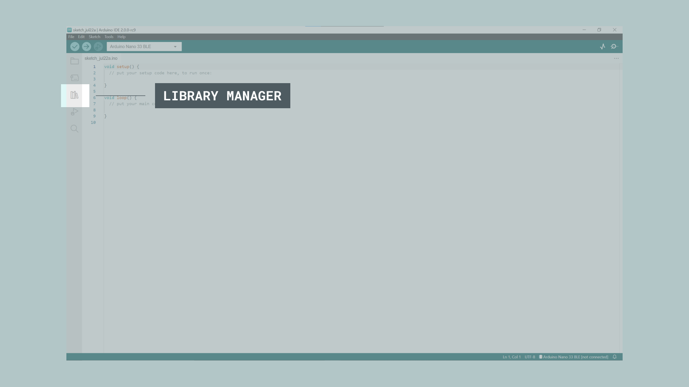
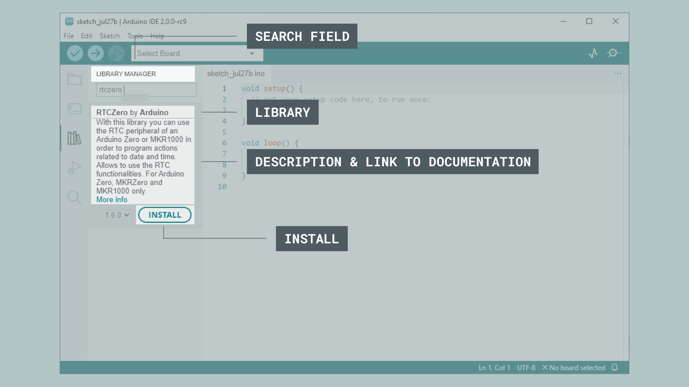
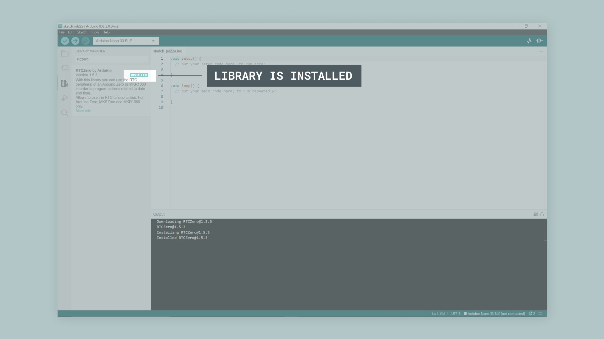
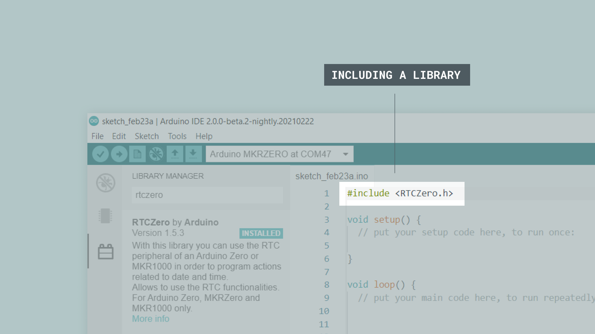
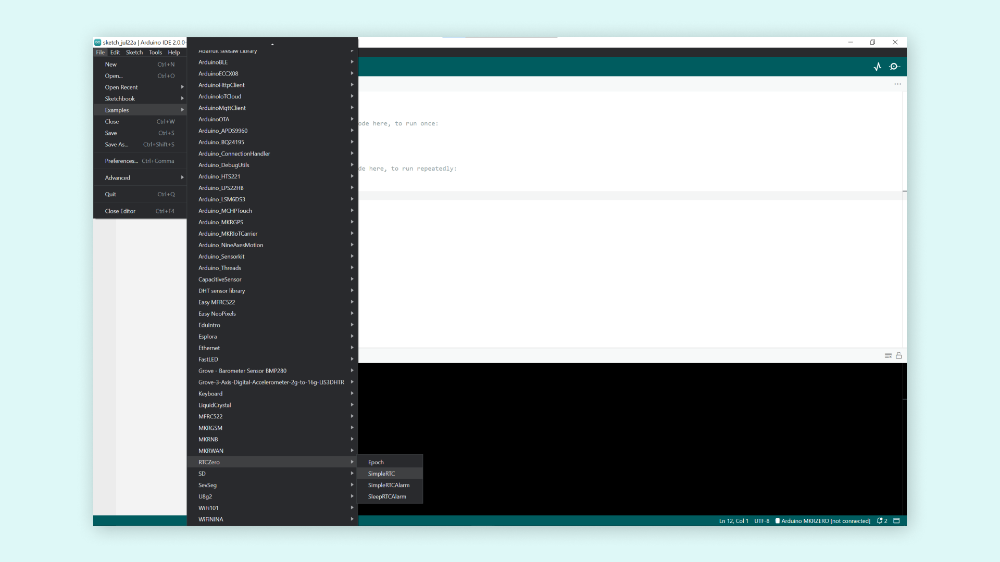
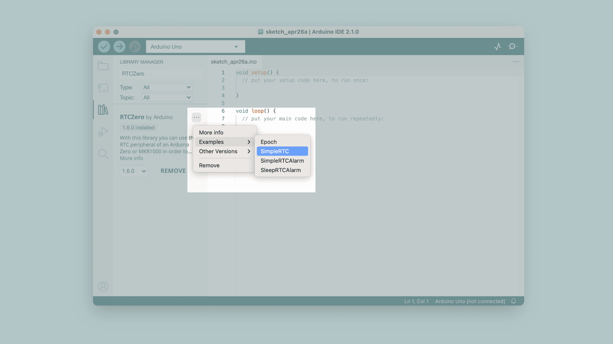
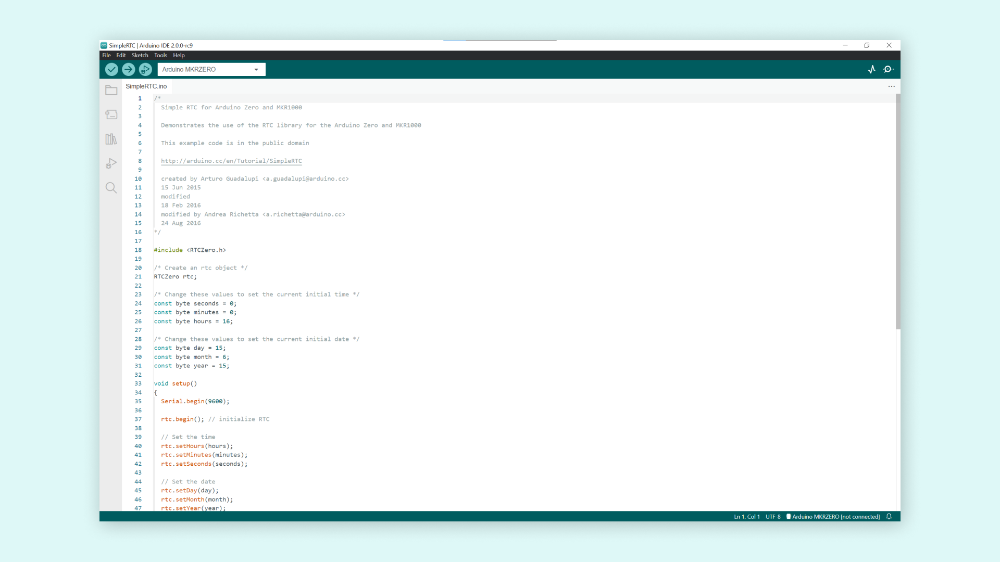

A large part of the Arduino programming experience is the **use of libraries.** There are thousands of libraries that can be found online, and the best documented ones can be found and installed directly through the editor.

In this tutorial, we will go through how to install a library using the library manager in the Arduino IDE 2. We will also show how to access examples from a library that you have installed.

You can easily download the editor from the [Arduino Software page](https://www.arduino.cc/en/software). 

You can also follow the [downloading and installing the Arduino IDE 2](/software/ide-v2/tutorials/getting-started/ide-v2-downloading-and-installing) tutorial for more detailed guide on how to install the editor.

## Requirements

- Arduino IDE 2 installed. 

## Why Use Libraries?

Libraries are incredibly useful when creating a project of any type. They make our development experience much smoother, and there almost an infinite amount out there. They are used to interface with many different sensors, RTCs, Wi-Fi modules, RGB matrices and of course with other components on your board. 

Arduino has many official libraries, but the real heroes are the Arduino community, who develop, maintain and improve their libraries on a regular basis. 

## Installing a Library

Installing a library is quick and easy, but let's take a look at what we need to do. 

**1.** Open the Arduino IDE 2. 

**2.** With the editor open, let's take a look at the left column. Here, we can see a couple of icons. Let's click the on the **"library"** icon.

**3.** A list will now appear of all available libraries, where we can also search for the library we want to use. In this example, we are going to install the **RTCZero** library. Click on the **"INSTALL"** button to install the library.

**4.** This process should not take too long, but allow up to a minute to install it. 

**5.** When it is finished, we can take a look at the library in the library manager column, where it should say **"INSTALLED"**.

Congratulations! You have now successfully downloaded and installed a library on your machine.

## Including a Library

To use a library, you first need to include the library at the top of the sketch.

Almost all libraries come with already made examples that you can use. These are accessible through **File > Examples > {Library} > {Example}**. In this example, we are choosing the **RTCZero > SimpleRTC**.

You can also access library examples directly in the library manager, by clicking the three dots next to the installed library, like this:

The chosen example will now open up in a new window, and you can start using it however you want to.

### More Tutorials

You can find more tutorials in the [Arduino IDE 2 documentation page](/software/ide-v2/).