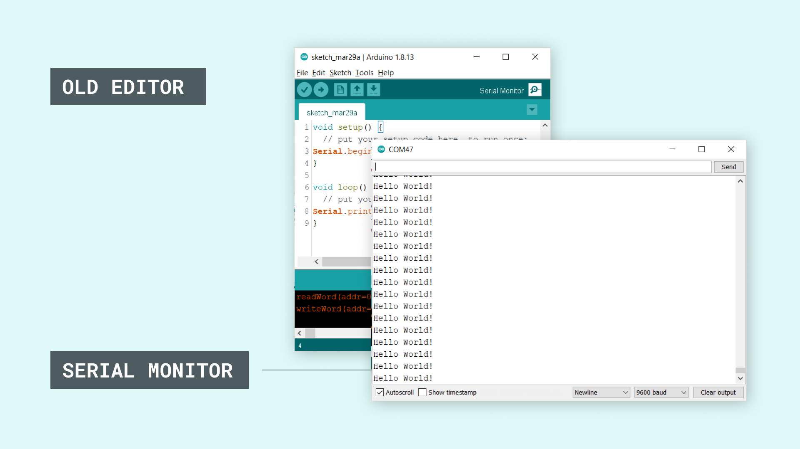
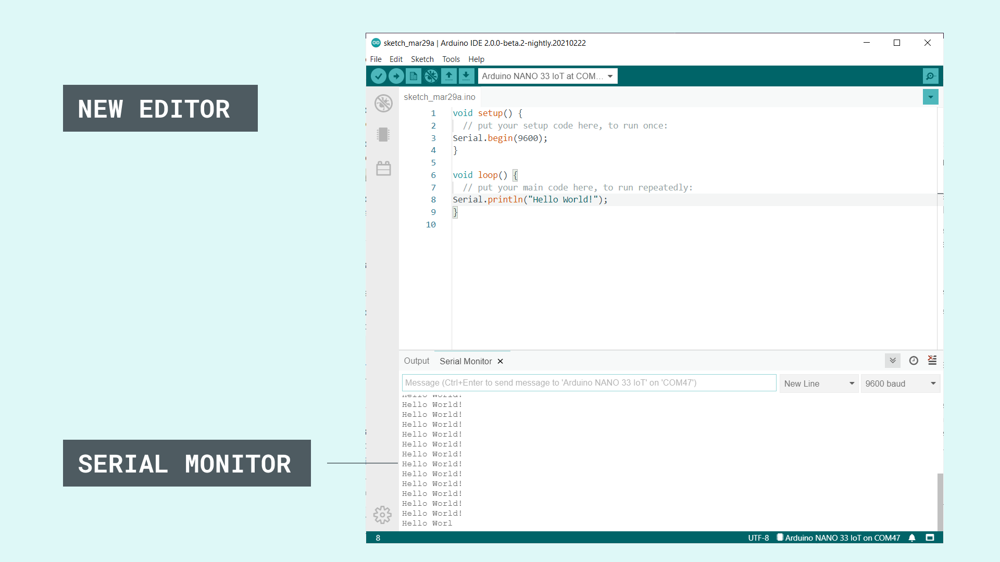
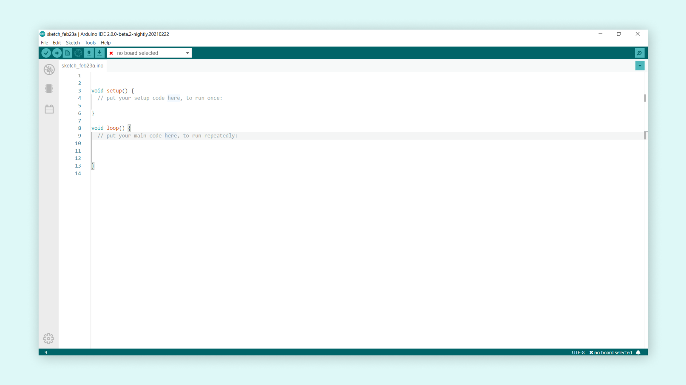
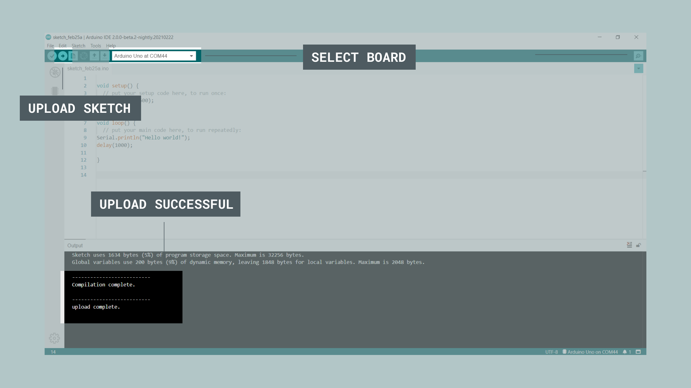
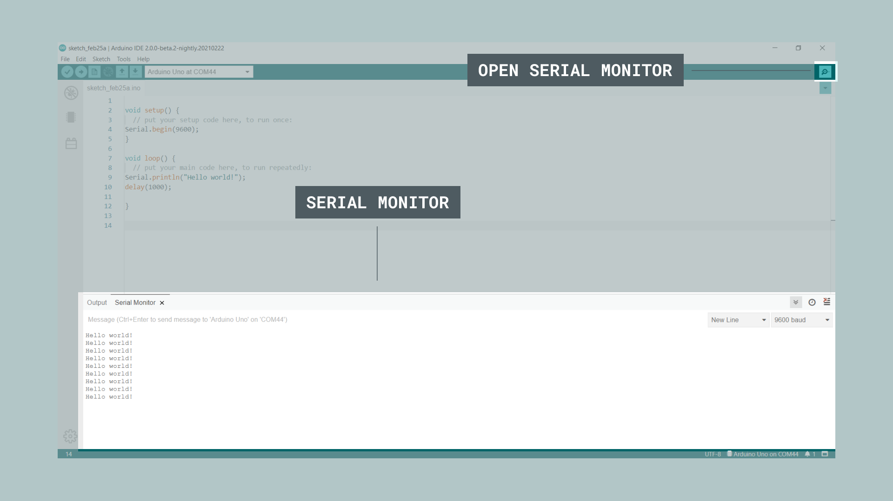
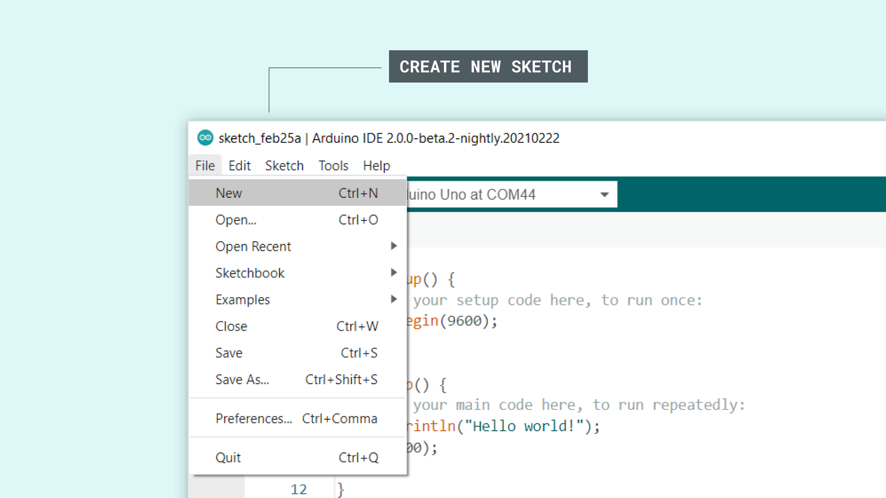
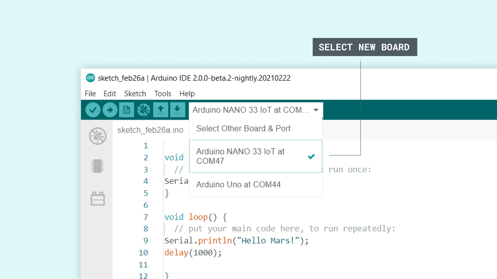
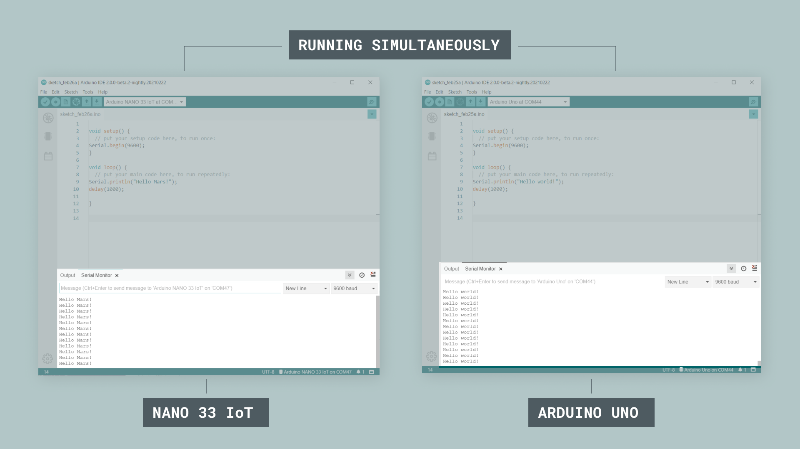

The Serial Monitor is an essential tool when creating projects with Arduino. It can be used as a debugging tool, testing out concepts or to communicate directly with the Arduino board. 

The Arduino IDE 2 has the Serial Monitor tool integrated with the editor, which means that no external window is opened when using the Serial Monitor. This means that you can have multiple windows open, each with its own Serial Monitor. 

You can download the editor from the [Arduino Software page](https://www.arduino.cc/en/software). 

You can also follow the [downloading and installing the Arduino IDE 2](/software/ide-v2/tutorials/getting-started/ide-v2-downloading-and-installing) tutorial for more detailed guide on how to install the editor.

## Requirements

- Arduino IDE 2 installed. 
- Arduino board.
- Core installed for the board used.

## Notable Changes

### Integrated Monitor

One major change that was introduced with the Arduino IDE 2 is the **integrated Serial Monitor**. The older versions of the editor features an external window that matches the port/board that we select. 

The Arduino IDE 2 works a bit differently. Instead of opening an external window for the Serial Monitor, it shows up where the console log is located, as an additional tab. To understand how this works, let's take a look at how the old editor works:



Now, let's take a look at the IDE 2. Notice how the Serial Monitor is located at the bottom of the editor:



The Serial Monitor settings are also located here, such as adjusting the baud rate and sending messages. 

#### Advantages

A major advantage with having the Serial Monitor integrated with the editor is the possibility to have multiple monitors open simultaneously. In the old editor, when changing the port/board, it changed across all windows. In addition, we were limited to **one Serial Monitor window**, an obstacle that the IDE 2 removes. 

You will find an example with more information on how to use this feature, further down this tutorial under the **Using multiple Serial Monitors simultaneously** section.

## Using the Serial Monitor Tool

The Serial Monitor tool is a really great tool for debugging and establishing communication between a computer and an Arduino. To use it is really easy, but there are some things that we need to do first.

**1.** First we need to open the Arduino IDE 2. 



**2.** Now, we need to create a sketch that includes some configurations needed, so that our board can communicate with our computer. Mainly, we need to set a **baud rate**, which is done by writing `Serial.begin(9600);`. Here, the `9600` represents the baud rate, which is the maximum bits per seconds that can be transferred. The sketch that we need to use can be found in the snippet below:

```arduino
void setup() {
Serial.begin(9600);
}

void loop() {
Serial.println("Hello world!");
delay(1000); 
}
```

**3.** This will print `"Hello world!"`, every one second to the Serial Monitor. Let's select the board we want to use, and upload the sketch to the board. 



**4.** When it has finished uploading, click on the Serial Monitor button, located at the top right corner of the IDE. This will launch the Serial Monitor in the bottom of the IDE, replacing the console section. 



The text `"Hello world!"` is now printed every one second. Congratulations, you have now successfully sent a message from your Arduino, to your computer. 


## Using Multiple Serial Monitors Simultaneously

A really cool feature with the Arduino IDE 2 is that the Serial Monitor is linked to the sketch windows you have open. For example, if we have two sketch windows, named **sketch_1** and **sketch_2**, we can select the port and board for each window, and have **two Serial Monitors running at the same time**. 

This is really useful when working with various communication / connectivity projects, where we want to know what's going on both boards at the same time. If you have two Arduino boards, you can try out this feature using the instructions below.

**1.** First, we need to open a new file, through **File > New**.



**2.** Now, we need to choose another board. In this example, we are using an **Arduino Nano 33 IoT**. If you have connected it to your computer and installed the necessary core for it, it will show up in the board list.




**3.** For the new sketch, let's use the same sketch we uploaded to the other board, but replace the `"Hello world!"`, with something else. In this example, we used `"Hello Mars!"`, as you can see in the code snippet below:

```arduino
void setup() {
Serial.begin(9600);
}

void loop() {
Serial.println("Hello Mars!");
delay(1000); 
}
```

**4.** Upload the code to the board, and open the Serial Monitor. We should now see `"Hello Mars!"` being printed every one second. If we put the two sketch windows side by side, we can see how they are printing at the same time.



Congratulations, you can now check what is going on with two boards simultaneously!

>**Note:** Using several sketch windows and Serial Monitor at the same time can be quite heavy on your machine. 

### More Tutorials

You can find more tutorials in the [Arduino IDE 2 documentation page](/software/ide-v2/).
