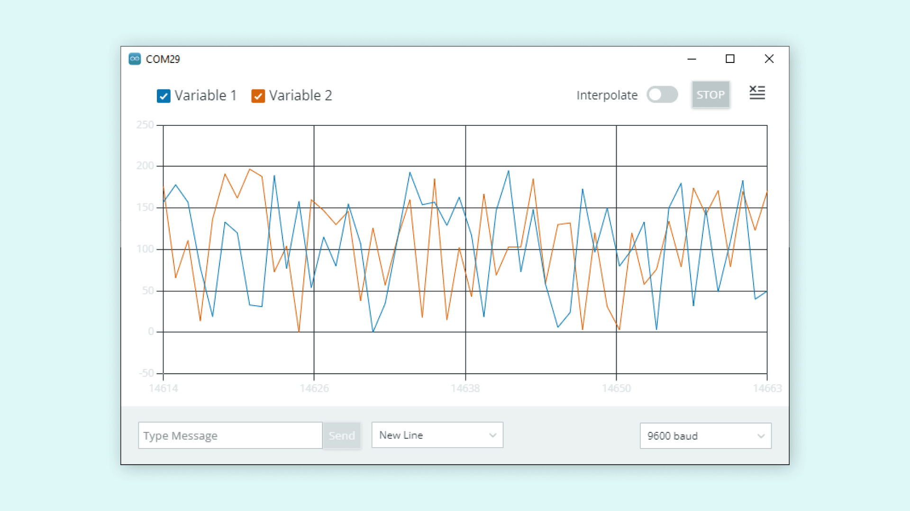
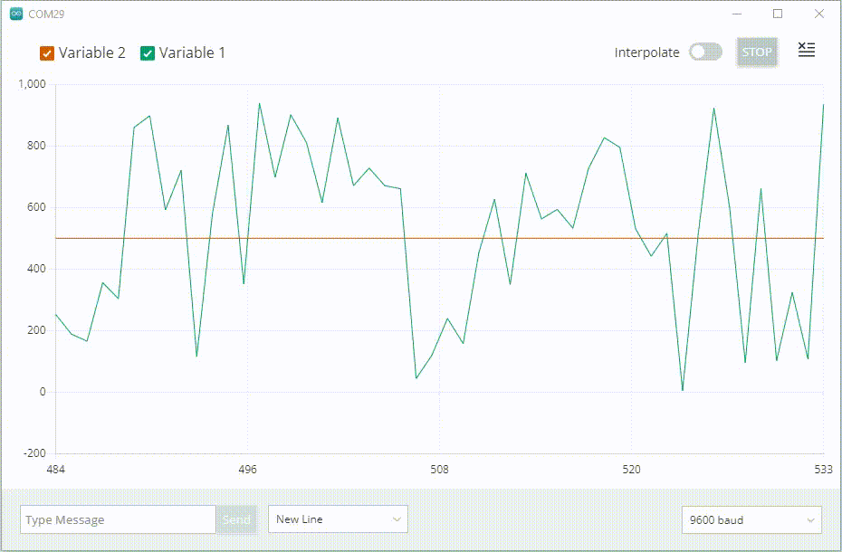
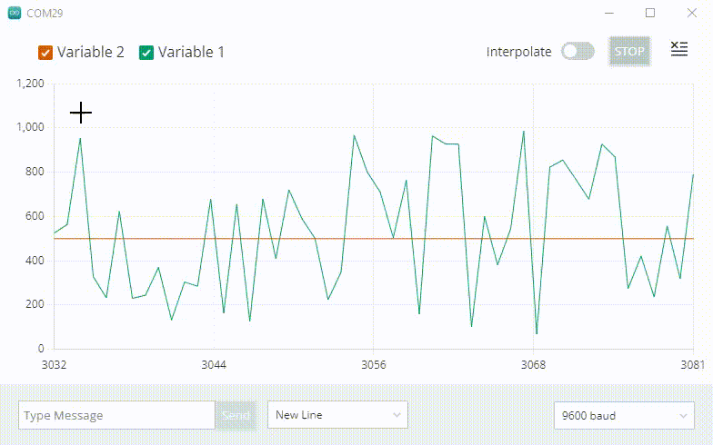

The **Serial Plotter tool** is a versatile tool for tracking different data that is sent from your Arduino board. It functions similarly to your standard [Serial Monitor tool](/software/ide-v2/tutorials/ide-v2-serial-monitor) which is used to print data "terminal style", but is a greater visual tool that will help you understand and compare your data better.

In this tutorial, we will take a quick look on how to enable this feature (works for practically **any sketch** that uses serial communication), how a sample sketch looks like, and how it is expected to work.

***If you need help to download and install the Arduino IDE 2, you can visit the [IDE 2 downloading and installing guide](/software/ide-v2/tutorials/getting-started/ide-v2-downloading-and-installing). For other guides on how to use the editor, visit the [IDE 2 docs](/software/ide-v2).***

## Requirements

- [Arduino IDE 2 installed](https://www.arduino.cc/en/software).
- [Core installed](/software/ide-v2/tutorials/ide-v2-board-manager) for the board used.
- Arduino board.
- Potentiometer (optional).

## Goals

The goal with this tutorial is:

- Learn how to use the Serial Plotter.
- Create a simple sketch and test it out.

## Example Sketch

To use the Serial Plotter, we will need to create a sketch and upload it to our board. This sketch needs to include at least one **numerical variable**, such as an `int` or `float`. 

Below you will find two sketches, one using a potentiometer and `analogRead()` function, the other using the `random()` function. Both sketches have a variable named `static_variable` which has a permanent value of `500`, used as a reference value.

**Choose and upload any of the examples below to your board.**

### Sketch (With Potentiometer)

- `int potentiometer` - variable to store value from a potentiometer, connected to an analog pin (gives a value between 0-1023). 
- `int static_variable = 500` -  variable that has an unchanged value of 500.

```arduino
int potentiometer;
int static_variable = 500;

void setup() {
  Serial.begin(9600);
}

void loop() {
  potentiometer = analogRead(A1);

  Serial.print("Variable_1:");
  Serial.print(potentiometer);
  Serial.print(",");
  Serial.print("Variable_2:");
  Serial.println(static_variable);

  delay(20);
}
```

### Sketch (Without Potentiometer)

- `int random_variable` - variable that stores a randomized value between 0-1000. 
- `int static_variable = 500` -  variable that has an unchanged value of 500.

```arduino
int random_variable;
int static_variable = 500;

void setup() {
  Serial.begin(9600);
}

void loop() {
  random_variable = random(0, 1000);

  Serial.print("Variable_1:");
  Serial.print(random_variable);
  Serial.print(",");
  Serial.print("Variable_2:");
  Serial.println(static_variable);

  delay(20);
}
```
***The Serial Plotter recognizes only CRLF`(\r\n)` & LF`(\n)` as linebreak characters. So ensure that the either there is a linebreak character after the last variable. You can use `Serial.print("\n")` or `Serial.print("\r\n")` to introduce a linebreak character at the end. Conversely, `Serial.println()` introduces a CRLF character automatically. Further, you can also use `\t`(tab) or ` `(space) as a delimiter instead of `,`(comma) in the above example.***

## The Serial Plotter

Once the sketch is uploaded, we can test out the Serial Plotter.

***Make sure the sketch has finished uploading before opening the Serial Plotter. You will see the text "upload complete" in the terminal output.***

Click the button in the the top right of the IDE window to open the **Serial Plotter**.


If you choose the **potentiometer example sketch**, when turning the knob, you should be creating a "wave-like" pattern in the plotter. Here, we can use the `static_variable` as a reference, as we know it is always `500`. This is an easy example of just testing out an analog component.


If you chose the **random example sketch**, when you open the plotter you will see very random spikes, as the values fluctuate rapidly. 



You can also enable/disable the variables by checking the box next to the variable name.



## Conclusion

The Serial Plotter is a really useful tool for tracking your variables. It can be used for testing and calibrating sensors, comparing values and other similar scenarios.

To learn more about the Arduino IDE 2 features, you can visit the [Arduino IDE 2 docs](/software/ide-v2).
