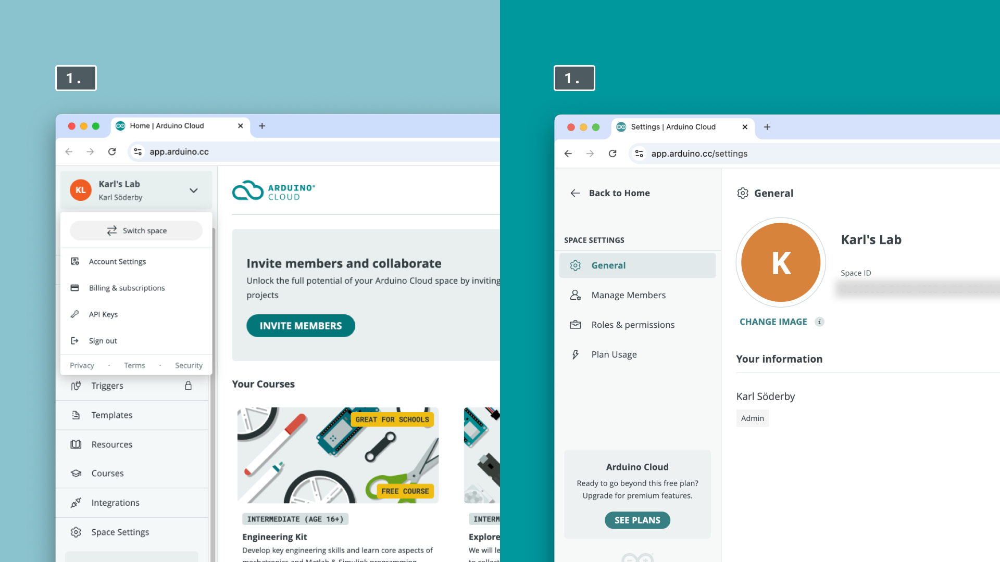
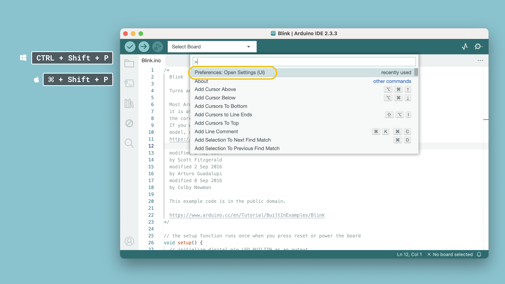
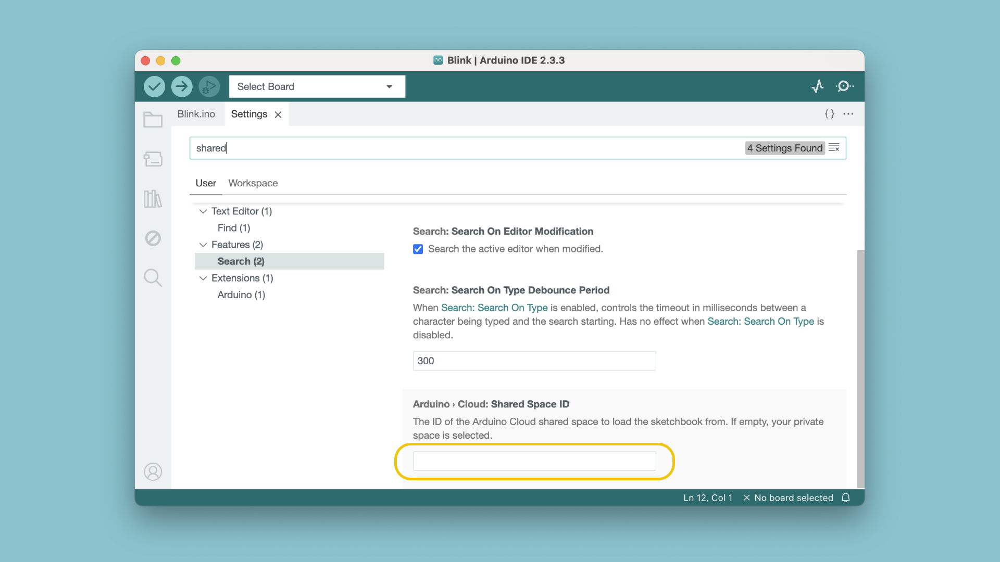
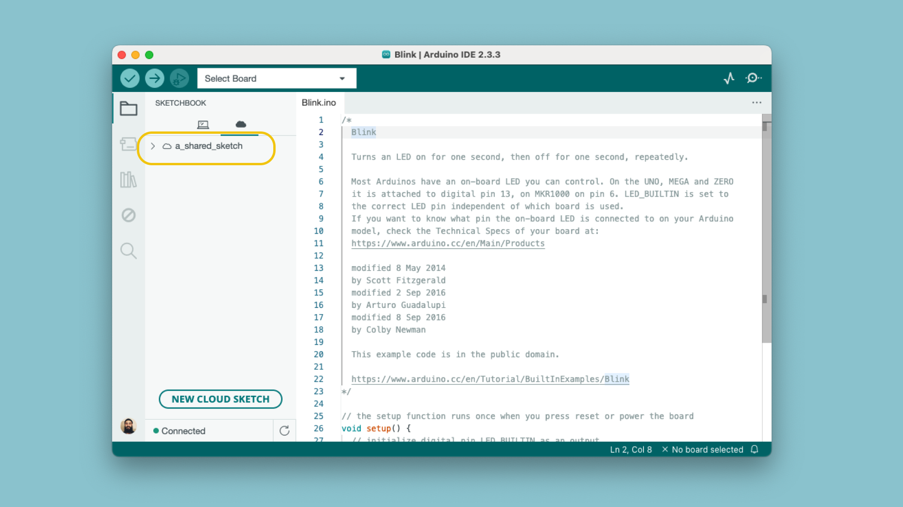

The Arduino IDE can be synchronized with your [Arduino Cloud](https://app.arduino.cc/) account, which can be used to [work on your Cloud sketches from the Arduino IDE](https://docs.arduino.cc/software/ide-v2/tutorials/ide-v2-cloud-sketch-sync/). In the Arduino Cloud, you can also set up shared spaces for collaborating on projects.

In this tutorial, we will learn how to change a setting that allows you to import projects based on a **Space ID**.

***Note that you will need to have a Shared Space already set up to follow this tutorial. Learn more about [shared spaces](https://docs.arduino.cc/arduino-cloud/education/shared-spaces/) in the Arduino Cloud.***

## Requirements

- [Arduino IDE 2 installed](https://www.arduino.cc/en/software).
- [Arduino Cloud](https://app.arduino.cc/) account.

## Retrieve Space ID

1. Log in to your Arduino Account, and navigate to [Cloud App](https://app.arduino.cc/). At the top left bar, click your profile name, select the space, and click on **"Account Settings"**.
2. Copy the ID located under **"Space ID"**.

## Enable Shared Space in IDE

1. Open the Arduino IDE, and open the "Preferences" menu, through the command **⌘ + Shift + P (Mac)** or **CTRL + Shift + P (Windows)**. Open the **"Preferences: Open Settings (UI)"**.
   

2. Search for "shared", and enter your Space ID in the form field.
   

3. Go to your sketchbook, click the Cloud icon, and sketches from the shared space should appear.
   