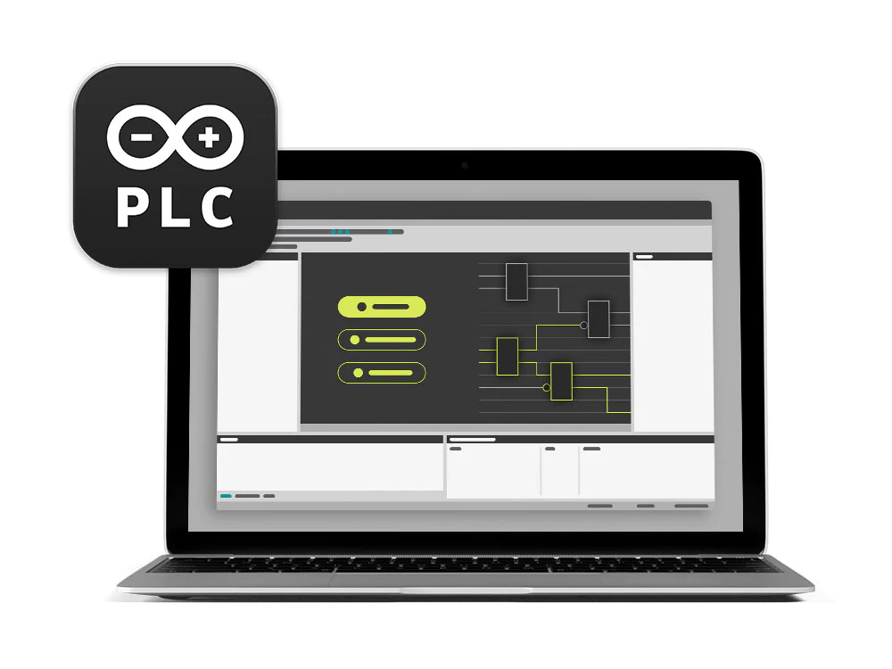
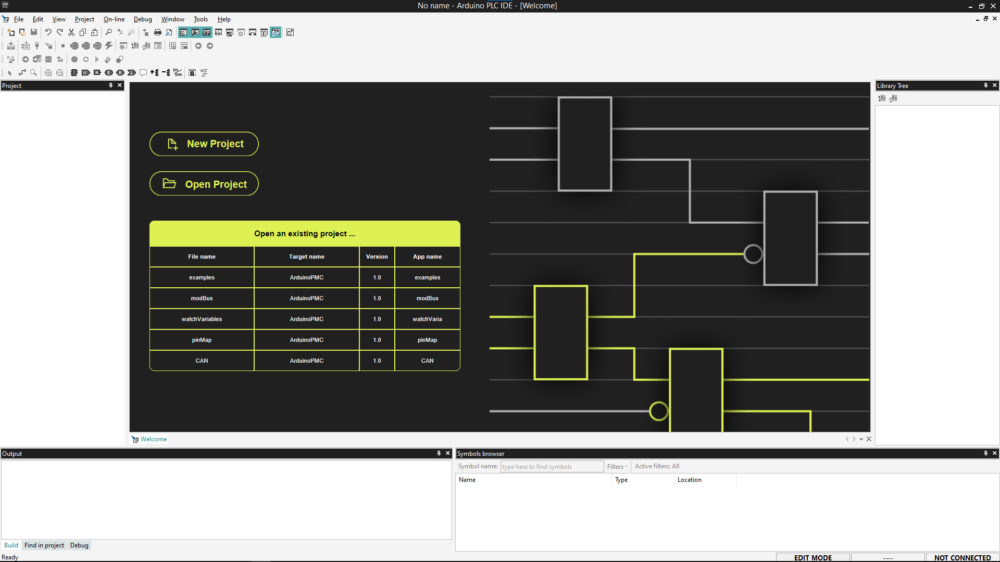
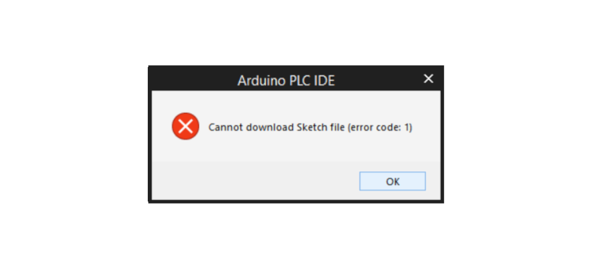
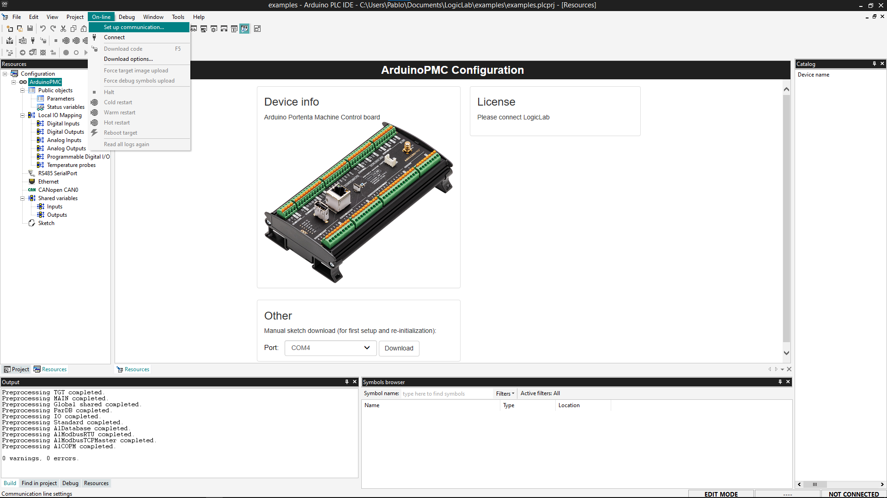
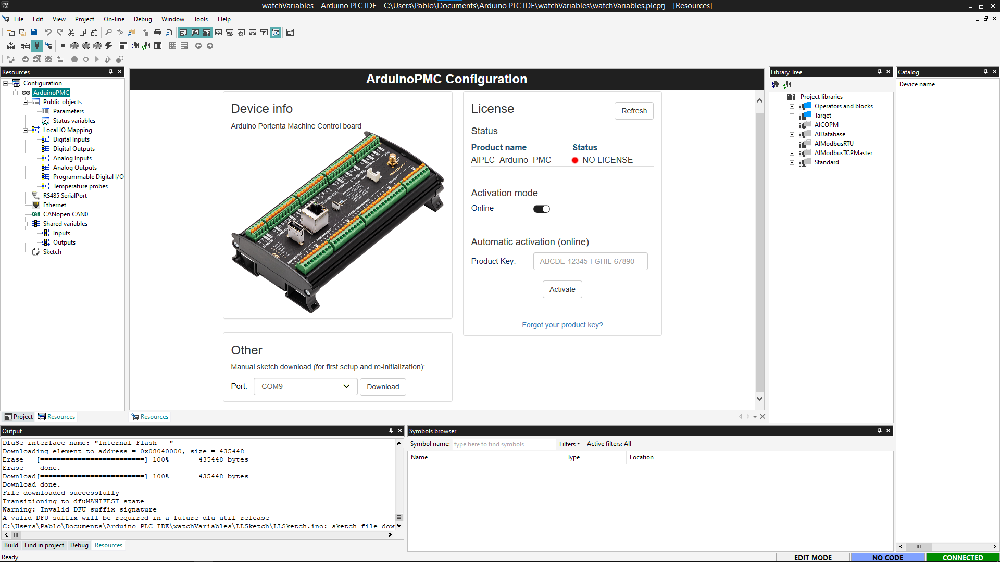
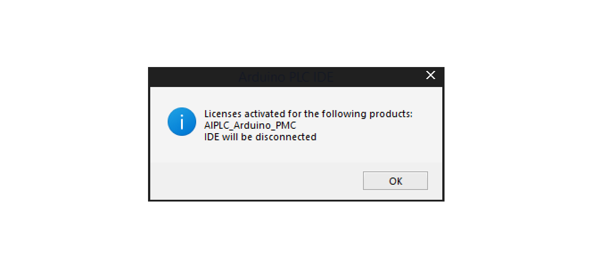
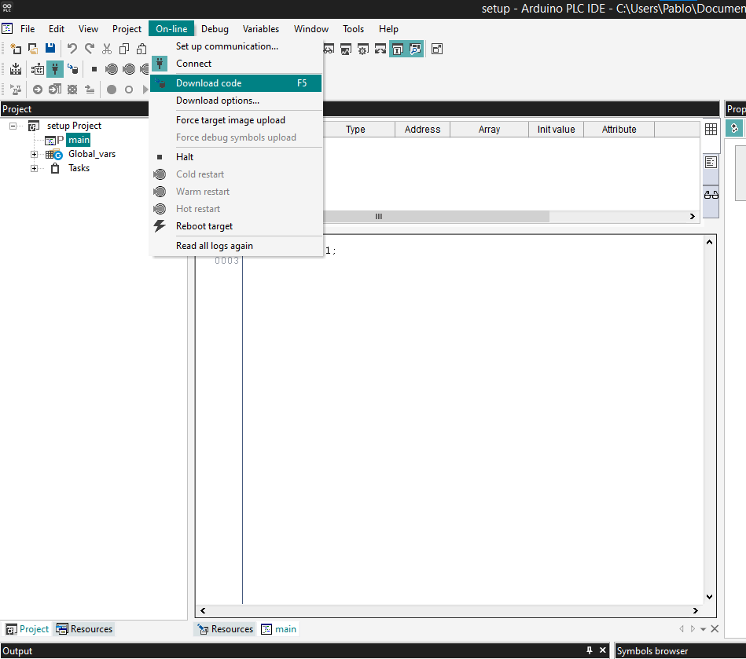

## Overview

The **Arduino PLC IDE** offers the possibility to use **IEC IEC61131-3** programming languages (LD, SFC, FBD, ST, IL) with the **Portenta Machine Control and Opta™**. The PLC IDE offers a comprehensive set of standard features commonly used in industrial automation.

This tutorial will show you how to connect the Portenta Machine Control and Opta™ to the Arduino PLC IDE, learning how to activate the software license and the basic setup to have your board up and running with the **Arduino PLC IDE**.

## Goals

- Set up the Arduino PLC IDE using the Arduino PLC IDE installer
- Download the PLC IDE bootloader to the board
- Establish a connection between your computer and the device using the PLC IDE
- Activate the device license
- Verify the connection between the devices

## Hardware and Software Requirements

### Hardware Requirements

Board compatible with the Arduino PLC IDE:
- [Opta™](https://store.arduino.cc/collections/opta-family)
- [Opta™ Digital Expansion (D1608E/D1608S)](https://store.arduino.cc/collections/opta-family)
- [Portenta Machine Control](https://store.arduino.cc/products/arduino-portenta-machine-control)

The following accessories are needed:
- [USB-C® cable for Opta™](https://store-usa.arduino.cc/products/usb-cable2in1-type-c) (x1)
- [Micro-USB cable for Portenta Machine Control](https://store.arduino.cc/products/usb-2-0-cable-type-a-micro) (x1)

### Software Requirements

- Arduino PLC IDE [Official Website](https://www.arduino.cc/pro/software-plc-ide)
- If you have a [Portenta Machine Control](https://store.arduino.cc/products/arduino-portenta-machine-control), you will need a unique PLC IDE License key for your device. Get your license key [here](https://store.arduino.cc/products/plc-key-portenta-machine-control).
- If you have an [Opta™](https://store-usa.arduino.cc/collections/opta-family), you do not need any license key to activate your product. Go to section [__License Activation With Pre-Licensed Products (Opta™)__](#6-license-activation-with-pre-licensed-products-opta™) to know more.
- [Arduino IDE 1.8.10+](https://www.arduino.cc/en/software), [Arduino IDE 2](https://www.arduino.cc/en/software), [Arduino Cloud Editor](https://create.arduino.cc/editor) or any program with a serial monitor in case you need to retrieve the _Hardware-ID_ of your device.

***To get the Arduino PLC IDE for your device, please visit the [Arduino software page](https://www.arduino.cc/en/software). In case you are using a Portenta Machine Control, you need to acquire a PLC IDE License at the [store page](https://store.arduino.cc/plc-key-portenta-machine-control).***

## Instructions

To get the Arduino PLC IDE software, go to the [official software website of the Arduino PLC IDE](https://www.arduino.cc/pro/software-plc-ide) and choose to download the PLC IDE installer file. The software is named `Arduino PLC IDE Installer`.

The software requires **Windows 10** or a newer operating system version for the x64 architecture.

The Arduino PLC IDE installer contains the IDE and all the required drivers, libraries, and cores. The continuing sections will help you install the Arduino PLC IDE software properly.

***Before installing the Arduino PLC IDE 1.0.6, remove both the PLC IDE 1.0.3 and PLC IDE Tools 1.0.3 from Windows using the "Add or remove programs" tool. Also, remove the folder "T" found on the directory (C:&#92;Users&#92;<your username\>&#92;AppData&#92;Local&#92;T).***

### 1. Arduino PLC IDE Setup

When you download the Arduino PLC IDE installer, the file naming scheme is as follows:

`Arduino-PLC-IDE-Installer_X.X.X_Windows_64bit`

If you have the correct IDE software, its name should include the version format `X.X.X`. For instance, a version example might look like `1.0.6`. Thus, a complete installer name should resemble the following:

`Arduino-PLC-IDE-Installer_1.0.6_Windows_64bit`

Run the Arduino PLC IDE installer after verifying that the installer naming scheme follows the above software nomenclature. It helps ensure the software package is legitimate and the latest version available.

***__To ensure a smooth and reliable installation, it is recommended to temporarily disable any antivirus software and run the installation with administrative privileges.__ During the installation, you may notice several terminal windows opening automatically. These are necessary for the installation process to load all required resources onto your computer successfully, so there is no need to be concerned.***

The installation process starts with a window that prompts you to begin. Click **Install** to proceed:

The installation will begin with the **PLC IDE Tools**. Click **Next** to continue:

Select a directory for installing the **PLC IDE Tools** and then click **Next**:

Click **Install** to install the **PLC IDE Tools** in the chosen directory:

Following the **PLC IDE Tools** installation, set up the **PLC IDE software** by choosing an installation directory and following the instructions:

A confirmation window will indicate the completion of the **PLC IDE software** installation:

Once the installation is finished, a message will appear confirming the successful setup. Click **Close** to exit the installer:

***If you encounter any issues using the software after installation, restarting your computer can help ensure that all drivers, libraries, and dependencies are properly integrated and updated with the IDE installation. Should the issue persist, you may retry the installation process by temporarily disabling any antivirus software and running the installation with administrative privileges if you haven’t had a chance to do that yet.***

Open the Arduino PLC IDE program, and the welcome screen will greet you.

The following sections will guide you through creating a project, downloading the runtime, and properly interfacing the Portenta Machine Control or Opta™ with its dedicated license activation procedure.

***Before using the PLC IDE with your Opta™ or Portenta Machine Control device, ensure proper memory partitioning using the latest Arduino Mbed OS board core (version 4.3.1 or higher) and libraries. Memory partitioning ensures your device is configured with the intended default settings for optimal PLC IDE functionality. Please refer to the [__Memory Partitioning for Use with the Arduino IDE tutorial__](https://docs.arduino.cc/tutorials/opta/memory-partitioning/) for more information.***

### 2. Project Setup

Create a new project by clicking the middle **New project ...** button or **File > New Project**.

After creating the project, there are some new windows on the screen; click on the left panel and switch it to the **Resources tab** inside the window on the tree structure. Now click on your board, it will open the **Boards configuration page**.

### 3. Download the Runtime

The board needs to run a specific program (runtime) to interact with the **PLC IDE**. Go to the **"Other"** section below the **"Device Info"** block.

Plug your device to the computer, select your board's Serial Port, and click the **Download** button.

***Download the runtime every time you update the PLC IDE from a previous version.***

***The device will display two Serial Ports: the default port, typically with the lowest number, and the secondary port, usually with the highest number. The default port is the usual Serial port and a virtual port for Modbus communication between the device and your computer. If the default port with the lowest number cannot establish a connection, please note the port number assigned to the secondary port, as it will be needed in a subsequent step.***

If the following message appears during the download procedure, double-tap the reset button using the tip of a pen or a similar pointed object. The LED above the reset button for Opta™ or the Digital Outputs LEDs for Portenta Machine control will start blinking, indicating that the device is ready to be flashed with new firmware. Click the **Download** button to begin the process again.

***If you persistently experience issues during the download procedure or related processes, try launching the PLC IDE with __administrative privileges__. This can help resolve permission related problems that may prevent download procedures or device interactions.***

### 4. Connect to the Device

After the runtime is up and running, set up the communication by going to **On-line > Set up communication**.

On the new popup window, open the properties of the Modbus protocol.

Ensure the Modbus protocol uses the default Serial port number as the initial option, the Modbus Virtual port you noted before. Use the secondary Serial port number number for additional devices or those with higher Serial number series if applicable. Press OK.

Click OK to save the settings and press the connect button on **On-line > Connect**.

### 5. License Activation with Product Key (Portenta Machine Control)

If the communication is successful, the main panel will show the license section to be filled in and a status indicator.

#### Online Activation

To use your product license, paste the key in the blank next to **Product Key** and press the **Activate** button.

After you click the **Activate** button, the IDE will bind the license to the hardware ID. A popup telling you to reboot the target (which is the device connected to the PLC IDE) will show up; press the reset button of your device to reboot.

Once the product has been activated, getting the **Hardware-ID** of your device is recommended.

#### Offline Activation

To activate the product **Offline**, deselect the "Online" slider, and the scenario below will show up:

Follow the instructions provided using our Contact [form](https://www.arduino.cc/en/contact-us) and generate the **Activation Request File**.

Once you receive the **Activation file**, drag and drop the file in the dashed rectangle or select it from the folder where it is stored to complete your Offline Activation.

### 6. License Activation with Pre-Licensed Products (Opta™)

When a product is **Pre-licensed**, the following scenario will be displayed:

Make sure your device is already connected to the computer and click the **Activate PLC Runtime** button, the product activation will be completed, and the PLC **Status** will be set as OK:

Now, the product is ready to be used with the PLC IDE.

### 7. Activation Recovery

In case the hardware is being reflashed and the key got lost, the license can be recovered just by clicking the "**Forgot your Product Key?**" button:

The IDE will then connect to a server, validate the hardware, and recover the activation, showing a confirmation popup when done:

### 8. Getting the Hardware-ID of Your Device

The hardware ID of your device is an important number to save in case you have problems with the divide or your PLC IDE license. To get the unique Hardware-ID of your device, follow the next steps:

- Be sure that your device is disconnected from the Arduino PLC IDE
- Open the **Arduino IDE** software
- Go to **Tools** > **Board** > **Arduino Mbed OS Portenta Boards** > **Arduino Portenta H7 (M7 Core)**
- Go to **Tools** > **Port** to select the proper port (the default one shown before in the PLC IDE inside the **Arduino PMC Configuration** > **Other** section)
- Go to **Tools** > **Serial Monitor** and reset the board. Look at the end of the boot report to find the "Hardware-ID" and store it in a safe place.

### 9. Download a Program

Let's download and run the first program on your device. We are going to use the default program that is included in a project: a counter.

Double-click on the file _main_ inside the _Project_ to see the counter program. To download that program to your PLC, you must compile it and send it to the target device.

### 10. Communication Test

Open the **Watch** window by clicking "View > Tool Windows > Watch". It will attach a new window on the right side called **Watch**. This window shows the real-time variables value.

To add a variable to be watched, click the **Insert new item** button inside the window. It will open a popup window; on the name label, insert "cnt" and click OK on the location "main". It will add the variable `cnt` from the `main` program on the table or drag and drop the `cnt` variable from the **Project** tree or from the **Main** program.

Select the **Watch** window and click on the **Start/Stop watch button** unless the variable's value is already getting updated.

## Conclusions

In this tutorial, we went through how to set up the Portenta Machine Control or Opta™ with the Arduino IDE lab, learned how to connect the board to the program through Modbus, activate the hardware license of your product, and create a simple sketch with one variable that went compiled and downloaded inside the board. Finally, we learned how to see the values of the variables in real time using the **Watch** window.

You can create professional solutions now that your board is running with the Arduino PLC IDE.