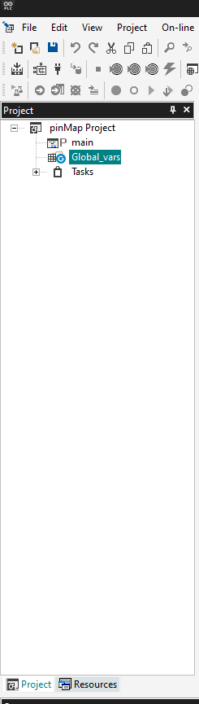
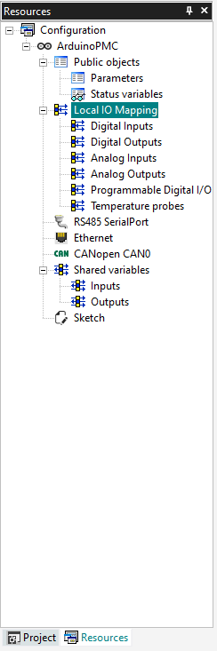
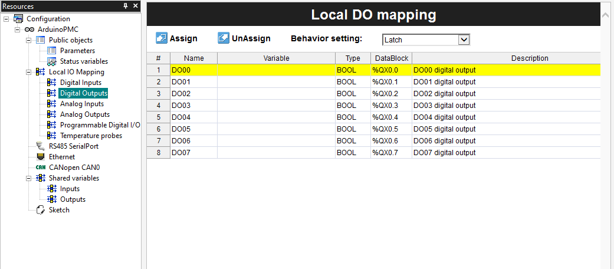
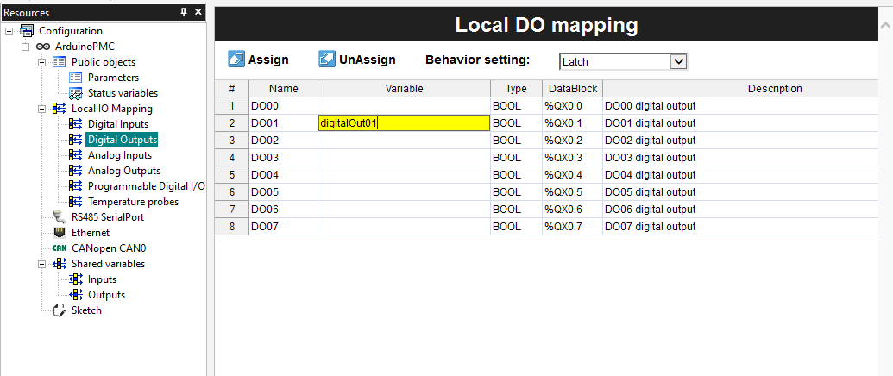
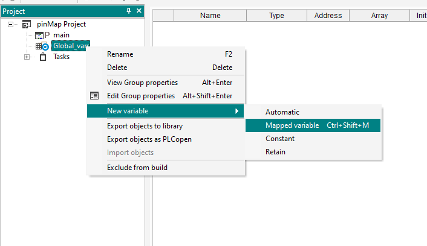
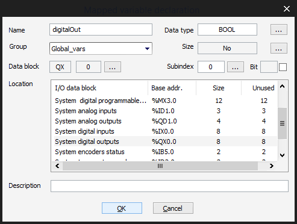
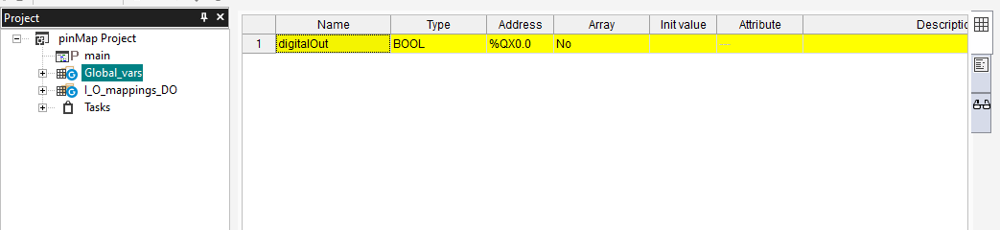

## Introduction

In this tutorial you will see how to access the available pins of your device as variables, you will create a **Pin Map Table**, configure it and interact with the pins from your PLC programs.

### What Is A Map Table

A **mapping table** is a table that **links** a **source**, like the memory address of an I/O, and its **target name** which functions as an alias. For example, if a microcontroller has an I/O with the name `PA01`, a mapping table can be used to access that resource with the name `digitalOut01`.

***If you are familiar with the C languages, it is similar to the way a pointer works.***

Using **mapping tables** makes your programs easier to read, which is always a good practice for long-term maintenance.

### Required Hardware and Software

- Portenta Machine Control
- Arduino PLC IDE
- 24V DC power source (Needed to supply the Digital Output pins)

***Remember to connect the 24V input on the device to see the status LEDs of the digital outputs. The LEDs indicate if the output is HIGH, which means it is delivering out power. If you do not connect the 24V DC Supply you will not be able to see the state of the pins, as they are being controlled by the microcontroller but they are not delivering power.***

## Create a New Project

First of all, open the **Arduino PLC IDE** and create a new project (or open an existing one).



## Create Map Tables

### Resources Tab

Navigate to the **Resources** tile window and you will see a list of the available mappings for your device. In the case of the **Portenta Machine Control** you have:
* Digital Inputs
* Digital Outputs
* Analog Inputs
* Analog Outputs
* Programmable Digital I/O
* Temperature Probes



### Table (Pin Map)

Each element of the table contains the **Variable** cell to define a variable in which the data or status of the pin is going to be stored.



### Assign New Variables

To create a variable for a **pin map** you have two options:
* Create a single variable for a single pin
* Create a bool array to contain multiple pins

***By default they are not available as variables, in any case, you can get the values by accessing their memory registers, which is not as easy as having variables with the data.***

#### Single Variable
<br></br>

Double-click the **Pin Map** that you want to edit, for example, the **Digital Output table**.

To assign a new variable you can type the name on the variable column, if it is new it will be automatically created if it exists it will change its value to the pin's state.

We will assign to the **Digital Output pin 2** the name **`digitalOut01`**



To interact with the digital output pin you can use this code:

```cpp
// Set the Digital Output 01 to HIGH

digitalOut01 := 1;
```

#### Array
<br></br>

Go to your project tile window, and right-click on the **Global Variable** element.

Navigate to **New Variable > Mapped Variable**.



Now on the popup menu, you can set the name of the variable, then select the type of pins that are going to contain scroll on the **Location** section, and you will see several types of pins, we will select the **System Digital OUTPUTS** and name it as **`digitalOut`**.





As it is an array you will be able to access its pin in a **For loop** like the following:

```cpp
// Set all the Digital Outputs to HIGH

FOR pinNumber := 0 TO 7 DO
    digitalOut[pinNumber] := 1;
END_FOR;
```

## Next Steps

Now that you've learned how to assign Pin Maps, you could:
* Make a blink program with the digital outputs
* Map the temperature probes pins and get the temperature of your environment

## Troubleshooting

* If you do not see the LED of the digital output channel change when you follow this tutorial, make sure you have connected the power supply with 24V DC on the 24V Input pins