## Overview

The Arduino Portenta Machine Control (PMC) is a fully-centralized, low-power, industrial control unit. For equipment and machinery control, industrial communication protocols, such as Modbus RTU over RS-485 and Modbus TCP/IP over Ethernet, can be implemented in the PMC. In this tutorial, we will learn about how to get started on how to configure the Modbus communication with the Arduino PLC IDE.

## Goals

- Configure the Modbus communication (RTU and TCP)

## Required Hardware and Software

- [Arduino Portenta Machine Control](https://store.arduino.cc/products/arduino-portenta-machine-control) board
- [Arduino PLC IDE](../../../../software/plc-ide) license

## Set Up

In order to configure the Portenta Machine Control you will need to connect to the device through the Arduino PLC IDE.

1. Connect the device to the computer through USB
2. Click "Connect to the target" button on the PLC IDE

***The device needs to be activated with a license, check the steps on the [PLC IDE Set-up tutorial](./plc-ide-setup-license)***

***Both Modbus RTU and Modbus TCP can run at the same time in parallel***

## Configure The Modbus RTU Communication

***Important: Once you use the Modbus Mode to Master/Slave the RS-485 ports will be only dedicated to Modbus, so the RS-485 protocol is not accessible while using Modbus***

### Modbus RTU Configuration

Inside the Arduino PLC IDE navigate to the left side panel and click on the "Resources" tab.

To configure the Modbus communication click on the "RS485 Serialport" label, it will open a new window in the middle to customize:

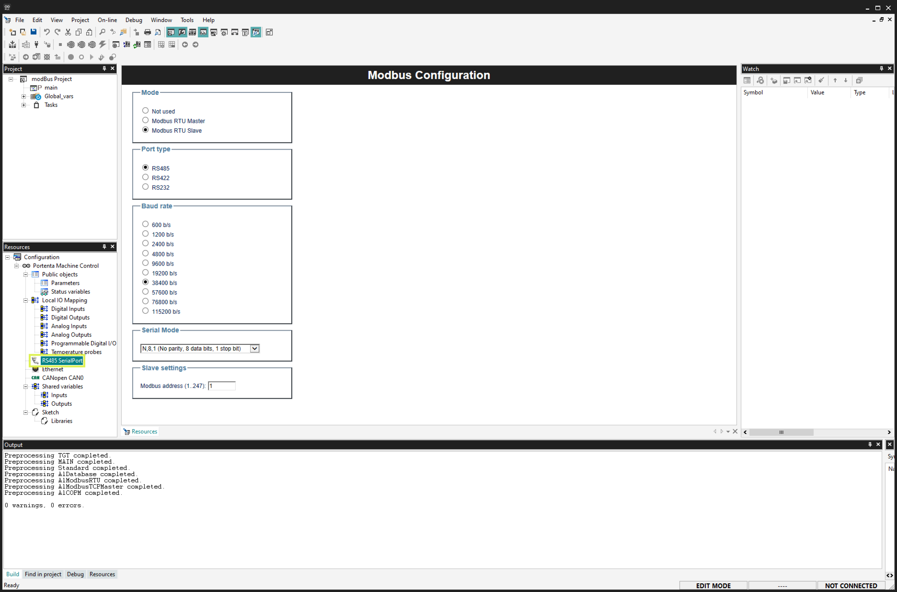

Then you can attach some functions to the Generic Modbus item, they will appear also in the **Catalog Tile Window**, you need to select first the **Generic Modbus_01**

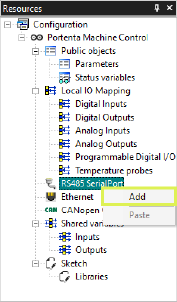

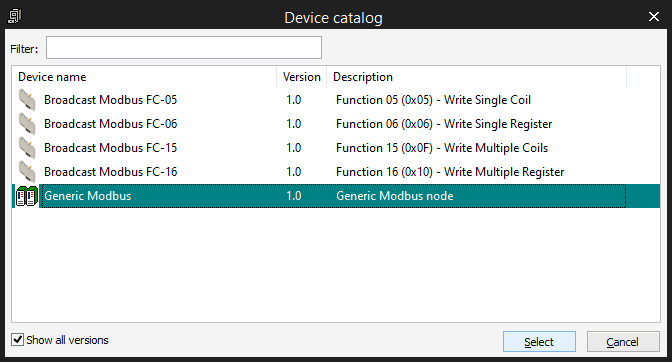

#### Mode
  

* Not used
* Modbus RTU Master
* Modbus RTU Slave

#### Baud Rate
  

Baud rate, options:
  * 600
  * 1200
  * 2400
  * 4800
  * 9600
  * 19200
  * 38400
  * 57600
  * 115200

#### Serial Mode
  

| Name    | Parity      | data bits | stop bits |
| ------- | ----------- | --------- | ----------|
| N, 8, 1 | No parity   | 8         | 1         |
| E, 8, 1 | Even parity | 8         | 1         |
| O, 8, 1 | Odd parity  | 8         | 2         |
| N, 8, 2 | No parity   | 8         | 2         |
| O, 8, 2 | Odd parity  | 8         | 2         |

#### Slave Settings
  

(Only available on slave mode)

* Modbus address
  Address of the device: from 1 to 247. It can not be repeated within the same Modbus net.

#### Modbus Node Configuration
  

Once you have configured your device as a **Modbus Master** you can attach some blocks to configure it, you can see them while you have the **RS485 SerialPort** on the **Catalog Tile Window**
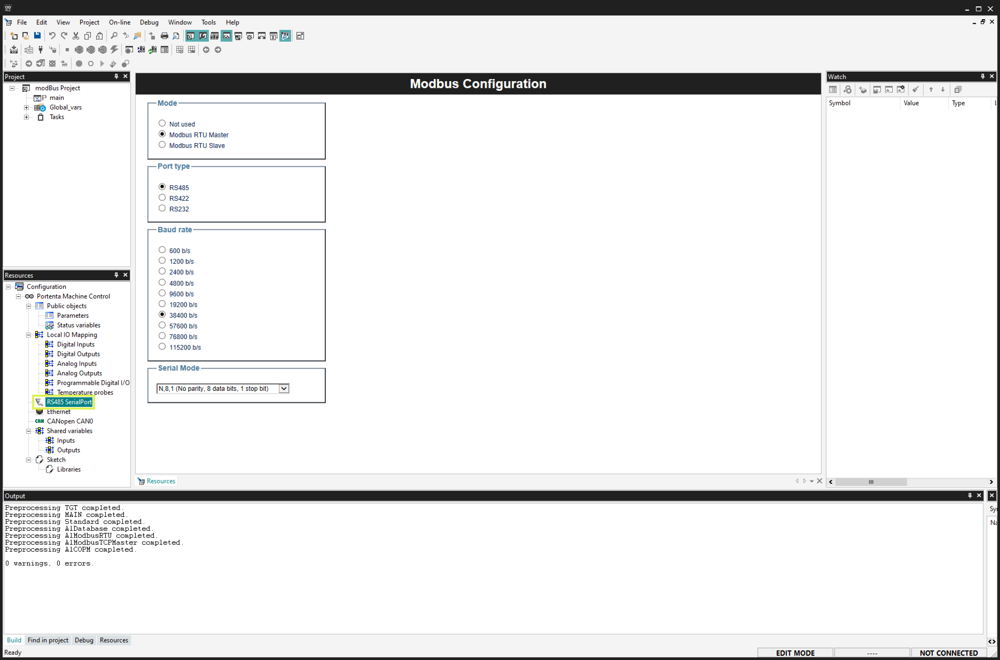

* Generic Modbus
  Configure the device name, Modbus address and the minimum polling time.

### Modbus TCP Configuration

***Important: Once you use the Modbus Mode, the Ethernet port will be only dedicated to Modbus, so the Ethernet protocol is not accessible while using Modbus***

Inside the Arduino PLC IDE navigate to the left side panel and click on the "Resources" tab.

To configure the Modbus communication click on the "Ethernet" label, it will open a new window in the middle to customize:

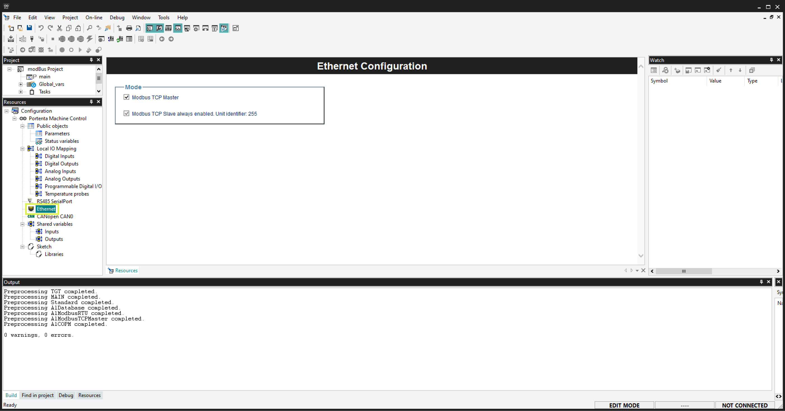

* Modbus TCP Master: Enables the Master mode on the TCP bus (Modbus)
* Modbus TCP Slave: Always enabled, address 255

Then you can attach some functions to the Generic Modbus item, they will appear also in the **Catalog Tile Window**, you need to select first the **Generic Modbus device**

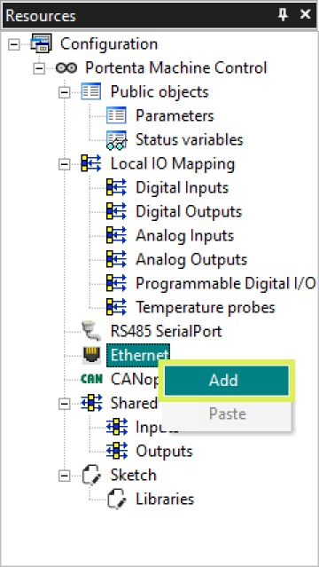

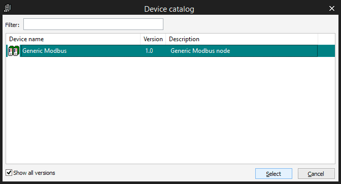

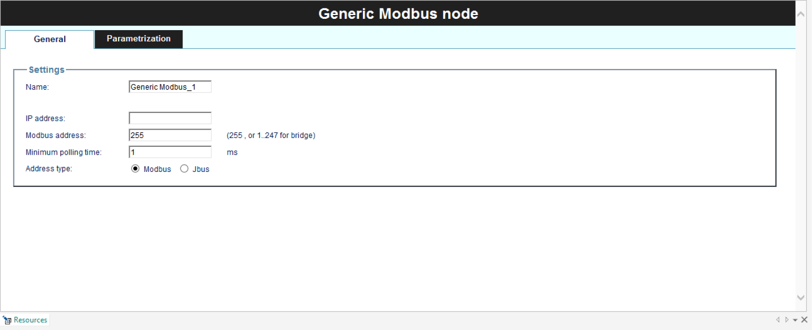

Settings:
* Name
* IP address
* Minimum polling time

## Modbus Parametrization

On the Generic
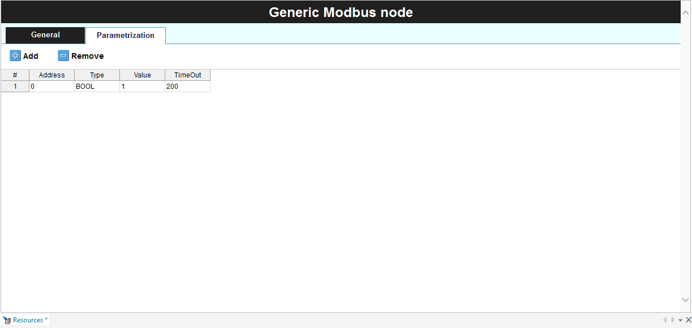

## Modbus Devices Functions (Modbus FC)

* Modbus FC-01: This will read the status of the coils (digital outputs)
* Modbus FC-02: Reads the discrete inputs
* Modbus FC-03: Reads the holding registers
* Modbus FC-04: Read the input registers
* Modbus FC-05: Writes single coil state
* Modbus FC-06: Write single register
* Modbus FC-15: Write multiple coils
* Modbus FC-16: Write multiple registers

To configure the block you can click on it and it will show the configuration panel on the main window.
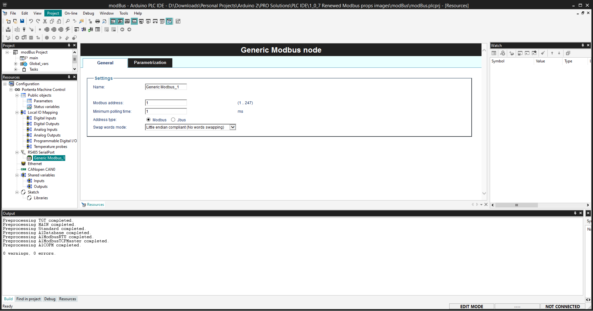

Inside each of the "devices" (functions) you can set its:
**General**
* Start address
* Polling time
* Time Out

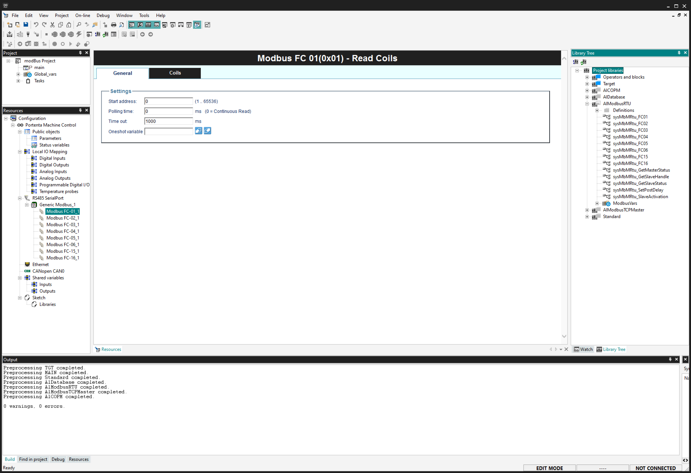

**Coil/Register/Table**
This is a table to link all the coils, registers or variables that the function is going to poll/write.

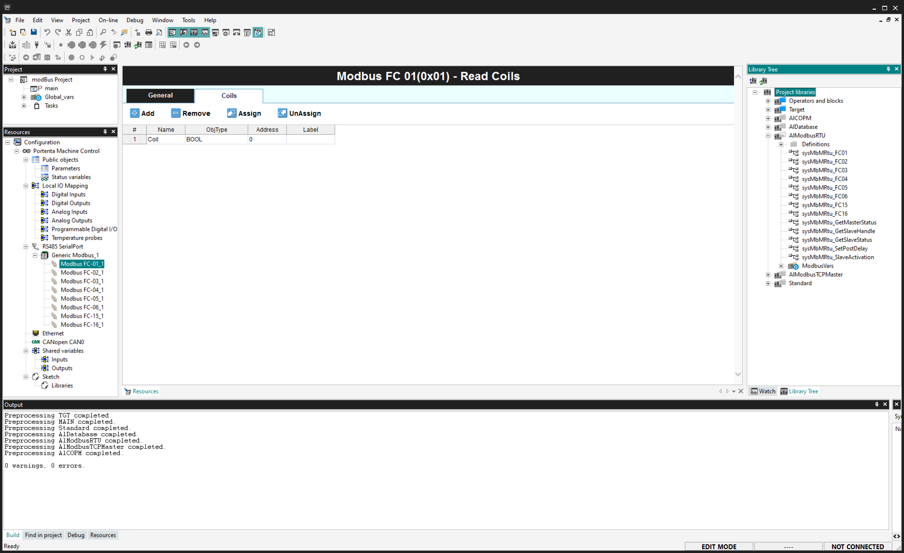

### Next Steps

- Configure it as a Modbus Master device and connect a Modbus sensor to get data from it.
- Interconnect two Portenta Machine Control boards and create a sketch to communicate between them.
