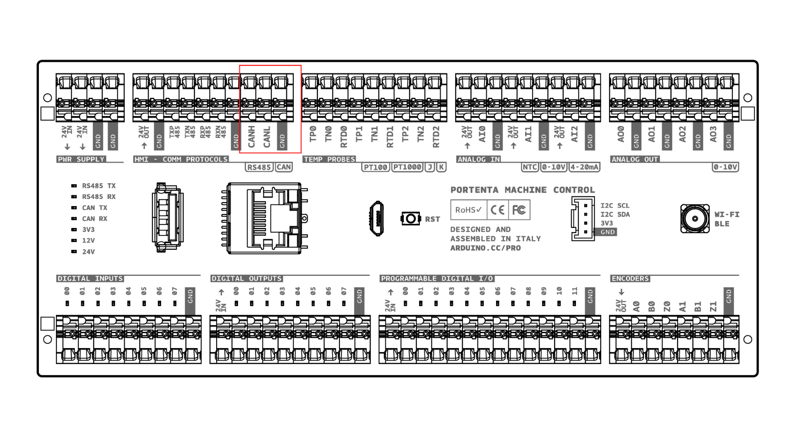
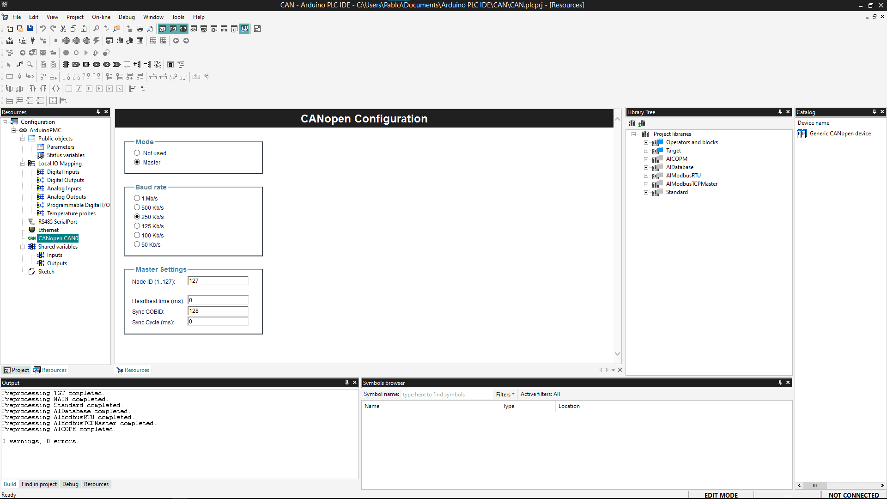
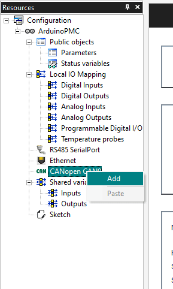
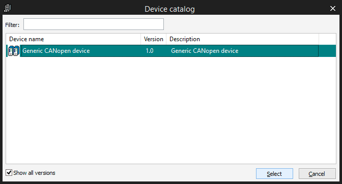
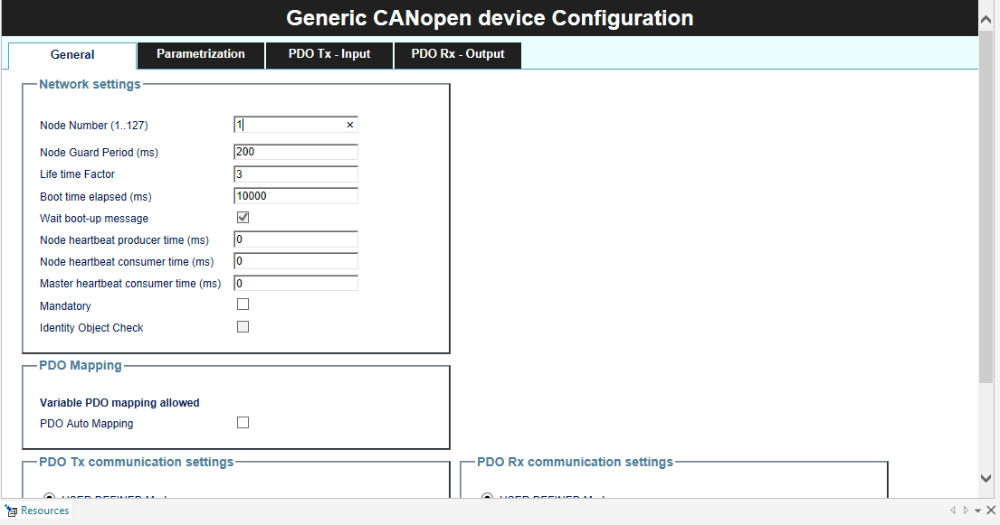
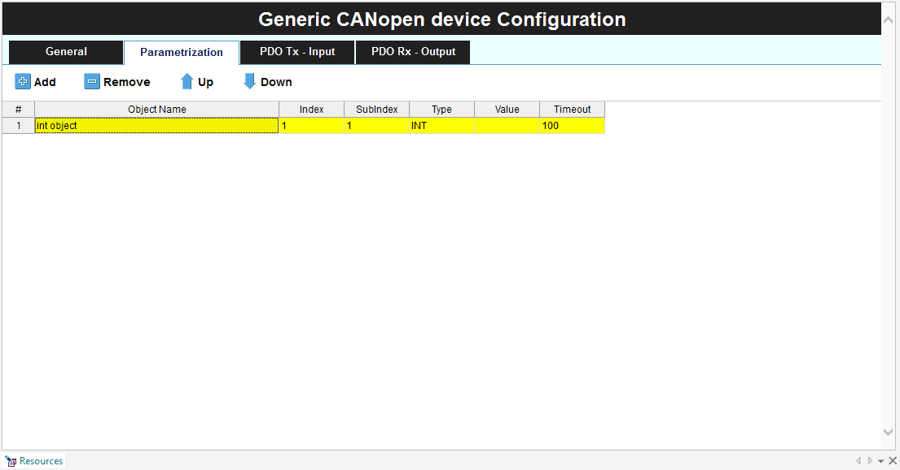
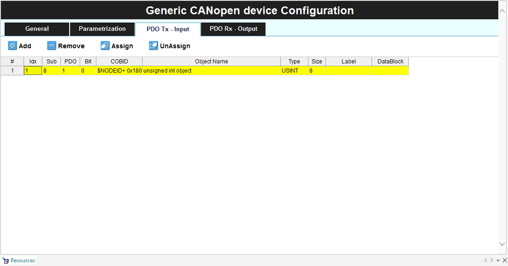
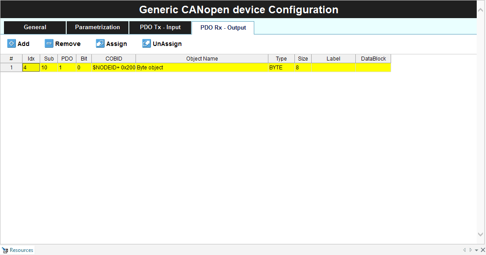

## Overview

The Arduino Portenta Machine Control has the **TJA1049T** CAN transceiver which allows to use the **Controller Area Network (CAN) protocol** communication.

### What Is CAN

CAN is the acronym used for Controlled Area Network. This protocol was developed to be used on automotive and industrial applications to communicate with precise and critical demanding sensors.

The main advantages of the CAN bus protocol are:

* **Reduced wiring:** The CAN communication only uses two wires, creating a bus communication where all the devices of the network are connected. This is a huge advantage for industrial applications, like the automotive one, where we can connect all the electronic components of a car to the same network using only two wires, saving cost, materials, and simplifying the programming and manufacturing process.

* **Fast speed communication:** The CAN protocol is one of the most used communication protocols in the industry not only for its simplicity but also for its speed rates.

* **Strength and reliability:** Thanks to the twisted pair cables and the differential signal between them, the CAN bus protocol protects the data against electrical noise in industrial environments keeping the critical information safe and without data losses.

Structure of a CAN network:
* **Main device:** Main controller or orchestrator of the communication. It interacts with the rest of the devices on the network, sending and receiving data from them. It usually is a controller device like the Portenta Machine control.
* **Node or ECU (Electronic Control Unit):** Devices capable of interacting on the data bus. Although every device on the network can listen to the data that is being transferred on the bus each device has a unique number (ID) to communicate with that is included in every message, ignoring the messages that do not match their ID. However, all the nodes have access to the messages of the network, being possible for a node to read and use the data from another node if necessary.

CAN has built-in error detection so the application can handle its own errors in case of data loss (like CRC).

## Goals

- Set up the Portenta Machine Control with the Arduino PLC IDE
- Configure the CAN communication inside the IDE

## Required Hardware and Software

- [Arduino Portenta Machine Control](https://store.arduino.cc/products/arduino-portenta-machine-control) board
- [Arduino PLC IDE](../../software/plc-ide) license

## Set Up

### Software

In order to configure the Portenta Machine Control you will need to connect to the device through the Arduino PLC IDE:

1. Connect the device to the computer through USB
2. Click "Connects to the target" button on the PLC IDE

***The device needs to be activated with a license, check the steps on the [PLC IDE Set-up tutorial](./plc-ide-setup-license)***

### Hardware

In order to use the CAN communication, you will need to:
1. Supply the board with 24V DC, through the 24VIn and GND
2. Connecting the CANH, CANL, and GND with a CAN Device

## Enable The CAN Communication

Inside the Arduino PLC IDE navigate to the left side panel and click on the "Resources" tab.

### CANopen Configuration

To configure in depth the settings you need to add the **Generic CANopen device** from the item's catalog.

Once the **Generic CANOpen device** has been added you can customize the configuration to comply with your needs.

{/*
Below, you will find an enumeration of the options located in each of the CAN configuration tabs and windows.

#### Network Settings Tabs

* Node number
* Node Guard Period(ms)
* Life time factor
* Boot time elapsed
* Wait boot-up message
* Node heartbeat producer time
* Node heartbeat consumer time
* Master heartbeat consumer time
* Mandatory
* Identify Object Check

#### PDO Mapping

* PDO Auto Mapping

#### PDO Tx Communication Settings Tab
Modes:
* User Defined Mode
* Sync Mode
* Event mode
* Cyclic mode

#### PDO Rx Communication Settings Tab
Modes:
* User Defined Mode
* Sync Mode
* Event Mode
*/}

### Parametrization Tab

This window allows to create objects and set the addresses, this is called a mapped variable table.

### PDO Tables

This table customizes the PDO (Process Data Object) dictionary, so you will set the variables for the information that you want to have usually cause they are time-critical, any device can overwrite those addresses, so it acts like shared variables.

You can edit the table by adding or removing new variables. You can also assign and unassign existing variables on your programs (Global Variables) to this table.

#### PDO Tx Input Tab

#### PDO Rx Output Tab

### Next Steps

Now that you have completed the setup of the Portenta Machine Control and its CAN bus communication with the Arduino PLC IDE, you can continue with:
- Plug a CAN sensor to your device and get its data.
- Expand your CAN bus network with more nodes sending and receiving messages from each one of them.