## Overview

The *Arduino PLC IDE* offers multiple possibilities to expand the connectivity of your industrial applications. Integrating the PLC IDE with the *Arduino Cloud* allows you to create advanced HMI for your professional solutions that can be controlled in real time in multiple ways and on multiple devices.

This tutorial will guide you through integrating and using the *Arduino Cloud* with the *Arduino PLC IDE*. You will learn to connect your compatible devices and create a compact, Cloud-connected application using Opta™.

## Goals

- Understand how the Arduino Cloud and the PLC IDE work together for seamless data exchange.
- Learn how to set up the workspace environment on the PLC IDE for use with the Arduino Cloud.
- Program a device using Opta™ as an example of integrating the PLC IDE and Arduino Cloud.

## Hardware and Software Requirements

### Hardware Requirements

- [Opta™ WiFi](https://store.arduino.cc/products/opta-wifi) (x1)
- [USB-C® cable](https://store.arduino.cc/products/usb-cable2in1-type-c) (x1)
- Analog sensor (Optional)

### Software Requirements

- [**Arduino PLC IDE Installer**](https://www.arduino.cc/en/software#arduino-plc-ide)

- If you have an Opta™, you do not need any license key to activate your product. Go to section [__License Activation With Pre-Licensed Products (Opta™)__](https://docs.arduino.cc/software/plc-ide/tutorials/plc-ide-setup-license#7-license-activation-with-pre-licensed-products-opta) to know more.

- The [**Arduino Cloud**](https://cloud.arduino.cc/) will be required to perform remote actuation and status monitoring via Wi-Fi® connectivity using the sketch provided in the following section. If you do not have an account, you can create one for free inside [**cloud.arduino.cc**](https://cloud.arduino.cc/home/?get-started=true).

- To ensure optimal Wi-Fi® connectivity on Opta™, please use the `WiFiFirmwareUpdater` to update to the latest network firmware version. This can be done by going to `Examples -> STM32H747_System -> WiFiFirmwareUpdater` on Arduino IDE 2.X. Additionally, please ensure that you have the latest __Arduino Mbed OS Opta Boards__ version, which can be checked under `Boards Manager`.

- [PLC IDE & Arduino Cloud integration example project](assets/Opta_PLCIDE_Cloud.zip) file compatible with Opta™

***This tutorial requires the latest version of the PLC IDE ( >= v 1.0.6 ). You can get the latest versions [here](https://www.arduino.cc/en/software#arduino-plc-ide). If it is your first time using the Arduino PLC IDE, we highly recommend you begin with [__Arduino PLC IDE Setup & Device License Activation__](https://docs.arduino.cc/software/plc-ide/tutorials/plc-ide-setup-license) tutorial.***

## PLC IDE & Arduino Cloud Integration

In this tutorial, we will use two separate platforms: the **Arduino PLC IDE** and the **Arduino Cloud**. Each tool brings unique features and capabilities that are required to our workflow.

* The [__Arduino PLC IDE__](https://www.arduino.cc/pro/software-plc-ide) integrates the capability to use **IEC IEC61131-3** programming languages, which are Ladder Diagram (LD), Sequential Function Chart (SFC), Function Block Diagram (FBD), Structured Text (ST), and Instruction List (IL). All these languages can be used with Opta™.

  
  These PRO solutions include a wide set of standard features to develop industrial automation or advanced applications. You can find more tutorials related to the PLC IDE at [the Arduino documentation page](https://docs.arduino.cc/software/plc-ide), and the latest version of the software can be [downloaded here](https://www.arduino.cc/en/software#arduino-plc-ide).

* The __IoT Cloud__ is a platform that allows users to deploy IoT applications with ease and control parameters at any given moment. The platform provides robust security characteristics, of which Opta™ takes advantage to provide secure industrial application deployments. You can find more about Arduino Cloud [here](https://docs.arduino.cc/arduino-cloud/).

### Understanding the Process

The PLC IDE supports seamless integration with Arduino Cloud, enabling IoT capabilities for its compatible devices. Thanks to this feature, the application field can be expanded with the needed security elements, ensuring stable industrial operations.

The structure comprises two elements:

* The PLC IDE defines the device program with its connectivity settings and designed tasks.
* The Arduino Cloud processes the exchange of information with the Arduino layer of the PRO solution devices.

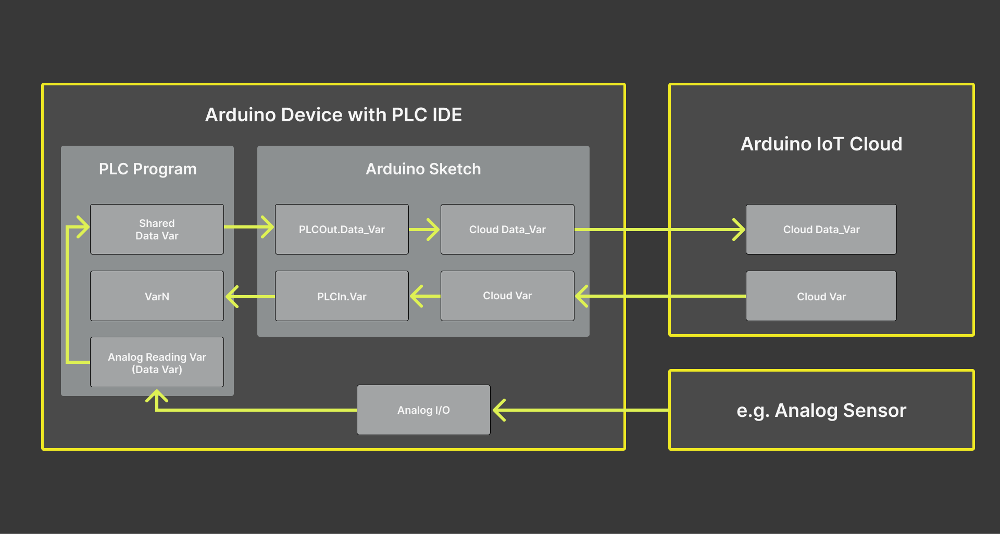

The device is programmed in two layers: The PLC main execution program and the Arduino sketch. To communicate and interchange data safely between these two different program layers, the PLC IDE uses `Shared variables` between these two layers.

The functions of each layer are:

* The **PLC program layer** will manage internal communication and data handling. It can be programmed to read sensor information obtained via selected Modbus protocol or available I/O pins and then, use that data to send to or receive from the Arduino sketch layer.

* The **Arduino sketch** will handle data exchange between the PLC program layer and the Arduino Cloud platform. The methods are __PLCOut.varname__ and __PLCIn.varname__, which are used to access the shared variables. For the purpose of the tutorial and to easily classify these methods, we will replace the `varname` with the `Shared_variable` tag.

Therefore, the __PLCOut.Shared_Variable__ and __PLCIn.Shared_Variable__ methods manage the shared variables that facilitate the communication between the two systems:

  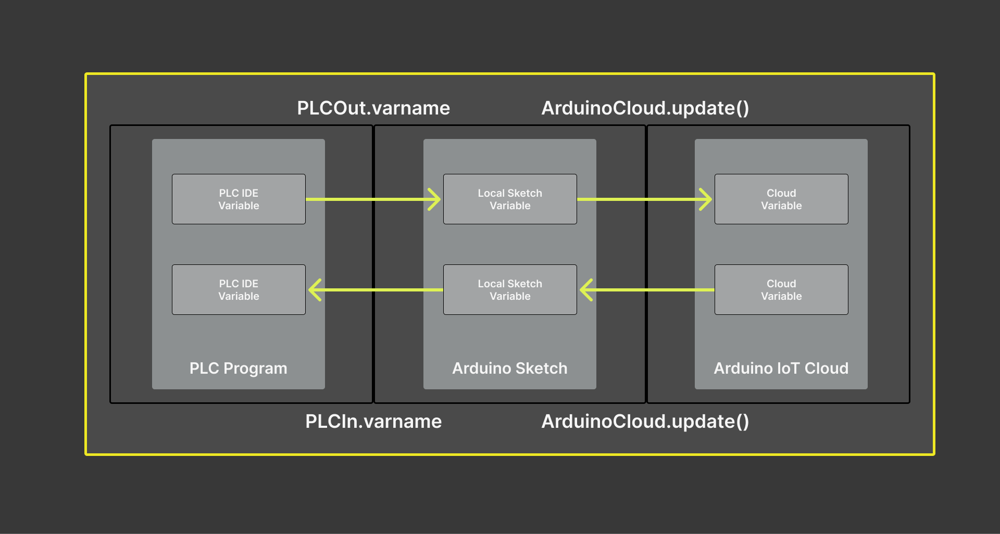

  - __PLCOut.Shared_Variable__: This variable refers to the data sent from the PLC program layer to the Arduino sketch layer, which will be sent to the Arduino Cloud. 
  
    In other words, it represents the outputs from the PLC program. It could be sensor readings, status information, or any other data the PLC program is designed to generate and share.

  - __PLCIn.Shared_Variable__: This variable refers to the data sent to the PLC from the Arduino sketch layer received from the Arduino Cloud platform. 
  
    These are inputs for the PLC program. It could be commands, configuration data, or other information the Arduino Cloud system sends to control or interact with the PLC.

In most industrial IoT applications, the PLC program layer will directly control machinery or processes based on its programming. At the same time, the Arduino Cloud platform will be used as an HMI for operators, analytics, and remote control capabilities. The `Shared_Variables` commands allow in both cases real-time communication between these two layers.

## Example Implementation

A demonstrative example will be used to show how both features are integrated. The example will consist of an Arduino Cloud dashboard and a PLC IDE project file configured for an Opta™ device.

Opta™ will be programmed to execute the following actions:

- Send analog readings and counter values from the device to the Arduino Cloud.
- The user programmable LED of Opta™ will be controlled via an interactive button found within the Arduino Cloud dashboard, which can later be designed to trigger certain actions.

The following diagram shows the main steps to connect Opta™ to the Arduino Cloud using the PLC IDE. In the following sections, you will find detailed instructions on how to perform all these steps.

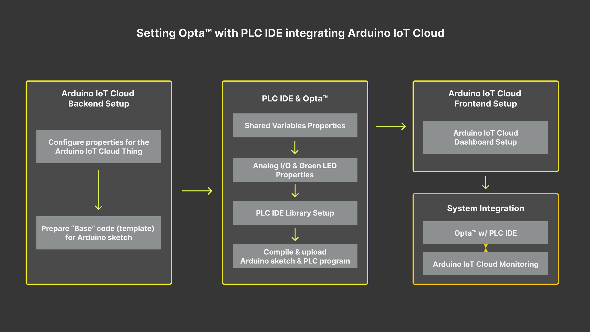

The example implementation comprises the following sequence:

1. [Setting up the Arduino Cloud](#setting-up-the-arduino-iot-cloud)
2. [Setting up the PLC IDE](#setting-up-the-plc-ide)
   1. [Shared variables configuration](#shared-variables-configuration)
   2. [Analog port](#analog-port-configuration) & [user programmable LED](#user-programmable-led-configuration) configuration
   3. [Library management](#library-components)
3. [Setting up the Arduino Cloud dashboard](#arduino-iot-cloud-dashboard)
4. [System integration test](#testing-plc-ide-with-arduino-iot-cloud)

### Setting Up the Arduino Cloud

We will begin by configuring the Arduino Cloud with Opta™ to create a *Thing*. It will have Opta™ registered with Cloud variables and a dashboard configured to perform different actions.

***To learn more about how to use the Arduino Cloud, please take a look at [Getting Started With the Arduino Cloud](https://docs.arduino.cc/arduino-cloud/getting-started/iot-cloud-getting-started) tutorial.***

The following Cloud variables will be created:

| **Cloud Variables** |        **Type**       | **Variable Permission** | **Send Values** |
|---------------------|-----------------------|-------------------------|-----------------|
| analog01            | Float (0 - 65535)     | Read Only               | On change       |
| counter             | Integer (0 - 2500)    | Read Only               | On change       |
| cloudButton         | Boolean               | Read & Write            | On change       |

The Cloud variables will subsequently be linked to the `Shared variables` within the PLC IDE environment to set up the communication pathway. Furthermore, the table displays a full 16-bit resolution range for `analog01`, which can be paired with any chosen analog sensor. The `counter` is set with a default limit of 2500, beyond which the device will reset to `0`. This limit can be adjusted in the PLC program, as elaborated further in this tutorial.

Once the *Arduino Cloud Thing* has been created successfully, we will have something similar to the following image:

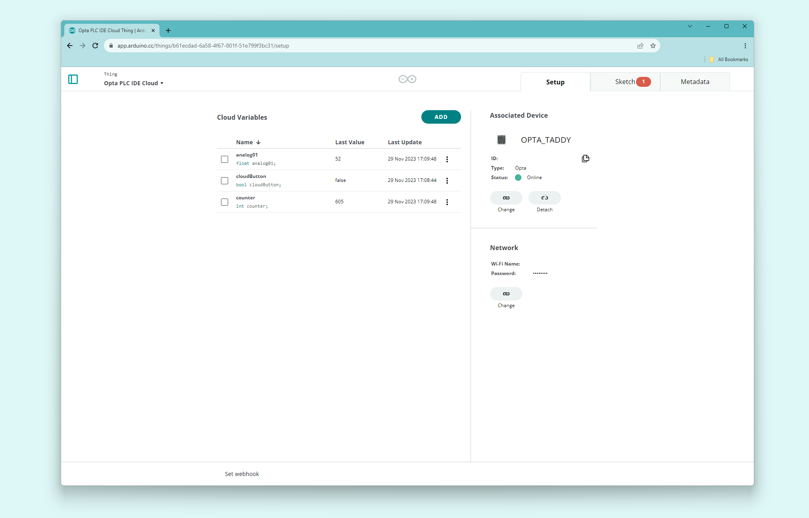

We can now extract the code that will serve as the base for the Arduino sketch for Opta™ in the PLC IDE. The code can be accessed by going to the full editor. It will require some lines from the `ThingProperties.h`.

Please follow: `Things -> "Opta PLC IDE Cloud" Thing -> Sketch -> Open full editor`, of which *Opta PLC IDE Cloud* is the name of your created Thing, to get to the full editor window.

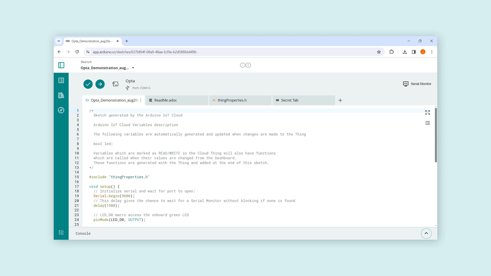

The base sketch of the example will be as follows:

```arduino
#include <ArduinoIoTCloud.h>
#include <Arduino_ConnectionHandler.h>

const char SSID[]     = "SECRET_SSID";    // Network SSID (name)
const char PASS[]     = "SECRET_OPTIONAL_PASS";    // Network password (use for WPA, or use as key for WEP)

void onCloudButtonChange();

float analog01;
int counter;
bool cloudButton;

WiFiConnectionHandler ArduinoIoTPreferredConnection(SSID, PASS);

void setup() {
  // Initialize serial and wait for port to open:
  Serial.begin(9600);
  // This delay gives the chance to wait for a Serial Monitor without blocking if none is found
  delay(1500); 

  // Defined in thingProperties.h
  initProperties();

  // Connect to Arduino Cloud
  ArduinoCloud.begin(ArduinoIoTPreferredConnection);
  
  /*
     The following function allows you to obtain more information
     related to the state of network and IoT Cloud connection and errors
     the higher number the more granular information you’ll get.
     The default is 0 (only errors).
     Maximum is 4
 */
  setDebugMessageLevel(2);
  ArduinoCloud.printDebugInfo();
}

void loop() {
  ArduinoCloud.update();
  // Your code here 
}

void initProperties(){
  ArduinoCloud.addProperty(analog01, READ, ON_CHANGE, NULL);
  ArduinoCloud.addProperty(counter, READ, ON_CHANGE, NULL);
  ArduinoCloud.addProperty(cloudButton, READWRITE, ON_CHANGE, onCloudButtonChange);
}

/*
  Since CloudButton is READ_WRITE variable, onCloudButtonChange() is
  executed every time a new value is received from IoT Cloud.
*/
void onCloudButtonChange()  {
  // Add your code here to act upon CloudButton change
}
```

Save this example template for later. We will now proceed with a demonstrative example to show you how to set up the PLC IDE to be connected to the Arduino Cloud "Thing" we just created.

### Setting Up the PLC IDE

***Before continuing with the PLC IDE configuration with Opta™, please remember to have the latest PLC IDE with its corresponding tools stated within [__Software Requirements__](#software-requirements).***

The PLC IDE configuration will be important in establishing successful communication with the Arduino Cloud. It will require setting onboard features and the communication protocol for Opta™ as usual. However, a proper 'Shared variables' setting will define the communication outcome with the Arduino Cloud.

Thus, you will learn to configure the 'Shared variables' based on the peripherals and tasks you may assign to Opta™.

#### Shared Variables Configuration

The successful communication between Opta™ configured with PLC IDE and Arduino Cloud relies on the **`Shared variables`**. The **`Shared variables`** are defined under `Resources > Opta > Shared variables`, where two additional tabs can be found: *Inputs* and *Outputs*.

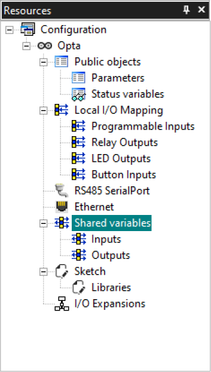

The **Inputs** define the variables that will capture the data from the Arduino Cloud through the local Arduino sketch to Opta™ PLC main program runtime. The Arduino Cloud will send the compilation of variables accordingly.

Subsequently, the user programmable LED will be controlled via the Arduino Cloud dashboard. We will define a variable to be assigned later to update the LED state variable accordingly.

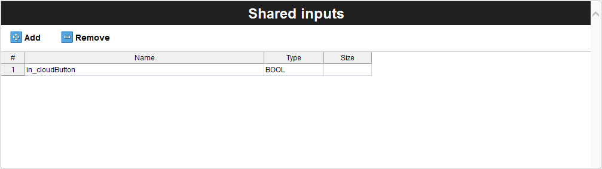

The **`in_cloudButton`** will represent the user programmable LED of Opta™ as a two state variable and indicate an input variable with the **`in`** tag.

The **Outputs** define the variables that Opta™ will send to Arduino Cloud. It is the compilation of variables that you would want to monitor within the Arduino Cloud dashboard.

The analog port reading and the counter value of Opta™ are the information that we want to display on the Arduino Cloud dashboard. It can be programmed to use Modbus-compatible devices and use its information for further development.

The following table shows the variables added to the **`Shared outputs`** table.

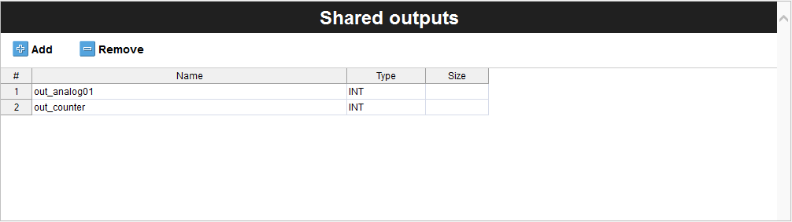

The shared output variables are indicated with an **`out`** tag and represent the following information:

- **`out_analog01`**: Analog port number one reading
- **`out_counter`** : Counter value

The same variable name is used to maintain variable relationship and simplicity with the Cloud variables we have previously defined [here](#setting-up-the-arduino-iot-cloud).

Depending on the project's development requirements, you can add all the variables that will be used to exchange information with the Arduino Cloud.

We will now configure the Opta™ device's features to link all these shared variables.

#### Analog Port Configuration

The analog port is configured using the following properties: `Resources > Opta > Local IO Mapping > Programmable Inputs`.

| **Analog Port** | **Name** | **Variable** | **IOType** | **Type** |
|-----------------|----------|--------------|-------------|----------|
| #1              | I1       | analog01     | Analog      | UINT     |

Opta™ has 8x I/O ports that can be programmed as analog or digital. You will select port number one and assign the **`analog01`** as the variable. The *IOType* must be *Analog*, and the *Type* will update based on selecting the *IOType* property.

The **`Programmable inputs mapping`** table should look as the following image:

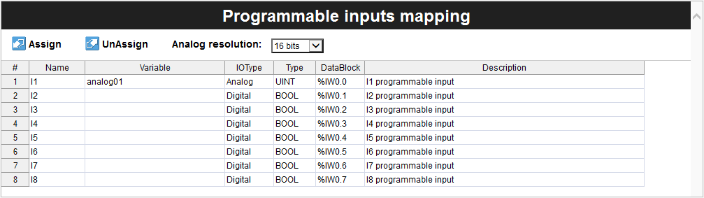

You can also change the analog resolution between 12, 14, or 16 bits if needed.

#### User Programmable LED Configuration

The user programmable LED of Opta™ is configurable under `Resources > Opta > Local IO Mapping > LED Outputs`. To use the user programmable LED, you will need to assign a variable that will represent the 'LB' row, as can be seen in the following image:


In this case, the **`userLed`** is assigned as the variable representing the user programmable LED of Opta™ that emits blue light. The **`userLed`** and the **`in_cloudButton`** are boolean type variables. It will be matched inside the PLC program to pass the boolean state per the command sent from the Arduino Cloud dashboard.

#### Library Components

The Library section is where you can find various pre-written codes or functions specific to PLC operations. It could include libraries for handling several industrial protocols, dealing with specific types of I/O, or even specialized functions for certain control systems. It makes the development process more efficient by providing ready-to-use codes, saving time and effort.

In the context of the PLC IDE, the libraries will need to be added manually under the **`Sketch Libraries`** found within the 'Resources' tab. These libraries are required to manage Arduino Cloud connection, and it is as follows:

| **Library Name**          | **Version** |
|---------------------------|-------------|
| ArduinoIoTCloud           | 1.15.1      |
| Arduino_ConnectionHandler | 0.8.1       |
| ArduinoECCX08             | 1.3.8       |
| ArduinoMqttClient         | 0.1.8       |
| Arduino_DebugUtils        | 1.4.0       |
| Arduino_Portenta_OTA      | 1.2.1       |
| Arduino_SecureElement     | 0.1.2       |

Once the libraries are in place within **`Sketch Libraries`**, we should have a similar table as the following image:

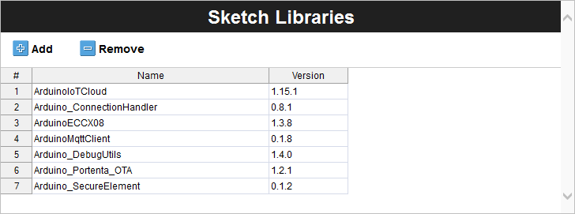

These libraries are indexed. Thus, they are certified to guarantee optimized performance and reliability. Leveraging them will speed up your development process and increase the robustness of your applications for industrial environments. It may seem like an extra step, but it will help you keep code cleaner, more reliable, and more maintainable.

***For more information about managing libraries inside PLC IDE, please have a look at ["Library Management"](https://docs.arduino.cc/software/plc-ide/tutorials/plc-programming-introduction#library-management) section from the [Programming Introduction with Arduino PLC IDE](https://docs.arduino.cc/software/plc-ide/tutorials/plc-programming-introduction).***

#### Arduino Sketch

We can now build the Arduino sketch that will be used to establish communication with the Arduino Cloud and manage data traffic. The base sketch will be needed and can be found as discussed in the ['Setting Up the Arduino Cloud'](#setting-up-the-iot-cloud) section.

Most of the code will keep the same structure contrary to the **`loop()`** and **`onCloudButtonChange()`** functions. It will integrate the 'Shared variables' with the **`PLCOut.Shared_Variable`** or **`PLCIn.Shared_Variable`** to establish information exchange between the device and platform.

Beginning with the **`loop()`** function, we have the following code:

```arduino
void loop() {
  ArduinoCloud.update();
   
  analog01 = PLCOut.out_analog01;
  counter = PLCOut.out_counter;
}
```

The **`loop()`** function periodically updates the **`analog01`** and **`counter`** variables with the shared output variables. The shared output variables are **`out_analog01`** and **`out_counter`**, which are attached to `PLCOut`.

This means that the PLC program, which captures the analog port reading and updates the counter value, is defined to bring the data to the Arduino sketch layer and update the Cloud variables accordingly. The Arduino Cloud dashboard then displays updated information after the **`ArduinoCloud.update()`** method based on the Cloud variables **`analog01`** and **`counter`**.

The **`onCloudButtonChange()`** function is Cloud generated and designed to process similar tasks. The function will be triggered whenever a new value is updated from the Arduino Cloud, and the assigned tasks will be run. In this instance, it will update the user programmable LED of Opta™ whenever a change is detected with the assigned dashboard button.

```
/*
  Since CloudButton is READ_WRITE variable, onCloudButtonChange() is
  executed every time a new value is received from IoT Cloud.
*/
void onCloudButtonChange()  {
  // Add your code here to act upon CloudButton change
  PLCIn.in_cloudButton = cloudButton;
}
```

The process involves assigning the updated Cloud variable value to the **`PLCIn.in_cloudButton`** variable. It will update the shared variables attached to **`PLCIn`**, which is the **`in_cloudButton`**, and pass its value to the PLC program layer updating the status of Opta™.

Consequently, you will have an Opta™ constantly exchanging information with the Arduino Cloud. The complete code for the Arduino sketch is as follows:

```arduino
#include <ArduinoIoTCloud.h>
#include <Arduino_ConnectionHandler.h>

const char SSID[]     = "NETWORK_SSID";    // Network SSID (name)
const char PASS[]     = "NETWORK_PASS";    // Network password (use for WPA, or use as key for WEP)

void onCloudButtonChange();

bool cloudButton;
float analog01;
int counter;

WiFiConnectionHandler ArduinoIoTPreferredConnection(SSID, PASS);

void setup() {
  // Initialize serial and wait for port to open:
  Serial.begin(9600);
  // This delay gives the chance to wait for a Serial Monitor without blocking if none is found
  delay(1500); 

  // Defined in thingProperties.h
  initProperties();

  // Connect to Arduino Cloud
  ArduinoCloud.begin(ArduinoIoTPreferredConnection);
  
  /*
     The following function allows you to obtain more information
     related to the state of network and IoT Cloud connection and errors
     the higher number the more granular information you’ll get.
     The default is 0 (only errors).
     Maximum is 4
 */
  setDebugMessageLevel(2);
  ArduinoCloud.printDebugInfo();
}

void loop() {
  ArduinoCloud.update();
  
  analog01 = PLCOut.out_analog01;
  counter = PLCOut.out_counter;
}

void initProperties(){
  ArduinoCloud.addProperty(cloudButton, READWRITE, ON_CHANGE, onCloudButtonChange);
  ArduinoCloud.addProperty(counter, READ, ON_CHANGE, NULL);
  ArduinoCloud.addProperty(analog01, READ, ON_CHANGE, NULL);
}

/*
  Since CloudButton is READ_WRITE variable, onCloudButtonChange() is
  executed every time a new value is received from IoT Cloud.
*/
void onCloudButtonChange()  {
  // Add your code here to act upon CloudButton change
  PLCIn.in_cloudButton = cloudButton;
}
```

The `NETWORK_SSID` and `NETWORK_PASS` require manual definitions. Please replace these parameters to establish a connection with the desired network. Also, the parameters must be defined between the quotation marks, replacing the `NETWORK_SSID` and `NETWORK_PASS` fields.

#### PLC Program

The Arduino sketch is ready, and now we need a PLC program that will control the onboard features of Opta™ and data readings.

The PLC program will do the following processes:

- Run a linear counter and store to **`cnt`**, and pass the data to **`out_counter`** (Shared variables)
- Reset counter value when it reaches 2500 in its value
- Update the user programmable LED state of Opta™ based on **`in_cloudButton`** (Shared variables)
- Update analog reading on the port number one defined to **`analog01`** and pass it to **`out_analog01`** (Shared variables)

The following code delivers the previous tasks:

```cpp
cnt := cnt + 1;
out_counter := cnt;

IF out_counter >= 2500 THEN
	cnt := 0;
END_IF;

userLed := in_cloudButton;

out_analog01 := analog01;

```

With this PLC program, we are all set to configure the Opta™ device's internal processes and use Arduino Sketch to establish a connection with the Arduino Cloud.

We will set the present PLC program as a 'Fast Task' for good practice. It can be done by adding the **`main`**, the present PLC program we will use, to `Tasks -> Fast` under **`Project`** window tab.

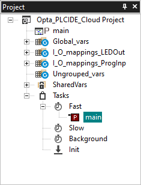

### Arduino Cloud Dashboard

The Arduino Cloud dashboard can be designed to your preference. The following image shows a dashboard example that allows for controlling the user programmable LED and displaying information received from Opta™.

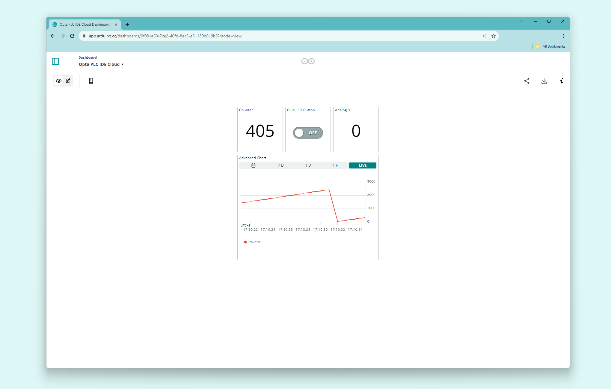

More information about Arduino Cloud & how to create dashboards can be found [here](https://docs.arduino.cc/arduino-cloud/getting-started/dashboard-widgets).

### Testing PLC IDE with Arduino Cloud

The complete example project file for PLC IDE can be downloaded [here](assets/Opta_PLCIDE_Cloud.zip). It is ready to use with Opta™ in the instance at the preferred workspace.

***The first compilation process may take some time to finish. Depending on the environment and hardware, it can take around 7 minutes or more.***

Once we have successfully configured Opta™ with PLC IDE and established communication with the Arduino Cloud dashboard, we have the following tasks in action:

- The Arduino Cloud dashboard displays the analog port number one reading and counter value of the connected Opta™
- The user programmable LED of Opta™ can be controlled using the button found within the Arduino Cloud dashboard

The animation below shows a simple active desktop dashboard:


The mobile dashboard is also available if on-demand monitoring and actuation is needed:


***If Opta™ fails to communicate with the Arduino Cloud after configuration, please use the `WiFiFirmwareUpdater` to update Opta™ with the latest network firmware version.***

## Conclusion

You have now set an Opta™ using PLC IDE and successfully connected to the Arduino Cloud platform. You learned how these tools integrate and can be used to create a simple interface allowing you to oversee the Opta™ device's status. Now that you are more familiar with the PLC IDE and Arduino Cloud environment, you have the base to create HMI interfaces that can be used to control and monitor your Industrial Arduino Pro devices.

### Next Steps

As you progress, feel free to dig into the vast Arduino ecosystem. To better understand the Arduino PLC IDE, consider reviewing the [available tutorials](https://docs.arduino.cc/software/plc-ide).

## Support

If you encounter any issues or have questions while working with the PLC IDE or Arduino Cloud, we provide various support resources to help you find answers and solutions.

### Help Center

Explore our Help Center, which offers a comprehensive collection of articles and guides for the PLC IDE or Arduino Cloud. The Arduino Help Center is designed to provide in-depth technical assistance and help you make the most of your device.

- [Arduino help center page](https://support.arduino.cc/hc)

### Forum

Join our community forum to connect with other PLC IDE and Arduino Cloud users, share your experiences, and ask questions. The forum is an excellent place to learn from others, discuss issues, and discover new ideas and projects related to PLC IDE and Arduino Cloud.

- [The PLC IDE and Arduino Cloud in the Arduino Forum](https://forum.arduino.cc/)

### Contact Us

Please get in touch with our support team if you need personalized assistance or have questions not covered by the help and support resources described before. We're happy to help you with any issues or inquiries about the PLC IDE and Arduino Cloud.

- [Contact us page](https://www.arduino.cc/pro/contact-us)
