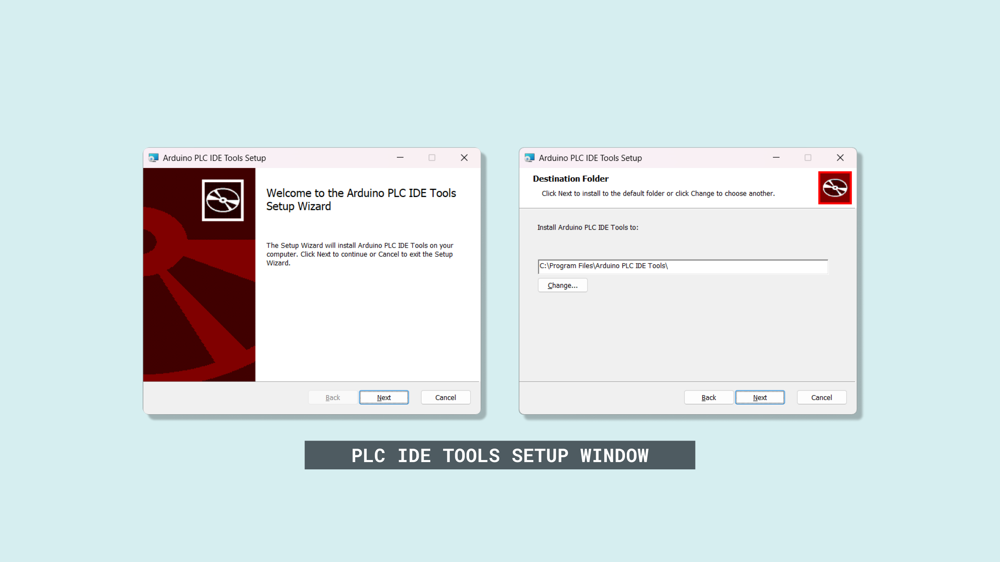
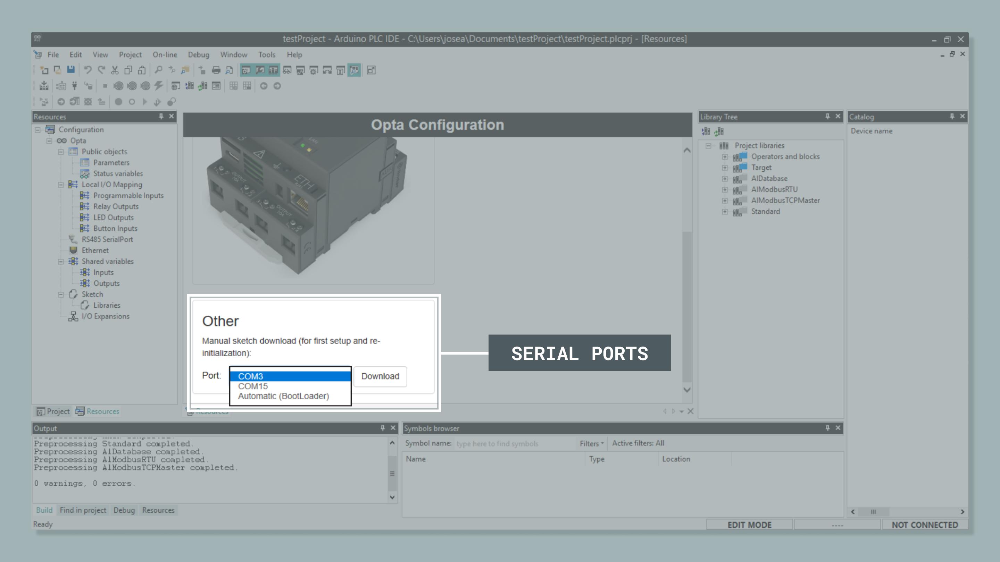
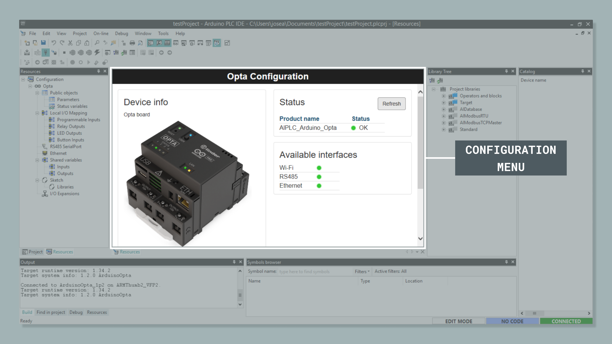

This user manual provides a comprehensive guide to the Arduino PLC IDE, a powerful integrated development environment (IDE) that allows you to program using IEC 61131-3 standard languages. The user manual covers all major software elements, functionalities and features that enable you to create industrial automation solutions with Arduino products.

Through this user manual, you will learn how to set up, configure and leverage the full potential of the Arduino PLC IDE, including its IDE, debugging tools and industrial communication capabilities. Whether you are new to PLC programming or an experienced automation engineer, this guide will help you master the Arduino PLC IDE's features, tools and capabilities.

## Hardware and Software Requirements

### Hardware Requirements

- [Opta™ Lite](https://store.arduino.cc/products/opta-lite), [Opta™ RS485](https://store.arduino.cc/products/opta-rs485), or [Opta™ WiFi](https://store.arduino.cc/products/opta-wifi) (x1)
- [USB-C® cable](https://store.arduino.cc/products/usb-cable2in1-type-c) (x1)
- +12-24 VDC/0.5 A power supply (x1)

***<strong>Note</strong>: While this user manual focuses on Opta™ devices, the PLC IDE also works with other Arduino Pro products like the [Portenta Machine Control](https://store.arduino.cc/products/arduino-portenta-machine-control), the Opta™ Analog Expansion ([A0602](https://store.arduino.cc/products/opta-ext-a0602)) or the Opta™ Digital Expansions ([D1608E](https://store.arduino.cc/collections/pro-family/products/opta-ext-d1608e) and [D1608S](https://store.arduino.cc/collections/pro-family/products/opta-ext-d1608s)).***

### Software Requirements

- [Latest release of the PLC IDE installer file](https://www.arduino.cc/en/software#arduino-plc-ide)
- Windows 10 or newer (64-bit)
- Administrator account privileges

***<strong>Important</strong>: Before installing the latest release of the PLC IDE, ensure that any previous versions (including the PLC IDE Tools) are completely uninstalled using Windows "Add or remove programs" tool. Additionally, delete the "T" folder located in C:\Users<your username>\AppData\Local\T.*** 

## PLC IDE Overview

The Arduino PLC IDE combines the well-known Arduino ecosystem with professional PLC development tools to create a complete environment for industrial automation programming. Its foundation lies in full support for the IEC 61131-3 standard, offering developers five essential programming languages:

- Ladder Diagram (LD)
- Functional Block Diagram (FBD)
- Structured Text (ST)
- Sequential Function Chart (SFC)
- Instruction List (IL)
  
Each language serves specific programming needs in the automation field, allowing developers to select the most suitable approach for their automation tasks. A distinctive strength of the PLC IDE is how it bridges PLC programming with traditional Arduino sketches, allowing developers to work in both environments at once. This integration means you can share variables and functions between your PLC programs and Arduino code, creating more flexible and powerful automation solutions.

PLC IDE handles complex timing requirements through its support for deterministic cyclic tasks and multitasking capabilities, ensuring precise control over critical industrial processes where timing accuracy is essential. For industrial networking, the PLC IDE provides integrated fieldbus support through its no-code configurators. These tools simplify the setup of three key industrial communication protocols:

- Modbus RTU
- Modbus TCP
- CANopen

Development efficiency is enhanced through an extensive collection of pre-installed function blocks and libraries. Developers can use these ready-made components directly or create custom libraries to meet specific project requirements. The development environment also provides a comprehensive suite of debugging tools:

- Live debug mode for real-time operation monitoring
- Oscilloscope for detailed program analysis
- Watch windows and breakpoints for precise debugging
- On-line program changes without halting execution

This combination of features creates a development environment that serves both rapid prototyping needs and professional industrial applications. The PLC IDE makes complex automation tasks more approachable while maintaining the robustness required for industrial systems, supporting developers of all experience levels in creating reliable automation solutions.

## PLC IDE Software Installation and Configuration

The installation and configuration process of the PLC IDE involves three main steps: installing the latest release of the software, establishing connection with your Opta™ device and activating your license. This section guides you through each step to ensure a proper setup of the PLC IDE with your Arduino hardware.

### First Setup and Initialization

The PLC IDE installation process begins with [downloading the correct installer file](https://www.arduino.cc/en/software#arduino-plc-ide). The installer follows a specific naming convention that helps you verify you have the right version. The file name structure is:

- `Arduino-PLC-IDE-Installer_X.X.X_Windows_64bit`

where `X.X.X` represents the version number (for example, `1.0.7`). This naming scheme helps ensure you are installing a legitimate and up-to-date version of the software. 

***PLC IDE is only compatible with Windows. It does not support MacOS or Linux-based computers.***

Before starting the installation process, there are two **important considerations** to ensure a correct setup process:

- Temporarily disable any antivirus software in your computer
- Run the PLC IDE installer file with administrative account privileges

During the installation process, you will notice several terminal windows opening automatically. **This is a normal part of the process** as the installer file loads necessary resources onto your computer. The installation proceeds through several steps:

#### Initial Setup

Launch the installer by double-clicking the downloaded file; when the PLC IDE installer welcome window appears, click **Install** to begin after reading and agreeing the license terms and conditions. The installation process starts with installing the PLC IDE Tools.

#### PLC IDE Tools Installation

Click **Next** at the welcome screen, then choose an installation directory for the PLC IDE Tools. Click **Install** to proceed with the PLC IDE Tools installation.

#### Main Software Installation

After the PLC IDE Tools installation process completes, the main PLC IDE software setup begins. Select an installation directory and follow the on-screen instructions to complete the installation process. A confirmation window will appear when the process finishes. Click **Close** to exit the installer.

The PLC IDE welcome screen indicates that your PLC IDE installation is complete and ready for the next configuration steps. 

#### Installation Process Troubleshooting

After installation, you can launch the PLC IDE to see the welcome screen. If you encounter any issues with the software, try these troubleshooting steps:

- Restart your computer to ensure all drivers and dependencies are properly integrated
- If problems persist after restarting your computer, reinstall the PLC IDE after disabling antivirus protection and running the installer file with administrative privileges

### Opta™ Connection to your Computer

After installing the PLC IDE software, you can connect your Opta™ device to your computer. Connect your Opta™ device directly to your computer using a [USB-C® cable](https://store.arduino.cc/products/usb-cable2in1-type-c), preferably to a USB port on your computer rather than through a USB hub. If you are using an external power supply, verify it meets the specifications of +12-24 VDC/0.5 A before connecting it to your Opta™ device.

### Project Setup

After installing and configuring your PLC IDE, you can begin creating your first project. The PLC IDE provides an intuitive interface for project creation and configuration.

#### Creating a New Project

You can create a new project using one of the following methods:

- Click the **New project...** button located in the center of the PLC IDE welcome screen
- Navigate to **File > New Project** in the menu bar

The **New project** window allows you to configure several important project parameters:

- **Project Name**: Define a unique **name** for your project
- **Project Location**: Select the **directory** where your project will be stored
- **Target Hardware**: Choose the specific Arduino **hardware** you will use in your project
- **Case Sensitivity**: Enable this option to enforce exact case matching in project names (uppercase and lowercase letters are treated as distinct). This is useful when managing directories with similarly named files.

Create a new project with the name `testProject`. This is the project we are going to use on the following sections of the user manual.
  
#### Initial Project Configuration

Once you create a new project, the PLC IDE will display several new windows. To configure your board settings:

- Locate the left panel of the PLC IDE interface
- Navigate to the **Resources tab** in the tree structure
- Select your board to open the **Board Configuration** page

This configuration page provides access to essential board settings and parameters that you will need for your project development.

### Runtime Program

Before you can begin programming your board, you need to install the runtime program that enables communication between your device and the PLC IDE.

#### Runtime Program Installation

Follow these steps to install the runtime program on your Opta™:

- Navigate to the board configuration page
- Locate the **Other** section below the **Device Info** block
- Select the correct Serial Port for your Opta™ device from the dropdown menu
- Click the **Download** button to begin the runtime program installation

***<strong>Important</strong>: You must reinstall the runtime program whenever you update to a new version of the PLC IDE.***

#### Serial Port Configuration

When connecting your device, you'll find two Serial port options in the system as shown below:

These ports serve different purposes:

- **Primary port (usually the lowest number)**: Functions as the standard Serial communication port and serves as a virtual port for Modbus communication. This should be your first choice for connection. 
- **Secondary port (usually the highest number)**: Serves as a backup communication port if the primary port fails to connect. May be required for specific configuration scenarios. 

***<strong>Note</strong>: If you cannot establish a connection through the primary port, make note of the secondary port number for future reference. You will need this information in later configuration steps.***

#### Troubleshooting Runtime Program Installation

If you encounter the following error message during the runtime installation:

- `Cannot download Sketch file (error code: 1)`

Try the following:

- Locate your Opta's reset button
- Using a pen tip or similar pointed object, double-tap the reset button

The LED above the reset button will begin blinking as shown in the image below, meaning that your Opta™ device is in **bootloader mode**.

Once you see the LED indication, click the **Download** button to restart the installation process. When the runtime program installation completes successfully, you will see a confirmation message in the **Output** window as shown in the image below. 

***<strong>Tip</strong>: For persistent installation issues, try running the PLC IDE with administrative privileges. This can often fix permission-related problems that interfere with the runtime installation or device communication.***

### Opta™ Connection to the PLC IDE

After installing the runtime program in your Opta™, you need to establish communication between the PLC IDE and your device. This section guides you through the connection process and the communication settings.

#### Setting Up Communication

To configure the connection settings:

- Navigate to **On-line > Set up communication** in the menu bar
- In the communication setup window (_DeviceLinkManager Config_), locate and select the **Modbus protocol**
- Click on **Properties** to configure the Modbus settings

#### Configuring the Modbus Protocol

When configuring the Modbus protocol in the Modbus configuration window (_Modbus Config_), consider the following:

- Use the primary Serial port (lowest number) as your default communication port
- This port serves as the **Modbus Virtual port** you noted during the runtime program installation
- For additional devices or those with higher Serial number series, use the secondary port number

***<strong>Note</strong>: The Serial port number used here must match the one you used during the runtime program installation.***

#### Establishing Connection

After configuring the communication settings:

- Click **OK** to save the Modbus protocol settings
- Click **OK** again to close the communication setup window
- Navigate to **On-line > Connect** to establish the connection of PLC IDE with your device

The configuration page will indicate when the connection is successful as shown in the image below:

Note that the **available interfaces** shown in the image will vary depending on your specific Opta™ variant. The example above displays the interfaces for an [Opta™ WiFi](https://store.arduino.cc/products/opta-wifi) variant. 

***<strong>Tip</strong>: If the connection fails, verify that you are using the correct Serial port number and that your device's runtime program is properly installed.***

### Hello World Example

Before exploring the advanced functionalities of the PLC IDE, let's begin with the default counter program that comes with every new project. This serves as the `Hello World` program for the PLC IDE. This example will help you understand the basic workflow of programming and monitoring your Opta™ device with the PLC IDE.

#### Running the Hello World Example

The default project structure includes a basic counter program that demonstrates core PLC IDE functionalities. To access and run this program:

1. Locate the `main` file in your **Project** window as shown below:

2. Double-click on the `main` file to open the counter program in the editor window:

3. To run the program on your Opta™ device, you must first **compile** it:

- Navigate to **Project > Compile** in the menu bar
- Alternatively, press **F7** as a shortcut

4. After successful compilation, **download** the program to your Opta™ device:

- Navigate to **On-line > Download code** in the menu bar
- Alternatively, press **F5** as a shortcut

***<strong>Note</strong>: Ensure your device is properly connected before attempting to download the program.***

If the download process was done successfully, you should see no error messages on the **Output** window and a message on it indicating that it is connected to your Opta™ device, as shown in the image below.

#### Monitoring the Hello World Example

The PLC IDE provides real-time monitoring capabilities through its **Watch** window. To access the Watch window, navigate to **View > Tool windows > Watch** in the menu bar as shown in the image below. This will open a new window on the right side of the PLC IDE called **Watch**. This is the window that the PLC IDE uses to show the real-time value of variables defined in your programs.

To add variables to monitor, first click the **Insert new item** button in the **Watch** window.

In the popup window that appears (_Add item to watch window_), enter `cnt` in the **Symbol name** field and select `main` as the **Location** field.

In the next popup window that appears (_Debug windows list_), Select **Watch** from the available debug options of the PLC IDE.

Click **OK** to confirm and add the variable to the Watch window.

***<strong>Tip</strong>: You can also add variables to be monitored by dragging them from the Project tree or the Main program directly into the Watch window.***

**Monitoring the Hello World Example:**

The PLC IDE provides real-time monitoring capabilities through its **Watch** window. To access the Watch window, navigate to **View > Tool windows > Watch** in the menu bar as shown in the image below. This will open a new window on the right side of the PLC IDE called **Watch**. This is the window that the PLC IDE uses to show the real-time value of variables defined in your programs.

To add variables to monitor, first click the **Insert new item** button in the **Watch** window.

In the popup window that appears (_Add item to watch window_), enter `cnt` in the **Symbol name** field and select `main` as the **Location** field.

In the next popup window that appears (_Debug windows list_), Select **Watch** from the available debug options of the PLC IDE. Click **OK** to confirm and add the variable to the Watch window.

***<strong>Tip</strong>: You can also add variables to be monitored by dragging them from the Project tree or the Main program directly into the Watch window.***

Automatically the monitoring should start, if not, select the **Watch** window and click the **Start/Stop Watch** button to begin monitoring. The value of `cnt` will update in real-time.

