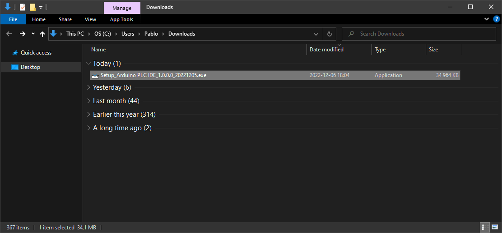
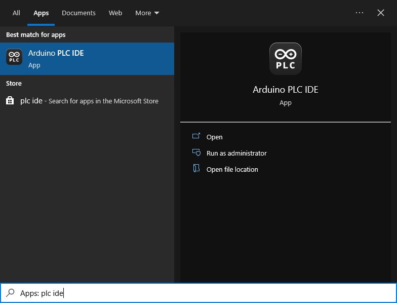

## Downloading and Installing the Arduino PLC IDE

In this tutorial, we will show how to download and install the Arduino PLC IDE on your Windows computer.

You can easily download the editor from the [Arduino Software page](https://www.arduino.cc/en/software#arduino-plc-ide).

### Requirements

- **Windows** - Win 10 or newer, x64 bits

### The Arduino PLC IDE

The Arduino PLC IDE is a solution that allows you to program using the 5 programming languages defined by the IEC 61131-3 standard and Arduino sketches at the same time.

### Download the IDE

Downloading the Arduino PLC IDE is done through the [Arduino Software page](https://www.arduino.cc/en/software). Here you will also find information on the other editors available to use. 

### Installation

#### Windows

Before installing the IDE, download the "Arduino PLC IDE Tools" from the software page.

Now to install the Arduino PLC IDE on a Windows computer, simply run the file downloaded the "Arduino PLC IDE" executable from the software page.

Follow the instructions in the installation guide. The installation may take several minutes.

Once is finished. You can now double click the file to launch the Arduino PLC IDE on your machine.

Now you are ready to use the **Arduino PLC IDE** on your Windows computer!

### Licence activation procedure

If you want to activate your key, [follow this tutorial](https://docs.arduino.cc/software/plc-ide/tutorials/plc-ide-setup-license)

