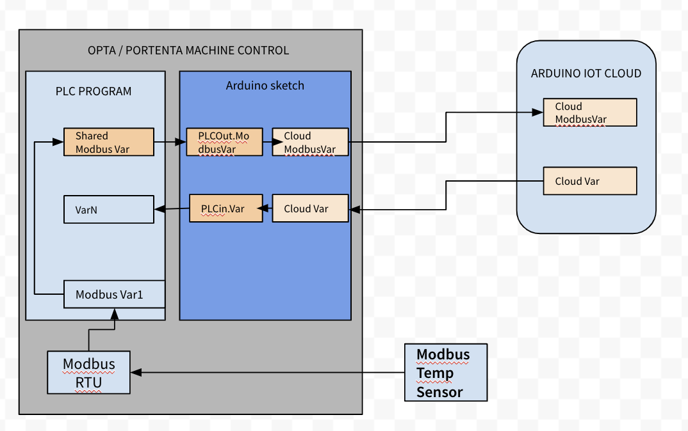

## Overview

The Arduino PLC IDE can help configure network connectivity on the Opta™, offering an edge for industrial applications. Such industrial applications can be enhanced with its integration of IoT capabilities.

TODO Add image, adding the dashboard animation to explain overall idea of the feature

In this tutorial, you will learn to set and use the IoT Cloud with the Opta™ on the Arduino PLC IDE.

## Goals

- Learn how the Arduino IoT Cloud and the PLC IDE cooperate for seamless data exchange
- Learn how to set the workspace environment on the PLC IDE for use with the Arduino IoT Cloud
- Program an Opta™ device using an example integrating the PLC IDE and IoT Cloud

## Hardware and Software Requirements

### Hardware Requirements

- [Opta™](https://store.arduino.cc/collections/pro-family) (x1)
- USB-C® cable (x1)
- Micro-USB cable (x1)

### Software Requirements

- [Official Website](https://www.arduino.cc/pro/software-plc-ide) for Arduino PLC IDE.
- If you have an Opta™, you do not need any license key to activate your product. Go to section __License Activation With Pre-Licensed Products (Opta™)__ to know more.
- The [Arduino Cloud](https://create.arduino.cc/iot/things) will be required to perform remote actuation and status monitoring via Wi-Fi® connectivity using the sketch provided in the following section. The Arduino Cloud account is free and is needed to access its features.
- [PLC IDE & IoT Cloud integration example project](assets/Opta_PLCIDE_Cloud.zip) file, compatible with Opta™

***The present tutorial requires latest version of the PLC IDE, with at least version 1.4.0. It goes same with the PLC IDE Tools. You can get the latest version [here](https://www.arduino.cc/en/software#arduino-plc-ide) for the latest PLC IDE and its tools.***

## PLC IDE & IoT Cloud Integration

The [__Arduino PLC IDE__](https://www.arduino.cc/pro/software-plc-ide) integrates the capability to use **IEC IEC61131-3** programming languages, which are LD, SFC, FBD, ST, and IL. All these languages are applicable for Opta™. A wide set of standard features are included with these PRO solutions to develop industrial automation or advanced applications. You can find more resources related to PLC IDE [here](https://docs.arduino.cc/software/plc-ide) and the software can be accessed [here](https://www.arduino.cc/en/software#arduino-plc-ide).

The __IoT Cloud__ is a platform that allows users to deploy IoT applications with ease and control parameters at any given moment. The platform provides robust security characteristics, of which Opta™ take advantage to provide secure industrial application deployments. You can find more about IoT Cloud at [here](https://docs.arduino.cc/arduino-cloud/).

### Understanding the Process

The PLC IDE supports seamless integration with IoT Cloud, enabling IoT capabilities for the Opta™. The application field can be expanded thanks to this feature with the needed security elements, ensuring stable industrial operation.

The structure comprises two elements, where PLC IDE defines Opta™ with connectivity settings and designed tasks; while IoT Cloud processes information exchange with the Arduino layer of the PRO solution devices.

TODO Create a new image for explaining the structure



The Opta™ is programmed with two layers: PLC program and Arduino sketch. The key to a successful transmission is to use 'Shared variables' between these two layers.

The PLC program layer will manage internal communication and data handling. It can be programmed to read sensor information that is obtained via selected Modbus protocol or available I/O pins. Then use this data to send out to or receive from the Arduino sketch layer.

The Arduino sketch will handle data exchange bound between the PLC program layer and the IoT Cloud platform. The '__PLCOut.Shared_Variable__' and '__PLCIn.Shared_Variable__' manages shared variables that facilitate communication between the two systems. Let's break down each:

- __PLCOut.Shared_Variable__: This variable refers to the data that is being sent from the PLC program layer to the IoT Cloud platform. In other words, it represents output from the PLC program. It could be sensor readings, status information, or any other data that the PLC program is designed to generate and share.

- __PLCIn.Shared_Variable__: Conversely, this variable refers to the data that is being sent to the PLC from the IoT Cloud system. This is input for the PLC program. It could be commands, configuration data, or other information that the IoT Cloud system sends to control or interact with the PLC.

In most industrial IoT applications, the PLC program layer will be responsible for direct control of machinery or processes based on its programming and input it receives, while the IoT Cloud platform will often be used for higher-level management, analytics, and remote control capabilities. The `Shared_Variable` in both cases allows for real-time communication between these two layers.

## Example Implementation

A demonstrative example will be used to show you how both features are integrated. The example will consist of an IoT Cloud dashboard and a PLC IDE project file configured for an Opta™.

The Opta™ will be programmed to execute the following actions:

- Send analog readings and counter values to IoT Cloud
- Green LED of the Opta™ will be controlled via an interactive button found within the IoT Cloud dashboard, which can later be designed to trigger certain actions.

The following diagram shows how you will achieve previous objectives for the Opta™ before continuing with sections containing series of instructions in detail.


The example implementation comprises in following sequence:

1. [Setting up the IoT Cloud](#setting-up-the-iot-cloud)
2. [Setting up the PLC IDE](#setting-up-the-plc-ide)
3. PLC IDE - [Shared variable configuration](#shared-variable-configuration)
4. PLC IDE - [Analog port](#analog-port-configuration) & [Green LED](#green-led-configuration) configuration
5. PLC IDE - [Library management](#library-components)
6. [Setting up the IoT Cloud dashboard](#iot-cloud-dashboard)

and finally ['System integration test'](#testing-plc-ide-with-iot-cloud).

### Setting Up the IoT Cloud

You will begin by configuring the IoT Cloud with Opta™ to create a Thing. It will have the Opta™ registered with variables and the dashboard configured to control programmed behaviors.

***To learn more about how to use the IoT Cloud, please take a look at ["Getting Started With the Arduino IoT Cloud" tutorial](https://docs.arduino.cc/arduino-cloud/getting-started/iot-cloud-getting-started).***

Following cloud variables will be created:

| **Cloud Variables** |        **Type**       | **Variable Permission** | **Send Values** |
|:-------------------:|:---------------------:|:-----------------------:|:---------------:|
| analog01            | Floating point number | Read Only               | On change       |s
| counter             | Integer number        | Read Only               | On change       |
| cloudButton         | Boolean               | Read & Write            | On change       |

The cloud variables will later be connected to 'Shared variables' of the PLC IDE environment to establish its communication path.

Once the IoT Cloud Thing has been created successfully, you will have a similar window on IoT Cloud Thing as the following image:


You can now extract the code that will serve as the base for the Arduino sketch for the Opta™ in the PLC IDE. The code can be accessed by going to the full editor. You will need to add some of the lines of the `ThingProperties.h`  The sketch of the example is as follows:

```arduino
#include <ArduinoIoTCloud.h>
#include <Arduino_ConnectionHandler.h>

const char SSID[]     = SECRET_SSID;    // Network SSID (name)
const char PASS[]     = SECRET_OPTIONAL_PASS;    // Network password (use for WPA, or use as key for WEP)

void onCloudButtonChange();

float analog01;
int counter;
bool cloudButton;

WiFiConnectionHandler ArduinoIoTPreferredConnection(SSID, PASS);

void setup() {
  // Initialize serial and wait for port to open:
  Serial.begin(9600);
  // This delay gives the chance to wait for a Serial Monitor without blocking if none is found
  delay(1500); 

  // Defined in thingProperties.h
  initProperties();

  // Connect to Arduino IoT Cloud
  ArduinoCloud.begin(ArduinoIoTPreferredConnection);
  
  /*
     The following function allows you to obtain more information
     related to the state of network and IoT Cloud connection and errors
     the higher number the more granular information you’ll get.
     The default is 0 (only errors).
     Maximum is 4
 */
  setDebugMessageLevel(2);
  ArduinoCloud.printDebugInfo();
}

void loop() {
  ArduinoCloud.update();
  // Your code here 
}

void initProperties(){
  ArduinoCloud.addProperty(analog01, READ, ON_CHANGE, NULL);
  ArduinoCloud.addProperty(counter, READ, ON_CHANGE, NULL);
  ArduinoCloud.addProperty(cloudButton, READWRITE, ON_CHANGE, onCloudButtonChange);
}

/*
  Since CloudButton is READ_WRITE variable, onCloudButtonChange() is
  executed every time a new value is received from IoT Cloud.
*/
void onCloudButtonChange()  {
  // Add your code here to act upon CloudButton change
}
```

We will now proceed with a demonstrative example to show you how both features are integrated.

### Setting Up the PLC IDE

***Before continuing with the PLC IDE configuration with Opta™, please remember to have the latest PLC IDE with its corresponding tools stated within [Software Requirements](#software-requirements).***

The PLC IDE configuration will play an important role in establishing successful communication with the IoT Cloud. It will require setting onboard features and communication protocol for the Opta™ as usual. But, a proper 'Shared variables' setting will define the communication outcome with the IoT Cloud.

Thus, you will learn to configure 'Shared variables' based on the peripherals and tasks you may assign to the Opta™.

#### Shared Variable Configuration

The successful communication between Opta™ configured with PLC IDE and IoT Cloud relies on the 'Shared variables'. The 'Shared variables' is defined by heading to `Resources > Opta > Shared variables`. It will then offer two additional tabs: 'Inputs' and 'Outputs'.


The '**Inputs**' define variables that will capture the data that comes to the Opta™ device. It is the compilation of variables that the IoT Cloud will send accordingly.

Subsequently, the Green LED will be controlled via IoT Cloud dashboard. So, the variable that will represent the Green LED of the Opta™ will be added to its table.


The Green LED of the Opta™ is represented as `in_cloudButton` and indicates that is an input variable with the `in` tag.

The '**Outputs**' define the variables that the Opta™ will send to IoT Cloud. It is the compilation of variables that you would want to monitor within the IoT Cloud dashboard.

The analog port reading and the counter value of the Opta™ are the information that we want to display on the IoT Cloud dashboard. The following table shows the variables added to the 'Shared outputs' table.


The shared output variables are indicated with an `out` tag and represent the following information:

- `out_analog01`: Analog port number one reading
- `out_counter` : Counter value

The same variable name is used to maintain variable relationship and simplicity with the Cloud variables that we have defined [here](#setting-up-the-iot-cloud) previously.

Depending on the project's development requirements, you can add all the variables that will be used to exchange information with the IoT Cloud.

We will now configure the Opta™ device's features to link all these shared variables.

#### Analog Port Configuration

The analog port is configured using the following properties under `Resources > Opta > Local IO Mapping > Programmable Inputs`:

| **Analog Port** | **Name** | **Variable** | **IO Type** | **Type** |
|-----------------|----------|--------------|-------------|----------|
| #1              | I1       | analog01     | Analog      | UINT     |

The Opta™ has available 8 I/O ports that can be programmed either as analog or digital. You will select port number one and assign the `analog01` as the variable. The 'IO Type' must be 'Analog' and the 'Type' will update based on the selection of the 'IO Type' property.

The 'Programmable inputs mapping' table should look as the following image:


You can also change the analog resolution if needed, and the options are:

- 12 bits
- 14 bits
- 16 bits

#### Green LED Configuration

The Green LED of the Opta™ is configurable under `Resources > Opta > Local IO Mapping > LED Outputs`. To use the Green LED, you will need to assign a variable that will represent the 'LG' row.


In this case, the `greenLed` is assigned as the variable that will represent the Green LED of the Opta™. The `greenLed` is a boolean type variable as well as the `in_cloudButton`. It will be matched inside the PLC program to pass the boolean state per the command sent from the IoT Cloud dashboard.

#### Library Components

The Library section would be where you could find various pre-written codes or functions specific to PLC operations. It could include libraries for handling several industrial protocols, dealing with specific types of I/O, or even specialized functions for certain control systems. It makes the development process more efficient by providing ready-to-use codes, saving time and effort.

In the context of the PLC IDE, the libraries will need to be added manually under the `Sketch Libraries` found within the 'Resources' tab. These libraries are required to manage IoT Cloud connection and it is as follows:


These libraries are indexed, thus they are certified guaranteeing optimized performance and reliability. Leveraging them will not only speed up your development process but also increase the robustness of your applications for industrial environments. It may seem an extra step but it will help you keep cleaner, more reliable, and maintainable code.

***For more information about managing libraries inside PLC IDE, please have a look at ["Library Management"](https://docs.arduino.cc/software/plc-ide/tutorials/plc-programming-introduction#library-management) section from the [Programming Introduction with Arduino PLC IDE](https://docs.arduino.cc/software/plc-ide/tutorials/plc-programming-introduction).***

#### Arduino Sketch

We can now build the Arduino sketch that will be used to establish communication with the IoT Cloud and manage data traffic. The base sketch will be needed and can be found as discussed in the ['Setting Up the IoT Cloud'](#setting-up-the-iot-cloud) section.

Most of the code will keep the same structure contrary to the `loop()` and `onCloudButtonChange()` functions. It will integrate the 'Shared variables' with the `PLCOut.Shared_Variable` or `PLCIn.Shared_Variable` to establish information exchange between the device and platform.

Beginning with the `loop()` function, we have the following code:

```arduino
void loop() {
  ArduinoCloud.update();
   
  analog01 = PLCOut.out_analog01;
  counter = PLCOut.out_counter;
}
```

The `loop()` function is used to periodically update the `analog01` and `counter` variables with the shared output variables. The shared output variables are `out_analog01` and `out_counter`, and they are attached to `PLCOut`.

This means that the PLC program, which is capturing the analog port reading and updating the counter value, is defined to bring the data to the Arduino sketch layer and update the cloud variables accordingly. The IoT Cloud dashboard then displays updated information after the `ArduinoCloud.update()` method based on the cloud variables, which are `analog01` and `counter`.

The `onCloudButtonChange()` function is cloud generated and designed to process similar tasks. Every time a new value is updated from the IoT Cloud, the function will be triggered and run the assigned tasks. In this instance, it will update the Green LED of the Opta™ whenever a change is detected with the assigned dashboard button.

```
/*
  Since CloudButton is READ_WRITE variable, onCloudButtonChange() is
  executed every time a new value is received from IoT Cloud.
*/
void onCloudButtonChange()  {
  // Add your code here to act upon CloudButton change
  PLCIn.in_cloudButton = cloudButton;
}
```

The exact process involves assigning the updated cloud variable value to the `PLCIn.in_cloudButton` variable. It will update the shared variable attached to `PLCIn`, which is the `in_cloudButton`, and pass its value to the PLC program layer updating the status of the Opta™.

Consequently, you will have an Opta™ constantly exchanging information with the IoT Cloud. The complete code for the Arduino sketch is as follows:

```arduino
#include <ArduinoIoTCloud.h>
#include <Arduino_ConnectionHandler.h>

const char SSID[]     = SECRET_SSID;    // Network SSID (name)
const char PASS[]     = SECRET_PASS;    // Network password (use for WPA, or use as key for WEP)

void onCloudButtonChange();

bool cloudButton;
float analog01;
int counter;

WiFiConnectionHandler ArduinoIoTPreferredConnection(SSID, PASS);

void setup() {
  // Initialize serial and wait for port to open:
  Serial.begin(9600);
  // This delay gives the chance to wait for a Serial Monitor without blocking if none is found
  delay(1500); 

  // Defined in thingProperties.h
  initProperties();

  // Connect to Arduino IoT Cloud
  ArduinoCloud.begin(ArduinoIoTPreferredConnection);
  
  /*
     The following function allows you to obtain more information
     related to the state of network and IoT Cloud connection and errors
     the higher number the more granular information you’ll get.
     The default is 0 (only errors).
     Maximum is 4
 */
  setDebugMessageLevel(2);
  ArduinoCloud.printDebugInfo();
}

void loop() {
  ArduinoCloud.update();
  
  analog01 = PLCOut.out_analog01;
  counter = PLCOut.out_counter;
}

void initProperties(){
  ArduinoCloud.addProperty(cloudButton, READWRITE, ON_CHANGE, onCloudButtonChange);
  ArduinoCloud.addProperty(counter, READ, ON_CHANGE, NULL);
  ArduinoCloud.addProperty(analog01, READ, ON_CHANGE, NULL);
}

/*
  Since CloudButton is READ_WRITE variable, onCloudButtonChange() is
  executed every time a new value is received from IoT Cloud.
*/
void onCloudButtonChange()  {
  // Add your code here to act upon CloudButton change
  PLCIn.in_cloudButton = cloudButton;
}
```

#### PLC Program

The Arduino sketch is ready, and it needs a PLC program that will control the onboard features of the Opta™ and data readings.

The PLC program will do the following processes:

- Run a linear counter and store to `cnt`, and pass the data to `out_counter` (Shared variable)
- Reset counter value when it reaches 2500 in its value
- Update the Green LED state of the Opta™ based on `in_cloudButton` (Shared variable)
- Update analog reading on the port number one defined to `analog01` and passing it to `out_analog01` (Shared variable)

The following code delivers the previous tasks:

```
cnt := cnt + 1;
out_counter := cnt;

IF out_counter >= 2500 THEN
	cnt := 0;
END_IF;

greenLed := in_cloudButton;

out_analog01 := analog01;
```

With this PLC program, you are all set to configure the Opta™ device's internal processes and use Arduino sketch to establish a connection with the IoT Cloud.

### IoT Cloud Dashboard

The IoT Cloud dashboard can be designed to your preference. The following image shows a dashboard example that allows for the control of the Green LED and the display of information received from the Opta™.


More information about IoT Cloud can be found [here](https://docs.arduino.cc/arduino-cloud/).

### Testing PLC IDE with IoT Cloud

The complete example project file for PLC IDE can be downloaded [here](assets/Opta_PLCIDE_Cloud.zip). It is ready to use with the Opta™ in the instance at the preferred workspace.

***The first compilation process may take some time to finish. It can take upto 7 minutes or more depending on the environment.***

Once you have successfully configured the Opta™ and the IoT Cloud dashboard, the following behaviors are expected to be observed:

- IoT Cloud dashboard displays the analog port number one reading and counter value of the connected Opta™
- Green LED of the Opta™ can be controlled using the button found within the IoT Cloud dashboard


***If the Opta™ fails to communicate with the IoT Cloud after configuration, please use the `WiFiFirmwareUpdater` to update the Opta™ with the latest network firmware version.***

## Conclusion

You have now set an Opta™ using PLC IDE and successfully connected to the IoT Cloud platform. You learned how these tools integrate and can be used to create a simple interface allowing you to oversee the Opta™ device's status. With this, you are now more familiar with the PLC IDE and IoT Cloud environment.

### Next Steps

As you progress, feel free to delve into the vast Arduino ecosystem. It will encourage you to utilize an array of libraries and hardware enhancements to construct robust, secure, and interconnected industrial solutions with the Opta™. For a deeper understanding of its software and hardware characteristics, consider reviewing our beginner's guide to the Opta™ [here](https://docs.arduino.cc/tutorials/opta/getting-started).

## Support

If you encounter any issues or have questions while working with the PLC IDE or IoT Cloud, we provide various support resources to help you find answers and solutions.

### Help Center

Explore our Help Center, which offers a comprehensive collection of articles and guides for the the PLC IDE or IoT Cloud. The Arduino Help Center is designed to provide in-depth technical assistance and help you make the most of your device.

- [Arduino help center page](https://support.arduino.cc/hc)

### Forum

Join our community forum to connect with other the PLC IDE and IoT Cloud users, share your experiences, and ask questions. The forum is an excellent place to learn from others, discuss issues, and discover new ideas and projects related to the Opta™.

- [the PLC IDE and IoT Cloud in the Arduino Forum](https://forum.arduino.cc/)

### Contact Us

Please get in touch with our support team if you need personalized assistance or have questions not covered by the help and support resources described before. We're happy to help you with any issues or inquiries about the the PLC IDE and IoT Cloud.

- [Contact us page](https://www.arduino.cc/pro/contact-us)
