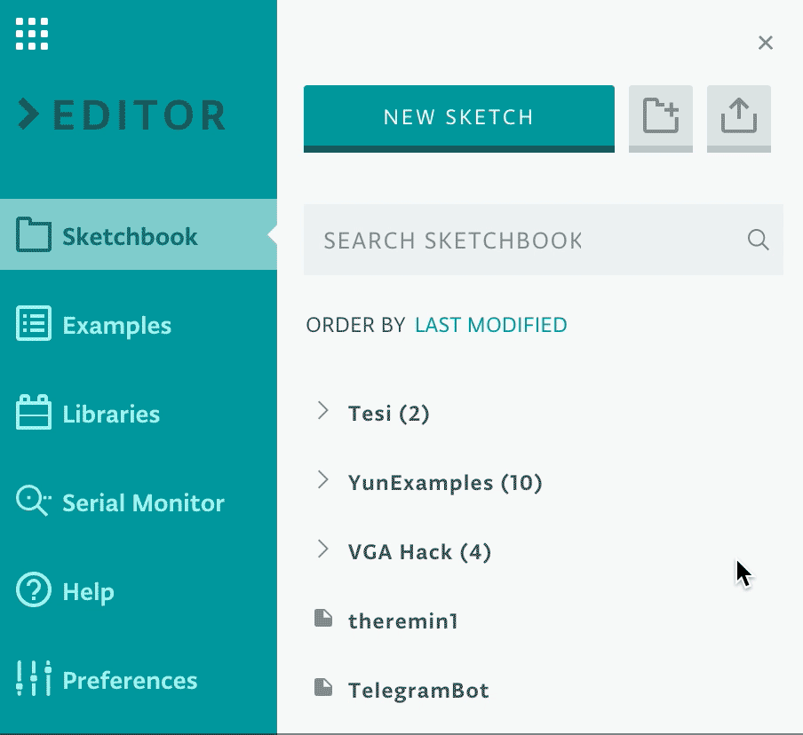
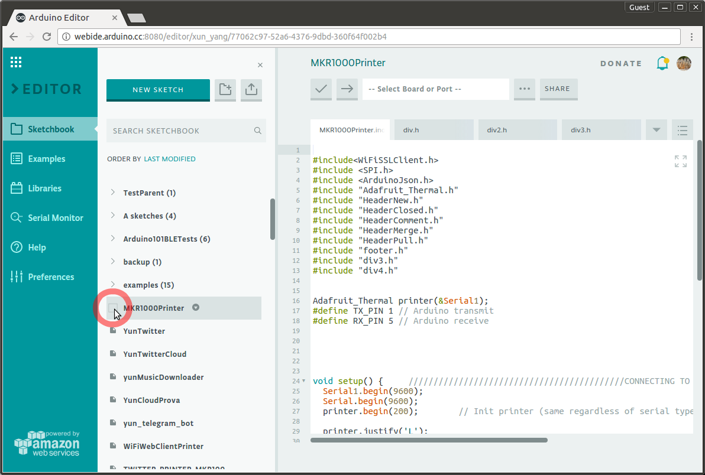
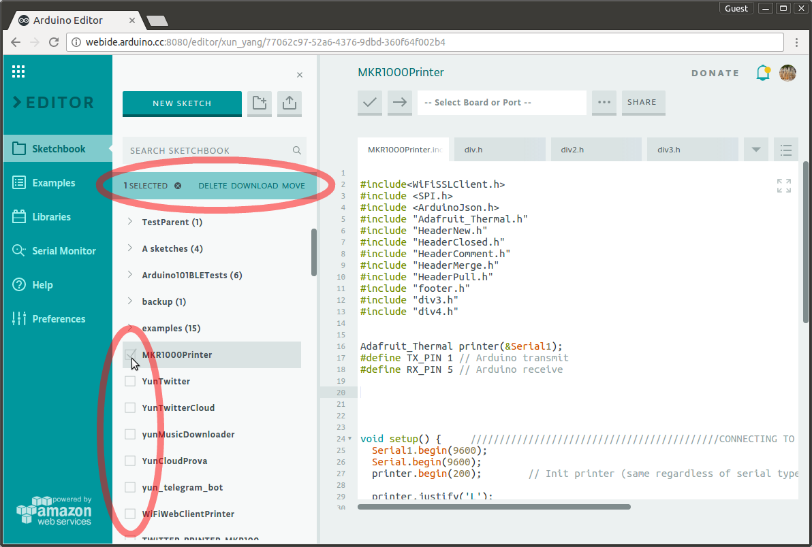
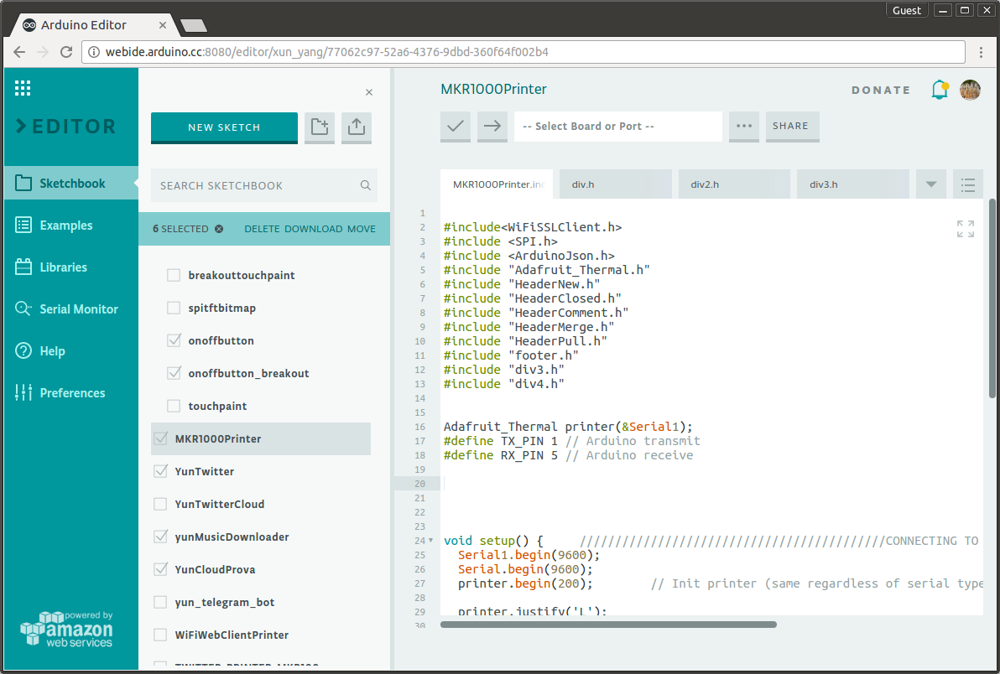
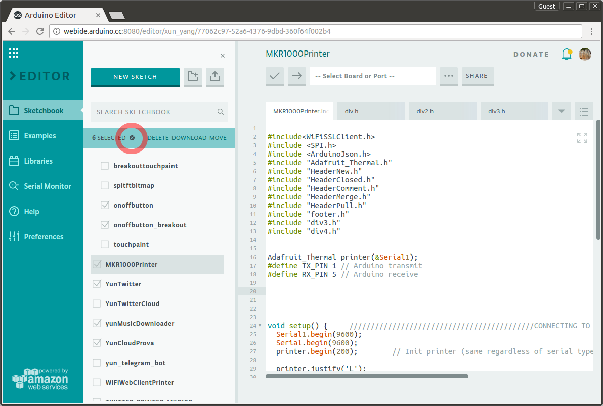
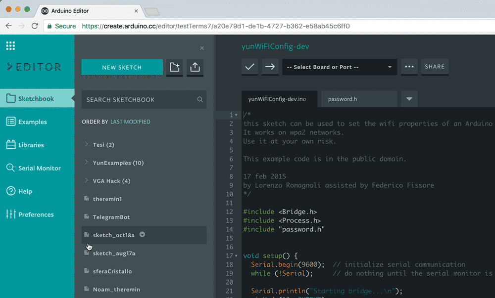

## Apps and Online Services

- [Arduino Cloud Editor](https://create.arduino.cc/editor)

## About This Project

### Overview

If you have a big sketchbook, you may want to cleanup/categorize things once in a while. With our bulk action tool, you can delete, move or download multiple sketches at the same time.

### Step 1

- Select all the sketches you want. You can even select sketches from different folders. When you’re done selecting the sketches, pick the action you want from the bulk action toolbar (Delete, Download, Move).

### Step 2

- If you want to remove the whole selection, you can click anywhere outside of the sidebar, press the ESC button on your keyboard, or press the deselection icon (the X button by the ‘`Selected`’ text on the bulk action toolbar). Instead if you want to select multiple sketches at once just pick the first, hold ‘`shift`’ key on your keyboard, and select the last one.

Some notes on this feature:

- If you select multiple files and hit ‘`Download`’ we will package a nice single .zip file for you. Please note that unfortunately Safari does not support a standard download attribute in HTML5, so for now this feature is supported only on Firefox, Chrome and Edge.
- You can’t bulk action on folders. If you want to delete a whole folder just right click on it and select ‘`Delete’` from the contextual menu.

