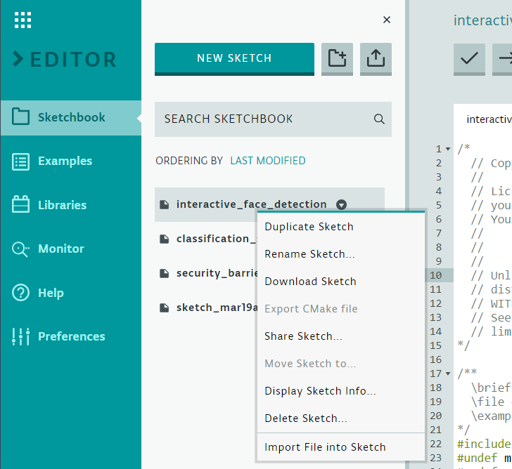
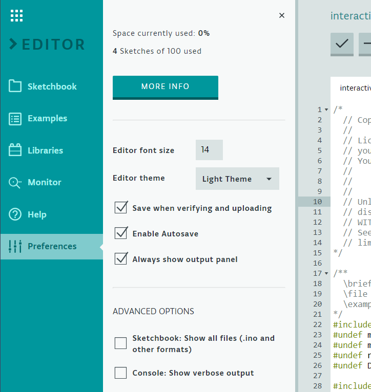
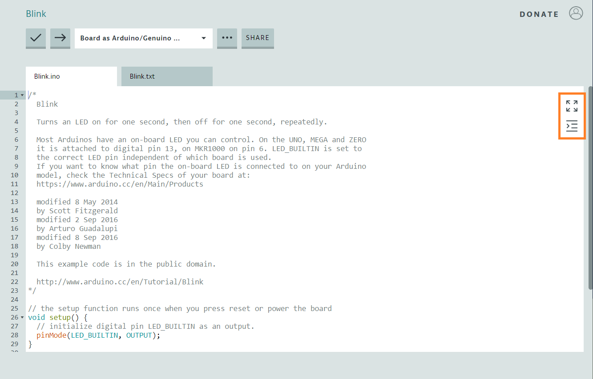

## Apps and Online Services

- [Arduino Web Editor](https://create.arduino.cc/editor)

## About This Project

In this tutorial, we'll demonstrate some secondary features of the Arduino Web Editor. If you're new to the Arduino Create platform, read this tutorial: [Getting Started with Arduino Web Editor on Various Platforms](https://create.arduino.cc/projecthub/Arduino_Genuino/getting-started-with-arduino-web-editor-on-various-platforms-4b3e4a). 

Let's start by focusing on the **Sketchbook** tab and then we'll review the **Preferences Tab** of the Web Editor.

### The Sketchbook Tab

After you've logged into Arduino Create and opened the Arduino Web Editor, you'll see some menu choices in the left margin. The **Sketchbook** tab will list all of your sketches.

You can create a new sketch clicking on the **New Sketch** button at the top. You can organize your sketches by creating folders using the gray button that looks like a folder with a plus-sign. You can also import sketches and custom libraries from your computer using the other gray button showing an up-arrow (see screenshot below). To learn more about this, read the tutorial on [Importing your Sketchbook and Libraries.](https://create.arduino.cc/projecthub/Arduino_Genuino/import-your-sketchbook-and-libraries-to-the-web-editor-296bb3)

Sketchbook Tab

If you have many sketches in your sketchbook, you can easily find the one you want by typing the name of the sketch – or part of its name – in the search box. Using the **Order By** option, you can sort sketches by name or by date modified.

Once you see the sketch you want, right-click on it – or click on the small icon to the left of it. This will reveal a menu of choices related to the sketch:

-  **Duplicate Sketch** will create a copy of the sketch you selected.
-  **Rename Sketch** allows you to rename the selected sketch.
- **Download Sketch** will download the sketch , both.ino and other files to your computer.
-  **Export CMake File** will export the sketch and included libraries to your computer so you can build it, locally.
-  **Share Sketch** allows you to share the sketch with others. The *Secret* content of a sketch will be deleted automatically in the shared sketch.
-  **Move Sketch** allows you to move the sketch between folders.
- **Display Sketch Info** shows additional information about your sketch (e.g., size and date last modified).
- **Delete Sketch** will delete the sketch you selected. A popup window will ask for confirmation to avoid deleting files accidentally.
- **Import File into Sketch** allows you to import additional files, such as images or circuit schematics, into the sketch.

### The Preferences Tab

The Preferences Tab contains some options to customize the look and behavior of the Editor (see the screenshot below). 

At the top, you can see how much space is currently used by your sketches and how many sketches are in your sketchbook. Click on the **MoreInfo** button for more accurate information regarding these two values and on imported custom libraries.

Following the usage information, are settings related to how the editor looks:

- **Editor Font Size** allows you to change the font size.
- **Editor Theme** allows you to switch between a light and dark theme;

There are a few options related to saving sketches in the next section:

- **Save when Verifying and Uploading** means the Editor will save the sketch each time you verify and upload it.
- **Enable Autosave** tells the Editor to save automatically the sketch whenever it's modified.
- **Always Show Output Panel** is set to show the output section at the bottom of the code window.

In the **Advanced Options** section, you can set a few other options:

- **Show All Files**, if set, will make visible the.ino files and related files in other formats that are in your sketchbook.
- **Show Verbose Output**, when enabled, will cause more detailed information to be displayed while a sketch is being compiled and uploaded.

### Extras: Full-Screen and Auto-Indent

There are two other settings that might be useful to you. In the code window, in the top right corner, you'll notice two icons. In the screenshot below we drew an orange box around these icons to indicate them.

The top icon allows you to enter **Full-Screen** mode: the code window will be maximized while the side bar will be minimized. The bottom icon is for **Auto-Indent**. When pressed, it will automatically indent your code to make it more readable. 

## Enjoy!

That's all there is: it's that easy to use the Arduino Web Editor. Now that you know how to manage your sketches inside a sketchbook, as well as how to customize the Editor, we hope you'll find creating and editing your sketches much easier and more pleasurable.