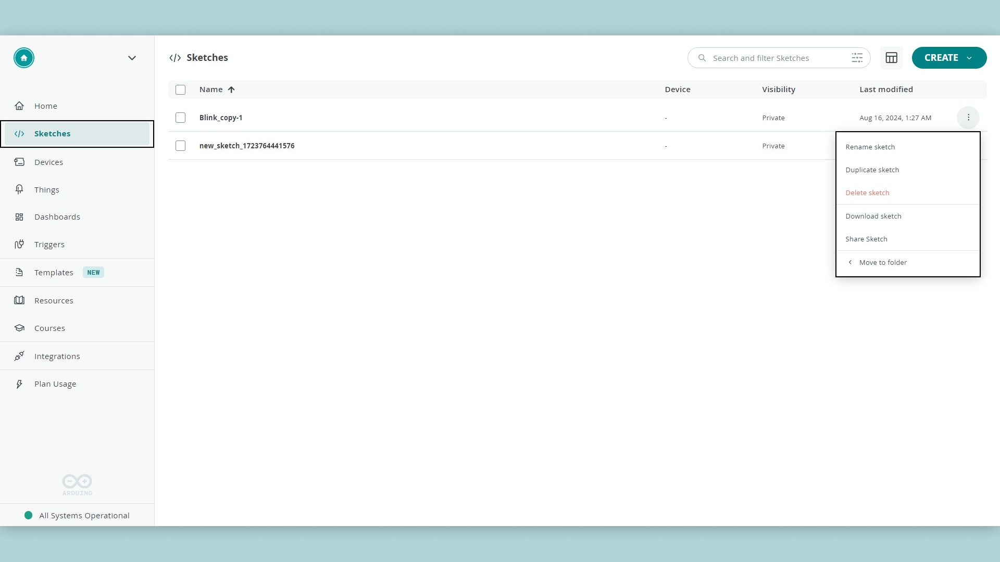
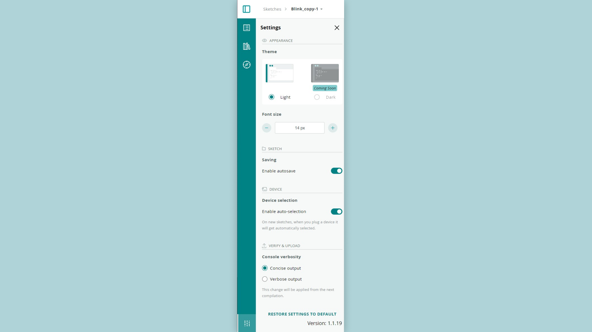
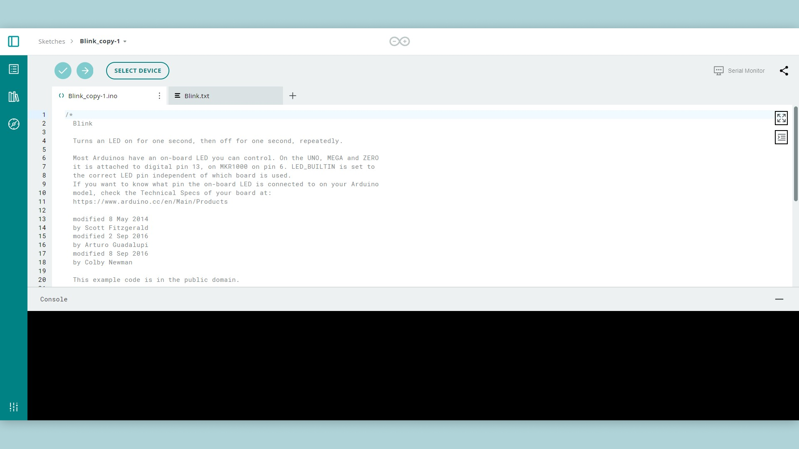

## Apps and Online Services

- [Arduino Cloud Editor](https://create.arduino.cc/editor)

## About This Project

In this tutorial, we'll demonstrate some secondary features of the Arduino Cloud Editor.

Let's start by focusing on the **Sketchbook** page and then we'll review the **Preferences Tab** of the Cloud Editor.

### The Sketchbook Tab

After you've logged into Arduino Create and opened the Arduino Cloud Editor, you'll see some menu choices in the left margin. The **Sketchbook** tab will list all of your sketches.

You can create a new sketch clicking on the **Create** button at the top, or in the middle of the page if no sketches exist. You can organize your sketches by creating folders. You can also import custom libraries from your computer on the library tab when you are in a sketch. To learn more about this, read the tutorial on [Importing your Sketchbook and Libraries.](https://create.arduino.cc/projecthub/Arduino_Genuino/import-your-sketchbook-and-libraries-to-the-web-editor-296bb3)

Sketchbook Page

If you have many sketches in your sketchbook, you can easily find the one you want by typing the name of the sketch – or part of its name – in the search box.

Once you see the sketch you want, click on the option menu at the right of the last modified date. This will reveal a menu of choices related to the sketch:

- **Rename Sketch** allows you to rename the selected sketch.
- **Duplicate Sketch** will create a copy of the sketch you selected.
- **Delete Sketch** will delete the sketch you selected. A popup window will ask for confirmation to avoid deleting files accidentally.
- **Download Sketch** will download the sketch , both.ino and other files to your computer.
- **Share Sketch** allows you to share the sketch with others. The *Secret* content of a sketch will be deleted automatically in the shared sketch.
- **Move to folder** allows you to move the sketch between folders and create new folders.

### The Preferences Tab

The Preferences Tab contains some options to customize the look and behavior of the Editor (see the screenshot below). It can be found at the bottom of the left menu bar when you are inside a sketch.

Following the usage information, are settings related to how the editor looks:

- **Editor Theme** allows you to switch between a light and dark theme;
- **Editor Font Size** allows you to change the font size.

In the **SKETCH** section, you can set the sketch save option:

- **Enable Autosave** tells the Editor to automatically save the sketch whenever it's modified.

In the **DEVICE** section, you can set the following option:

- **Enable auto-selection** If turned on, then in new sketches, when you plug a device in it will get automatically selected.

In the **VERIFY & UPLOAD** section, you can set the console verbosity option:

- **Show Verbose Output**, when enabled, will cause more detailed information to be displayed while a sketch is being compiled and uploaded.

### Extras: Full-Screen and Auto-Indent

There are two other settings that might be useful to you. In the code window, in the top right corner, you'll notice two icons. In the screenshot below we drew an orange box around these icons to indicate them.

The top icon allows you to enter **Full-Screen** mode: the code window will be maximized while the side bar will be minimized. The bottom icon is for **Auto-Indent**. When pressed, it will automatically indent your code to make it more readable. 

## Enjoy!

That's all there is: it's that easy to use the Arduino Cloud Editor. Now that you know how to manage your sketches inside a sketchbook, as well as how to customize the Editor, we hope you'll find creating and editing your sketches much easier and more pleasurable.