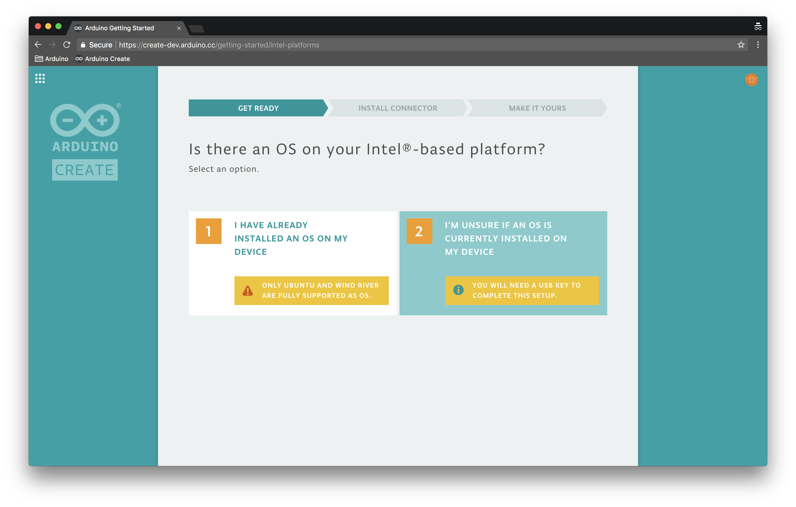
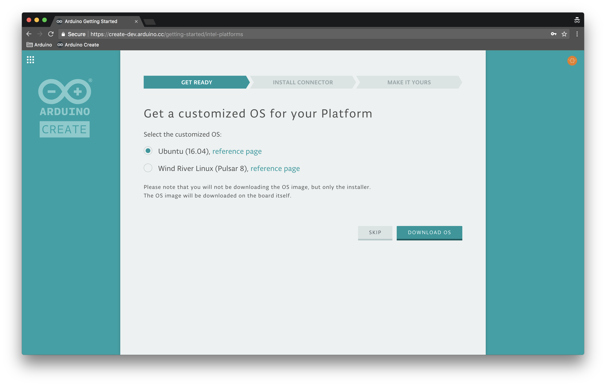
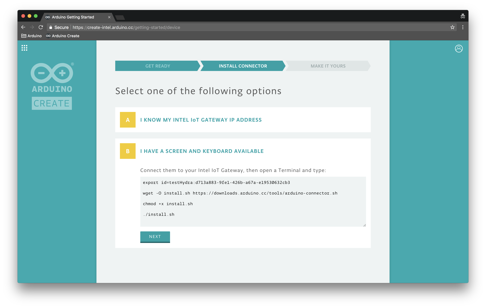
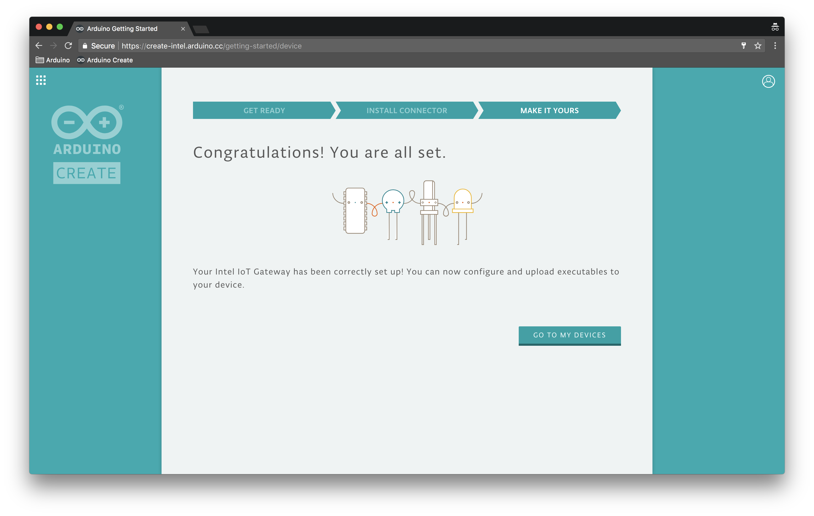

## Apps and Online Services

- [Arduino Web Editor](https://create.arduino.cc/editor)

## About This Project

### What is Arduino Create?

[Arduino Create](https://create-intel.arduino.cc/) is an online platform that enables makers to write code, access tutorials, configure boards, and share projects. Designed to provide users with a continuous workflow, Arduino Create connects the dots between each part of a maker’s journey from inspiration to implementation. If you want to learn more on the features of Create check out [this getting started guide](https://create.arduino.cc/projecthub/Arduino_Genuino/getting-started-with-the-arduino-web-editor-4b3e4a). 

## Setting up Your Intel-based Platform 

If you have an [Intel-based platform](https://software.intel.com/en-us/iot/hardware/gateways), such as an [Intel Nuc, Up2 Board, Dell Wyse](https://www.intel.com/content/www/us/en/products/boards-kits/nuc.html), [Gigabyte GB-BXT ](http://b2b.gigabyte.com/Embedded-Computing/GB-BXBT-3825-rev-10#ov)or any other gateway with Ethernetconnection, you can easily set it up by following a simple guide. If you have the [UP Squared Grove IoT Development Kit,](https://software.intel.com/en-us/iot/hardware/up-squared-grove-dev-kit) you can follow a simplified setup process [here.](https://create.arduino.cc/getting-started/up2)

Once you have configured your device, you will be able to upload sketches from anywhere in the world via the Cloud. You will be also able to interact with all the processes running on the Gateway; for instance you can stop and start your programs, read their output, or monitor their behavior.

All you need to get started is an Arduino Profile.

### Sign up to Arduino

[Create a new Arduino Account at this link](https://auth.arduino.cc/register). Complete the registration form, then hit the ‘Create Account’ button. You will receive an email with a link to activate your account. Select the link and a new page will open with your confirmed account information.

Note that you can also use this account to write posts on [Arduino’s official Forum](https://forum.arduino.cc/c/software/intel-based-platforms/144), buy products on the [online store](https://store.arduino.cc/), add comments on the [blog](https://blog.arduino.cc/), as well as create tutorials on the Arduino Project Hub (YAY!).

### Logging In To The Arduino Web Editor

Once you have successfully registered for an Arduino account, go to the [Getting Started Web app ](https://create-intel.arduino.cc/getting-started)and log in[. ](https://create-intel.arduino.cc/getting-started)Then press [Set Up a generic Intel-based platform](https://create-intel.arduino.cc/getting-started/device).

### Setup Your Device to Communicate With Create

After having read the welcome page that lists all the steps you will go through, you can pick the installation flow that best suits your needs:

### A. You Are Just Unpacking Your Brand New Device

If you have just purchased your device and this is your first time using it this is the flow for you. If the device is brand new chances are really high that no OS has been installed on it yet. But no worries we are going to install it together, just make sure you have a USB stick at hand.

To be able to correctly install a Linux distribution on your gateway we need to create a new user and set a password. You will be able to use these credentials to access your Gateway if you connect to it via SSH or if you plug it into a screen and keyboard. 

Select the Linux distribution you prefer and then press the 'Download OS' button. We recommend you use Ubuntu for generic Gateways.

Please look for a file called `arduino-connector.img`in your Download folder.

Now that we have a customized OS we are going to flash it on a USB stick, to do so we will use [Etcher](https://etcher.io/) but you can use any other software you may already have on your PC.

So [download Etcher](https://etcher.io/) and install it on your PC. Run Etcher and follow the instructions to flash the USB key: select the `arduino-connect.img`file, plug in the USB key and hit 'Flash'. **Please note that all the content previously stored on your USB will be erased in this process.** Also note that you might be asked to enter your PC's password to complete this process.

As soon as the USB is ready you will get a success message from Etcher. Your OS might complain that the USB stick will be not readable, just ignore the message and eject it.

Now you can quit Etcher and go back to the Getting Started guide in the browser.

We are now ready to install the customized OS on your device. 

First thing to do is checking if your device can boot from USB, here are [some guides on how to change the booting order](http://www.boot-disk.com/boot_priority.htm). Once you are sure about the order, plug the USB key in your device, connect it to Internet via Ethernet and turn it on, you can do so by simply and plugging the power jack in.

The installation process has now started! 

If something goes wrong (for instance the progress bar gets stuck for a very long time) you can try to flash a new USB key or check your Internet connection. **Please note that you cannot reuse the same USB stick for multiple Gateways and you must always restart the flow** **[from the very beginning](https://create-intel.arduino.cc/getting-started/device)**.

In general you need to be a bit patient during this unattended flow, as it can take up to **30 minutes** according to your Internet connection.

Once the process has been successfully completed you will be asked to remove the USB key from you Gateway.

You are all set! You are ready to [jump to the last part of this guide](https://create.arduino.cc/projecthub/Arduino_Genuino/getting-started-with-intel-iot-gateways-on-arduino-create-dcf1bc#toc-finishing-up-the-installation-6).

## B. You Have Already Installed An OS On Your Device

 You should now connect your device to Internet via Ethernet and turn it on, you can do so by simply and plugging the power jack in. When ready go to the next screen.

You are now presented with 2 options, (1) Enter your device IP address or (2) Connect a screen and a keyboard to the device.

If you know your device IP address you can simply write it in the text field. You can use services like [Angry IP Scanner](http://angryip.org/) to check what devices are available on your network and what their IP is. 

For this option to work, your host computer and gateway need to be on the same network. Arduino Create is using SSH to login to your target platform from your host, in order to configure the Arduino Connector. If an OpenSSH server isn’t running on your gateway you can install it using `sudo apt-get install openssh-server`. Once it’s installed the SSH server should start automatically.

Once you have entered the IP address you will be asked to enter your Gateway username and password. If you are behind proxy you can also set it up here.

That's it! You will need to wait for the installation process to be completed and you will be ready to go.

If you have a screen and keyboard at hand you can connect them to your Gateway. Now just open the Terminal on the device and type the script displayed on your PC. Run the 4 commands one by one.

At the end of this progress bar the installation flow will be completed.

## Finishing Up The Installation

You have successfully completed the installation (using either the USB, the IP or the Script)! You will be now asked to give your Gateway a name so you will be able to recognize it when you access it from [My Devices app ](https://create-intel.arduino.cc/devices)and the [Online Editor. ](https://create-intel.arduino.cc/editor)

### Run a Test Sketch

At the end of the installation flow you will be redirected to the web editor. For more infos on how to use it [follow this tutorial.](https://create.arduino.cc/projecthub/Arduino_Genuino/getting-started-with-the-arduino-web-editor-4b3e4a)

Let's run a test sketch! Open the DebugSerial example included in the UP Squared Grove IoT Development Kit library. 

You can find it in LIBRARIES > UP SQUARED GROVE IOT DEV KIT > Serial > DebugSerial. You can also just type 'UP' in the search field and it will be easier to find :)

While you may have a different board than what’s in the [UP Squared Grove IoT Development Kit](https://software.intel.com/en-us/iot/hardware/up-squared-grove-dev-kit), all of the examples created for that kit should work, with the exception of the ones that include specific sensors (GroveLCD and GroveRotaryAngle for example). 

This example demonstrate the use of the Monitor in the online editor, that can be used to receive or send messages to and from your board via Network. To see it in action you need to upload the example onto your board, make sure you have selected your device **via Cloud** in the target dropdown.

Once the upload has completed you will see a success message appearing right under the code area. You can confirm that your sketch is running because the log gives you a Process ID (PID). For example:

Congratulations, you've compiled and built your first sketch!

Now you can go to the Monitor panel, if you enter 'hello' into input field and press SEND, you will see the following: 

The DebugSerial method behaves like [Serial](https://www.arduino.cc/reference/en/language/functions/communication/serial/). In general, here is how to use it:

Initialize in the setup() method, using a baud of 115200:

`DebugSerial.begin(115200);`

To print messages from the board, use either:

`DebugSerial.println(“message”);`

Or:

`DebugSerial.print(“message);`

To listen to messages:

`DebugSerial.read()` 

## Stopping and Starting Sketches

Now that your sketch is running onto a Intel-based platform you should be seeing a RUN/STOP button in the toolbar. Since multiple sketches can run simultaneously on your device, you can now decide which one should run and which one should be stopped.

## My Devices App

Go to the My Devices app by clicking the menu icon in the upper left and clicking My Devices. Alternatively, you can go to <https://create.arduino.cc/devices.>

[My Devices ](https://create-intel.arduino.cc/devices)allows you to see all the cloud-enabled boards and products that you have setup and are linked to your account. 

From here you can see what processes are running on each board and stop or start them. You can also delete your devices if you don't need them anymore.

Click ‘1 SKETCHES RUNNING’. You should now see the name of the sketch that you ran, for example ‘Blink’. Click on ‘RUNNING’.

You should now see ‘STOPPED’.

You are not limited to running one sketch at a time and can run multiple sketches, given they don’t conflict with each other. 

### Useful Links

[Using Intel Libraries in Arduino Create](https://software.intel.com/en-us/articles/using-intel-libraries-in-arduino-create) 

[MRAA and UPM Basics in Arduino Create](https://software.intel.com/en-us/articles/mraa-and-upm-basics-in-arduino-create)

### Troubleshooting

If something goes wrong in this installation process you can let us know [on the Arduino Forum](http://forum.arduino.cc/index.php?board=105.0). Keep in mind that this guide has been tested in depth only on the [Intel Nuc ](https://www.intel.com/content/www/us/en/products/boards-kits/nuc.html)and the[ UP2 Board.](https://www.intel.com/content/www/us/en/products/boards-kits/nuc.html)