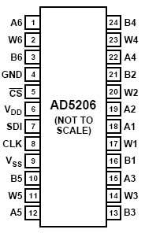
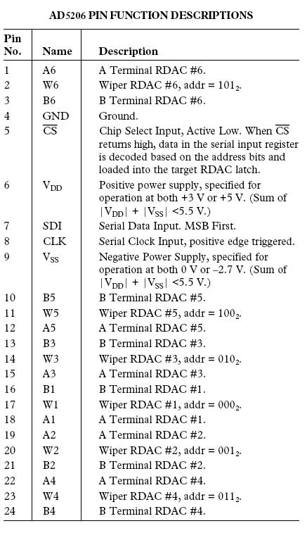
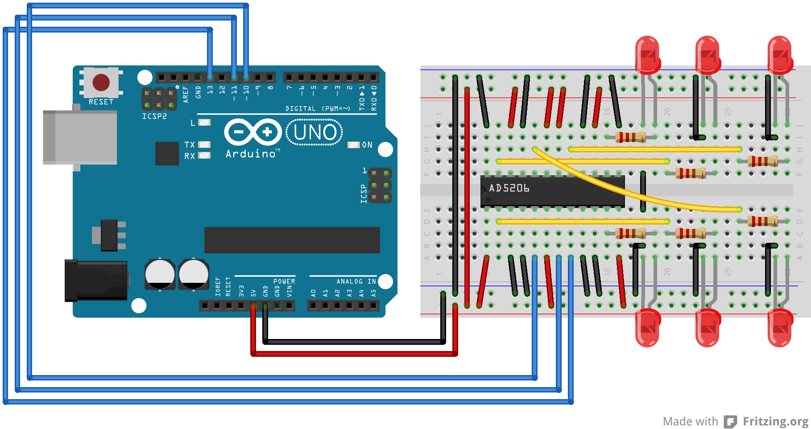

In this tutorial you will learn how to control the AD5206 digital potentiometer using Serial Peripheral Interface (SPI).  For an explanation of SPI see the [SPI Library reference](https://www.arduino.cc/en/Reference/SPI).

Digital potentiometers are useful when you need to vary the resistance in a circuit electronically rather than by hand. Example applications include LED dimming, audio signal conditioning and tone generation. In this example we will use a six channel digital potentiometer to control the brightness of six LEDs. The steps we will cover for implementing SPI communication can be modified for use with most other SPI devices.

## Hardware Required

- Arduino board
- AD5206 Digital Potentiometer
- 6 LEDs
- 6 220 ohm resistors
- Hook-up wires
- Breadboard

## Introduction to the AD5206 Digital Potentiometer

[Click for for the AD5206's datasheet.](http://datasheet.octopart.com/AD5206BRU10-Analog-Devices-datasheet-8405.pdf)





The AD5206 is a 6 channel digital potentiometer. This means it has six variable resistors (potentiometers) built in for individual electronic control. There are three pins on the chip for each of the six internal variable resistors, and they can be interfaced with just as you would use a mechanical potentiometer. The individual variable resistor pins are labeled Ax, Bx and Wx, ie. A1, B1 and W1.
For example, in this tutorial we will be using each variable resistor as a voltage divider by pulling one side pin (pin B) high, pulling another side pin (pin A) low and taking the variable voltage output of the center pin (Wiper).
In this case, the AD5206 provides a maximum resistance of 10k ohm, delivered in 255 steps (255 being the max, 0 being the least).

## Circuit




## Schematic


## Code

```arduino

/*

  Digital Pot Control

  This example controls an Analog Devices AD5206 digital potentiometer.

  The AD5206 has 6 potentiometer channels. Each channel's pins are labeled

  A - connect this to voltage

  W - this is the pot's wiper, which changes when you set it

  B - connect this to ground.

 The AD5206 is SPI-compatible,and to command it, you send two bytes,

 one with the channel number (0 - 5) and one with the resistance value for the

 channel (0 - 255).

 The circuit:

  * All A pins  of AD5206 connected to +5V

  * All B pins of AD5206 connected to ground

  * An LED and a 220-ohm resisor in series connected from each W pin to ground

  * CS - to digital pin 10  (SS pin)

  * SDI - to digital pin 11 (MOSI pin)

  * CLK - to digital pin 13 (SCK pin)

 created 10 Aug 2010

 by Tom Igoe

 Thanks to Heather Dewey-Hagborg for the original tutorial, 2005

*/

// inslude the SPI library:
#include <SPI.h>

// set pin 10 as the chip select for the digital pot:

const int chipSelectPin = 10;

void setup() {

  // set the chipSelectPin as an output:

  pinMode(chipSelectPin, OUTPUT);

  // initialize SPI:

  SPI.begin();
}

void loop() {

  // go through the six channels of the digital pot:

  for (int channel = 0; channel < 6; channel++) {

    // change the resistance on this channel from min to max:

    for (int level = 0; level < 255; level++) {

      digitalPotWrite(channel, level);

      delay(10);

    }

    // wait a second at the top:

    delay(100);

    // change the resistance on this channel from max to min:

    for (int level = 0; level < 255; level++) {

      digitalPotWrite(channel, 255 - level);

      delay(10);

    }

  }

}

void digitalPotWrite(int address, int value) {

  // take the SS pin low to select the chip:

  digitalWrite(chipSelectPin, LOW);

  delay(100);

  //  send in the address and value via SPI:

  SPI.transfer(address);

  SPI.transfer(value);

  delay(100);

  // take the SS pin high to de-select the chip:

  digitalWrite(chipSelectPin, HIGH);
}
```

Original tutorial by Heather Dewey-Hagborg, update by Tom Igoe and Christian Cerrito


*Last revision 2018/05/17 by SM*