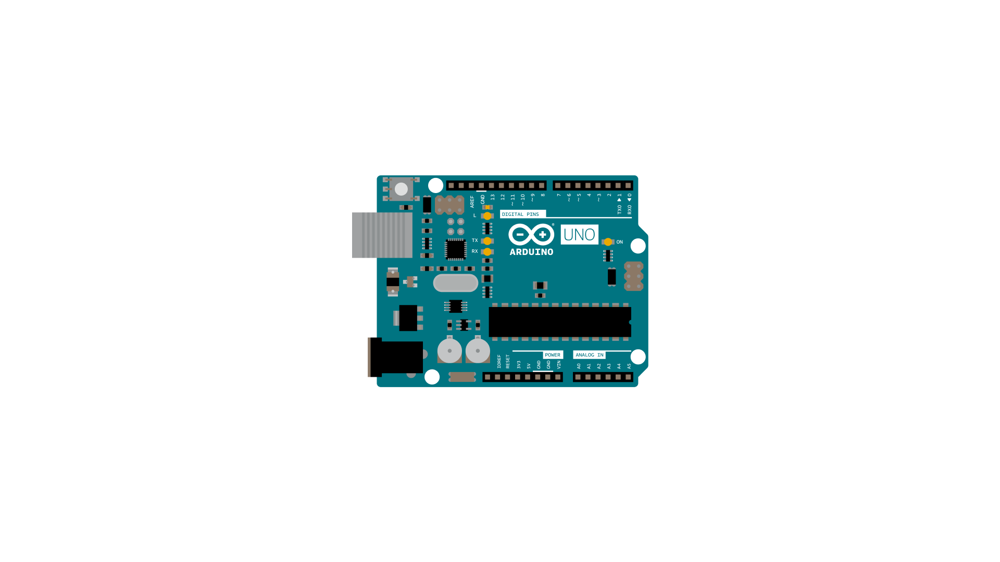
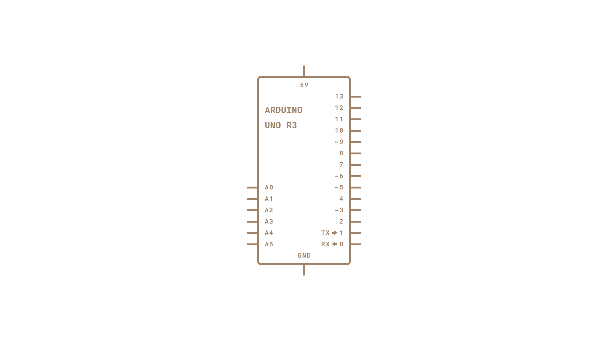

Arduino boards have built in support for serial communication on pins 0 and 1, but what if you need more serial ports?  The [SoftwareSerial Library](https://www.arduino.cc/en/Reference/SoftwareSerial) has been developed to allow serial communication to take place on the other digital pins of your boards, using software to replicate the functionality of the hardwired RX and TX lines.  This can be extremely helpful when the need arises to communicate with two serial enabled devices, or to talk with just one device while leaving the main serial port open for debugging purpose.

In the example below, digital pins 10 and 11 on your Arduino boards are used as virtual RX and TX serial lines. The virtual RX pin is set up to listen for anything coming in on via the main serial line, and to then echo that data out the virtual TX line. Conversely, anything received on the virtual RX is sent out over the hardware TX.

## Hardware Required

- Arduino Board

## Circuit

There is no circuit for this example. Make sure that your Arduino board is attached to your computer via USB to enable serial communication through the serial monitor window of the Arduino Software (IDE).

image developed using [Fritzing](http://www.fritzing.org). For more circuit examples, see the [Fritzing project page](http://fritzing.org/projects/)

## Schematics

image developed using [Fritzing](http://www.fritzing.org). For more circuit examples, see the [Fritzing project page](http://fritzing.org/projects/)

## Code

<iframe src='https://create.arduino.cc/example/library/arc32%3A2.0.4%3Acuriesoftwareserial/Intel%5Chardware%5Carc32%5C2.0.4%5Clibraries%5CCurieSoftwareSerial%5Cexamples%5CSoftwareSerialExample/SoftwareSerialExample/preview?embed' style='height:510px;width:100%;margin:10px 0' frameborder='0'></iframe>

*Last revision 2018/05/17 by SM *
