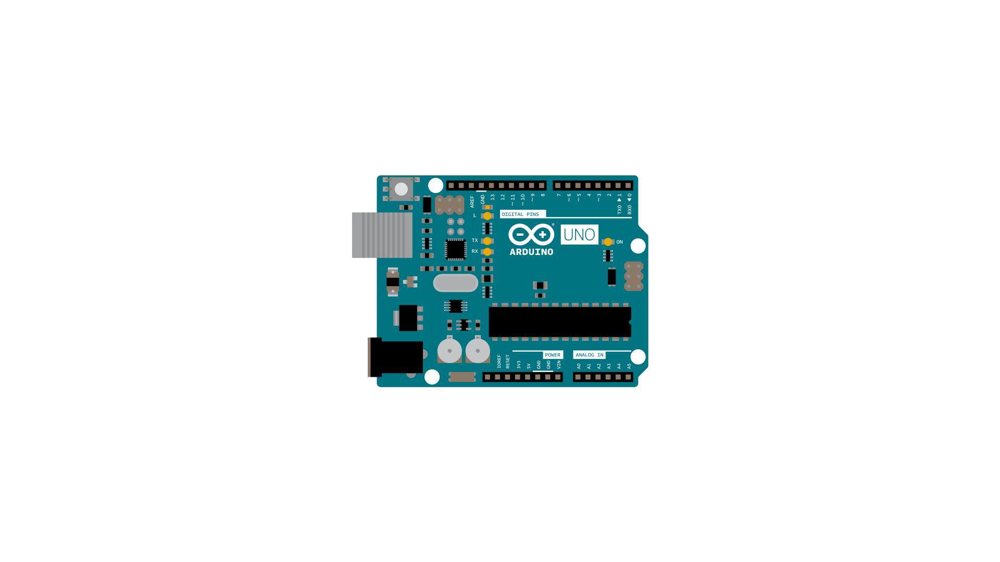
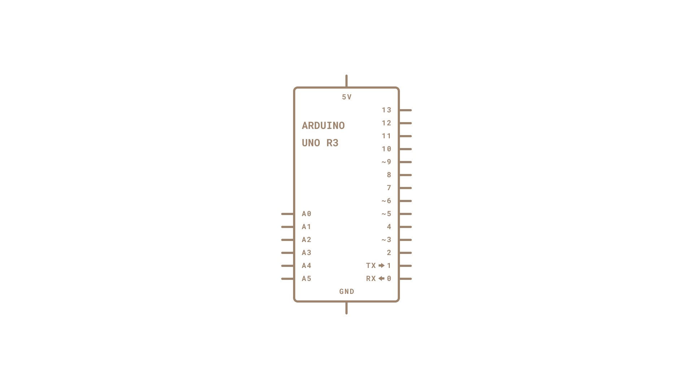

Arduino boards have built-in support for serial communication on pins 0 and 1, but what if you need more serial ports? The [`SoftwareSerial` library](https://docs.arduino.cc/learn/built-in-libraries/software-serial/) was developed to allow serial communication on other digital pins of your board, using software to replicate the functionality of the hardware RX and TX lines. This is useful when you need to talk to two serial devices at the same time, or to communicate with a single device while keeping the main hardware serial port free for debugging.

In the example below, digital pins 10 and 11 are used as virtual RX and TX. Anything received on the hardware serial line is echoed out the virtual TX, and anything received on the virtual RX is sent out the hardware TX.

## Hardware Required

- Arduino board (such as the UNO R3, Nano, or Mega 2560)
- USB cable

## Circuit

There is no external circuit for this example. Make sure your Arduino board is connected to your computer via USB so you can use the Serial Monitor in the Arduino IDE.



Image developed using [Fritzing](https://fritzing.org). For more circuit examples, see the [Fritzing project page](https://fritzing.org/projects/).

## Schematics



Image developed using [Fritzing](https://fritzing.org). For more circuit examples, see the [Fritzing project page](https://fritzing.org/projects/).

## Opening the example in the Arduino IDE

The `SoftwareSerial` library and its example come pre-installed with your board's support package, so you do not need to download anything separately. To open the example sketch:

1. From the menu, select **Tools > Board > Arduino AVR Boards > Arduino Uno** (or another Arduino board such as the Nano or the Mega 2560).
2. Select **File > Examples > SoftwareSerial > SoftwareSerialExample**.

The example sketch will open in a new editor window.

<Alert type="note"><strong>Tip</strong>: If you do not see `SoftwareSerial` listed under **File > Examples**, make sure that an Arduino board is currently selected. The IDE only shows the examples available for the board you have chosen.</Alert>

## Code

Below is the content of `SoftwareSerialExample.ino` (this example is in the public domain):

```arduino
/*
  Software serial multiple serial test

  Receives from the hardware serial, sends to software serial.
  Receives from software serial, sends to hardware serial.

  The circuit:
  * RX is digital pin 10 (connect to TX of other device)
  * TX is digital pin 11 (connect to RX of other device)

  Note:
  Not all pins on the Mega and Mega 2560 support change interrupts,
  so only the following can be used for RX:
  10, 11, 12, 13, 50, 51, 52, 53, 62, 63, 64, 65, 66, 67, 68, 69

  Not all pins on the Leonardo and Micro support change interrupts,
  so only the following can be used for RX:
  8, 9, 10, 11, 14 (MISO), 15 (SCK), 16 (MOSI).

  created back in the mists of time
  modified 25 May 2012
  by Tom Igoe
  based on Mikal Hart's example

  This example code is in the public domain.
*/

#include <SoftwareSerial.h>

SoftwareSerial mySerial(10, 11); // RX, TX

void setup() {
  // Open serial communications and wait for port to open:
  Serial.begin(57600);
  while (!Serial) {
    ; // wait for serial port to connect. Needed for native USB port only
  }

  Serial.println("Goodnight moon!");

  // set the data rate for the SoftwareSerial port
  mySerial.begin(4800);
  mySerial.println("Hello, world?");
}

void loop() { // run over and over
  if (mySerial.available()) {
    Serial.write(mySerial.read());
  }
  if (Serial.available()) {
    mySerial.write(Serial.read());
  }
}
```

## Things to keep in mind

- **Only one software serial port can listen at a time**: If you create more than one `SoftwareSerial` object in the same sketch, only one of them can receive data at a time. You can switch between them using `mySerial.listen()`.
- **Speed**: `SoftwareSerial` works reliably up to about 115200 bps, but the higher the speed the more work the CPU has to do. Whenever possible, use the hardware serial port for fast or critical communications.
- **Newer Arduino boards**: Boards such as the UNO R4, Nano ESP32, MKR family, GIGA R1, Portenta, and Nano 33 BLE already include extra hardware serial ports (`Serial1`, `Serial2`, …). On those boards it is better to use the hardware ports directly instead of `SoftwareSerial`.

*Last revision 2026/05/04*