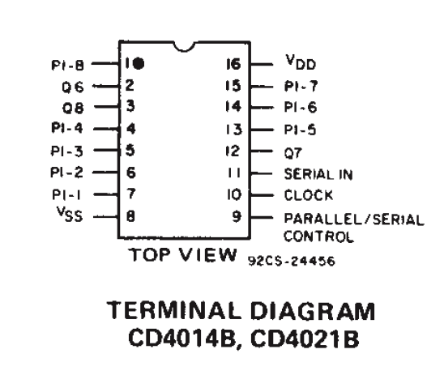
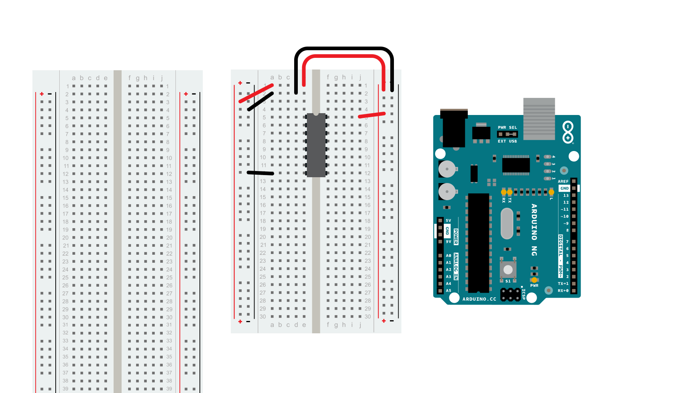
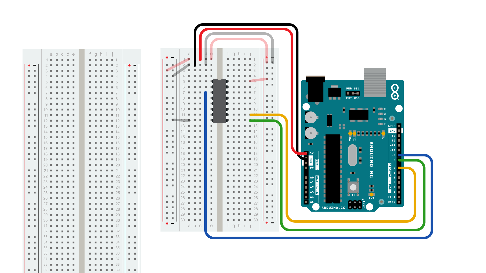
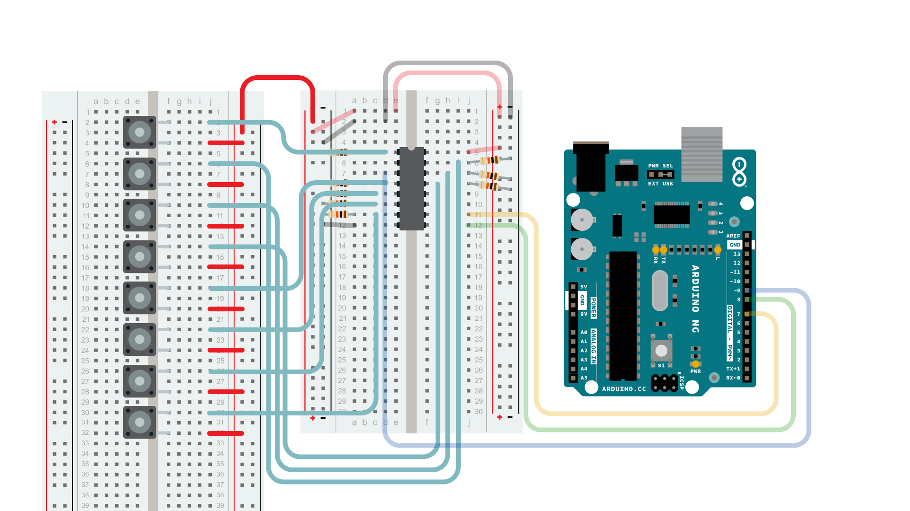
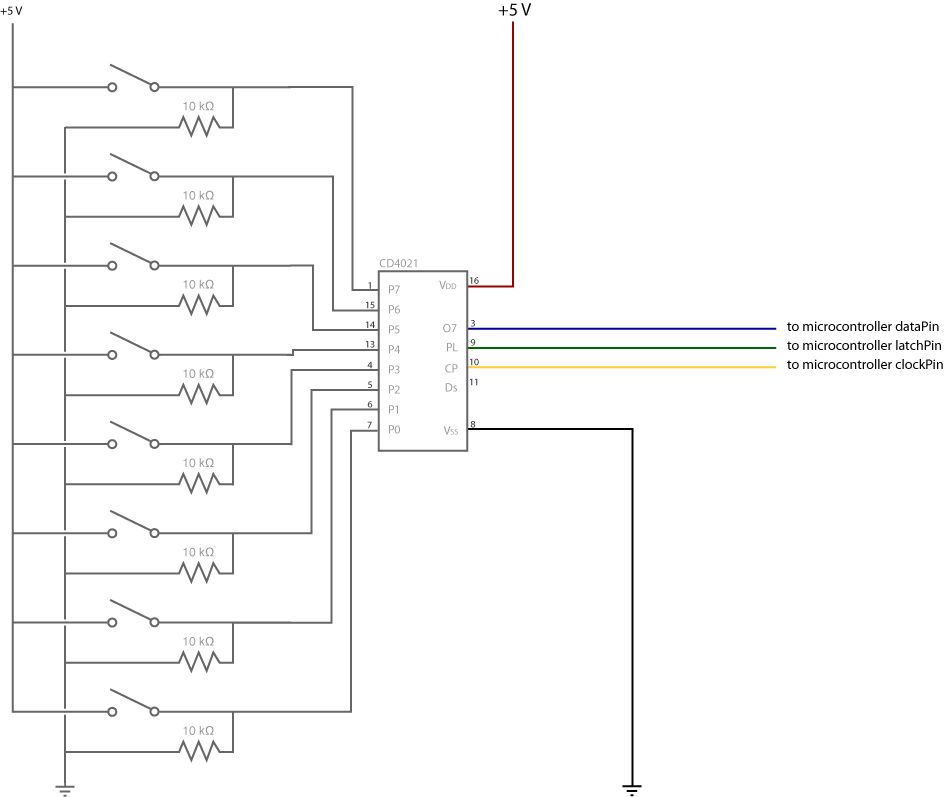
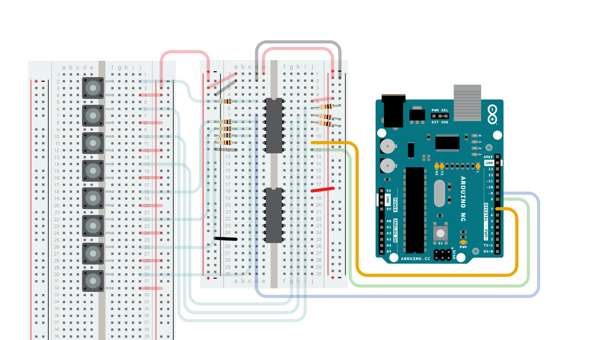
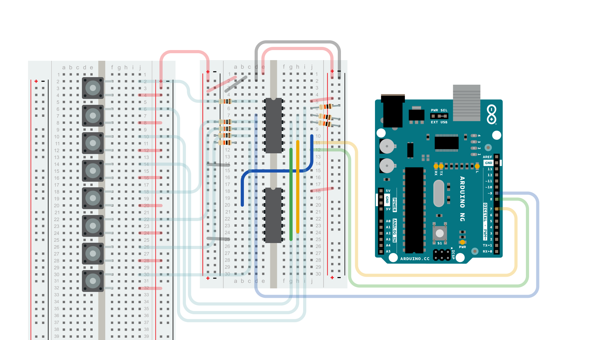
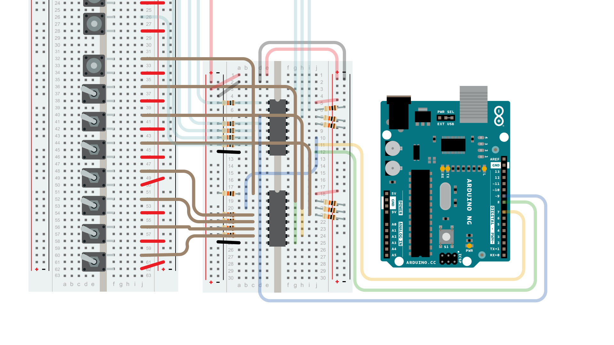
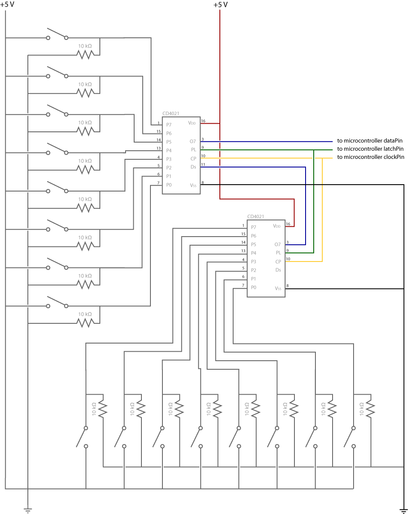

> Updated by Scott Fitzgerald Feb 2014

## Shifting In & the CD4021B

Sometimes you'll end up needing more digital input than there are pins on your Arduino. Using a parallel to serial shift register you can collect information from 8 or more switches while only using 3 of the pins on your Arduino.

An example of a parallel to serial register is the CD4021B, sometimes referred to as an 8-Stage Static Shift Register. This means you can read the state of up to 8 digital inputs attached to the register all at once. This is called  Asynchronous Parallel Input. "Input" because you are collecting information. "Parallel" because it is all at once, like hearing a musical cord. "Asynchronous" because the CD4021B is doing all this data collection at its own pace without coordinating with the Arduino.

The 8 inputs are translated into a series of HIGH and LOW pulses on the serial-out pin of the shift register. This pin should be connected to an input pin on your Arduino Board, referred to as the **data pin**. The transfer of information on the data pin is called "Synchronous Serial Output" because the shift register waits to deliver linear sequence of data to the Arduino until the Arduino asks for it.  Synchronous Serial communication, either input or output, is heavily reliant on what is referred to as a **clock pin.**  The clock pin is the metronome of the conversation between the shift register and the Arduino, it is what keeps the two systems synchronous. Every time the Arduino changes the clock pin from LOW to HIGH the shift register changes the state of the Serial Output pin, indicating the value of the next switch.

The third pin attached to the Arduino is a "Parallel to Serial Control" pin. It is referred to as a **latch pin**. When the latch pin is HIGH the shift register is listening to its 8 parallel inputs. When the latch pin is LOW, it listens to the clock pin and passes information serially. That means every time the latch pin transitions from HIGH to LOW the shift register will start passing its most current switch information.

The pseudo code to coordinate this all looks something like this:

1. Make sure the register has the latest information from its parallel inputs (i.e. that the latch pin is HIGH)

2. Tell the register the Arduino is ready to get the information serially (latch pin LOW)

3. For each of the inputs that are to be read, pulse the clockPin and check to see if the data pin is LOW or HIGH

This is a basic diagram.

```arduino
_______
switch ->  |     |
switch ->  |  C  |
switch ->  |  D  |
switch ->  |  4  | -> Serial Data to Arduino
switch ->  |  0  |
switch ->  |  2  |
switch ->  |  1  | <- Clock Data from Arduino
switch ->  |_____| <- Latch Data from Arduino
```

There is more information about shifting in the [ShiftOut](https://www.arduino.cc/en/Tutorial/Foundations/ShiftOut) tutorial.

Before you start wiring up your board here is the pin diagram of the CD4021 from the [Texas Instruments Datasheet](https://www.arduino.cc/en/uploads/Tutorial/TI_CD4021.pdf)
 PINS 1,4-7, 13-15
 P1, P8 (Pins 0-7)
 Parallel Inputs
 PINS 2, 12, 3
 Q6, Q7, Q8
 Serial Output Pins from different steps in the sequence. Q7 is a pulse behind Q8 and Q6 is a pulse behind Q7. Q8 is the only one used in these examples.
 PIN 8
 Vss
 GND
 PIN 9
 P/S C
 Parallel/Serial Control (latch pin)
 PIN 10
 CLOCK
 Shift register clock pin
 PIN 11
 SERIAL-IN
 Serial data input
 PIN 16
 VDD
 DC supply voltage

##  Example 1: One Shift Register

The first step is to extend your Arduino with one shift register.

## The Circuit

### 1. Power Connections

Make the following connections:

- GND (pin 8) to ground,

- VDD (pin 16) to 5V



### 2.Connect to Arduino

- Q8 (pin 3)  to Ardunio DigitalPin 9 (blue wire)

- CLOCK (pin 10) to to Ardunio DigitalPin 7 (yellow wire)

- P/S C (pin 9) to Ardunio DigitalPin 8 (green wire)

From now on those will be referred to as the dataPin, the clockPin and the latchPin respectively.



### 3. Add 8 Switches



### Diagram



## The Code

[Code Sample 1.1 Hello World](#shftin11)
[Code Sample 1.2 What is Pressed?](#shftin12)
[Code Sample 1.3 Button Combination Check](#shftin13)
[Code Sample 1.4 Is it pressed? (sub-function)](#shftin14)

##  Example 2: Multiple Shift Registers

In this example you'll add a second shift register, doubling the number of input pins while still using the same number of pins on the Arduino.

If supplementing your Arduino with an additional 8 digital inputs isn't going to be enough for your project, you can have a second CD4021 pass its information on to another CD4021 which will stream all 16 bits of information to the Arduino. If you know you will need to use multiple shift registers like this, check that any shift registers you buy can handle Synchronous Serial Input as well as the standard Synchronous Serial Output capability.  Synchronous Serial Input is the feature that allows the first shift register to receive and transmit the serial output from a second one. The example below details how to use this system. Within reason, you can keep extending this daisy-chain of shift registers until you have all the inputs you need.

```arduino
_______
switch ->  |     |
switch ->  |  C  |
switch ->  |  D  |
switch ->  |  4  | -> Serial Data to Arduino
switch ->  |  0  |
switch ->  |  2  | <- Clock Data from Arduino
switch ->  |  1  | <- Latch Data from Arduino
switch ->  |_____| <------
|
|
|
_______       |  Serial Data Passed to First
switch ->  |     |       |  Shift Register
switch ->  |  C  |       |
switch ->  |  D  |       |
switch ->  |  4  | ______|
switch ->  |  0  |
switch ->  |  2  | <- Clock Data from Arduino
switch ->  |  1  | <- Latch Data from Arduino
switch ->  |_____|
```

## The Circuit

### 1. Add a second shift register.



### 2. Connect  the 2 registers.

Two of these connections simply extend the same clock and latch signal from the Arduino to the second shift register (yellow and green wires).  The blue wire is going from the serial out pin (pin 9) of the first shift register to the serial data input (pin 14) of the second register.



### 3. Add a second set of Switches.

Notice that there is one momentary switch and the rest are toggle switches.  This is because the code examples will be using the switches attached to the second shift register as settings, like a preference file, rather than as event triggers. The one momentary switch will be telling the microcontroller that the setting switches are being changed.



### Diagram



## The Code

- [Code Sample 2.1 Hello World](#shftin21)
- [Code Sample 2.2 Using the second byte for settings, Print all](#shftin22)
- [Code Sample 2.3 Using the second byte for settings, Print on only](#shftin23) (uses sub-function)


##  Examples

## ShftIn11


```arduino
//**************************************************************//
//  Name    : shiftIn Example 1.1                              //
//  Author  : Carlyn Maw                                        //
//  Date    : 25 Jan, 2007                                      //
//  Version : 1.0                                               //
//  Notes   : Code for using a CD4021B Shift Register       //
//          :                                                   //
//****************************************************************

//define where your pins are
int latchPin = 8;
int dataPin = 9;
int clockPin = 7;

//Define variables to hold the data
//for shift register.
//starting with a non-zero numbers can help
//troubleshoot
byte switchVar1 = 72;  //01001000

void setup() {

  //start serial

  Serial.begin(9600);

  //define pin modes

  pinMode(latchPin, OUTPUT);

  pinMode(clockPin, OUTPUT);

  pinMode(dataPin, INPUT);

}

void loop() {

  //Pulse the latch pin:

  //set it to 1 to collect parallel data

  digitalWrite(latchPin,1);

  //set it to 1 to collect parallel data, wait

  delayMicroseconds(20);

  //set it to 0 to transmit data serially

  digitalWrite(latchPin,0);

  //while the shift register is in serial mode

  //collect each shift register into a byte

  //the register attached to the chip comes in first

  switchVar1 = shiftIn(dataPin, clockPin);

  //Print out the results.

  //leading 0's at the top of the byte

  //(7, 6, 5, etc) will be dropped before

  //the first pin that has a high input

  //reading

  Serial.println(switchVar1, BIN);

//white space
Serial.println("-------------------");
//delay so all these print statements can keep up.
delay(500);

}

//------------------------------------------------end main loop

////// ----------------------------------------shiftIn function
///// just needs the location of the data pin and the clock pin
///// it returns a byte with each bit in the byte corresponding
///// to a pin on the shift register. leftBit 7 = Pin 7 / Bit 0= Pin 0

byte shiftIn(int myDataPin, int myClockPin) {

  int i;

  int temp = 0;

  int pinState;

  byte myDataIn = 0;

  pinMode(myClockPin, OUTPUT);

  pinMode(myDataPin, INPUT);
//we will be holding the clock pin high 8 times (0,..,7) at the
//end of each time through the for loop

//at the beginning of each loop when we set the clock low, it will
//be doing the necessary low to high drop to cause the shift
//register's DataPin to change state based on the value
//of the next bit in its serial information flow.
//The register transmits the information about the pins from pin 7 to pin 0
//so that is why our function counts down

  for (i=7; i>=0; i--)

  {

    digitalWrite(myClockPin, 0);

    delayMicroseconds(0.2);

    temp = digitalRead(myDataPin);

    if (temp) {

      pinState = 1;

      //set the bit to 0 no matter what

      myDataIn = myDataIn | (1 << i);

    }

    else {

      //turn it off -- only necessary for debugging

     //print statement since myDataIn starts as 0

      pinState = 0;

    }

    //Debugging print statements

    //Serial.print(pinState);

    //Serial.print("     ");

    //Serial.println (dataIn, BIN);

    digitalWrite(myClockPin, 1);

  }

  //debugging print statements whitespace

  //Serial.println();

  //Serial.println(myDataIn, BIN);

  return myDataIn;
}


```

## ShftIn12

```arduino
//**************************************************************//
//  Name    : shiftIn Example 1.2                               //
//  Author  : Carlyn Maw                                        //
//  Date    : 25 Jan, 2007                                      //
//  Version : 1.0                                               //
//  Notes   : Code for using a CD4021B Shift Register       //
//          :                                                   //
//****************************************************************

//define where your pins are
int latchPin = 8;
int dataPin = 9;
int clockPin = 7;

//Define variables to hold the data
//for shift register.
//starting with a non-zero numbers can help
//troubleshoot
byte switchVar1 = 72;  //01001000

//define an array that corresponds to values for each
//of the shift register's pins
char note2sing[] = {

  'C', 'd', 'e', 'f', 'g', 'a', 'b', 'c'};

void setup() {

  //start serial

  Serial.begin(9600);

  //define pin modes

  pinMode(latchPin, OUTPUT);

  pinMode(clockPin, OUTPUT);

  pinMode(dataPin, INPUT);

}

void loop() {

  //Pulse the latch pin:

  //set it to 1 to collect parallel data

  digitalWrite(latchPin,1);

  //set it to 1 to collect parallel data, wait

  delayMicroseconds(20);

  //set it to 0 to transmit data serially

  digitalWrite(latchPin,0);

  //while the shift register is in serial mode

  //collect each shift register into a byte

  //the register attached to the chip comes in first

  switchVar1 = shiftIn(dataPin, clockPin);

  //Print out the results.

  //leading 0's at the top of the byte

  //(7, 6, 5, etc) will be dropped before

  //the first pin that has a high input

  //reading

  Serial.println(switchVar1, BIN);

  //This for-loop steps through the byte

  //bit by bit which holds the shift register data

  //and if it was high (1) then it prints

  //the corresponding location in the array

  for (int n=0; n<=7; n++)

  {

    //so, when n is 3, it compares the bits

    //in switchVar1 and the binary number 00001000

    //which will only return true if there is a

    //1 in that bit (ie that pin) from the shift

    //register.

    if (switchVar1 & (1 << n) ){

      //print the value of the array location

      Serial.println(note2sing[n]);

    }

  }

//white space
Serial.println("-------------------");
//delay so all these print statements can keep up.
delay(500);

}

//------------------------------------------------end main loop

////// ----------------------------------------shiftIn function
///// just needs the location of the data pin and the clock pin
///// it returns a byte with each bit in the byte corresponding
///// to a pin on the shift register. leftBit 7 = Pin 7 / Bit 0= Pin 0

byte shiftIn(int myDataPin, int myClockPin) {

  int i;

  int temp = 0;

  int pinState;

  byte myDataIn = 0;

  pinMode(myClockPin, OUTPUT);

  pinMode(myDataPin, INPUT);
//we will be holding the clock pin high 8 times (0,..,7) at the
//end of each time through the for loop

//at the beginning of each loop when we set the clock low, it will
//be doing the necessary low to high drop to cause the shift
//register's DataPin to change state based on the value
//of the next bit in its serial information flow.
//The register transmits the information about the pins from pin 7 to pin 0
//so that is why our function counts down

  for (i=7; i>=0; i--)

  {

    digitalWrite(myClockPin, 0);

    delayMicroseconds(0.2);

    temp = digitalRead(myDataPin);

    if (temp) {

      pinState = 1;

      //set the bit to 0 no matter what

      myDataIn = myDataIn | (1 << i);

    }

    else {

      //turn it off -- only necessary for debugging

     //print statement since myDataIn starts as 0

      pinState = 0;

    }

    //Debugging print statements

    //Serial.print(pinState);

    //Serial.print("     ");

    //Serial.println (dataIn, BIN);

    digitalWrite(myClockPin, 1);

  }

  //debugging print statements whitespace

  //Serial.println();

  //Serial.println(myDataIn, BIN);

  return myDataIn;
}


```

## ShftIn13

```arduino

//**************************************************************//
//  Name    : shiftIn Example 1.3                               //
//  Author  : Carlyn Maw                                        //
//  Date    : 25 Jan, 2007                                      //
//  Version : 1.0                                               //
//  Notes   : Code for using a CD4021B Shift Register       //
//          :                                                   //
//****************************************************************

//define where your pins are
int latchPin = 8;
int dataPin = 9;
int clockPin = 7;

//Define variables to hold the data
//for shift register.
//starting with a non-zero numbers can help
//troubleshoot
byte switchVar1 = 72;  //01001000

//define an array that corresponds to values for each
//of the shift register's pins
char note2sing[] = {

  'C', 'd', 'e', 'f', 'g', 'a', 'b', 'c'};

void setup() {

  //start serial

  Serial.begin(9600);

  //define pin modes

  pinMode(latchPin, OUTPUT);

  pinMode(clockPin, OUTPUT);

  pinMode(dataPin, INPUT);

}

void loop() {

  //Pulse the latch pin:

  //set it to 1 to collect parallel data

  digitalWrite(latchPin,1);

  //set it to 1 to collect parallel data, wait

  delayMicroseconds(20);

  //set it to 0 to transmit data serially

  digitalWrite(latchPin,0);

  //while the shift register is in serial mode

  //collect each shift register into a byte

  //the register attached to the chip comes in first

  switchVar1 = shiftIn(dataPin, clockPin);

  //Print out the results.

  //leading 0's at the top of the byte

  //(7, 6, 5, etc) will be dropped before

  //the first pin that has a high input

  //reading

  Serial.println(switchVar1, BIN);

  //This for-loop steps through the byte

  //bit by bit which holds the shift register data

  //and if it was high (1) then it prints

  //the corresponding location in the array

  for (int n=0; n<=7; n++)

  {

    //so, when n is 3, it compares the bits

    //in switchVar1 and the binary number 00001000

    //which will only return true if there is a

    //1 in that bit (ie that pin) from the shift

    //register.

    if (switchVar1 & (1 << n) ){

      //print the value of the array location

      Serial.println(note2sing[n]);

    }

  }

//This following is a away to examine the whole
//byte at once and create combinations
//of settings.

//By passing the switchVar1 variable to
//a "switch" statement and comparing it against
//a set nemerical value (written in binary)
//you can create special cases

  switch (switchVar1) {

  case 0b00101010:

    Serial.println("D minor");

    break;

  case 0b00010101:

    Serial.println("C major");

    break;

  case 0b01010100:

    Serial.println("E minor");

    break;

  case 0b00101001:

    Serial.println("F major");

    break;

  case 0b01010010:

    Serial.println("G major");

    break;

  case 0b00100101:

    Serial.println("A minor");

    break;

  case 0b01001010:

    Serial.println("B diminished");

    break;

  default:

    // if nothing else matches, do the default

    Serial.println("Play It, Joe");

  }

//white space
Serial.println("-------------------");
//delay so all these print statements can keep up.
delay(500);

}

//------------------------------------------------end main loop

////// ----------------------------------------shiftIn function
///// just needs the location of the data pin and the clock pin
///// it returns a byte with each bit in the byte corresponding
///// to a pin on the shift register. leftBit 7 = Pin 7 / Bit 0= Pin 0

byte shiftIn(int myDataPin, int myClockPin) {

  int i;

  int temp = 0;

  int pinState;

  byte myDataIn = 0;

  pinMode(myClockPin, OUTPUT);

  pinMode(myDataPin, INPUT);
//we will be holding the clock pin high 8 times (0,..,7) at the
//end of each time through the for loop

//at the beginning of each loop when we set the clock low, it will
//be doing the necessary low to high drop to cause the shift
//register's DataPin to change state based on the value
//of the next bit in its serial information flow.
//The register transmits the information about the pins from pin 7 to pin 0
//so that is why our function counts down

  for (i=7; i>=0; i--)

  {

    digitalWrite(myClockPin, 0);

    delayMicroseconds(0.2);

    temp = digitalRead(myDataPin);

    if (temp) {

      pinState = 1;

      //set the bit to 0 no matter what

      myDataIn = myDataIn | (1 << i);

    }

    else {

      //turn it off -- only necessary for debugging

     //print statement since myDataIn starts as 0

      pinState = 0;

    }

    //Debugging print statements

    //Serial.print(pinState);

    //Serial.print("     ");

    //Serial.println (dataIn, BIN);

    digitalWrite(myClockPin, 1);

  }

  //debugging print statements whitespace

  //Serial.println();

  //Serial.println(myDataIn, BIN);

  return myDataIn;
}
```

## ShftIn14


```arduino
//**************************************************************//
//  Name    : shiftIn Example 1.4                             //
//  Author  : Carlyn Maw                                        //
//  Date    : 25 Jan, 2007                                      //
//  Version : 1.0                                               //
//  Notes   : Code for using a CD4021B Shift Register       //
//          :                                                   //
//****************************************************************

//define where your pins are
int latchPin = 8;
int dataPin = 9;
int clockPin = 7;

//Define variables to hold the data
//for shift register.
//starting with a non-zero numbers can help
//troubleshoot
byte switchVar1 = 72;  //01001000

byte lowcBitNum = 7;
byte dBitNum = 6;
byte eBitNum = 5;
byte fBitNum = 4;
byte gBitNum = 3;
byte aBitNum = 2;
byte bBitNum = 1;
byte highcNum = 0;

boolean dBit;

void setup() {

  //start serial

  Serial.begin(9600);

  //define pin modes

  pinMode(latchPin, OUTPUT);

  pinMode(clockPin, OUTPUT);

  pinMode(dataPin, INPUT);

}

void loop() {

  //Pulse the latch pin:

  //set it to 1 to collect parallel data

  digitalWrite(latchPin,1);

  //set it to 1 to collect parallel data, wait

  delayMicroseconds(20);

  //set it to 0 to transmit data serially

  digitalWrite(latchPin,0);

  //while the shift register is in serial mode

  //collect each shift register into a byte

  //the register attached to the chip comes in first

  switchVar1 = shiftIn(dataPin, clockPin);

  //Print out the results.

  //leading 0's at the top of the byte

  //(7, 6, 5, etc) will be dropped before

  //the first pin that has a high input

  //reading

  Serial.println(switchVar1, BIN);

//You can get a bit state through the subfunction
//written below by either...

//setting a boolean variable

dBit = getBit(switchVar1, dBitNum);

  if (dBit) {

    Serial.println("D");

  }

//just validating a function (no new variable required)

 if (getBit(switchVar1, aBitNum)) {

    Serial.println("A");

  }

//white space
Serial.println("-------------------");
//delay so all these print statements can keep up.
delay(500);

}

//------------------------------------------------end main loop

////// ----------------------------------------shiftIn function
///// just needs the location of the data pin and the clock pin
///// it returns a byte with each bit in the byte corresponding
///// to a pin on the shift register. leftBit 7 = Pin 7 / Bit 0= Pin 0

byte shiftIn(int myDataPin, int myClockPin) {

//internal function setup

  int i;

  int temp = 0;

  int pinState;

  byte myDataIn = 0;

  pinMode(myClockPin, OUTPUT);

  pinMode(myDataPin, INPUT);

//we will be holding the clock pin high 8 times (0,..,7) at the
//end of each time through the for loop

//at the beginning of each loop when we set the clock low, it will
//be doing the necessary low to high drop to cause the shift
//register's DataPin to change state based on the value
//of the next bit in its serial information flow.
//The register transmits the information about the pins from pin 7 to pin 0
//so that is why our function counts down

  for (i=7; i>=0; i--)

  {

    digitalWrite(myClockPin, 0);

    delayMicroseconds(0.2);

    temp = digitalRead(myDataPin);

    if (temp) {

      pinState = 1;

      //set the bit to 0 no matter what

      myDataIn = myDataIn | (1 << i);

    }

    else {

      //turn it off -- only necessary for debugging

     //print statement since myDataIn starts as 0

      pinState = 0;

    }

    //Debugging print statements

    //Serial.print(pinState);

    //Serial.print("     ");

    //Serial.println (dataIn, BIN);

    digitalWrite(myClockPin, 1);

  }

  //debugging print statements whitespace

  //Serial.println();

  //Serial.println(myDataIn, BIN);

  return myDataIn;
}

////// ----------------------------------------getBit
boolean getBit(byte myVarIn, byte whatBit) {

  boolean bitState;

  bitState = myVarIn & (1 << whatBit);

  return bitState;
}

////// A little extra function...
////// ----------------------------------------setBit
byte setBit(byte myVarIn, byte whatBit, boolean s) {

  boolean bitState;

  if (s) {

    myVarIn = myVarIn | (1 << whatBit);

  } else {

    myVarIn = myVarIn & ~(1 << whatBit);

  }

  return myVarIn;
}


```

## ShftIn21


```arduino
//**************************************************************//
//  Name    : shiftIn Example 2.1                               //
//  Author  : Carlyn Maw                                        //
//  Date    : 25 Jan, 2007                                      //
//  Version : 1.0                                               //
//  Notes   : Code for using a CD4021B Shift Register       //
//          :                                                   //
//****************************************************************

//define where your pins are
int latchPin = 8;
int dataPin = 9;
int clockPin = 7;

//Define variables to hold the data
//for each shift register.
//starting with non-zero numbers can help
//troubleshoot
byte switchVar1 = 72;  //01001000
byte switchVar2 = 159; //10011111

void setup() {

  //start serial

  Serial.begin(9600);

  //define pin modes

  pinMode(latchPin, OUTPUT);

  pinMode(clockPin, OUTPUT);

  pinMode(dataPin, INPUT);

}

void loop() {

  //Pulse the latch pin:

  //set it to 1 to collect parallel data

  digitalWrite(latchPin,1);

  //set it to 1 to collect parallel data, wait

  delayMicroseconds(20);

  //set it to 0 to transmit data serially

  digitalWrite(latchPin,0);

  //while the shift register is in serial mode

  //collect each shift register into a byte

  //the register attached to the chip comes in first

  switchVar1 = shiftIn(dataPin, clockPin);

  switchVar2 = shiftIn(dataPin, clockPin);

  //Print out the results.

  //leading 0's at the top of the byte

  //(7, 6, 5, etc) will be dropped before

  //the first pin that has a high input

  //reading

  Serial.println(switchVar1, BIN);

  Serial.println(switchVar2, BIN);

//white space
Serial.println("-------------------");
//delay so all these print statements can keep up.
delay(500);

}

//------------------------------------------------end main loop

////// ----------------------------------------shiftIn function
///// just needs the location of the data pin and the clock pin
///// it returns a byte with each bit in the byte corresponding
///// to a pin on the shift register. leftBit 7 = Pin 7 / Bit 0= Pin 0

byte shiftIn(int myDataPin, int myClockPin) {

  int i;

  int temp = 0;

  int pinState;

  byte myDataIn = 0;

  pinMode(myClockPin, OUTPUT);

  pinMode(myDataPin, INPUT);

//we will be holding the clock pin high 8 times (0,..,7) at the
//end of each time through the for loop

//at the beginning of each loop when we set the clock low, it will
//be doing the necessary low to high drop to cause the shift
//register's DataPin to change state based on the value
//of the next bit in its serial information flow.
//The register transmits the information about the pins from pin 7 to pin 0
//so that is why our function counts down

  for (i=7; i>=0; i--)

  {

    digitalWrite(myClockPin, 0);

    delayMicroseconds(2);

    temp = digitalRead(myDataPin);

    if (temp) {

      pinState = 1;

      //set the bit to 0 no matter what

      myDataIn = myDataIn | (1 << i);

    }

    else {

      //turn it off -- only necessary for debugging

     //print statement since myDataIn starts as 0

      pinState = 0;

    }

    //Debugging print statements

    //Serial.print(pinState);

    //Serial.print("     ");

    //Serial.println (dataIn, BIN);

    digitalWrite(myClockPin, 1);

  }

  //debugging print statements whitespace

  //Serial.println();

  //Serial.println(myDataIn, BIN);

  return myDataIn;
}


```

## ShftIn22


```arduino
//**************************************************************//
//  Name    : shiftIn Example 2.2                               //
//  Author  : Carlyn Maw                                        //
//  Date    : 25 Jan, 2007                                      //
//  Version : 1.0                                               //
//  Notes   : Code for using a CD4021B Shift Register       //
//          :                                                   //
//****************************************************************

//define where your pins are
int latchPin = 8;
int dataPin = 9;
int clockPin = 7;

//Define variables to hold the data
//for each shift register.
//starting with non-zero numbers can help
//troubleshoot
byte switchVar1 = 72;  //01001000
byte switchVar2 = 159; //10011111

//define an array that corresponds to values for each
//of the first shift register's pins
char note2sing[] = {

  'C', 'd', 'e', 'f', 'g', 'a', 'b', 'c'};

//define an array that has a place for the values of
//pins 1-7 (not 0) of the second shift register's
//pins. Not 0 because that will be used as a flag value
byte settingVal[] = {

  0, 0, 0, 0, 0, 0, 0};

//a flag variable used to track whether the program
//is in a setting update mode or not
byte settingSwitch = 0;

void setup() {

  //start serial

  Serial.begin(9600);

  //define pin modes

  pinMode(latchPin, OUTPUT);

  pinMode(clockPin, OUTPUT);

  pinMode(dataPin, INPUT);

}

void loop() {

  //Pulse the latch pin:

  //set it to 1 to collect parallel data

  digitalWrite(latchPin,1);

  //set it to 1 to collect parallel data, wait

  delayMicroseconds(20);

  //set it to 0 to transmit data serially

  digitalWrite(latchPin,0);

  //while the shift register is in serial mode

  //collect each shift register into a byte

  //the register attached to the chip comes in first

  switchVar1 = shiftIn(dataPin, clockPin);

  switchVar2 = shiftIn(dataPin, clockPin);

  //Print out the results.

  //leading 0's at the top of the byte

  //(7, 6, 5, etc) will be dropped before

  //the first pin that has a high input

  //reading

  Serial.println(switchVar1, BIN);

  Serial.println(switchVar2, BIN);

  //This for-loop steps through the byte

  //bit by bit which holds the shift register data

  //and if it was high (1) then it prints

  //the corresponding location in the array

  for (int n=0; n<=7; n++)

  {

    //so, when n is 3, it compares the bits

    //in switchVar1 and the binary number 00001000

    //which will only return true if there is a

    //1 in that bit (ie that pin) from the shift

    //register.

    if (switchVar1 & (1 << n) ){

      //print the value of the array location

      Serial.println(note2sing[n]);

    }

  }

//This is a away to examine the whole
//byte at once and create combinations
//of settings.

//By passing the switchVar1 variable to
//a "switch" statement and comparing it against
//a set nemerical value (written in binary)
//you can create special cases

  switch (switchVar1) {

  case 0b00101010:

    Serial.println("D minor");

    break;

  case 0b00010101:

    Serial.println("C major");

    break;

  case 0b01010100:

    Serial.println("E minor");

    break;

  case 0b00101001:

    Serial.println("F major");

    break;

  case 0b01010010:

    Serial.println("G major");

    break;

  case 0b00100101:

    Serial.println("A minor");

    break;

  case 0b01001010:

    Serial.println("B diminished");

    break;

  default:

    // if nothing else matches, do the default

    Serial.println("Play It, Joe");

  }

//--- SHIFT REGISTER 2
// This is a more complicated behavior

//If the switch attached to pin 7 is High

  if (switchVar2 & (1 << 7) ){

    //print"Check, Check" to let us know the settings are being updated"

    Serial.println("Check, Check");

    //set a flag variable to let the program know the settings are being updated

    settingSwitch = 1;

    //While the switch attached to seven is high,

    //take the bottom 7 bits and load them into

    //an array for easy access later.

    for (int v=6; v>=0; v--)

    {

      if (switchVar2 & (1 << v) ){

        settingVal[v] = 1;

      }

      else {

        settingVal[v] = 0;

      }

    }

  }

  //if the switch is low

  else {

    //and if it was high the very last time it came through

    //this if statement (indicated by the settingSwitch variable still

    //set to "1")

    if (settingSwitch) {

      //turn off the settingSwitch variable

      settingSwitch=0;

      //Print out the current settings

      Serial.println("___SETTINGS___");

      for (int s=0; s<=6; s++)

      {

      //Print out the setting names

      //this is being done as a case statement because

      //there weren't built in string arrays yet

      //in Arduino as of Feb. 2007

        switch (s) {

        case 0:

          Serial.print("Mute");

          break;

        case 1:

          Serial.print("Octave Shift");

          break;

        case 2:

          Serial.print("Delay");

          break;

        case 3:

          Serial.print("Reverb");

          break;

        case 4:

          Serial.print("Vibrato");

          break;

        case 5:

          Serial.print("Funkify");

          break;

        case 6:

          Serial.print("Dampen");

          break;

        default:

          // if nothing else matches, do the default

          Serial.println("Not Defined");

        }

        //Print Status

        if (settingVal[s]) {

          Serial.print(" On");

          }

        else {

          Serial.print(" Off") ;

         }

         //white space

         Serial.println();

      }

    }

  }

//white space
Serial.println("-------------------");
//delay so all these print statements can keep up.
delay(500);

}

//------------------------------------------------end main loop

////// ----------------------------------------shiftIn function
///// just needs the location of the data pin and the clock pin
///// it returns a byte with each bit in the byte corresponding
///// to a pin on the shift register. leftBit 7 = Pin 7 / Bit 0= Pin 0
byte shiftIn(int myDataPin, int myClockPin) {

  int i;

  int temp = 0;

  int pinState;

  byte myDataIn = 0;

  pinMode(myClockPin, OUTPUT);

  pinMode(myDataPin, INPUT);
//we will be holding the clock pin high 8 times (0,..,7) at the
//end of each time through the for loop

//at the beginning of each loop when we set the clock low, it will
//be doing the necessary low to high drop to cause the shift
//register's DataPin to change state based on the value
//of the next bit in its serial information flow.
//The register transmits the information about the pins from pin 7 to pin 0
//so that is why our function counts down

  for (i=7; i>=0; i--)

  {

    digitalWrite(myClockPin, 0);

    delayMicroseconds(2);

    temp = digitalRead(myDataPin);

    if (temp) {

      pinState = 1;

      //set the bit to 0 no matter what

      myDataIn = myDataIn | (1 << i);

    }

    else {

      //turn it off -- only necessary for debugging

     //print statement since myDataIn starts as 0

      pinState = 0;

    }

    //Debugging print statements

    //Serial.print(pinState);

    //Serial.print("     ");

    //Serial.println (dataIn, BIN);

    digitalWrite(myClockPin, 1);

  }

  //debugging print statements whitespace

  //Serial.println();

  //Serial.println(myDataIn, BIN);

  return myDataIn;
}
```

## ShftIn23


```arduino
//**************************************************************//
//  Name    : shiftIn Example 2.3                               //
//  Author  : Carlyn Maw                                        //
//  Date    : 25 Jan, 2007                                      //
//  Version : 1.0                                               //
//  Notes   : Code for using a CD4021B Shift Register       //
//          :                                                   //
//****************************************************************

//define where your pins are
int latchPin = 8;
int dataPin = 9;
int clockPin = 7;

//Define variables to hold the data
//for each shift register.
//starting with non-zero numbers can help
//troubleshoot
byte switchVar1 = 72;  //01001000
byte switchVar2 = 159; //10011111

//define an array that corresponds to values for each
//of the first shift register's pins
char note2sing[] = {

  'C', 'd', 'e', 'f', 'g', 'a', 'b', 'c'};

//define an array that has a place for the values of
//pins 1-7 (not 0) of the second shift register's
//pins. Not 0 because that will be used as a flag value
byte settingVal[] = {

  0, 0, 0, 0, 0, 0, 0};

boolean MuteBit = 0;
boolean OctShftBit = 1;
boolean DelayBit = 2;
boolean ReverbBit = 3;
boolean VibratoBit = 4;
boolean FunkifyBit = 5;
boolean DampenBit = 6;

//a flag variable used to track whether the program
//is in a setting update mode or not
byte settingSwitch = 0;

void setup() {

  //start serial

  Serial.begin(9600);

  //define pin modes

  pinMode(latchPin, OUTPUT);

  pinMode(clockPin, OUTPUT);

  pinMode(dataPin, INPUT);

}

void loop() {

  //Pulse the latch pin:

  //set it to 1 to collect parallel data

  digitalWrite(latchPin,1);

  //set it to 1 to collect parallel data, wait

  delayMicroseconds(20);

  //set it to 0 to transmit data serially

  digitalWrite(latchPin,0);

  //while the shift register is in serial mode

  //collect each shift register into a byte

  //the register attached to the chip comes in first

  switchVar1 = shiftIn(dataPin, clockPin);

  switchVar2 = shiftIn(dataPin, clockPin);

  //Print out the results.

  //leading 0's at the top of the byte

  //(7, 6, 5, etc) will be dropped before

  //the first pin that has a high input

  //reading

  Serial.println(switchVar1, BIN);

  Serial.println(switchVar2, BIN);

  //This for-loop steps through the byte

  //bit by bit which holds the shift register data

  //and if it was high (1) then it prints

  //the corresponding location in the array

  for (int n=0; n<=7; n++)

  {

    //so, when n is 3, it compares the bits

    //in switchVar1 and the binary number 00001000

    //which will only return true if there is a

    //1 in that bit (ie that pin) from the shift

    //register.

    if (switchVar1 & (1 << n) ){

      //print the value of the array location

      Serial.println(note2sing[n]);

    }

  }

  //--- SHIFT REGISTER 2

  // This is a more complicated behavior

  //If the switch attached to pin 7 is High

  if (switchVar2 & (1 << 7) ){

    //print"Check, Check" to let us know the settings are being updated"

    Serial.println("Check, Check");

    //set a flag variable to let the program know the settings are being updated

    settingSwitch = 1;

  }

  //if the switch is low

  else {

    //and if it was high the very last time it came through

    //this if statement (indicated by the settingSwitch variable still

    //set to "1")

    if (settingSwitch) {

      //turn off the settingSwitch variable

      settingSwitch=0;

      //just print which settings are ON

      if (getBit(switchVar2, MuteBit)) {

        Serial.print("Mute On   ");

      }

      if (getBit(switchVar2, OctShftBit)) {

        Serial.println("Octave Shift On   ");

      }

      if (getBit(switchVar2, DelayBit)) {

        Serial.println("Delay On   ");

      }

      if (getBit(switchVar2, ReverbBit)) {

        Serial.println("Reverb On   ");

      }

      if (getBit(switchVar2, VibratoBit)) {

        Serial.println("Vibrato On   ");

      }

      if (getBit(switchVar2, FunkifyBit)) {

        Serial.println("Funkified   ");

      }

      if (getBit(switchVar2, DampenBit)) {

        Serial.println("Note Dampened   ");

      }

    }

  }

  //white space

  Serial.println("-------------------");

  //delay so all these print statements can keep up.

  delay(500);

}

//------------------------------------------------end main loop

////// ----------------------------------------shiftIn function
///// just needs the location of the data pin and the clock pin
///// it returns a byte with each bit in the byte corresponding
///// to a pin on the shift register. leftBit 7 = Pin 7 / Bit 0= Pin 0
byte shiftIn(int myDataPin, int myClockPin) {

  int i;

  int temp = 0;

  int pinState;

  byte myDataIn = 0;

  pinMode(myClockPin, OUTPUT);

  pinMode(myDataPin, INPUT);

  //we will be holding the clock pin high 8 times (0,..,7) at the

  //end of each time through the for loop

  //at the beginning of each loop when we set the clock low, it will

  //be doing the necessary low to high drop to cause the shift

  //register's DataPin to change state based on the value

  //of the next bit in its serial information flow.

  //The register transmits the information about the pins from pin 7 to pin 0

  //so that is why our function counts down

  for (i=7; i>=0; i--)

  {

    digitalWrite(myClockPin, 0);

    delayMicroseconds(2);

    temp = digitalRead(myDataPin);

    if (temp) {

      pinState = 1;

      //set the bit to 0 no matter what

      myDataIn = myDataIn | (1 << i);

    }

    else {

      //turn it off -- only necessary for debugging

      //print statement since myDataIn starts as 0

      pinState = 0;

    }

    //Debugging print statements

    //Serial.print(pinState);

    //Serial.print("     ");

    //Serial.println (dataIn, BIN);

    digitalWrite(myClockPin, 1);

  }

  //debugging print statements whitespace

  //Serial.println();

  //Serial.println(myDataIn, BIN);

  return myDataIn;
}

////// ----------------------------------------getBit
boolean getBit(byte myVarIn, byte whatBit) {

  boolean bitState;

  bitState = myVarIn & (1 << whatBit);

  return bitState;
}

////// A little extra function...
////// ----------------------------------------setBit
byte setBit(byte myVarIn, byte whatBit, boolean s) {

  boolean bitState;

  if (s) {

    myVarIn = myVarIn | (1 << whatBit);

  }

  else {

    myVarIn = myVarIn & ~(1 << whatBit);

  }

  return myVarIn;
}
```
