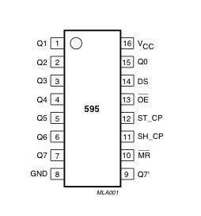
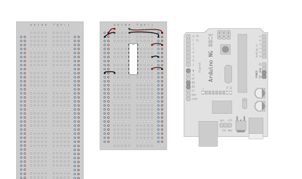
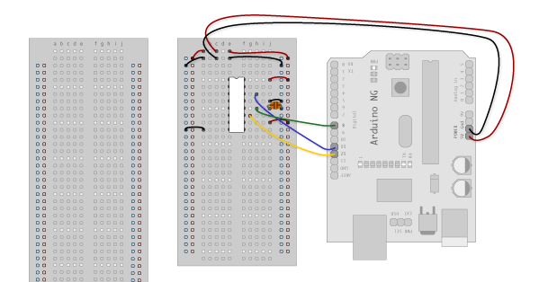
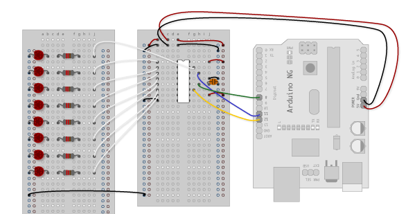
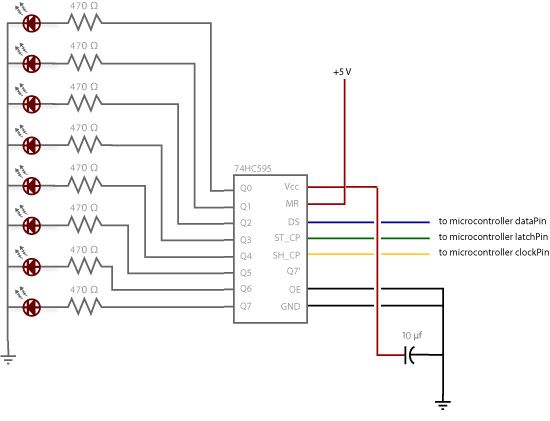
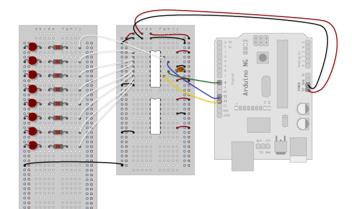
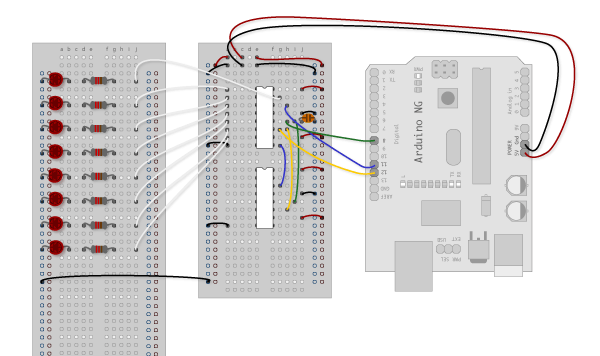
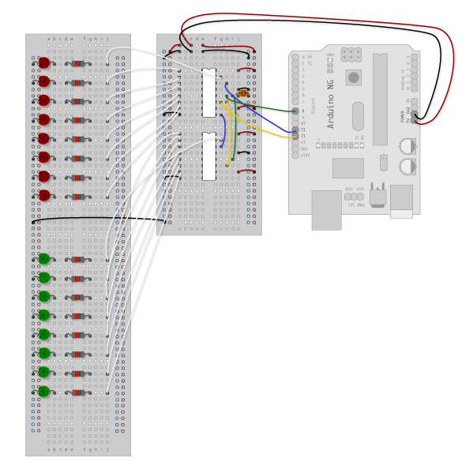

## Shifting Out & the 595 chip

At sometime or another you may run out of pins on your Arduino board and need to extend it with shift registers. This example is based on the 74HC595. The datasheet refers to the 74HC595 as an "8-bit serial-in, serial or parallel-out shift register with output latches; 3-state." In other words,  you can use it to control 8 outputs at a time while only taking up a few pins on your microcontroller. You can link multiple registers together to extend your output even more. (Users may also wish to search for other driver chips with "595" or "596" in their part numbers, there are many. The STP16C596 for example will drive 16 LED's and eliminates the series resistors with built-in constant current sources.)

How this all works is through something called "synchronous serial communication," i.e. you can pulse one pin up and down thereby communicating a data byte to the register bit by bit.  It's by pulsing second pin, the clock pin, that you delineate between bits. This is in contrast to using the "asynchronous serial communication" of the Serial.begin() function which relies on the sender and the receiver to be set independently to an agreed upon specified data rate. Once the whole byte is transmitted to the register the HIGH or LOW messages held in each bit get parceled out to each of the individual output pins.  This is the "parallel output" part, having all the pins do what you want them to do all at once.

The "serial output" part of this component comes from its extra pin which can pass the serial information received from the microcontroller out again unchanged. This means you can transmit 16 bits in a row (2 bytes) and the first 8 will flow through the first register into the second register and be expressed there. You can learn to do that from the second example.

"3 states" refers to the fact that you can set the output pins as either high, low or "[high impedance](http://en.wikipedia.org/wiki/High_impedance)." Unlike the HIGH and LOW states, you can"t set pins to their high impedance state individually.  You can only set the whole chip together. This is a pretty specialized thing to do -- Think of an LED array that might need to be controlled by completely different microcontrollers depending on a specific mode setting built into your project.  Neither example takes advantage of this feature and you won"t usually need to worry about getting a chip that has it.

**Here is a table explaining the pin-outs adapted from the [Phillip's datasheet](https://www.arduino.cc/en/uploads/Tutorial/595datasheet.pdf).**



| PINS 1-7, 15 | Q0 - Q7 | Output Pins                            |
| ------------ | ------- | -------------------------------------- |
| PIN 8        | GND     | Ground, Vss                            |
| PIN 9        | Q7      | Serial Out                             |
| PIN 10       | MR      | Master Reclear, active low             |
| PIN 11       | SH_CP   | Shift register clock pin               |
| PIN 12       | ST_CP   | Storage register clock pin (latch pin) |
| PIN 13       | OE      | Output enable, active low              |
| PIN 14       | DS      | Serial data input                      |
| PIN 16       | Vcc     | Positive supply voltage                |

##  Example 1: One Shift Register

The first step is to extend your Arduino with one shift register.

## The Circuit

### 1. Turning it on

Make the following connections:

- GND (pin 8) to ground,

- Vcc (pin 16) to 5V

- OE (pin 13)  to ground

- MR (pin 10) to 5V

This set up makes all of the output pins active and addressable all the time.  The one flaw of this set up is that you end up with the lights turning on to their last state or something arbitrary every time you first power up the circuit before the program starts to run. You can get around this by controlling the MR and OE pins from your Arduino board too, but this way will work and leave you with more open pins.



### 2. Connect to Arduino

- DS (pin 14)  to Ardunio DigitalPin 11 (blue wire)

- SH_CP (pin 11) to to Ardunio DigitalPin 12 (yellow wire)

- ST_CP (pin 12) to Ardunio DigitalPin 8 (green wire)

From now on those will be referred to as the dataPin, the clockPin and the latchPin respectively.  Notice the 0.1"f capacitor on the latchPin, if you have some flicker when the latch pin pulses you can use a capacitor to even it out.



### 3. Add 8 LEDs.

In this case you should connect the cathode (short pin) of each LED to a common ground, and the anode (long pin) of each LED to its respective shift register output pin.  Using the shift register to supply power like this is called *sourcing current.* Some shift registers can't source current, they can only do what is called *sinking current.*  If you have one of those it means you will have to flip the direction of the LEDs, putting the anodes directly to power and the cathodes (ground pins) to the shift register outputs. You should check the your specific datasheet if you aren't using a 595 series chip. Don't forget to add a 470-ohm resistor in series to protect the LEDs from being overloaded.



### Circuit Diagram



## The Code

Here are three code examples. The first is just some "hello world" code that simply outputs a byte value from 0 to 255. The second program  lights one LED at a time.  The third cycles through an array.


- 595 logic table:
[](https://www.arduino.cc/en/uploads/Tutorial/595_logic_table.png)

- 595 timing diagram:
[](https://www.arduino.cc/en/uploads/Tutorial/595_timing_diagram.png)


The code is based on  two pieces of information in the datasheet: the timing diagram and the logic table.  The logic table is what tells you that basically everything important happens on an up beat. When the clockPin goes from low to high, the shift register reads the state of the data pin. As the data gets shifted in it is saved in an internal memory register. When the latchPin goes from low to high the sent data gets moved from the shift registers aforementioned memory register into the output pins, lighting the LEDs.

- [Code Sample 1.1 Hello World](#shftout11)
- [Code Sample 1.2 One by One](#shftout12)
- [Code Sample 1.3 Using an array](#shftout13)

##  Example 2

In this example you'll add a second shift register, doubling the number of output pins you have while still using the same number of pins from the Arduino.

## The Circuit

### 1. Add a second shift register.

Starting from the previous example, you should put a second shift register on the board. It should have the same leads to power and ground.



### 2. Connect  the 2 registers.

Two of these connections simply extend the same clock and latch signal from the Arduino to the second shift register (yellow and green wires).  The blue wire is going from the serial out pin (pin 9) of the first shift register to the serial data input (pin 14) of the second register.



### 3. Add a second set of LEDs.

In this case I added green ones so when reading the code it is clear which byte is going to which set of LEDs



## Circuit Diagram


## The Code

Here again are  three code samples. If you are curious, you might want to try the samples from the first example with this circuit set up just to see what happens.

[Code Sample 2.1  Dual Binary Counters](#shftout21)
There is only one extra line of code compared to the first code sample from Example 1. It sends out a second byte. This forces the first shift register, the one directly attached to the Arduino,  to pass the first byte sent through to the second register, lighting the green LEDs. The second byte will then show up on the red LEDs.

[Code Sample 2.2  2 Byte One By One](#shftout22)
Comparing this code to the similar code from Example 1 you see that a little bit more has had to change.  The blinkAll() function has been changed to the blinkAll_2Bytes() function to reflect the fact that now there are 16 LEDs to control.  Also, in version 1 the pulsings of the latchPin were situated inside the subfunctions lightShiftPinA and lightShiftPinB(). Here they need to be moved back into the main loop to accommodate needing to run each subfunction twice in a row, once for the green LEDs and once for the red ones.

[Code Sample 2.3 - Dual Defined  Arrays](#shftout23)
Like sample 2.2, sample 2.3 also takes advantage of the new blinkAll_2bytes() function.  2.3's big difference from sample 1.3 is only that instead of just a single variable called "data" and a single array called "dataArray" you have to have a dataRED, a dataGREEN, dataArrayRED, dataArrayGREEN defined up front.   This means that line

`data = dataArray[j];`

becomes

`dataRED = dataArrayRED[j];
dataGREEN = dataArrayGREEN[j];`

and

`shiftOut(dataPin, clockPin, data);`

becomes

`shiftOut(dataPin, clockPin, dataGREEN);
shiftOut(dataPin, clockPin, dataRED);`


## Examples

### ShftOut11

```arduino
//**************************************************************//
//  Name    : shiftOutCode, Hello World
//  Author  : Carlyn Maw,Tom Igoe, David A. Mellis
//  Date    : 25 Oct, 2006
//  Modified: 23 Mar 2010
//  Version : 2.0
//  Notes   : Code for using a 74HC595 Shift Register           //
//          : to count from 0 to 255
//****************************************************************
//Pin connected to ST_CP of 74HC595
int latchPin = 8;
//Pin connected to SH_CP of 74HC595
int clockPin = 12;
////Pin connected to DS of 74HC595
int dataPin = 11;
void setup() {
//set pins to output so you can control the shift register
pinMode(latchPin, OUTPUT);
pinMode(clockPin, OUTPUT);
pinMode(dataPin, OUTPUT);
}
void loop() {
// count from 0 to 255 and display the number
// on the LEDs
for (int numberToDisplay = 0; numberToDisplay < 256; numberToDisplay++) {
// take the latchPin low so
// the LEDs don't change while you're sending in bits:
digitalWrite(latchPin, LOW);
// shift out the bits:
shiftOut(dataPin, clockPin, MSBFIRST, numberToDisplay);
//take the latch pin high so the LEDs will light up:
digitalWrite(latchPin, HIGH);
// pause before next value:
delay(500);
}
}
```

### ShftOut12

```arduino
/*
Shift Register Example
for 74HC595 shift register
This sketch turns reads serial input and uses it to set the pins
of a 74HC595 shift register.
Hardware:
* 74HC595 shift register attached to pins 8, 12, and 11 of the Arduino,
as detailed below.
* LEDs attached to each of the outputs of the shift register.
Created 22 May 2009
Created 23 Mar 2010
by Tom Igoe
*/
//Pin connected to latch pin (ST_CP) of 74HC595
const int latchPin = 8;
//Pin connected to clock pin (SH_CP) of 74HC595
const int clockPin = 12;
////Pin connected to Data in (DS) of 74HC595
const int dataPin = 11;
void setup() {
//set pins to output because they are addressed in the main loop
pinMode(latchPin, OUTPUT);
pinMode(dataPin, OUTPUT);
pinMode(clockPin, OUTPUT);
Serial.begin(9600);
Serial.println("reset");
}
void loop() {
if (Serial.available() > 0) {
// ASCII '0' through '9' characters are
// represented by the values 48 through 57.
// so if the user types a number from 0 through 9 in ASCII,
// you can subtract 48 to get the actual value:
int bitToSet = Serial.read() - 48;
// write to the shift register with the correct bit set high:
registerWrite(bitToSet, HIGH);
}
}
// This method sends bits to the shift register:
void registerWrite(int whichPin, int whichState) {
// the bits you want to send
byte bitsToSend = 0;
// turn off the output so the pins don't light up
// while you're shifting bits:
digitalWrite(latchPin, LOW);
// turn on the next highest bit in bitsToSend:
bitWrite(bitsToSend, whichPin, whichState);
// shift the bits out:
shiftOut(dataPin, clockPin, MSBFIRST, bitsToSend);
// turn on the output so the LEDs can light up:
digitalWrite(latchPin, HIGH);
}
```

### ShftOut13


```arduino
/*

  Shift Register Example

  Turning on the outputs of a 74HC595 using an array

 Hardware:

 * 74HC595 shift register

 * LEDs attached to each of the outputs of the shift register

 */
//Pin connected to ST_CP of 74HC595
int latchPin = 8;
//Pin connected to SH_CP of 74HC595
int clockPin = 12;
////Pin connected to DS of 74HC595
int dataPin = 11;

//holders for information you're going to pass to shifting function
byte data;
byte dataArray[10];

void setup() {

  //set pins to output because they are addressed in the main loop

  pinMode(latchPin, OUTPUT);

  Serial.begin(9600);

  //Binary notation as comment

  dataArray[0] = 0xFF; //0b11111111

  dataArray[1] = 0xFE; //0b11111110

  dataArray[2] = 0xFC; //0b11111100

  dataArray[3] = 0xF8; //0b11111000

  dataArray[4] = 0xF0; //0b11110000

  dataArray[5] = 0xE0; //0b11100000

  dataArray[6] = 0xC0; //0b11000000

  dataArray[7] = 0x80; //0b10000000

  dataArray[8] = 0x00; //0b00000000

  dataArray[9] = 0xE0; //0b11100000

  //function that blinks all the LEDs

  //gets passed the number of blinks and the pause time

  blinkAll_2Bytes(2,500);
}

void loop() {

  for (int j = 0; j < 10; j++) {

    //load the light sequence you want from array

    data = dataArray[j];

    //ground latchPin and hold low for as long as you are transmitting

    digitalWrite(latchPin, 0);

    //move 'em out

    shiftOut(dataPin, clockPin, data);

    //return the latch pin high to signal chip that it

    //no longer needs to listen for information

    digitalWrite(latchPin, 1);

    delay(300);

  }
}

// the heart of the program
void shiftOut(int myDataPin, int myClockPin, byte myDataOut) {

  // This shifts 8 bits out MSB first,

  //on the rising edge of the clock,

  //clock idles low

  //internal function setup

  int i=0;

  int pinState;

  pinMode(myClockPin, OUTPUT);

  pinMode(myDataPin, OUTPUT);

  //clear everything out just in case to

  //prepare shift register for bit shifting

  digitalWrite(myDataPin, 0);

  digitalWrite(myClockPin, 0);

  //for each bit in the byte myDataOut&#xFFFD;

  //NOTICE THAT WE ARE COUNTING DOWN in our for loop

  //This means that %00000001 or "1" will go through such

  //that it will be pin Q0 that lights.

  for (i=7; i>=0; i--)  {

    digitalWrite(myClockPin, 0);

    //if the value passed to myDataOut and a bitmask result

    // true then... so if we are at i=6 and our value is

    // %11010100 it would the code compares it to %01000000

    // and proceeds to set pinState to 1.

    if ( myDataOut & (1<<i) ) {

      pinState= 1;

    }

    else {

      pinState= 0;

    }

    //Sets the pin to HIGH or LOW depending on pinState

    digitalWrite(myDataPin, pinState);

    //register shifts bits on upstroke of clock pin

    digitalWrite(myClockPin, 1);

    //zero the data pin after shift to prevent bleed through

    digitalWrite(myDataPin, 0);

  }

  //stop shifting

  digitalWrite(myClockPin, 0);
}

//blinks the whole register based on the number of times you want to
//blink "n" and the pause between them "d"
//starts with a moment of darkness to make sure the first blink
//has its full visual effect.
void blinkAll_2Bytes(int n, int d) {

  digitalWrite(latchPin, 0);

  shiftOut(dataPin, clockPin, 0);

  shiftOut(dataPin, clockPin, 0);

  digitalWrite(latchPin, 1);

  delay(200);

  for (int x = 0; x < n; x++) {

    digitalWrite(latchPin, 0);

    shiftOut(dataPin, clockPin, 255);

    shiftOut(dataPin, clockPin, 255);

    digitalWrite(latchPin, 1);

    delay(d);

    digitalWrite(latchPin, 0);

    shiftOut(dataPin, clockPin, 0);

    shiftOut(dataPin, clockPin, 0);

    digitalWrite(latchPin, 1);

    delay(d);

  }
}
```

### ShftOut21


```arduino
//**************************************************************//
//  Name    : shiftOutCode, Dual Binary Counters                 //
//  Author  : Carlyn Maw, Tom Igoe                               //
//  Date    : 25 Oct, 2006                                       //
//  Version : 1.0                                                //
//  Notes   : Code for using a 74HC595 Shift Register            //
//          : to count from 0 to 255                             //
//**************************************************************//
//Pin connected to ST_CP of 74HC595
int latchPin = 8;
//Pin connected to SH_CP of 74HC595
int clockPin = 12;
////Pin connected to DS of 74HC595
int dataPin = 11;
void setup() {
//Start Serial for debugging purposes
Serial.begin(9600);
//set pins to output because they are addressed in the main loop
pinMode(latchPin, OUTPUT);
}
void loop() {
//count up routine
for (int j = 0; j < 256; j++) {
//ground latchPin and hold low for as long as you are transmitting
digitalWrite(latchPin, 0);
//count up on GREEN LEDs
shiftOut(dataPin, clockPin, j);
//count down on RED LEDs
shiftOut(dataPin, clockPin, 255-j);
//return the latch pin high to signal chip that it
//no longer needs to listen for information
digitalWrite(latchPin, 1);
delay(1000);
}
}
void shiftOut(int myDataPin, int myClockPin, byte myDataOut) {
// This shifts 8 bits out MSB first,
//on the rising edge of the clock,
//clock idles low
..//internal function setup
int i=0;
int pinState;
pinMode(myClockPin, OUTPUT);
pinMode(myDataPin, OUTPUT);
. //clear everything out just in case to
. //prepare shift register for bit shifting
digitalWrite(myDataPin, 0);
digitalWrite(myClockPin, 0);
//for each bit in the byte myDataOut&#xFFFD;
//NOTICE THAT WE ARE COUNTING DOWN in our for loop
//This means that %00000001 or "1" will go through such
//that it will be pin Q0 that lights.
for (i=7; i>=0; i--)  {
digitalWrite(myClockPin, 0);
//if the value passed to myDataOut and a bitmask result
// true then... so if we are at i=6 and our value is
// %11010100 it would the code compares it to %01000000
// and proceeds to set pinState to 1.
if ( myDataOut & (1<<i) ) {
pinState= 1;
}
else {
pinState= 0;
}
//Sets the pin to HIGH or LOW depending on pinState
digitalWrite(myDataPin, pinState);
//register shifts bits on upstroke of clock pin
digitalWrite(myClockPin, 1);
//zero the data pin after shift to prevent bleed through
digitalWrite(myDataPin, 0);
}
//stop shifting
digitalWrite(myClockPin, 0);
}
```

### ShftOut22


```arduino
//**************************************************************//
//  Name    : shiftOutCode, Dual One By One                           //
//  Author  : Carlyn Maw, Tom Igoe                               //
//  Date    : 25 Oct, 2006                                       //
//  Version : 1.0                                                //
//  Notes   : Code for using a 74HC595 Shift Register            //
//          : to count from 0 to 255                             //
//**************************************************************//
//Pin connected to ST_CP of 74HC595
int latchPin = 8;
//Pin connected to SH_CP of 74HC595
int clockPin = 12;
////Pin connected to DS of 74HC595
int dataPin = 11;
//holder for information you're going to pass to shifting function
byte data = 0;
void setup() {
//set pins to output because they are addressed in the main loop
pinMode(latchPin, OUTPUT);
}
void loop() {
//function that blinks all the LEDs
//gets passed the number of blinks and the pause time
blinkAll_2Bytes(1,500);
// light each pin one by one using a function A
for (int j = 0; j < 8; j++) {
//ground latchPin and hold low for as long as you are transmitting
digitalWrite(latchPin, 0);
//red LEDs
lightShiftPinA(7-j);
//green LEDs
lightShiftPinA(j);
//return the latch pin high to signal chip that it
//no longer needs to listen for information
digitalWrite(latchPin, 1);
delay(1000);
}
// light each pin one by one using a function A
for (int j = 0; j < 8; j++) {
//ground latchPin and hold low for as long as you are transmitting
digitalWrite(latchPin, 0);
//red LEDs
lightShiftPinB(j);
//green LEDs
lightShiftPinB(7-j);
//return the latch pin high to signal chip that it
//no longer needs to listen for information
digitalWrite(latchPin, 1);
delay(1000);
}
}
//This function uses bitwise math to move the pins up
void lightShiftPinA(int p) {
//defines a local variable
int pin;
//this is line uses a bitwise operator
//shifting a bit left using << is the same
//as multiplying the decimal number by two.
pin = 1<< p;
//move 'em out
shiftOut(dataPin, clockPin, pin);
}
//This function uses that fact that each bit in a byte
//is 2 times greater than the one before it to
//shift the bits higher
void lightShiftPinB(int p) {
//defines a local variable
int pin;
//start with the pin = 1 so that if 0 is passed to this
//function pin 0 will light.
pin = 1;
for (int x = 0; x < p; x++) {
pin = pin * 2;
}
//move 'em out
shiftOut(dataPin, clockPin, pin);
}
// the heart of the program
void shiftOut(int myDataPin, int myClockPin, byte myDataOut) {
// This shifts 8 bits out MSB first,
//on the rising edge of the clock,
//clock idles low
//internal function setup
int i=0;
int pinState;
pinMode(myClockPin, OUTPUT);
pinMode(myDataPin, OUTPUT);
//clear everything out just in case to
//prepare shift register for bit shifting
digitalWrite(myDataPin, 0);
digitalWrite(myClockPin, 0);
//for each bit in the byte myDataOut&#xFFFD;
//NOTICE THAT WE ARE COUNTING DOWN in our for loop
//This means that %00000001 or "1" will go through such
//that it will be pin Q0 that lights.
for (i=7; i>=0; i--)  {
digitalWrite(myClockPin, 0);
//if the value passed to myDataOut and a bitmask result
// true then... so if we are at i=6 and our value is
// %11010100 it would the code compares it to %01000000
// and proceeds to set pinState to 1.
if ( myDataOut & (1<<i) ) {
pinState= 1;
}
else {
pinState= 0;
}
//Sets the pin to HIGH or LOW depending on pinState
digitalWrite(myDataPin, pinState);
//register shifts bits on upstroke of clock pin
digitalWrite(myClockPin, 1);
//zero the data pin after shift to prevent bleed through
digitalWrite(myDataPin, 0);
}
//stop shifting
digitalWrite(myClockPin, 0);
}
//blinks both registers based on the number of times you want to
//blink "n" and the pause between them "d"
//starts with a moment of darkness to make sure the first blink
//has its full visual effect.
void blinkAll_2Bytes(int n, int d) {
digitalWrite(latchPin, 0);
shiftOut(dataPin, clockPin, 0);
shiftOut(dataPin, clockPin, 0);
digitalWrite(latchPin, 1);
delay(200);
for (int x = 0; x < n; x++) {
digitalWrite(latchPin, 0);
shiftOut(dataPin, clockPin, 255);
shiftOut(dataPin, clockPin, 255);
digitalWrite(latchPin, 1);
delay(d);
digitalWrite(latchPin, 0);
shiftOut(dataPin, clockPin, 0);
shiftOut(dataPin, clockPin, 0);
digitalWrite(latchPin, 1);
delay(d);
}
}
```

### ShftOut23


```arduino
//**************************************************************//
//  Name    : shiftOutCode, Predefined Dual Array Style         //
//  Author  : Carlyn Maw, Tom Igoe                              //
//  Date    : 25 Oct, 2006                                      //
//  Version : 1.0                                               //
//  Notes   : Code for using a 74HC595 Shift Register           //
//          : to count from 0 to 255                            //
//****************************************************************
//Pin connected to ST_CP of 74HC595
int latchPin = 8;
//Pin connected to SH_CP of 74HC595
int clockPin = 12;
////Pin connected to DS of 74HC595
int dataPin = 11;
//holders for information you're going to pass to shifting function
byte dataRED;
byte dataGREEN;
byte dataArrayRED[10];
byte dataArrayGREEN[10];
void setup() {
//set pins to output because they are addressed in the main loop
pinMode(latchPin, OUTPUT);
Serial.begin(9600);
//Arduino doesn't seem to have a way to write binary straight into the code
//so these values are in HEX.  Decimal would have been fine, too.
dataArrayRED[0] = 0xFF; //11111111
dataArrayRED[1] = 0xFE; //11111110
dataArrayRED[2] = 0xFC; //11111100
dataArrayRED[3] = 0xF8; //11111000
dataArrayRED[4] = 0xF0; //11110000
dataArrayRED[5] = 0xE0; //11100000
dataArrayRED[6] = 0xC0; //11000000
dataArrayRED[7] = 0x80; //10000000
dataArrayRED[8] = 0x00; //00000000
dataArrayRED[9] = 0xE0; //11100000
//Arduino doesn't seem to have a way to write binary straight into the code
//so these values are in HEX.  Decimal would have been fine, too.
dataArrayGREEN[0] = 0xFF; //11111111
dataArrayGREEN[1] = 0x7F; //01111111
dataArrayGREEN[2] = 0x3F; //00111111
dataArrayGREEN[3] = 0x1F; //00011111
dataArrayGREEN[4] = 0x0F; //00001111
dataArrayGREEN[5] = 0x07; //00000111
dataArrayGREEN[6] = 0x03; //00000011
dataArrayGREEN[7] = 0x01; //00000001
dataArrayGREEN[8] = 0x00; //00000000
dataArrayGREEN[9] = 0x07; //00000111
//function that blinks all the LEDs
//gets passed the number of blinks and the pause time
blinkAll_2Bytes(2,500);
}
void loop() {
for (int j = 0; j < 10; j++) {
//load the light sequence you want from array
dataRED = dataArrayRED[j];
dataGREEN = dataArrayGREEN[j];
//ground latchPin and hold low for as long as you are transmitting
digitalWrite(latchPin, 0);
//move 'em out
shiftOut(dataPin, clockPin, dataGREEN);
shiftOut(dataPin, clockPin, dataRED);
//return the latch pin high to signal chip that it
//no longer needs to listen for information
digitalWrite(latchPin, 1);
delay(300);
}
}
// the heart of the program
void shiftOut(int myDataPin, int myClockPin, byte myDataOut) {
// This shifts 8 bits out MSB first,
//on the rising edge of the clock,
//clock idles low
//internal function setup
int i=0;
int pinState;
pinMode(myClockPin, OUTPUT);
pinMode(myDataPin, OUTPUT);
//clear everything out just in case to
//prepare shift register for bit shifting
digitalWrite(myDataPin, 0);
digitalWrite(myClockPin, 0);
//for each bit in the byte myDataOut&#xFFFD;
//NOTICE THAT WE ARE COUNTING DOWN in our for loop
//This means that %00000001 or "1" will go through such
//that it will be pin Q0 that lights.
for (i=7; i>=0; i--)  {
digitalWrite(myClockPin, 0);
//if the value passed to myDataOut and a bitmask result
// true then... so if we are at i=6 and our value is
// %11010100 it would the code compares it to %01000000
// and proceeds to set pinState to 1.
if ( myDataOut & (1<<i) ) {
pinState= 1;
}
else {
pinState= 0;
}
//Sets the pin to HIGH or LOW depending on pinState
digitalWrite(myDataPin, pinState);
//register shifts bits on upstroke of clock pin
digitalWrite(myClockPin, 1);
//zero the data pin after shift to prevent bleed through
digitalWrite(myDataPin, 0);
}
//stop shifting
digitalWrite(myClockPin, 0);
}
//blinks the whole register based on the number of times you want to
//blink "n" and the pause between them "d"
//starts with a moment of darkness to make sure the first blink
//has its full visual effect.
void blinkAll_2Bytes(int n, int d) {
digitalWrite(latchPin, 0);
shiftOut(dataPin, clockPin, 0);
shiftOut(dataPin, clockPin, 0);
digitalWrite(latchPin, 1);
delay(200);
for (int x = 0; x < n; x++) {
digitalWrite(latchPin, 0);
shiftOut(dataPin, clockPin, 255);
shiftOut(dataPin, clockPin, 255);
digitalWrite(latchPin, 1);
delay(d);
digitalWrite(latchPin, 0);
shiftOut(dataPin, clockPin, 0);
shiftOut(dataPin, clockPin, 0);
digitalWrite(latchPin, 1);
delay(d);
}
}
```