In this tutorial you will learn how to communicate with a computer using a MAX3323 single channel RS-232 driver/receiver and a software serial connection on the Arduino. A general purpose software serial tutorial can be found [here](http://www.arduino.cc/en/Tutorial/SoftwareSerial).

Materials needed:

* Computer with a terminal program installed (ie. HyperTerminal or RealTerm on the PC, Zterm on Mac)
* Serial-Breadboard cable
* MAX3323 chip (or similar)
* 4 1uf capacitors
* Solderless breadboard
* Hookup wire
* Arduino Microcontroller Module
* Light emitting Diode (LED) - optional, for debugging

## Prepare the Breadboard

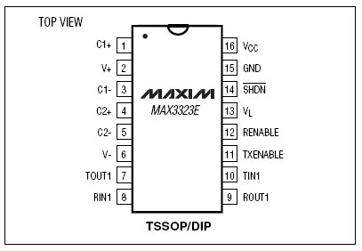

Insert the MAX3323 chip in the breadboard. Connect 5V power and ground from the breadboard to 5V power and ground from the microcontroller. Connect pin 15 on the MAX233 chip to ground and pins 16 and 14 - 11 to 5V. If you are using an LED connect it between pin 13 and ground.

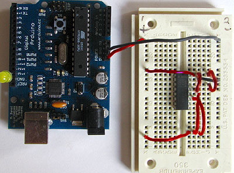

Connect a 1uF capacitor across pins 1 and 3, another across pins 4 and 5, another between pin 2 and ground, and the last between pin 6 and ground. If you are using polarized capacitors make sure the negative pins connect to the negative sides (pins 3 and 5 and ground).

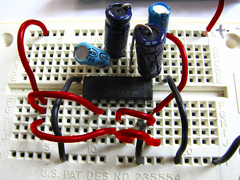

Determine which Arduino pins you want to use for your transmit (TX) and receive (RX) lines. In this tutorial we will be using Arduino pin 6 for receiving and pin 7 for transmitting. Connect your TX pin (7) to MAX3323 pin 10 (T1IN). Connect your RX pin (6) to MAX3323 pin 9 (R1OUT).

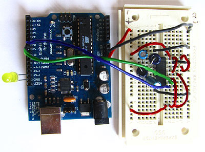

## Cables

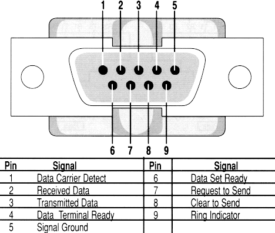


If you do not have one already, you need to make a cable to connect from the serial port (or USB-serial adapter) on your computer and the breadboard. To do this, pick up a female DB9 connector from radioshack. Pick three different colors of wire, one for TX, one for RX, and one for ground. Solder your TX wire to pin 2 of the DB9 connector, RX wire to pin 3 and Ground to pin 5.

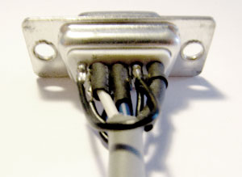

Connect pins 1 and 6 to pin 4 and pin 7 to pin 8. Heatshrink the wire connections to avoid accidental shorts.

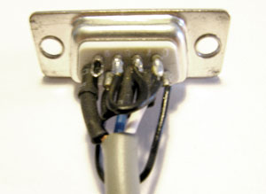

Enclose the connector in a backshell to further protect the signal and enable easy unplugging from your serial port.

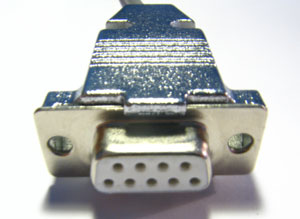

Connect the TX line from your computer to pin 8 (R1IN) on the MAX233 and the RX line to pin 7 (T1OUT). Connect the ground line from your computer to ground on the breadboard.

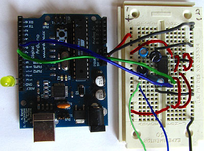

TX wires Green, RX wires Blue, +5v wires are red, GND wires are black

## Program the Arduino

Now we will write the code to enable serial data communication. This program will simply wait for a character to arrive in the serial receiving port and then spit it back out in uppercase out the transmit port. This is a good general purpose serial debugging program and you should be able to extrapolate from this example to cover all your basic serial needs. Upload the following code into the Arduino microcontroller module:

```arduino

//Created August 23 2006
//Heather Dewey-Hagborg
//http://www.arduino.cc

#include <ctype.h>

#define bit9600Delay 100  
#define halfBit9600Delay 50
#define bit4800Delay 188
#define halfBit4800Delay 94

byte rx = 6;
byte tx = 7;
byte SWval;

void setup() {
  pinMode(rx,INPUT);
  pinMode(tx,OUTPUT);
  digitalWrite(tx,HIGH);
  delay(2);
  digitalWrite(13,HIGH); //turn on debugging LED
  SWprint('h');  //debugging hello
  SWprint('i');
  SWprint(10); //carriage return
}

void SWprint(int data)
{
  byte mask;
  //startbit
  digitalWrite(tx,LOW);
  delayMicroseconds(bit9600Delay);
  for (mask = 0x01; mask>0; mask <<= 1) {
    if (data & mask){ // choose bit
     digitalWrite(tx,HIGH); // send 1
    }
    else{
     digitalWrite(tx,LOW); // send 0
    }
    delayMicroseconds(bit9600Delay);
  }
  //stop bit
  digitalWrite(tx, HIGH);
  delayMicroseconds(bit9600Delay);
}

int SWread()
{
  byte val = 0;
  while (digitalRead(rx));
  //wait for start bit
  if (digitalRead(rx) == LOW) {
    delayMicroseconds(halfBit9600Delay);
    for (int offset = 0; offset < 8; offset++) {
     delayMicroseconds(bit9600Delay);
     val |= digitalRead(rx) << offset;
    }
    //wait for stop bit + extra
    delayMicroseconds(bit9600Delay);
    delayMicroseconds(bit9600Delay);
    return val;
  }
}

void loop()
{
    SWval = SWread();
    SWprint(toupper(SWval));
}
```

Open up your serial terminal program and set it to 9600 baud, 8 data bits, 1 stop bit, no parity, no hardware flow control. Press the reset button on the arduino board. The word "hi" should appear in the terminal window followed by an advancement to the next line. Here is a shot of what it should look like in Hyperterminal, the free pre-installed windows terminal application.

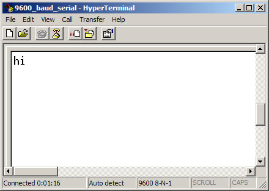

Now, try typing a lowercase character into the terminal window. You should see the letter you typed return to you in uppercase.

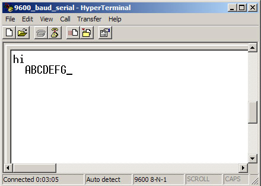

If this works, congratulations! Your serial connection is working as planned. You can now use your new serial/computer connection to print debugging statements from your code, and to send commands to your microcontroller.

*code and tutorial by Heather Dewey-Hagborg, photos by Thomas Dexter*