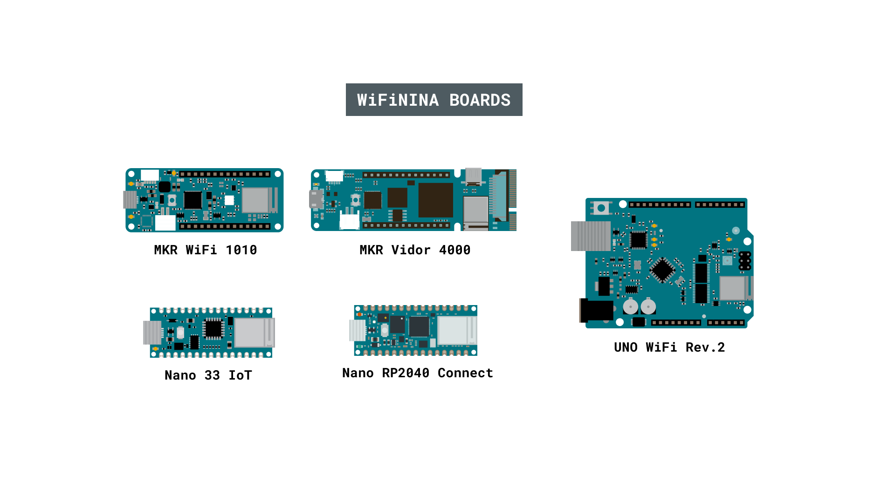
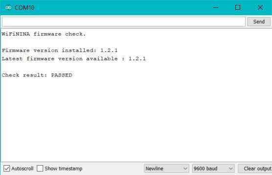

The [WiFiNINA library](https://www.arduino.cc/reference/en/libraries/wifinina/) is designed for Arduino boards using a [NINA W-10 series module](https://content.arduino.cc/assets/Arduino_NINA-W10_DataSheet_%28UBX-17065507%29.pdf). In this article you will find a series of examples that can be uploaded to your board.

You can also visit the [WiFiNINA GitHub repository](https://github.com/arduino-libraries/WiFiNINA) to learn more about this library.

## Hardware Required

- [Arduino MKR WiFi 1010](https://store.arduino.cc/arduino-mkr-wifi-1010)
- [Arduino MKR VIDOR 4000](https://store.arduino.cc/arduino-vidor-4000)
- [Arduino UNO WiFi Rev.2](https://store.arduino.cc/arduino-uno-wiFi-rev2)
- [Arduino Nano 33 IoT](https://store.arduino.cc/products/arduino-nano-33-iot)
- [Arduino Nano RP2040 Connect](https://store.arduino.cc/products/arduino-nano-rp2040-connect)

## Circuit

Most examples in this article uses no external circuit, only the board itself is required.



***Please note: these three boards use dedicated pins to communicate and select the WiFi module, therefore you have no restriction in the usage of the available digital pins connected to the header pins.***

## Examples

### WiFiNINA AP Simple Web Server

In this example,  a simple web server lets you blink an LED via the web. This example uses the beginAP() function to set up an access point without relying on a local WiFI network. This example will print the IP address of your WiFi module to the Arduino Software (IDE) serial monitor. Once you know the IP address of our board, you can open that address in a web browser to turn on and off the LED on pin 9.

If the IP address of your shield is yourAddress:

- [http://yourAddress/H](http://yourAddress/H) turns the LED on
- [http://yourAddress/L](http://yourAddress/L) turns it off


The default address of the board in AP mode is 192.168.4.1.  When you load this sketch, the WiFi module creates an Access Point with the name specified as SSID in arduino_secrets.h. Connect to it using the password specified as PASS.

```arduino

/*

  WiFi Web Server LED Blink

  A simple web server that lets you blink an LED via the web.

  This sketch will create a new access point (with no password).

  It will then launch a new server and print out the IP address

  to the Serial monitor. From there, you can open that address in a web browser

  to turn on and off the LED on pin 13.

  If the IP address of your board is yourAddress:

    http://yourAddress/H turns the LED on

    http://yourAddress/L turns it off

  created 25 Nov 2012

  by Tom Igoe

  adapted to WiFi AP by Adafruit

 */

#include <SPI.h>
#include <WiFiNINA.h>
#include "arduino_secrets.h"
///////please enter your sensitive data in the Secret tab/arduino_secrets.h
char ssid[] = SECRET_SSID;        // your network SSID (name)
char pass[] = SECRET_PASS;    // your network password (use for WPA, or use as key for WEP)
int keyIndex = 0;                // your network key Index number (needed only for WEP)

int led =  LED_BUILTIN;
int status = WL_IDLE_STATUS;

WiFiServer server(80);

void setup() {

  //Initialize serial and wait for port to open:

  Serial.begin(9600);

  while (!Serial) {

    ; // wait for serial port to connect. Needed for native USB port only

  }

  Serial.println("Access Point Web Server");

  pinMode(led, OUTPUT);      // set the LED pin mode

  // check for the WiFi module:

  if (WiFi.status() == WL_NO_MODULE) {

    Serial.println("Communication with WiFi module failed!");

    // don't continue

    while (true);

  }

  String fv = WiFi.firmwareVersion();

  if (fv < WIFI_FIRMWARE_LATEST_VERSION) {

    Serial.println("Please upgrade the firmware");

  }

  // by default the local IP address of will be 192.168.4.1

  // you can override it with the following:

  // WiFi.config(IPAddress(10, 0, 0, 1));

  // print the network name (SSID);

  Serial.print("Creating access point named: ");

  Serial.println(ssid);

  // Create open network. Change this line if you want to create an WEP network:

  status = WiFi.beginAP(ssid, pass);

  if (status != WL_AP_LISTENING) {

    Serial.println("Creating access point failed");

    // don't continue

    while (true);

  }

  // wait 10 seconds for connection:

  delay(10000);

  // start the web server on port 80

  server.begin();

  // you're connected now, so print out the status

  printWiFiStatus();
}

void loop() {

  // compare the previous status to the current status

  if (status != WiFi.status()) {

    // it has changed update the variable

    status = WiFi.status();

    if (status == WL_AP_CONNECTED) {

      // a device has connected to the AP

      Serial.println("Device connected to AP");

    } else {

      // a device has disconnected from the AP, and we are back in listening mode

      Serial.println("Device disconnected from AP");

    }

  }


  WiFiClient client = server.available();   // listen for incoming clients

  if (client) {                             // if you get a client,

    Serial.println("new client");           // print a message out the serial port

    String currentLine = "";                // make a String to hold incoming data from the client

    while (client.connected()) {            // loop while the client's connected

      if (client.available()) {             // if there's bytes to read from the client,

        char c = client.read();             // read a byte, then

        Serial.write(c);                    // print it out the serial monitor

        if (c == '\n') {                    // if the byte is a newline character

          // if the current line is blank, you got two newline characters in a row.

          // that's the end of the client HTTP request, so send a response:

          if (currentLine.length() == 0) {

            // HTTP headers always start with a response code (e.g. HTTP/1.1 200 OK)

            // and a content-type so the client knows what's coming, then a blank line:

            client.println("HTTP/1.1 200 OK");

            client.println("Content-type:text/html");

            client.println();

            // the content of the HTTP response follows the header:

            client.print("Click <a href=\"/H\">here</a> turn the LED on<br>");

            client.print("Click <a href=\"/L\">here</a> turn the LED off<br>");

            // The HTTP response ends with another blank line:

            client.println();

            // break out of the while loop:

            break;

          }

          else {      // if you got a newline, then clear currentLine:

            currentLine = "";

          }

        }

        else if (c != '\r') {    // if you got anything else but a carriage return character,

          currentLine += c;      // add it to the end of the currentLine

        }

        // Check to see if the client request was "GET /H" or "GET /L":

        if (currentLine.endsWith("GET /H")) {

          digitalWrite(led, HIGH);               // GET /H turns the LED on

        }

        if (currentLine.endsWith("GET /L")) {

          digitalWrite(led, LOW);                // GET /L turns the LED off

        }

      }

    }

    // close the connection:

    client.stop();

    Serial.println("client disconnected");

  }
}

void printWiFiStatus() {

  // print the SSID of the network you're attached to:

  Serial.print("SSID: ");

  Serial.println(WiFi.SSID());

  // print your WiFi shield's IP address:

  IPAddress ip = WiFi.localIP();

  Serial.print("IP Address: ");

  Serial.println(ip);

  // print where to go in a browser:

  Serial.print("To see this page in action, open a browser to http://");

  Serial.println(ip);

}
```

### WiFiNINA Connect No Encryption

This example shows you how to connect to an open (not encrypted) 802.11b/g network with one of the boards that support this library.  Your Arduino Software (IDE) serial monitor will provide information about the connection once it has connected.

You should have access to a 802.11b/g wireless network that connects to the internet for this example. You will need to change the network settings in the sketch to correspond to your particular networks SSID.

```arduino

/*

 This example connects to an unencrypted Wifi network.

 Then it prints the MAC address of the board,

 the IP address obtained, and other network details.

 created 13 July 2010

 by dlf (Metodo2 srl)

 modified 31 May 2012

 by Tom Igoe

 */
#include <SPI.h>
#include <WiFiNINA.h>

#include "arduino_secrets.h"
///////please enter your sensitive data in the Secret tab/arduino_secrets.h
char ssid[] = SECRET_SSID;        // your network SSID (name)
int status = WL_IDLE_STATUS;     // the Wifi radio's status

void setup() {

  //Initialize serial and wait for port to open:

  Serial.begin(9600);

  while (!Serial) {

    ; // wait for serial port to connect. Needed for native USB port only

  }

  // check for the WiFi module:

  if (WiFi.status() == WL_NO_MODULE) {

    Serial.println("Communication with WiFi module failed!");

    // don't continue

    while (true);

  }

  String fv = WiFi.firmwareVersion();

  if (fv < WIFI_FIRMWARE_LATEST_VERSION) {

    Serial.println("Please upgrade the firmware");

  }

  // attempt to connect to Wifi network:

  while (status != WL_CONNECTED) {

    Serial.print("Attempting to connect to open SSID: ");

    Serial.println(ssid);

    status = WiFi.begin(ssid);

    // wait 10 seconds for connection:

    delay(10000);

  }

  // you're connected now, so print out the data:

  Serial.print("You're connected to the network");

  printCurrentNet();

  printWifiData();
}

void loop() {

  // check the network connection once every 10 seconds:

  delay(10000);

  printCurrentNet();
}

void printWifiData() {

  // print your board's IP address:

  IPAddress ip = WiFi.localIP();

  Serial.print("IP Address: ");

  Serial.println(ip);

  Serial.println(ip);

  // print your MAC address:

  byte mac[6];

  WiFi.macAddress(mac);

  Serial.print("MAC address: ");

  printMacAddress(mac);

  // print your subnet mask:

  IPAddress subnet = WiFi.subnetMask();

  Serial.print("NetMask: ");

  Serial.println(subnet);

  // print your gateway address:

  IPAddress gateway = WiFi.gatewayIP();

  Serial.print("Gateway: ");

  Serial.println(gateway);
}

void printCurrentNet() {

  // print the SSID of the network you're attached to:

  Serial.print("SSID: ");

  Serial.println(WiFi.SSID());

  // print the MAC address of the router you're attached to:

  byte bssid[6];

  WiFi.BSSID(bssid);

  Serial.print("BSSID: ");

  printMacAddress(bssid);

  // print the received signal strength:

  long rssi = WiFi.RSSI();

  Serial.print("signal strength (RSSI):");

  Serial.println(rssi);

  // print the encryption type:

  byte encryption = WiFi.encryptionType();

  Serial.print("Encryption Type:");

  Serial.println(encryption, HEX);
}

void printMacAddress(byte mac[]) {

  for (int i = 5; i >= 0; i--) {

    if (mac[i] < 16) {

      Serial.print("0");

    }

    Serial.print(mac[i], HEX);

    if (i > 0) {

      Serial.print(":");

    }

  }

  Serial.println();
}
```

### WifiNINA Connect With WEP

This example shows you how to connect to a WEP encrypted 802.11b/g network with one of the boards that support this library.  Your Arduino Software (IDE) serial monitor will provide information about the connection once it has connected.

You should have access to a 802.11b/g wireless network that connects to the internet for this example. You will need to change the network settings in the sketch to correspond to your particular networks SSID.

WEP network passwords are hexadecimal strings known as keys. A WEP network can have 4 different keys; each key is assigned a "Key Index" value. For WEP encrypted networks, you need the SSID, the key, and key number.

```arduino
/*

 This example connects to a WEP-encrypted Wifi network.

 Then it prints the  MAC address of the Wifi module,

 the IP address obtained, and other network details.

 If you use 40-bit WEP, you need a key that is 10 characters long,

 and the characters must be hexadecimal (0-9 or A-F).

 e.g.  for 40-bit, ABBADEAF01 will work, but ABBADEAF won't work

 (too short) and ABBAISDEAF won't work (I and S are not

 hexadecimal characters).

 For 128-bit, you need a string that is 26 characters long.

 D0D0DEADF00DABBADEAFBEADED will work because it's 26 characters,

 all in the 0-9, A-F range.

 created 13 July 2010

 by dlf (Metodo2 srl)

 modified 31 May 2012

 by Tom Igoe

 */
#include <SPI.h>
#include <WiFiNINA.h>

#include "arduino_secrets.h"
///////please enter your sensitive data in the Secret tab/arduino_secrets.h
char ssid[] = SECRET_SSID;        // your network SSID (name)
char pass[] = SECRET_PASS;    // your network password (use for WPA, or use as key for WEP)
int keyIndex = 0;                                // your network key Index number
int status = WL_IDLE_STATUS;                     // the Wifi radio's status

void setup() {

  //Initialize serial and wait for port to open:

  Serial.begin(9600);

  while (!Serial) {

    ; // wait for serial port to connect. Needed for native USB port only

  }

  // check for the WiFi module:

  if (WiFi.status() == WL_NO_MODULE) {

    Serial.println("Communication with WiFi module failed!");

    // don't continue

    while (true);

  }

  String fv = WiFi.firmwareVersion();

  if (fv < WIFI_FIRMWARE_LATEST_VERSION) {

    Serial.println("Please upgrade the firmware");

  }

  // attempt to connect to Wifi network:

  while (status != WL_CONNECTED) {

    Serial.print("Attempting to connect to WEP network, SSID: ");

    Serial.println(ssid);

    status = WiFi.begin(ssid, keyIndex, pass);

    // wait 10 seconds for connection:

    delay(10000);

  }

  // once you are connected :

  Serial.print("You're connected to the network");

  printCurrentNet();

  printWifiData();
}

void loop() {

  // check the network connection once every 10 seconds:

  delay(10000);

  printCurrentNet();
}

void printWifiData() {

  // print your board's IP address:

  IPAddress ip = WiFi.localIP();

  Serial.print("IP Address: ");

  Serial.println(ip);

  Serial.println(ip);

  // print your MAC address:

  byte mac[6];

  WiFi.macAddress(mac);

  Serial.print("MAC address: ");

  printMacAddress(mac);
}

void printCurrentNet() {

  // print the SSID of the network you're attached to:

  Serial.print("SSID: ");

  Serial.println(WiFi.SSID());

  // print the MAC address of the router you're attached to:

  byte bssid[6];

  WiFi.BSSID(bssid);

  Serial.print("BSSID: ");

  printMacAddress(bssid);

  // print the received signal strength:

  long rssi = WiFi.RSSI();

  Serial.print("signal strength (RSSI):");

  Serial.println(rssi);

  // print the encryption type:

  byte encryption = WiFi.encryptionType();

  Serial.print("Encryption Type:");

  Serial.println(encryption, HEX);

  Serial.println();
}

void printMacAddress(byte mac[]) {

  for (int i = 5; i >= 0; i--) {

    if (mac[i] < 16) {

      Serial.print("0");

    }

    Serial.print(mac[i], HEX);

    if (i > 0) {

      Serial.print(":");

    }

  }

  Serial.println();
}
```

### WifiNINA Connect With WPA

This example shows you how to connect to a WPA2 Personal encrypted 802.11b/g network with one of the boards that support this library.  Your Arduino Software (IDE) serial monitor will provide information about the connection once it has connected.

You should have access to a 802.11b/g wireless network that connects to the internet for this example. You will need to change the network settings in the sketch to correspond to your particular networks SSID.

For networks using WPA/WPA2 Personal encryption, you need the SSID and password. The module will not connect to networks using WPA2 Enterprise encryption.

```arduino
/*

 This example connects to an unencrypted Wifi network.

 Then it prints the  MAC address of the Wifi module,

 the IP address obtained, and other network details.

 created 13 July 2010

 by dlf (Metodo2 srl)

 modified 31 May 2012

 by Tom Igoe

 */
#include <SPI.h>
#include <WiFiNINA.h>

#include "arduino_secrets.h"
///////please enter your sensitive data in the Secret tab/arduino_secrets.h
char ssid[] = SECRET_SSID;        // your network SSID (name)
char pass[] = SECRET_PASS;    // your network password (use for WPA, or use as key for WEP)
int status = WL_IDLE_STATUS;     // the Wifi radio's status

void setup() {

  //Initialize serial and wait for port to open:

  Serial.begin(9600);

  while (!Serial) {

    ; // wait for serial port to connect. Needed for native USB port only

  }

  // check for the WiFi module:

  if (WiFi.status() == WL_NO_MODULE) {

    Serial.println("Communication with WiFi module failed!");

    // don't continue

    while (true);

  }

  String fv = WiFi.firmwareVersion();

  if (fv < WIFI_FIRMWARE_LATEST_VERSION) {

    Serial.println("Please upgrade the firmware");

  }

  // attempt to connect to Wifi network:

  while (status != WL_CONNECTED) {

    Serial.print("Attempting to connect to WPA SSID: ");

    Serial.println(ssid);

    // Connect to WPA/WPA2 network:

    status = WiFi.begin(ssid, pass);

    // wait 10 seconds for connection:

    delay(10000);

  }

  // you're connected now, so print out the data:

  Serial.print("You're connected to the network");

  printCurrentNet();

  printWifiData();

}

void loop() {

  // check the network connection once every 10 seconds:

  delay(10000);

  printCurrentNet();
}

void printWifiData() {

  // print your board's IP address:

  IPAddress ip = WiFi.localIP();

  Serial.print("IP Address: ");

  Serial.println(ip);

  Serial.println(ip);

  // print your MAC address:

  byte mac[6];

  WiFi.macAddress(mac);

  Serial.print("MAC address: ");

  printMacAddress(mac);
}

void printCurrentNet() {

  // print the SSID of the network you're attached to:

  Serial.print("SSID: ");

  Serial.println(WiFi.SSID());

  // print the MAC address of the router you're attached to:

  byte bssid[6];

  WiFi.BSSID(bssid);

  Serial.print("BSSID: ");

  printMacAddress(bssid);

  // print the received signal strength:

  long rssi = WiFi.RSSI();

  Serial.print("signal strength (RSSI):");

  Serial.println(rssi);

  // print the encryption type:

  byte encryption = WiFi.encryptionType();

  Serial.print("Encryption Type:");

  Serial.println(encryption, HEX);

  Serial.println();
}

void printMacAddress(byte mac[]) {

  for (int i = 5; i >= 0; i--) {

    if (mac[i] < 16) {

      Serial.print("0");

    }

    Serial.print(mac[i], HEX);

    if (i > 0) {

      Serial.print(":");

    }

  }

  Serial.println();
}
```

### WifiNINA Scan Networks

This example scans for 802.11b/g network with one of the boards that support this library.  Your Arduino Software (IDE) serial monitor will print out information about the board and the networks it can see. It will not connect to a network.

Open your Arduino Software (IDE) serial monitor to view the networks the WiFi module can see. The shield may not see as many networks as your computer.

```arduino
/*

 This example  prints the board's MAC address, and

 scans for available Wifi networks using the NINA module.

 Every ten seconds, it scans again. It doesn't actually

 connect to any network, so no encryption scheme is specified.

 Circuit:

 * Board with NINA module (Arduino MKR WiFi 1010, MKR VIDOR 4000 and UNO WiFi Rev.2)

 created 13 July 2010

 by dlf (Metodo2 srl)

 modified 21 Junn 2012

 by Tom Igoe and Jaymes Dec

 */

#include <SPI.h>
#include <WiFiNINA.h>

void setup() {

  //Initialize serial and wait for port to open:

  Serial.begin(9600);

  while (!Serial) {

    ; // wait for serial port to connect. Needed for native USB port only

  }

  // check for the WiFi module:

  if (WiFi.status() == WL_NO_MODULE) {

    Serial.println("Communication with WiFi module failed!");

    // don't continue

    while (true);

  }

  String fv = WiFi.firmwareVersion();

  if (fv < WIFI_FIRMWARE_LATEST_VERSION) {

    Serial.println("Please upgrade the firmware");

  }

  // print your MAC address:

  byte mac[6];

  WiFi.macAddress(mac);

  Serial.print("MAC: ");

  printMacAddress(mac);
}

void loop() {

  // scan for existing networks:

  Serial.println("Scanning available networks...");

  listNetworks();

  delay(10000);
}

void listNetworks() {

  // scan for nearby networks:

  Serial.println("** Scan Networks **");

  int numSsid = WiFi.scanNetworks();

  if (numSsid == -1) {

    Serial.println("Couldn't get a wifi connection");

    while (true);

  }

  // print the list of networks seen:

  Serial.print("number of available networks:");

  Serial.println(numSsid);

  // print the network number and name for each network found:

  for (int thisNet = 0; thisNet < numSsid; thisNet++) {

    Serial.print(thisNet);

    Serial.print(") ");

    Serial.print(WiFi.SSID(thisNet));

    Serial.print("\tSignal: ");

    Serial.print(WiFi.RSSI(thisNet));

    Serial.print(" dBm");

    Serial.print("\tEncryption: ");

    printEncryptionType(WiFi.encryptionType(thisNet));

  }
}

void printEncryptionType(int thisType) {

  // read the encryption type and print out the name:

  switch (thisType) {

    case ENC_TYPE_WEP:

      Serial.println("WEP");

      break;

    case ENC_TYPE_TKIP:

      Serial.println("WPA");

      break;

    case ENC_TYPE_CCMP:

      Serial.println("WPA2");

      break;

    case ENC_TYPE_NONE:

      Serial.println("None");

      break;

    case ENC_TYPE_AUTO:

      Serial.println("Auto");

      break;

    case ENC_TYPE_UNKNOWN:

    default:

      Serial.println("Unknown");

      break;

  }
}

void printMacAddress(byte mac[]) {

  for (int i = 5; i >= 0; i--) {

    if (mac[i] < 16) {

      Serial.print("0");

    }

    Serial.print(mac[i], HEX);

    if (i > 0) {

      Serial.print(":");

    }

  }

  Serial.println();
}
```

### WifiNINA Scan Networks Advanced

This example scans for 802.11b/g network with one of the boards that support this library.  Your Arduino Software (IDE) serial monitor will print out information about the board and the networks it can see, with the encryption type. It will not connect to a network.

Open your Arduino Software (IDE) serial monitor to view the networks the WiFi module can see. The shield may not see as many networks as your computer, but it will show also the encryption type.

```arduino
/*

  This example  prints the board's MAC address, and

  scans for available WiFi networks using the NINA module.

  Every ten seconds, it scans again. It doesn't actually

  connect to any network, so no encryption scheme is specified.

  BSSID and WiFi channel are printed

  Circuit:

  * Board with NINA module (Arduino MKR WiFi 1010, MKR VIDOR 4000 and UNO WiFi Rev.2)

  This example is based on ScanNetworks

  created 1 Mar 2017

  by Arturo Guadalupi

*/

#include <SPI.h>
#include <WiFiNINA.h>

void setup() {

  //Initialize serial and wait for port to open:

  Serial.begin(9600);

  while (!Serial) {

    ; // wait for serial port to connect. Needed for native USB port only

  }

  // check for the WiFi module:

  if (WiFi.status() == WL_NO_MODULE) {

    Serial.println("Communication with WiFi module failed!");

    // don't continue

    while (true);

  }

  String fv = WiFi.firmwareVersion();

  if (fv < WIFI_FIRMWARE_LATEST_VERSION) {

    Serial.println("Please upgrade the firmware");

  }

  // print your MAC address:

  byte mac[6];

  WiFi.macAddress(mac);

  Serial.print("MAC: ");

  printMacAddress(mac);

  // scan for existing networks:

  Serial.println();

  Serial.println("Scanning available networks...");

  listNetworks();
}

void loop() {

  delay(10000);

  // scan for existing networks:

  Serial.println("Scanning available networks...");

  listNetworks();
}

void listNetworks() {

  // scan for nearby networks:

  Serial.println("** Scan Networks **");

  int numSsid = WiFi.scanNetworks();

  if (numSsid == -1)

  {

    Serial.println("Couldn't get a WiFi connection");

    while (true);

  }

  // print the list of networks seen:

  Serial.print("number of available networks: ");

  Serial.println(numSsid);

  // print the network number and name for each network found:

  for (int thisNet = 0; thisNet < numSsid; thisNet++) {

    Serial.print(thisNet + 1);

    Serial.print(") ");

    Serial.print("Signal: ");

    Serial.print(WiFi.RSSI(thisNet));

    Serial.print(" dBm");

    Serial.print("\tChannel: ");

    Serial.print(WiFi.channel(thisNet));

    byte bssid[6];

    Serial.print("\t\tBSSID: ");

    printMacAddress(WiFi.BSSID(thisNet, bssid));

    Serial.print("\tEncryption: ");

    printEncryptionType(WiFi.encryptionType(thisNet));

    Serial.print("\t\tSSID: ");

    Serial.println(WiFi.SSID(thisNet));

    Serial.flush();

  }

  Serial.println();
}

void printEncryptionType(int thisType) {

  // read the encryption type and print out the name:

  switch (thisType) {

    case ENC_TYPE_WEP:

      Serial.print("WEP");

      break;

    case ENC_TYPE_TKIP:

      Serial.print("WPA");

      break;

    case ENC_TYPE_CCMP:

      Serial.print("WPA2");

      break;

    case ENC_TYPE_NONE:

      Serial.print("None");

      break;

    case ENC_TYPE_AUTO:

      Serial.print("Auto");

      break;

    case ENC_TYPE_UNKNOWN:

    default:

      Serial.print("Unknown");

      break;

  }
}

void print2Digits(byte thisByte) {

  if (thisByte < 0xF) {

    Serial.print("0");

  }

  Serial.print(thisByte, HEX);
}

void printMacAddress(byte mac[]) {

  for (int i = 5; i >= 0; i--) {

    if (mac[i] < 16) {

      Serial.print("0");

    }

    Serial.print(mac[i], HEX);

    if (i > 0) {

      Serial.print(":");

    }

  }

  Serial.println();
}
```

### WifiNINA Simple Web Server WiFi

In this example,  a simple web server lets you blink an LED via the web. This example will print the IP address of your WiFi module (once connected) to the Arduino Software (IDE) serial monitor. Once you know the IP address of our board, you can open that address in a web browser to turn on and off the LED on pin 9.

***If you do not have an LED, you can use the built-in LED instead (just remember to change out "9" to "LED_BUILTIN")***

If the IP address of your shield is yourAddress:

- [http://yourAddress/H](http://yourAddress/H) turns the LED on
- [http://yourAddress/L](http://yourAddress/L) turns it off

This example is written for a network using WPA encryption. For  WEP or WPA, change the Wifi.begin() call accordingly.

You should have access to a 802.11b/g wireless network that connects to the internet for this example. You will need to change the network settings in the sketch to correspond to your particular networks SSID.

For networks using WPA/WPA2 Personal encryption, you need the SSID and password. The shield will not connect to networks using WPA2 Enterprise encryption.

WEP network passwords are hexadecimal strings known as keys. A WEP network can have 4 different keys; each key is assigned a "Key Index" value. For WEP encrypted networks, you need the SSID, the key, and key number.

```arduino
/*

  WiFi Web Server LED Blink

 A simple web server that lets you blink an LED via the web.

 This sketch will print the IP address of your WiFi module (once connected)

 to the Serial monitor. From there, you can open that address in a web browser

 to turn on and off the LED on pin 9.

 If the IP address of your board is yourAddress:

 http://yourAddress/H turns the LED on

 http://yourAddress/L turns it off

 This example is written for a network using WPA encryption. For

 WEP or WPA, change the Wifi.begin() call accordingly.

 Circuit:

 * Board with NINA module (Arduino MKR WiFi 1010, MKR VIDOR 4000 and UNO WiFi Rev.2)

 * LED attached to pin 9

 created 25 Nov 2012

 by Tom Igoe

 */
#include <SPI.h>
#include <WiFiNINA.h>

#include "arduino_secrets.h"
///////please enter your sensitive data in the Secret tab/arduino_secrets.h
char ssid[] = SECRET_SSID;        // your network SSID (name)
char pass[] = SECRET_PASS;    // your network password (use for WPA, or use as key for WEP)
int keyIndex = 0;                 // your network key Index number (needed only for WEP)

int status = WL_IDLE_STATUS;

WiFiServer server(80);

void setup() {

  Serial.begin(9600);      // initialize serial communication

  pinMode(9, OUTPUT);      // set the LED pin mode

  // check for the WiFi module:

  if (WiFi.status() == WL_NO_MODULE) {

    Serial.println("Communication with WiFi module failed!");

    // don't continue

    while (true);

  }

  String fv = WiFi.firmwareVersion();

  if (fv < WIFI_FIRMWARE_LATEST_VERSION) {

    Serial.println("Please upgrade the firmware");

  }

  // attempt to connect to Wifi network:

  while (status != WL_CONNECTED) {

    Serial.print("Attempting to connect to Network named: ");

    Serial.println(ssid);                   // print the network name (SSID);

    // Connect to WPA/WPA2 network. Change this line if using open or WEP network:

    status = WiFi.begin(ssid, pass);

    // wait 10 seconds for connection:

    delay(10000);

  }

  server.begin();                           // start the web server on port 80

  printWifiStatus();                        // you're connected now, so print out the status
}

void loop() {

  WiFiClient client = server.available();   // listen for incoming clients

  if (client) {                             // if you get a client,

    Serial.println("new client");           // print a message out the serial port

    String currentLine = "";                // make a String to hold incoming data from the client

    while (client.connected()) {            // loop while the client's connected

      if (client.available()) {             // if there's bytes to read from the client,

        char c = client.read();             // read a byte, then

        Serial.write(c);                    // print it out the serial monitor

        if (c == '\n') {                    // if the byte is a newline character

          // if the current line is blank, you got two newline characters in a row.

          // that's the end of the client HTTP request, so send a response:

          if (currentLine.length() == 0) {

            // HTTP headers always start with a response code (e.g. HTTP/1.1 200 OK)

            // and a content-type so the client knows what's coming, then a blank line:

            client.println("HTTP/1.1 200 OK");

            client.println("Content-type:text/html");

            client.println();

            // the content of the HTTP response follows the header:

            client.print("Click <a href=\"/H\">here</a> turn the LED on pin 9 on<br>");

            client.print("Click <a href=\"/L\">here</a> turn the LED on pin 9 off<br>");

            // The HTTP response ends with another blank line:

            client.println();

            // break out of the while loop:

            break;

          } else {    // if you got a newline, then clear currentLine:

            currentLine = "";

          }

        } else if (c != '\r') {  // if you got anything else but a carriage return character,

          currentLine += c;      // add it to the end of the currentLine

        }

        // Check to see if the client request was "GET /H" or "GET /L":

        if (currentLine.endsWith("GET /H")) {

          digitalWrite(9, HIGH);               // GET /H turns the LED on

        }

        if (currentLine.endsWith("GET /L")) {

          digitalWrite(9, LOW);                // GET /L turns the LED off

        }

      }

    }

    // close the connection:

    client.stop();

    Serial.println("client disconnected");

  }
}

void printWifiStatus() {

  // print the SSID of the network you're attached to:

  Serial.print("SSID: ");

  Serial.println(WiFi.SSID());

  // print your board's IP address:

  IPAddress ip = WiFi.localIP();

  Serial.print("IP Address: ");

  Serial.println(ip);

  // print the received signal strength:

  long rssi = WiFi.RSSI();

  Serial.print("signal strength (RSSI):");

  Serial.print(rssi);

  Serial.println(" dBm");

  // print where to go in a browser:

  Serial.print("To see this page in action, open a browser to http://");

  Serial.println(ip);
}
```

### WifiNINA Udp NTP Client

In this example, you will use your board's wifi capabilities to query a Network Time Protocol (NTP) server. In this way, your board can get the time from the Internet.

You should have access to a 802.11b/g wireless network that connects to the internet for this example. You will need to change the network settings in the sketch to correspond to your particular networks SSID.

```arduino

/*

 Udp NTP Client

 Get the time from a Network Time Protocol (NTP) time server

 Demonstrates use of UDP sendPacket and ReceivePacket

 For more on NTP time servers and the messages needed to communicate with them,

 see http://en.wikipedia.org/wiki/Network_Time_Protocol

 created 4 Sep 2010

 by Michael Margolis

 modified 9 Apr 2012

 by Tom Igoe

 This code is in the public domain.

 */

#include <SPI.h>
#include <WiFiNINA.h>
#include <WiFiUdp.h>

int status = WL_IDLE_STATUS;
#include "arduino_secrets.h"
///////please enter your sensitive data in the Secret tab/arduino_secrets.h
char ssid[] = SECRET_SSID;        // your network SSID (name)
char pass[] = SECRET_PASS;    // your network password (use for WPA, or use as key for WEP)
int keyIndex = 0;            // your network key Index number (needed only for WEP)

unsigned int localPort = 2390;      // local port to listen for UDP packets

IPAddress timeServer(129, 6, 15, 28); // time.nist.gov NTP server

const int NTP_PACKET_SIZE = 48; // NTP time stamp is in the first 48 bytes of the message

byte packetBuffer[ NTP_PACKET_SIZE]; //buffer to hold incoming and outgoing packets

// A UDP instance to let us send and receive packets over UDP

WiFiUDP Udp;

void setup() {

  // Open serial communications and wait for port to open:

  Serial.begin(9600);

  while (!Serial) {

    ; // wait for serial port to connect. Needed for native USB port only

  }

  // check for the WiFi module:

  if (WiFi.status() == WL_NO_MODULE) {

    Serial.println("Communication with WiFi module failed!");

    // don't continue

    while (true);

  }

  String fv = WiFi.firmwareVersion();

  if (fv < WIFI_FIRMWARE_LATEST_VERSION) {

    Serial.println("Please upgrade the firmware");

  }

  // attempt to connect to Wifi network:

  while (status != WL_CONNECTED) {

    Serial.print("Attempting to connect to SSID: ");

    Serial.println(ssid);

    // Connect to WPA/WPA2 network. Change this line if using open or WEP network:

    status = WiFi.begin(ssid, pass);

    // wait 10 seconds for connection:

    delay(10000);

  }

  Serial.println("Connected to wifi");

  printWifiStatus();

  Serial.println("\nStarting connection to server...");

  Udp.begin(localPort);
}

void loop() {

  sendNTPpacket(timeServer); // send an NTP packet to a time server

  // wait to see if a reply is available

  delay(1000);

  if (Udp.parsePacket()) {

    Serial.println("packet received");

    // We've received a packet, read the data from it

    Udp.read(packetBuffer, NTP_PACKET_SIZE); // read the packet into the buffer

    //the timestamp starts at byte 40 of the received packet and is four bytes,

    // or two words, long. First, esxtract the two words:

    unsigned long highWord = word(packetBuffer[40], packetBuffer[41]);

    unsigned long lowWord = word(packetBuffer[42], packetBuffer[43]);

    // combine the four bytes (two words) into a long integer

    // this is NTP time (seconds since Jan 1 1900):

    unsigned long secsSince1900 = highWord << 16 | lowWord;

    Serial.print("Seconds since Jan 1 1900 = ");

    Serial.println(secsSince1900);

    // now convert NTP time into everyday time:

    Serial.print("Unix time = ");

    // Unix time starts on Jan 1 1970. In seconds, that's 2208988800:

    const unsigned long seventyYears = 2208988800UL;

    // subtract seventy years:

    unsigned long epoch = secsSince1900 - seventyYears;

    // print Unix time:

    Serial.println(epoch);

    // print the hour, minute and second:

    Serial.print("The UTC time is ");       // UTC is the time at Greenwich Meridian (GMT)

    Serial.print((epoch  % 86400L) / 3600); // print the hour (86400 equals secs per day)

    Serial.print(':');

    if (((epoch % 3600) / 60) < 10) {

      // In the first 10 minutes of each hour, we'll want a leading '0'

      Serial.print('0');

    }

    Serial.print((epoch  % 3600) / 60); // print the minute (3600 equals secs per minute)

    Serial.print(':');

    if ((epoch % 60) < 10) {

      // In the first 10 seconds of each minute, we'll want a leading '0'

      Serial.print('0');

    }

    Serial.println(epoch % 60); // print the second

  }

  // wait ten seconds before asking for the time again

  delay(10000);
}

// send an NTP request to the time server at the given address
unsigned long sendNTPpacket(IPAddress& address) {

  //Serial.println("1");

  // set all bytes in the buffer to 0

  memset(packetBuffer, 0, NTP_PACKET_SIZE);

  // Initialize values needed to form NTP request

  // (see URL above for details on the packets)

  //Serial.println("2");

  packetBuffer[0] = 0b11100011;   // LI, Version, Mode

  packetBuffer[1] = 0;     // Stratum, or type of clock

  packetBuffer[2] = 6;     // Polling Interval

  packetBuffer[3] = 0xEC;  // Peer Clock Precision

  // 8 bytes of zero for Root Delay & Root Dispersion

  packetBuffer[12]  = 49;

  packetBuffer[13]  = 0x4E;

  packetBuffer[14]  = 49;

  packetBuffer[15]  = 52;

  //Serial.println("3");

  // all NTP fields have been given values, now

  // you can send a packet requesting a timestamp:

  Udp.beginPacket(address, 123); //NTP requests are to port 123

  //Serial.println("4");

  Udp.write(packetBuffer, NTP_PACKET_SIZE);

  //Serial.println("5");

  Udp.endPacket();

  //Serial.println("6");
}

void printWifiStatus() {

  // print the SSID of the network you're attached to:

  Serial.print("SSID: ");

  Serial.println(WiFi.SSID());

  // print your board's IP address:

  IPAddress ip = WiFi.localIP();

  Serial.print("IP Address: ");

  Serial.println(ip);

  // print the received signal strength:

  long rssi = WiFi.RSSI();

  Serial.print("signal strength (RSSI):");

  Serial.print(rssi);

  Serial.println(" dBm");
}
```


### WifiNINA WiFi Chat Server

A simple server that distributes any incoming messages to all connected clients.  To use, open a terminal window, telnet to your WiFi module's IP address, and type away. Any incoming text will be sent to all connected clients (including the one typing). Additionally, you will be able to see the client's input in your Arduino Software (IDE) serial monitor as well.

You should have access to a 802.11b/g wireless network that connects to the internet for this example. You will need to change the network settings in the sketch to correspond to your particular networks SSID.

For networks using WPA/WPA2 Personal encryption, you need the SSID and password. The shield will not connect to networks using WPA2 Enterprise encryption.

WEP network passwords are hexadecimal strings known as keys. A WEP network can have 4 different keys; each key is assigned a "Key Index" value. For WEP encrypted networks, you need the SSID, the key, and key number.

```arduino

/*

 Chat  Server

 A simple server that distributes any incoming messages to all

 connected clients.  To use telnet to  your device's IP address and type.

 You can see the client's input in the serial monitor as well.

 This example is written for a network using WPA encryption. For

 WEP or WPA, change the Wifi.begin() call accordingly.

 Circuit:

 * Board with NINA module (Arduino MKR WiFi 1010, MKR VIDOR 4000 and UNO WiFi Rev.2)

 created 18 Dec 2009

 by David A. Mellis

 modified 31 May 2012

 by Tom Igoe

 */

#include <SPI.h>
#include <WiFiNINA.h>

#include "arduino_secrets.h"
///////please enter your sensitive data in the Secret tab/arduino_secrets.h
char ssid[] = SECRET_SSID;        // your network SSID (name)
char pass[] = SECRET_PASS;    // your network password (use for WPA, or use as key for WEP)

int keyIndex = 0;            // your network key Index number (needed only for WEP)

int status = WL_IDLE_STATUS;

WiFiServer server(23);

boolean alreadyConnected = false; // whether or not the client was connected previously

void setup() {

  //Initialize serial and wait for port to open:

  Serial.begin(9600);

  while (!Serial) {

    ; // wait for serial port to connect. Needed for native USB port only

  }

  // check for the WiFi module:

  if (WiFi.status() == WL_NO_MODULE) {

    Serial.println("Communication with WiFi module failed!");

    // don't continue

    while (true);

  }

  String fv = WiFi.firmwareVersion();

  if (fv < WIFI_FIRMWARE_LATEST_VERSION) {

    Serial.println("Please upgrade the firmware");

  }

  // attempt to connect to Wifi network:

  while (status != WL_CONNECTED) {

    Serial.print("Attempting to connect to SSID: ");

    Serial.println(ssid);

    // Connect to WPA/WPA2 network. Change this line if using open or WEP network:

    status = WiFi.begin(ssid, pass);

    // wait 10 seconds for connection:

    delay(10000);

  }

  // start the server:

  server.begin();

  // you're connected now, so print out the status:

  printWifiStatus();
}

void loop() {

  // wait for a new client:

  WiFiClient client = server.available();

  // when the client sends the first byte, say hello:

  if (client) {

    if (!alreadyConnected) {

      // clead out the input buffer:

      client.flush();

      Serial.println("We have a new client");

      client.println("Hello, client!");

      alreadyConnected = true;

    }

    if (client.available() > 0) {

      // read the bytes incoming from the client:

      char thisChar = client.read();

      // echo the bytes back to the client:

      server.write(thisChar);

      // echo the bytes to the server as well:

      Serial.write(thisChar);

    }

  }
}

void printWifiStatus() {

  // print the SSID of the network you're attached to:

  Serial.print("SSID: ");

  Serial.println(WiFi.SSID());

  // print your board's IP address:

  IPAddress ip = WiFi.localIP();

  Serial.print("IP Address: ");

  Serial.println(ip);

  // print the received signal strength:

  long rssi = WiFi.RSSI();

  Serial.print("signal strength (RSSI):");

  Serial.print(rssi);

  Serial.println(" dBm");
}
```


### WifiNINA WiFi Ping

This example connects to a encrypted WiFi network (WPA/WPA2) then it prints the  MAC address of the WiFi module, the IP address obtained, and other network details. After this initial phase, the loop continuously pings a given host, specified by IP Address or name.

You should have access to a 802.11b/g wireless network that connects to the internet for this example. You will need to change the network settings in the sketch to correspond to your particular networks SSID.

For networks using WPA/WPA2 Personal encryption, you need the SSID and password. The module will not connect to networks using WPA2 Enterprise encryption.

```arduino

/*

  This example connects to a encrypted WiFi network (WPA/WPA2).

  Then it prints the  MAC address of the board,

  the IP address obtained, and other network details.

  Then it continuously pings given host specified by IP Address or name.

  Circuit:

  * Board with NINA module (Arduino MKR WiFi 1010, MKR VIDOR 4000 and UNO WiFi Rev.2)

  created 13 July 2010

  by dlf (Metodo2 srl)

  modified 09 June 2016

  by Petar Georgiev

*/
#include <SPI.h>
#include <WiFiNINA.h>

#include "arduino_secrets.h"
///////please enter your sensitive data in the Secret tab/arduino_secrets.h
char ssid[] = SECRET_SSID;        // your network SSID (name)
char pass[] = SECRET_PASS;    // your network password (use for WPA, or use as key for WEP)
int status = WL_IDLE_STATUS;     // the WiFi radio's status

// Specify IP address or hostname

String hostName = "www.google.com";
int pingResult;

void setup() {

  // Initialize serial and wait for port to open:

  Serial.begin(9600);

  while (!Serial) {

    ; // wait for serial port to connect. Needed for native USB port only

  }

  // check for the WiFi module:

  if (WiFi.status() == WL_NO_MODULE) {

    Serial.println("Communication with WiFi module failed!");

    // don't continue

    while (true);

  }

  String fv = WiFi.firmwareVersion();

  if (fv < WIFI_FIRMWARE_LATEST_VERSION) {

    Serial.println("Please upgrade the firmware");

  }

  // attempt to connect to WiFi network:

  while ( status != WL_CONNECTED) {

    Serial.print("Attempting to connect to WPA SSID: ");

    Serial.println(ssid);

    // Connect to WPA/WPA2 network:

    status = WiFi.begin(ssid, pass);

    // wait 5 seconds for connection:

    delay(5000);

  }

  // you're connected now, so print out the data:

  Serial.println("You're connected to the network");

  printCurrentNet();

  printWiFiData();
}

void loop() {

  Serial.print("Pinging ");

  Serial.print(hostName);

  Serial.print(": ");

  pingResult = WiFi.ping(hostName);

  if (pingResult >= 0) {

    Serial.print("SUCCESS! RTT = ");

    Serial.print(pingResult);

    Serial.println(" ms");

  } else {

    Serial.print("FAILED! Error code: ");

    Serial.println(pingResult);

  }

  delay(5000);
}

void printWiFiData() {

  // print your board's IP address:

  IPAddress ip = WiFi.localIP();

  Serial.print("IP address : ");

  Serial.println(ip);

  Serial.print("Subnet mask: ");

  Serial.println((IPAddress)WiFi.subnetMask());

  Serial.print("Gateway IP : ");

  Serial.println((IPAddress)WiFi.gatewayIP());

  // print your MAC address:

  byte mac[6];

  WiFi.macAddress(mac);

  Serial.print("MAC address: ");

  printMacAddress(mac);
}

void printCurrentNet() {

  // print the SSID of the network you're attached to:

  Serial.print("SSID: ");

  Serial.println(WiFi.SSID());

  // print the MAC address of the router you're attached to:

  byte bssid[6];

  WiFi.BSSID(bssid);

  Serial.print("BSSID: ");

  printMacAddress(bssid);

  // print the received signal strength:

  long rssi = WiFi.RSSI();

  Serial.print("signal strength (RSSI): ");

  Serial.println(rssi);

  // print the encryption type:

  byte encryption = WiFi.encryptionType();

  Serial.print("Encryption Type: ");

  Serial.println(encryption, HEX);

  Serial.println();
}

void printMacAddress(byte mac[]) {

  for (int i = 5; i >= 0; i--) {

    if (mac[i] < 16) {

      Serial.print("0");

    }

    Serial.print(mac[i], HEX);

    if (i > 0) {

      Serial.print(":");

    }

  }

  Serial.println();
}
```


### WifiNINA WiFi SSL Client

This example creates a client object that connects and transfers data using always SSL.

You should have access to a 802.11b/g wireless network that connects to the internet for this example. You will need to change the network settings in the sketch to correspond to your particular networks SSID.

For networks using WPA/WPA2 Personal encryption, you need the SSID and password. The module will not connect to networks using WPA2 Enterprise encryption.

```arduino

/*

This example creates a client object that connects and transfers

data using always SSL.

It is compatible with the methods normally related to plain

connections, like client.connect(host, port).

Written by Arturo Guadalupi

last revision November 2015

*/

#include <SPI.h>
#include <WiFiNINA.h>

#include "arduino_secrets.h"
///////please enter your sensitive data in the Secret tab/arduino_secrets.h
char ssid[] = SECRET_SSID;        // your network SSID (name)
char pass[] = SECRET_PASS;    // your network password (use for WPA, or use as key for WEP)
int keyIndex = 0;            // your network key Index number (needed only for WEP)

int status = WL_IDLE_STATUS;
// if you don't want to use DNS (and reduce your sketch size)
// use the numeric IP instead of the name for the server:
//IPAddress server(74,125,232,128);  // numeric IP for Google (no DNS)
char server[] = "www.google.com";    // name address for Google (using DNS)

// Initialize the Ethernet client library
// with the IP address and port of the server
// that you want to connect to (port 80 is default for HTTP):

WiFiSSLClient client;

void setup() {

  //Initialize serial and wait for port to open:

  Serial.begin(9600);

  while (!Serial) {

    ; // wait for serial port to connect. Needed for native USB port only

  }

  // check for the WiFi module:

  if (WiFi.status() == WL_NO_MODULE) {

    Serial.println("Communication with WiFi module failed!");

    // don't continue

    while (true);

  }

  String fv = WiFi.firmwareVersion();

  if (fv < WIFI_FIRMWARE_LATEST_VERSION) {

    Serial.println("Please upgrade the firmware");

  }

  // attempt to connect to WiFi network:

  while (status != WL_CONNECTED) {

    Serial.print("Attempting to connect to SSID: ");

    Serial.println(ssid);

    // Connect to WPA/WPA2 network. Change this line if using open or WEP network:

    status = WiFi.begin(ssid, pass);

    // wait 10 seconds for connection:

    delay(10000);

  }

  Serial.println("Connected to wifi");

  printWiFiStatus();

  Serial.println("\nStarting connection to server...");

  // if you get a connection, report back via serial:

  if (client.connect(server, 443)) {

    Serial.println("connected to server");

    // Make a HTTP request:

    client.println("GET /search?q=arduino HTTP/1.1");

    client.println("Host: www.google.com");

    client.println("Connection: close");

    client.println();

  }
}

void loop() {

  // if there are incoming bytes available

  // from the server, read them and print them:

  while (client.available()) {

    char c = client.read();

    Serial.write(c);

  }

  // if the server's disconnected, stop the client:

  if (!client.connected()) {

    Serial.println();

    Serial.println("disconnecting from server.");

    client.stop();

    // do nothing forevermore:

    while (true);

  }
}

void printWiFiStatus() {

  // print the SSID of the network you're attached to:

  Serial.print("SSID: ");

  Serial.println(WiFi.SSID());

  // print your board's IP address:

  IPAddress ip = WiFi.localIP();

  Serial.print("IP Address: ");

  Serial.println(ip);

  // print the received signal strength:

  long rssi = WiFi.RSSI();

  Serial.print("signal strength (RSSI):");

  Serial.print(rssi);

  Serial.println(" dBm");
}
```


### WifiNINA WiFi Udp Send Receive String

This tutorial waits for a UDP packet on a local port. When a valid packet is received, an acknowledge packet is sent back to the client on a specified outgoing port. It relies on a WiFi connection made to your WiFi equipped board.

You should have access to a 802.11b/g wireless network that connects to the internet for this example. You will need to change the network settings in the sketch to correspond to your particular networks SSID.

```arduino

/*

  WiFi UDP Send and Receive String

 This sketch wait an UDP packet on localPort using the WiFi module.

 When a packet is received an Acknowledge packet is sent to the client on port remotePort

 created 30 December 2012

 by dlf (Metodo2 srl)

 */

#include <SPI.h>
#include <WiFiNINA.h>
#include <WiFiUdp.h>

int status = WL_IDLE_STATUS;
#include "arduino_secrets.h"
///////please enter your sensitive data in the Secret tab/arduino_secrets.h
char ssid[] = SECRET_SSID;        // your network SSID (name)
char pass[] = SECRET_PASS;    // your network password (use for WPA, or use as key for WEP)
int keyIndex = 0;            // your network key Index number (needed only for WEP)

unsigned int localPort = 2390;      // local port to listen on

char packetBuffer[256]; //buffer to hold incoming packet
char  ReplyBuffer[] = "acknowledged";       // a string to send back

WiFiUDP Udp;

void setup() {

  //Initialize serial and wait for port to open:

  Serial.begin(9600);

  while (!Serial) {

    ; // wait for serial port to connect. Needed for native USB port only

  }

  // check for the WiFi module:

  if (WiFi.status() == WL_NO_MODULE) {

    Serial.println("Communication with WiFi module failed!");

    // don't continue

    while (true);

  }

  String fv = WiFi.firmwareVersion();

  if (fv < WIFI_FIRMWARE_LATEST_VERSION) {

    Serial.println("Please upgrade the firmware");

  }

  // attempt to connect to Wifi network:

  while (status != WL_CONNECTED) {

    Serial.print("Attempting to connect to SSID: ");

    Serial.println(ssid);

    // Connect to WPA/WPA2 network. Change this line if using open or WEP network:

    status = WiFi.begin(ssid, pass);

    // wait 10 seconds for connection:

    delay(10000);

  }

  Serial.println("Connected to wifi");

  printWifiStatus();

  Serial.println("\nStarting connection to server...");

  // if you get a connection, report back via serial:

  Udp.begin(localPort);
}

void loop() {

  // if there's data available, read a packet

  int packetSize = Udp.parsePacket();

  if (packetSize) {

    Serial.print("Received packet of size ");

    Serial.println(packetSize);

    Serial.print("From ");

    IPAddress remoteIp = Udp.remoteIP();

    Serial.print(remoteIp);

    Serial.print(", port ");

    Serial.println(Udp.remotePort());

    // read the packet into packetBufffer

    int len = Udp.read(packetBuffer, 255);

    if (len > 0) {

      packetBuffer[len] = 0;

    }

    Serial.println("Contents:");

    Serial.println(packetBuffer);

    // send a reply, to the IP address and port that sent us the packet we received

    Udp.beginPacket(Udp.remoteIP(), Udp.remotePort());

    Udp.write(ReplyBuffer);

    Udp.endPacket();

  }
}

void printWifiStatus() {

  // print the SSID of the network you're attached to:

  Serial.print("SSID: ");

  Serial.println(WiFi.SSID());

  // print your board's IP address:

  IPAddress ip = WiFi.localIP();

  Serial.print("IP Address: ");

  Serial.println(ip);

  // print the received signal strength:

  long rssi = WiFi.RSSI();

  Serial.print("signal strength (RSSI):");

  Serial.print(rssi);

  Serial.println(" dBm");
}
```

### WifiNINA WiFi Web Client

This example shows you how to make a HTTP request using a WiFi module equipped board. It returns a [Google search for the term "Arduino"](http://www.google.com/search?q=arduino). The results of this search are viewable as HTML through your Arduino Software (IDE) serial window.

This example is written for a network using WPA encryption. For  WEP or WPA, change the Wifi.begin() call accordingly.

```arduino

/*

  Web client

 This sketch connects to a website (http://www.google.com)

 using the WiFi module.

 This example is written for a network using WPA encryption. For

 WEP or WPA, change the Wifi.begin() call accordingly.

 This example is written for a network using WPA encryption. For

 WEP or WPA, change the Wifi.begin() call accordingly.

 Circuit:

 * Board with NINA module (Arduino MKR WiFi 1010, MKR VIDOR 4000 and UNO WiFi Rev.2)

 created 13 July 2010

 by dlf (Metodo2 srl)

 modified 31 May 2012

 by Tom Igoe

 */

#include <SPI.h>
#include <WiFiNINA.h>

#include "arduino_secrets.h"
///////please enter your sensitive data in the Secret tab/arduino_secrets.h
char ssid[] = SECRET_SSID;        // your network SSID (name)
char pass[] = SECRET_PASS;    // your network password (use for WPA, or use as key for WEP)
int keyIndex = 0;            // your network key Index number (needed only for WEP)

int status = WL_IDLE_STATUS;
// if you don't want to use DNS (and reduce your sketch size)
// use the numeric IP instead of the name for the server:
//IPAddress server(74,125,232,128);  // numeric IP for Google (no DNS)
char server[] = "www.google.com";    // name address for Google (using DNS)

// Initialize the Ethernet client library
// with the IP address and port of the server
// that you want to connect to (port 80 is default for HTTP):

WiFiClient client;

void setup() {

  //Initialize serial and wait for port to open:

  Serial.begin(9600);

  while (!Serial) {

    ; // wait for serial port to connect. Needed for native USB port only

  }

  // check for the WiFi module:

  if (WiFi.status() == WL_NO_MODULE) {

    Serial.println("Communication with WiFi module failed!");

    // don't continue

    while (true);

  }

  String fv = WiFi.firmwareVersion();

  if (fv < WIFI_FIRMWARE_LATEST_VERSION) {

    Serial.println("Please upgrade the firmware");

  }

  // attempt to connect to Wifi network:

  while (status != WL_CONNECTED) {

    Serial.print("Attempting to connect to SSID: ");

    Serial.println(ssid);

    // Connect to WPA/WPA2 network. Change this line if using open or WEP network:

    status = WiFi.begin(ssid, pass);

    // wait 10 seconds for connection:

    delay(10000);

  }

  Serial.println("Connected to wifi");

  printWifiStatus();

  Serial.println("\nStarting connection to server...");

  // if you get a connection, report back via serial:

  if (client.connect(server, 80)) {

    Serial.println("connected to server");

    // Make a HTTP request:

    client.println("GET /search?q=arduino HTTP/1.1");

    client.println("Host: www.google.com");

    client.println("Connection: close");

    client.println();

  }
}

void loop() {

  // if there are incoming bytes available

  // from the server, read them and print them:

  while (client.available()) {

    char c = client.read();

    Serial.write(c);

  }

  // if the server's disconnected, stop the client:

  if (!client.connected()) {

    Serial.println();

    Serial.println("disconnecting from server.");

    client.stop();

    // do nothing forevermore:

    while (true);

  }
}

void printWifiStatus() {

  // print the SSID of the network you're attached to:

  Serial.print("SSID: ");

  Serial.println(WiFi.SSID());

  // print your board's IP address:

  IPAddress ip = WiFi.localIP();

  Serial.print("IP Address: ");

  Serial.println(ip);

  // print the received signal strength:

  long rssi = WiFi.RSSI();

  Serial.print("signal strength (RSSI):");

  Serial.print(rssi);

  Serial.println(" dBm");
}
```


### WifiNINA WiFi Web Client Repeating

This example shows you how to make repeated HTTP requests using a WiFi equipped board.  It connects to  [http://example.org](http://example.org). The content of the page is viewable through your Arduino Software (IDE) Serial Monitor window.

You should have access to a 802.11b/g wireless network that connects to the internet for this example. You will need to change the network settings in the sketch to correspond to your particular networks SSID.

For networks using WPA/WPA2 Personal encryption, you need the SSID and password. The shield will not connect to networks using WPA2 Enterprise encryption.

WEP network passwords are hexadecimal strings known as keys. A WEP network can have 4 different keys; each key is assigned a "Key Index" value. For WEP encrypted networks, you need the SSID, the key, and key number.

```arduino

/*

  Repeating Wifi Web Client

 This sketch connects to a a web server and makes a request

 using a WiFi equipped Arduino board.

 created 23 April 2012

 modified 31 May 2012

 by Tom Igoe

 modified 13 Jan 2014

 by Federico Vanzati

 https://docs.arduino.cc/library-examples/wifi-library/WiFiWebClientRepeating

 This code is in the public domain.

 */

#include <SPI.h>
#include <WiFiNINA.h>

#include "arduino_secrets.h"
///////please enter your sensitive data in the Secret tab/arduino_secrets.h
char ssid[] = SECRET_SSID;        // your network SSID (name)
char pass[] = SECRET_PASS;    // your network password (use for WPA, or use as key for WEP)
int keyIndex = 0;            // your network key Index number (needed only for WEP)

int status = WL_IDLE_STATUS;

// Initialize the Wifi client library

WiFiClient client;

// server address:
char server[] = "example.org";
//IPAddress server(64,131,82,241);

unsigned long lastConnectionTime = 0;            // last time you connected to the server, in milliseconds

const unsigned long postingInterval = 10L * 1000L; // delay between updates, in milliseconds

void setup() {

  //Initialize serial and wait for port to open:

  Serial.begin(9600);

  while (!Serial) {

    ; // wait for serial port to connect. Needed for native USB port only

  }

  // check for the WiFi module:

  if (WiFi.status() == WL_NO_MODULE) {

    Serial.println("Communication with WiFi module failed!");

    // don't continue

    while (true);

  }

  String fv = WiFi.firmwareVersion();

  if (fv < WIFI_FIRMWARE_LATEST_VERSION) {

    Serial.println("Please upgrade the firmware");

  }

  // attempt to connect to Wifi network:

  while (status != WL_CONNECTED) {

    Serial.print("Attempting to connect to SSID: ");

    Serial.println(ssid);

    // Connect to WPA/WPA2 network. Change this line if using open or WEP network:

    status = WiFi.begin(ssid, pass);

    // wait 10 seconds for connection:

    delay(10000);

  }

  // you're connected now, so print out the status:

  printWifiStatus();
}

void loop() {

  // if there's incoming data from the net connection.

  // send it out the serial port.  This is for debugging

  // purposes only:

  while (client.available()) {

    char c = client.read();

    Serial.write(c);

  }

  // if ten seconds have passed since your last connection,

  // then connect again and send data:

  if (millis() - lastConnectionTime > postingInterval) {

    httpRequest();

  }

}

// this method makes a HTTP connection to the server:
void httpRequest() {

  // close any connection before send a new request.

  // This will free the socket on the Nina module

  client.stop();

  // if there's a successful connection:

  if (client.connect(server, 80)) {

    Serial.println("connecting...");

    // send the HTTP PUT request:

    client.println("GET / HTTP/1.1");

    client.println("Host: example.org");

    client.println("User-Agent: ArduinoWiFi/1.1");

    client.println("Connection: close");

    client.println();

    // note the time that the connection was made:

    lastConnectionTime = millis();

  } else {

    // if you couldn't make a connection:

    Serial.println("connection failed");

  }
}

void printWifiStatus() {

  // print the SSID of the network you're attached to:

  Serial.print("SSID: ");

  Serial.println(WiFi.SSID());

  // print your board's IP address:

  IPAddress ip = WiFi.localIP();

  Serial.print("IP Address: ");

  Serial.println(ip);

  // print the received signal strength:

  long rssi = WiFi.RSSI();

  Serial.print("signal strength (RSSI):");

  Serial.print(rssi);

  Serial.println(" dBm");
}
```

### WifiNINA WiFi Web Server

In this example, you will use the WiFi module of your board to create a simple Web server. Using the WiFi 1010 library, your device will be able to answer a HTTP request received from the WiFI connection. After opening a browser and navigating to your WiFi's IP address, your board will respond with just enough HTML for a browser to display the input values from all six analog pins.

This example is written for a network using WPA encryption. For  WEP or WPA, change the Wifi.begin() call accordingly.

You should have access to a 802.11b/g wireless network that connects to the internet for this example. You will need to change the network settings in the sketch to correspond to your particular networks SSID.

For networks using WPA/WPA2 Personal encryption, you need the SSID and password. The shield will not connect to networks using WPA2 Enterprise encryption.

WEP network passwords are hexadecimal strings known as keys. A WEP network can have 4 different keys; each key is assigned a "Key Index" value. For WEP encrypted networks, you need the SSID, the key, and key number.

```arduino
/*
  WiFi Web Server

 A simple web server that shows the value of the analog input pins.

 This example is written for a network using WPA encryption. For
 WEP or WPA, change the Wifi.begin() call accordingly.

 Circuit:
 * Analog inputs attached to pins A0 through A5 (optional)

 created 13 July 2010
 by dlf (Metodo2 srl)
 modified 31 May 2012
 by Tom Igoe

 */

#include <SPI.h>
#include <WiFiNINA.h>


#include "arduino_secrets.h" 
///////please enter your sensitive data in the Secret tab/arduino_secrets.h
char ssid[] = SECRET_SSID;        // your network SSID (name)
char pass[] = SECRET_PASS;    // your network password (use for WPA, or use as key for WEP)
int keyIndex = 0;                 // your network key Index number (needed only for WEP)

int status = WL_IDLE_STATUS;

WiFiServer server(80);

void setup() {
  //Initialize serial and wait for port to open:
  Serial.begin(9600);
  while (!Serial) {
    ; // wait for serial port to connect. Needed for native USB port only
  }

  // check for the WiFi module:
  if (WiFi.status() == WL_NO_MODULE) {
    Serial.println("Communication with WiFi module failed!");
    // don't continue
    while (true);
  }

  String fv = WiFi.firmwareVersion();
  if (fv < WIFI_FIRMWARE_LATEST_VERSION) {
    Serial.println("Please upgrade the firmware");
  }

  // attempt to connect to Wifi network:
  while (status != WL_CONNECTED) {
    Serial.print("Attempting to connect to SSID: ");
    Serial.println(ssid);
    // Connect to WPA/WPA2 network. Change this line if using open or WEP network:
    status = WiFi.begin(ssid, pass);

    // wait 10 seconds for connection:
    delay(10000);
  }
  server.begin();
  // you're connected now, so print out the status:
  printWifiStatus();
}


void loop() {
  // listen for incoming clients
  WiFiClient client = server.available();
  if (client) {
    Serial.println("new client");
    // an http request ends with a blank line
    boolean currentLineIsBlank = true;
    while (client.connected()) {
      if (client.available()) {
        char c = client.read();
        Serial.write(c);
        // if you've gotten to the end of the line (received a newline
        // character) and the line is blank, the http request has ended,
        // so you can send a reply
        if (c == '\n' && currentLineIsBlank) {
          // send a standard http response header
          client.println("HTTP/1.1 200 OK");
          client.println("Content-Type: text/html");
          client.println("Connection: close");  // the connection will be closed after completion of the response
          client.println("Refresh: 5");  // refresh the page automatically every 5 sec
          client.println();
          client.println("<!DOCTYPE HTML>");
          client.println("<html>");
          // output the value of each analog input pin
          for (int analogChannel = 0; analogChannel < 6; analogChannel++) {
            int sensorReading = analogRead(analogChannel);
            client.print("analog input ");
            client.print(analogChannel);
            client.print(" is ");
            client.print(sensorReading);
            client.println("<br />");
          }
          client.println("</html>");
          break;
        }
        if (c == '\n') {
          // you're starting a new line
          currentLineIsBlank = true;
        } else if (c != '\r') {
          // you've gotten a character on the current line
          currentLineIsBlank = false;
        }
      }
    }
    // give the web browser time to receive the data
    delay(1);

    // close the connection:
    client.stop();
    Serial.println("client disconnected");
  }
}


void printWifiStatus() {
  // print the SSID of the network you're attached to:
  Serial.print("SSID: ");
  Serial.println(WiFi.SSID());

  // print your board's IP address:
  IPAddress ip = WiFi.localIP();
  Serial.print("IP Address: ");
  Serial.println(ip);

  // print the received signal strength:
  long rssi = WiFi.RSSI();
  Serial.print("signal strength (RSSI):");
  Serial.print(rssi);
  Serial.println(" dBm");
}
```


## NINA Firmware

### Firmware Version

It is important to check firmware version against WiFiNNINA library version so that they are both aligned. Having different versions of library and firmware may create compatibility issues.

## Code

When you load the sketch on the board, it will wait for a serial monitor console to be opened on your computer, then it prints out the result of the check between the expected firmware and the one available. If everything is fine, then you can proceed with your tasks, otherwise you should update the firmware following this update procedure.



The sketch can be found in the snippet below:

```arduino
/*

 * This example check if the firmware loaded on the NINA module

 * is updated.

 *

 * Circuit:

 * - Board with NINA module (Arduino MKR WiFi 1010, MKR VIDOR 4000 and UNO WiFi Rev.2)

 *

 * Created 17 October 2018 by Riccardo Rosario Rizzo

 * This code is in the public domain.

 */
#include <SPI.h>
#include <WiFiNINA.h>

void setup() {

  // Initialize serial

  Serial.begin(9600);

  while (!Serial) {

    ; // wait for serial port to connect. Needed for native USB port only

  }

  // Print a welcome message

  Serial.println("WiFiNINA firmware check.");

  Serial.println();

  // check for the WiFi module:

  if (WiFi.status() == WL_NO_MODULE) {

    Serial.println("Communication with WiFi module failed!");

    // don't continue

    while (true);

  }

  // Print firmware version on the module

  String fv = WiFi.firmwareVersion();

  String latestFv;

  Serial.print("Firmware version installed: ");

  Serial.println(fv);

  latestFv = WIFI_FIRMWARE_LATEST_VERSION;

  // Print required firmware version

  Serial.print("Latest firmware version available : ");

  Serial.println(latestFv);

  // Check if the latest version is installed

  Serial.println();

  if (fv >= latestFv) {

    Serial.println("Check result: PASSED");

  } else {

    Serial.println("Check result: NOT PASSED");

    Serial.println(" - The firmware version on the module do not match the");

    Serial.println("   version required by the library, you may experience");

    Serial.println("   issues or failures.");

  }
}

void loop() {

  // do nothing
}
```

### Firmware Update

To update the firmware on your NINA module, you can visit the [Firmware/Certificate uploader for u-Blox NINA modules](https://docs.arduino.cc/tutorials/generic/WiFiNINAFirmwareUpdater) tutorial for instructions.

