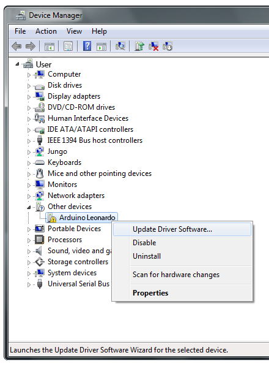
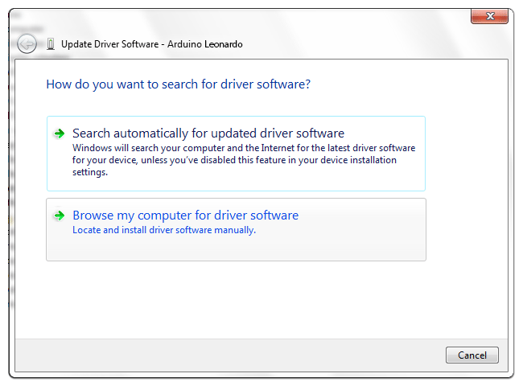
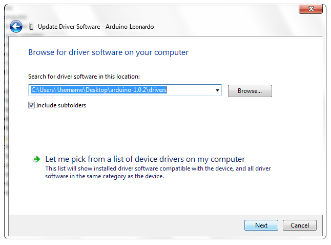
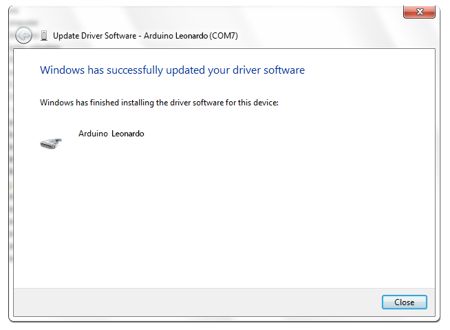

The following instructions are for Windows 7, Vista and 10. They are valid also for Windows XP, with small differences in the dialog windows. In the following instruction only the Leonardo board will be mentioned, but the same procedure is valid for all the Arduino boards.

Plug in your board and wait for Windows to begin its driver installation process. If the installer does not launch automatically, navigate to the Windows Device Manager (Start>Control Panel>Hardware) and find the Arduino Leonardo listing. Right click and choose **Update driver**.

At the next screen, choose "Browse my computer for driver software", and click **Next**.

Click the **Browse...** button. Another dialog appears: navigate to the folder with the Arduino software that you just downloaded. Select the **drivers** folder an click **OK**, then click **Next**.

You will receive a notification that the board has not passed Windows Logo testing. Click on the button **Continue Anyway**.

After a few moments, a window will tell you the wizard has finished installing software for Arduino Leonardo. Press the **Close** button.

The text of the Arduino getting started guide is licensed under a
[Creative Commons Attribution-ShareAlike 3.0 License](http://creativecommons.org/licenses/by-sa/3.0/). Code samples in the guide are released into the public domain.
