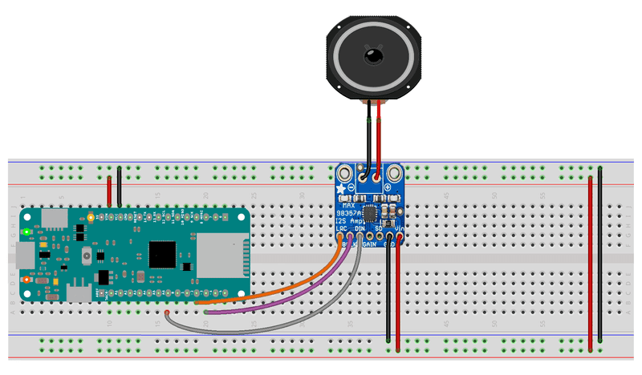

The first example will show you how to read and visualize audio data coming from an I2S microphone. The second example shows you how to generate a simple tone using a SAMD21 based board and an I2S DAC.

## Hardware Required

- [Zero](/hardware/zero), [MKR1000](/hardware/mkr-1000-wifi) or [MKRZero](/hardware/mkr-zero) Board
- I2S microphone (i.e [ICS43432](http://www.invensense.com/wp-content/uploads/2015/02/ICS-43432_DS.pdf))
- MAX98357A amplifier
- 3W minimum Speaker 4 or 8 Ohms

## Circuit

To run the first example you simply have to connect the board and the I2S microphone using the I2S bus as shown in the image. The image is for MKRZero; you find the proper pins for Zero and MKR1000 at the beginning of the sketch, in the comments.


To run the second example you simply have to connect the board and the I2S DAC using the I2S bus as shown in the image.  The image is for MKRZero; you find the proper pins for Zero and MKR1000 at the beginning of the sketch, in the comments.




### I2S Input Serial Plotter

This example shows you how to read and visualize on the serial plotter I2S audio data coming from an I2S microphone.

```arduino
/*

 This example reads audio data from an Invensense's ICS43432 I2S microphone

 breakout board, and prints out the samples to the Serial console. The

 Serial Plotter built into the Arduino IDE can be used to plot the audio

 data (Tools -> Serial Plotter)

 Circuit:

 * Arduino Zero, MKR family and Nano 33 IoT

 * ICS43432:

   * GND connected GND

   * 3.3V connected to 3.3V (Zero, Nano) or VCC (MKR)

   * WS connected to pin 0 (Zero) or 3 (MKR) or A2 (Nano)

   * CLK connected to pin 1 (Zero) or 2 (MKR) or A3 (Nano)

   * SD connected to pin 9 (Zero) or A6 (MKR) or 4 (Nano)

 created 17 November 2016

 by Sandeep Mistry

 */

#include <I2S.h>

void setup() {

  // Open serial communications and wait for port to open:

  // A baud rate of 115200 is used instead of 9600 for a faster data rate

  // on non-native USB ports

  Serial.begin(115200);

  while (!Serial) {

    ; // wait for serial port to connect. Needed for native USB port only

  }

  // start I2S at 8 kHz with 32-bits per sample

  if (!I2S.begin(I2S_PHILIPS_MODE, 8000, 32)) {

    Serial.println("Failed to initialize I2S!");

    while (1); // do nothing

  }
}

void loop() {

  // read a sample

  int sample = I2S.read();

  if (sample) {

    // if it's non-zero print value to serial

    Serial.println(sample);

  }
}
```

### I2S Simple Tone

This example shows you how to generate a simple tone using a SAMD21 based board (MKRZero, MKR1000 or Zero) and an I2S DAC like the adafruit MAX98357A.

```
/*

 This example generates a square wave based tone at a specified frequency

 and sample rate. Then outputs the data using the I2S interface to a

 MAX98357 I2S Amp Breakout board.

 Circuit:

 * Arduino Zero, MKR family and Nano 33 IoT

 * MAX98357:

   * GND connected GND

   * VIN connected 5V

   * LRC connected to pin 0 (Zero) or 3 (MKR) or A2 (Nano)

   * BCLK connected to pin 1 (Zero) or 2 (MKR) or A3 (Nano)

   * DIN connected to pin 9 (Zero) or A6 (MKR) or 4 (Nano)

 created 17 November 2016

 by Sandeep Mistry

 */

#include <I2S.h>

const int frequency = 440; // frequency of square wave in Hz

const int amplitude = 500; // amplitude of square wave

const int sampleRate = 8000; // sample rate in Hz

const int halfWavelength = (sampleRate / frequency) / 2; // half wavelength of square wave

short sample = amplitude; // current sample value
int count = 0;

void setup() {

  Serial.begin(9600);

  Serial.println("I2S simple tone");

  // start I2S at the sample rate with 16-bits per sample

  if (!I2S.begin(I2S_PHILIPS_MODE, sampleRate, 16)) {

    Serial.println("Failed to initialize I2S!");

    while (1); // do nothing

  }
}

void loop() {

  if (count % halfWavelength == 0) {

    // invert the sample every half wavelength count multiple to generate square wave

    sample = -1 * sample;

  }

  // write the same sample twice, once for left and once for the right channel

  I2S.write(sample);

  I2S.write(sample);

  // increment the counter for the next sample

  count++;
}
```
