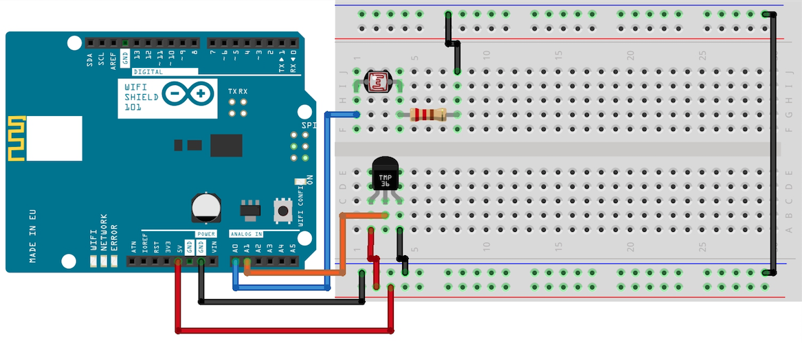

## WiFi 101 ThingSpeak Data Uploader

This tutorial demonstrates how to use the Arduino Zero or Arduino Uno and the WiFi Shield 101 to send a live stream of the light and temperature values in your environment using [ThingSpeak.com](https://www.thingspeak.com). ThingSpeak is an open data platform for the Internet of Things which allows you to collect data in a your own channel and get data from other channels using the API. In this example, we will use a photocell and a temperature sensor and send their values wirelessly to the ThingSpeak server.

## Hardware Required

- Arduino Zero or Uno Board

- Arduino Wifi Shield 101

- Photocell

- Temperature Sensor (This example uses a [TMP36](http://www.analog.com/media/en/technical-documentation/data-sheets/TMP35_36_37.pdf))

- 10K Ohm Resistor

## The Circuit

The Wifi Shield 101 sits on top of the Zero/Uno. The photocell should be connected with one leg to pin A0 and the other to ground via the 10K Ohm resistor. As with ordinary resistors, photocells do not have polarity so it does not matter which leg is connected to which pin. The temperature sensor has three pins: Power, Voltage out and Ground. In this case it is important that pin 1 goes to power and pin 3 goes to ground, and the middle leg of the sensor (voltage out) is then connected to pin A1, as seen in the circuit below.




***In the above  image, the board would be stacked below the WiFi Shield 101.***

## Creating a Channel on ThingSpeak

First of all, it is necessary to create a channel on [ThingSpeak.com](https://www.thingspeak.com) to which the data can be uploaded. To do this, navigate to [www.thingspeak.com](https://www.thingspeak.com) in your web browser and **Sign Up** with a new account or with an existing MathWorks account. You can then **Create a Channel**, give your channel a name such as "Arduino Channel" and a description, such as "Light and temperature values from my environment". Tick the boxes next to Field 1 and Field 2, naming them "Light" and "Temperature" respectively. The rest of the fields are optional and example information is found in **Channel Settings** on the same page. Hit save channel, and you will be taken to the current view of your new channel. Go to the **API Keys** tab and find your **Write API Key**. You will need to insert this into the sketch in order to write to your channel.

## Code

This sketch simply continuously reads the values of the thermistor and photocell inside the loop and stores them in a string, and every 20 seconds the current values of the analog sensors are sent to your channel. Before using the program, your wireless network's SSID and its password must be entered into the following lines in the code:

```arduino
char ssid[] = "networkssid";  // your network SSID (name)
char pass[] = "password";     // your network password
```

Then in the ThingSpeak settings, the Write API Key described in the previous section must be inserted into the String APIKey. Optionally, the duration of time in between updates can be changed in updateThingSpeakInterval:

```arduino
char thingSpeakAddress[] = "api.thingspeak.com";

String APIKey = "O2JUIN8J6CPPX1AW";              //enter your channel's Write API Key

const int updateThingSpeakInterval = 20 * 1000;  // 20 second interval at which to update ThingSpeak
```

The analog value  of range 0-1023 from the temperature sensor is converted into a temperature value in degrees Celsius by first converting the sensor value to a voltage. From the [datasheet](http://www.analog.com/media/en/technical-documentation/data-sheets/TMP35_36_37.pdf), we can see that the offset voltage for the TMP36 is 0.5V (Note: the TMP37 and TMP35 do not have an offset Voltage), therefore the temperature can be read using formula Temp &#xB0;C = 100 * (voltageReading - 0.5).

```arduino
float voltage = analogRead(A1) * (3.3 / 1024); // convert from range 0 - 1023 to 0 - 3.3V
int tempVal = (voltage - 0.5) * 100;           // convert to Celsius using offset of 0.5V
```

Strings must be sent to ThingSpeak, therefore a conversion is required. The light value straight from the A0 pin and the previously calculated temperature are cast to strings.

```arduino
String light = String(analogRead(A0),DEC);

String temp = String(tempVal,DEC);
```

An if statement inside the loop then determines whether the specified amount of time has passed and whether the client is disconnected. If so, the function updateThingSpeak sends the string values of light and temperature to fields 1 and 2 respectively:

```arduino
if (!client.connected() && (millis() - lastConnectionTime > updateThingSpeakInterval)) {

    updateThingSpeak("field1=" + light + "&field2=" + temp);

  }
```

The full code can be found below. Upon running the sketch, you can go to your channel and view your Private/Public channel and see the **Channel Stats**. You should have two graphs, the first showing light and the second temperature. You can now watch this dynamic graph change without refreshing the page. You can also use the MatLab or [thingspeak.com/apps](https://www.thingspeak.com/apps) to visualise and trigger actions from the data.

```arduino
/*

WiFi 101 ThingSpeak Data Uploader

Hardware Required:

* Arduino Zero or Uno Board

* Arduino Wifi Shield 101

* Photocell

* Temperature Sensor (This example uses a TMP36)

* 10K Ohm Resistor

created Sept 2015

by Helena Bisby <support@arduino.cc>

This example code is in the public domain

https://www.arduino.cc/en/Tutorial/WiFi101ThingSpeakDataUploader

*/

#include <SPI.h>
#include <WiFi101.h>

// Local Network Settings
#include "arduino_secrets.h"
///////please enter your sensitive data in the Secret tab/arduino_secrets.h
char ssid[] = SECRET_SSID;        // your network SSID (name)
char pass[] = SECRET_PASS;    // your network password (use for WPA, or use as key for WEP)
int keyIndex = 0;             // your network key Index number (needed only for WEP)

int status = WL_IDLE_STATUS;

WiFiServer server(80);

// ThingSpeak Settings
char thingSpeakAddress[] = "api.thingspeak.com";

String APIKey = "XXXXXXXXXXXXXXXX";             // enter your channel's Write API Key

const int updateThingSpeakInterval = 20 * 1000; // 20 second interval at which to update ThingSpeak

// Variable Setup
long lastConnectionTime = 0;
boolean lastConnected = false;

// Initialize Arduino Ethernet Client

WiFiClient client;

void setup() {

  // Start Serial for debugging on the Serial Monitor

  Serial.begin(9600);

  while (!Serial) {

    ; // wait for serial port to connect. Needed for Leonardo only

  }

  // check for the presence of the shield:

  if (WiFi.status() == WL_NO_SHIELD) {

    Serial.println("WiFi shield not present");

    // don't continue:

    while (true);

  }

  // attempt to connect to Wifi network:

  while ( status != WL_CONNECTED) {

    Serial.print("Attempting to connect to SSID: ");

    Serial.println(ssid);

    // Connect to WPA/WPA2 network. Change this line if using open or WEP network:

    status = WiFi.begin(ssid, pass);

    // wait 10 seconds for connection:

    delay(10000);

  }

  // you're connected now, so print out the status:

  printWifiStatus();
}

void loop() {

  // read values from pins and store as strings

  String light = String(analogRead(A0), DEC); // read light value

  // find temp value

  float voltage = analogRead(A1) * (3.3 / 1024);  // convert 0-1023 range to 3.3V range

  int tempVal = (voltage - 0.5) * 100;            // convert voltage to temperature in *C

  String temp = String(tempVal);

  // Print Update Response to Serial Monitor

  if (client.available()) {

    char c = client.read();

    Serial.print(c);

  }

  // Disconnect from ThingSpeak

  if (!client.connected() && lastConnected) {

    Serial.println("...disconnected");

    Serial.println();

    client.stop();

  }

  // Update ThingSpeak

  if (!client.connected() && (millis() - lastConnectionTime > updateThingSpeakInterval)) {

    updateThingSpeak("field1=" + light + "&field2=" + temp);

    Serial.println(light);

    Serial.println(temp);

  }

  lastConnected = client.connected();
}

void updateThingSpeak(String tsData) {

  if (client.connect(thingSpeakAddress, 80)) {

    client.print("POST /update HTTP/1.1\n");

    client.print("Host: api.thingspeak.com\n");

    client.print("Connection: close\n");

    client.print("X-THINGSPEAKAPIKEY: " + APIKey + "\n");

    client.print("Content-Type: application/x-www-form-urlencoded\n");

    client.print("Content-Length: ");

    client.print(tsData.length());

    client.print("\n\n");

    client.print(tsData);

    lastConnectionTime = millis();

    if (client.connected()) {

      Serial.println("Connecting to ThingSpeak...");

      Serial.println();

    }

  }
}

void printWifiStatus() {

  // print the SSID of the network you're attached to:

  Serial.print("SSID: ");

  Serial.println(WiFi.SSID());

  // print your WiFi shield's IP address:

  IPAddress ip = WiFi.localIP();

  Serial.print("IP Address: ");

  Serial.println(ip);

  // print the received signal strength:

  long rssi = WiFi.RSSI();

  Serial.print("signal strength (RSSI):");

  Serial.print(rssi);

  Serial.println(" dBm");
}
```